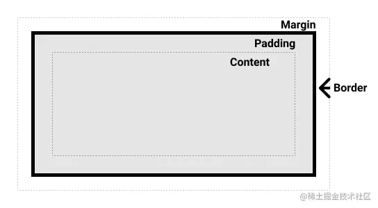
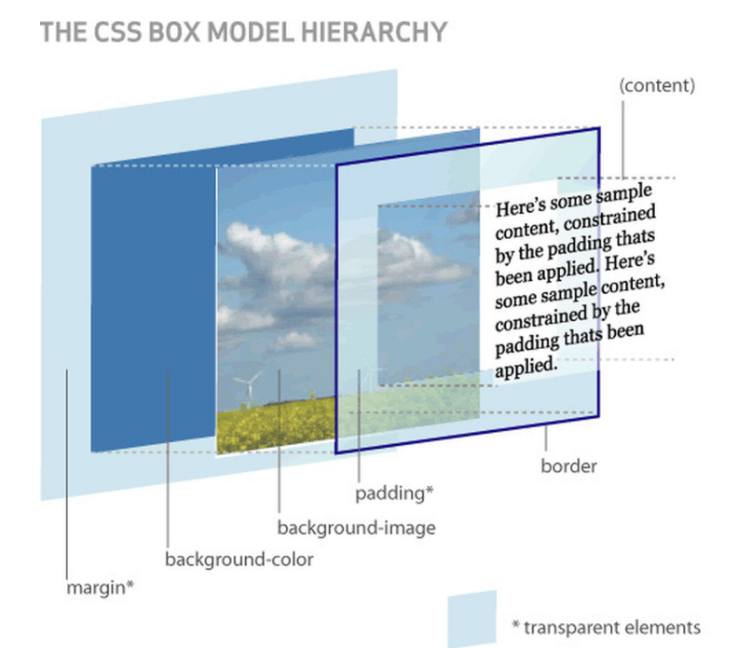
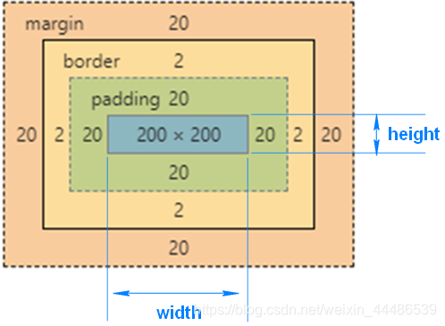
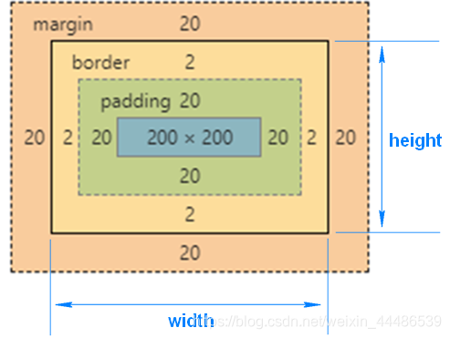

# 盒子模型
当对一个文档进行布局（layout）的时候，浏览器的渲染引擎会根据标准之一的 CSS 基础框盒模型（CSS basic box model），将所有元素表示为一个个矩形的盒子（box）

一个盒子由四个部分组成：content、padding、border、margin


- content，即实际内容，显示文本和图像
- boreder，即边框，围绕元素内容的内边距的一条或多条线，由粗细、样式、颜色三部分组成
- padding，即内边距，清除内容周围的区域，内边距是透明的，取值不能为负，受盒子的background属性影响
- margin，即外边距，在元素外创建额外的空白，空白通常指不能放其他元素的区域
上述是一个从二维的角度观察盒子，下面再看看看三维图：


```html
<style>
  .box {
    width: 200px;
    height: 100px;
    padding: 20px;
  }
</style>
<div class="box">
  盒子模型
</div>
```
当我们在浏览器查看元素时，却发现元素的大小变成了240px

这是因为，在CSS中，盒子模型可以分成：
- W3C 标准盒子模型
- IE 怪异盒子模型
默认情况下，盒子模型为W3C 标准盒子模型

## 标准盒子模型

标准盒子模型，是浏览器默认的盒子模型

下面看看标准盒子模型的模型图：


从上图可以看到：
- 盒子总宽度 = width + padding + border + margin;
- 盒子总高度 = height + padding + border + margin
也就是，width/height 只是内容高度，不包含 padding 和 border 值
所以上面问题中，设置width为200px，但由于存在padding，但实际上盒子的宽度有240px


## IE 怪异盒子模型
同样看看IE 怪异盒子模型的模型图：

从上图可以看到：
- 盒子总宽度 = width + margin;
- 盒子总高度 = height + margin;
也就是，width/height 包含了 padding 和 border 值


## Box-sizing
CSS 中的 box-sizing 属性定义了引擎应该如何计算一个元素的总宽度和总高度
语法：
```css
box-sizing: content-box|border-box|inherit:
```
- content-box 默认值，元素的 width/height 不包含padding，border，与标准盒子模型表现一致
- border-box 元素的 width/height 包含 padding，border，与怪异盒子模型表现一致
- inherit 指定 box-sizing 属性的值，应该从父元素继承
回到上面的例子里，设置盒子为 border-box 模型
```html
<style>
  .box {
    width: 200px;
    height: 100px;
    padding: 20px;
    box-sizing: border-box;
  }
</style>
<div class="box">
  盒子模型
</div>
```
这时候，就可以发现盒子的所占据的宽度为200px


## BFC
BFC（Block Formatting Context），即块级格式化上下文，它是页面中的一块渲染区域，并且有一套属于自己的渲染规则：
- 内部的盒子会在垂直方向上一个接一个的放置
- 对于同一个BFC的俩个相邻的盒子的margin会发生重叠，与方向无关。
- 每个元素的左外边距与包含块的左边界相接触（从左到右），即使浮动元素也是如此
- BFC的区域不会与float的元素区域重叠
- 计算BFC的高度时，浮动子元素也参与计算
- BFC就是页面上的一个隔离的独立容器，容器里面的子元素不会影响到外面的元素，反之亦然
BFC目的是形成一个相对于外界完全独立的空间，让内部的子元素不会影响到外部的元素

### 触发条件
触发BFC的条件包含不限于：
- 根元素，即HTML元素
- 浮动元素：float值为left、right
- overflow值不为 visible，为 auto、scroll、hidden
- display的值为inline-block、inltable-cell、table-caption、table、inline-table、flex、inline-flex、grid、inline-grid
- position的值为absolute或fixed

### 应用场景
利用BFC的特性，我们将BFC应用在以下场景：
- 防止margin重叠（塌陷）
同一个BFC的俩个相邻的盒子的margin会发生重叠
- 清除内部浮动
计算BFC的高度时，浮动子元素也参与计算
- 自适应多栏布局
每个元素的左外边距与包含块的左边界相接触（从左到右），即使浮动元素也是如此


