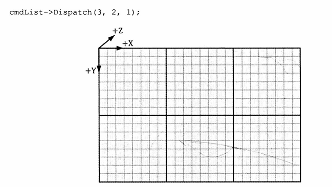
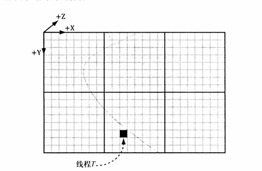

# 计算着色器（Compute Shader）
计算着色器并非渲染流水线的组成部分，但是可以读写GPU资源，如纹理、缓冲区等。将GPU用于非图形应用程序的情况称为**通用GPU程序设计**。


## 线程组
GPU编程中，可以将线程划分为**线程组(Thread Group)**，构成的网格。一个线程组运行于一个多处理器之上。
1. 每个多处理器只有拥有两个线程组，使他能够切换到不同的线程组进行处理（线程组在运行时可能会停顿，着色器会等待纹理的处理结果）。
2. 组内的线程存在共享内存，组内的线程可以进行同步操作。而不同组的线程之间是独立的，不能进行同步操作和数据共享。
3. 一个线程组中含有n个线程，硬件会将这些线程分为多个warp（每个warp包含32个线程）。应当总是把线程组的大小设置为32的倍数。
调用如下方法来启动线程组
```
void ID3D12GraphicsCommandList::Dispatch(UINT ThreadGroupCountX, UINT ThreadGroupCountY, UINT ThreadGroupCountZ);
cmdlist.Dispatch(3, 2, 1);
```
此方法可开启一个由线程组构成的3D网格，开启了6个线程组的网格



## 例程
纹理简单叠加例程
```hlsl
cbuffer cbSettings{}

//数据源
Texture2D gInputA;
Texture2D gInputB;
RWTexture2D<float4> gOutput;  //RW前缀意味着读写操作

//计算着色器
[numthreads(16, 16, 1)]
void CSMain(int3 dispatchThreadID : SV_GroupThreadID)
{
  gOutput[dispatchThreadID.xy] = gInputA[dispatchThreadID.xy]+gInputB[dispatchThreadID.xy];
}
```
1. 通过常量缓冲区访问的全局变量
2. 输入与输出资源
3. numthreads(X,Y,Z)指令，指定3D线程网格中的线程数量
4. 每个线程都要执行的着色器指令
5. 线程ID系统值参数


## 计算流水线状态对象
计算着色器位于图形流水线之外，需要使用特定的计算流水线状态，D3D12_COMPUTE_PIPELINE_STATE_DESC对象。
```
D3D12_COMPUTE_PIPELINE_STATE_DESC wavesUpdatePSO = {};
wavesUpdatePSO.pRootSignature = mWaveRootSignature.Get();
wavesUpdatePSO.CS = { 
    reinterpret_cast<BYTE*>(mShader["waveUpdateCS"]->GetBufferPointer()),
    mShader["waveUpdateCS"]->GetBufferSize(),
 };
wavesUpdatePSO.Flags = D3D12_PIPELINE_STATE_FLAG_NONE;
ThrowIfFailed(device->CreateComputePipelineState(&wavesUpdatePSO, IID_PPV_ARGS(&mPSOs["waveUpdate"])));
```
1. pRootSignature:定义了着色器所期望的输入
2. CS:就是知道的计算着色器
3. 在计算着色器中纹理过滤，必须使用SamplerLevel方法，他有第三个额外的参数，指定纹理的mipmap层级。


## 将计算着色器结果复制到系统内存
堆属性D3D12_HEAP_TYPE_READBACK创建系统内存，再通过ID3D12CommandList::CopyReadBack()方法将GPU资源复制到系统内存资源之中。


## 线程标识的系统值

线程T，所在的线程组是（1,1,0），在组内的线程ID是（2,5,0），该线程的调度ID为（1,1,0）* （8,8,0） + （2,5,0）=（10,13,0）,而他在组内的线程ID则为5*8+2=42.
1. 线程组ID(groupID)，系统值的语义为**SV_GroupID**
2. 组内线程ID(groupThreadID)，系统值的语义为**SV_GroupThreadID**
3. 调用一次Dispatch函数便会分派一次线程组网络。**调度线程ID**是Dispatch调用为线程所生成的唯一标识。
```
dispatchThreadID.xyz= groupID.xyz * ThreadGroupSize.xyz + groupThreadID.xyz;
```
4. 通过D3D系统值**SV_GroupThreadID**，可以指定组内线程ID的线性所有。


## 追加缓冲区与消费缓冲区
希望基于粒子的速度与恒定加速度在计算着色器中对其位置进行更新，不必考虑粒子的更新顺序以及他们被写入输出缓冲区的顺序。
消费结构化缓冲区（Consume Structured Buffer，输入缓冲区）与追加结构化缓冲区（Append Structured Buffer，输出缓冲区）
```hlsl
struct Particle
{
    float3 position;
    float3 velocity;
    float3 acceleration;
}

float TimeStep = 1.0f/60.0f;

ConsumeStructuredBuffer<Particle> gInput;
AppendStructuredBuffer<Particle> gOutput;

[numthreads(16, 16, 1)]
void CSMain(int3 dispatchThreadID : SV_GroupThreadID)
{
    Particle p = gInput.Consume();    //消费一个元素，从缓冲区中移除
    
    p.velocity += p.acceleration * TimeStep;
    p.position += p.velocity * TimeStep;
    
    gOutput.Append(p);    //将规范化向量追加到输出缓冲区
}
```


## 共享内存与线程同步
共享内存的声明如下:
```hlsl
groupshared float4 gCache[256];
```
1. 共享内存的上限为32kb，通过**SV_GroupThreadID**来对他进行索引。
2. 常见的应用场景是存储纹理数据。
例如模糊图像就需要对同一个纹素多次拾取，纹理采样是较慢的GPU操作。所以需要将线程组需要的纹理样本全部预加载至共享内存块。
3. 同步命令，确保所有的线程将各自处理的纹理加载到共享内存之中，而后再令计算着色器继续后面的工作
```hlsl
Texture2D gInput;
RWTexture2D<float4> gOutput; 

[numthreads(256, 16, 1)]
void CSMain(int3 groupThreadID : SV_GroupThreadID,
            int3 dispatchThreadID : SV_DispatchThreadID){
    gCache[groupThreadID.x] = gInput[dispatchThreadID.xy];

    //等待所有线程加载完成
    GroupMemoryBarrierWithGroupSync();

    //安全读取
    float4 left= gCache[groupThreadID.x-1];
    float4 right= gCache[groupThreadID.x+1];
}


```