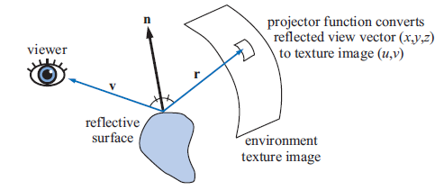

# 环境映射(Environment Mapping)

在指定位置放置相机，生成一个环境贴图（纹理），然后将该贴图映射到模型上，实现反射的效果。

根据不同的采样方式和存储格式，有如下的环境映射技术：
1. 经纬映射：球体表面展开为矩形（经度=宽度，纬度=高度）
兼容性好，采样不均匀（极点密集）
2. 球面映射：通过球体法线映射到平面圆盘
简单，但背面信息丢失
3. 立方体映射：6个正方形贴图拼成一个立方体
采样均匀，是目前主流标准
4. 双抛物面映射：两个抛物面对接，展开为两个圆盘
比球面映射信息更完整，但较少用
5. 八面体映射：八面体展开为矩形，比立方体更紧凑
存储效率高，移动端常用

