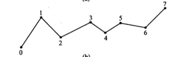
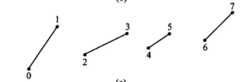
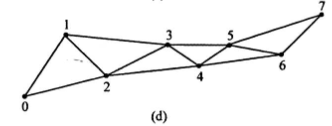
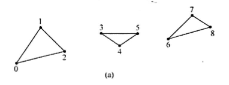
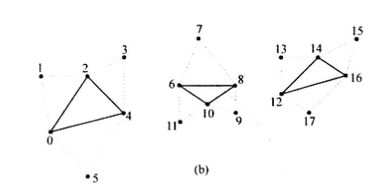
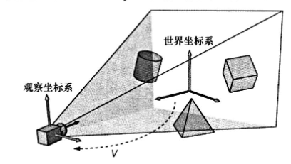

# 渲染流水线（Rendering Pipeline）
渲染流水线描述了从输入到输出的整个渲染过程。我们需要注意每个阶段的输入输出。


```输入流水线阶段
输入装配器阶段    <-      GPU资源 缓冲区 纹理
顶点着色器阶段    <-      GPU资源 缓冲区 纹理
外壳着色器阶段    <-      GPU资源 缓冲区 纹理
曲面细分阶段
域着色器阶段      <-      GPU资源 缓冲区 纹理
几何着色器阶段    <-      GPU资源 缓冲区 纹理
流输出阶段        ->      GPU资源 缓冲区 纹理
光栅化阶段        <-      GPU资源 缓冲区 纹理
像素着色器阶段    <-      GPU资源 缓冲区 纹理
输出合并阶段      <->      GPU资源 缓冲区 纹理
```

## 输入装配器阶段（Input Assembler）
**输入装配器阶段（IA）**会从显存中读取几何数据（顶点和索引），再将它们组合成**几何图元（Primitive）**。
通过指定**图元拓扑（Primitive Topology）**来告知D3D如何用顶点数据来表示几何图元。

### 几何图元（Primitive）
有如下的几何图元：
1. 点列表：所有的顶点被绘制成一个单独的点
2. 线条带：顶点在绘制时被连接成一系列的连续线段。 n+1个顶点可以绘制n个线段

3. 线列表：每对顶点在绘制成单独的线段。  2n个顶点可以绘制n个线段

4. 三角形带：顶点在绘制时被连接成一系列的连续三角形。 n个顶点可以绘制n-2个三角形

5. 三角形列表：每三个顶点在绘制成单独的三角形。 3n个顶点可以绘制n个三角形

6. 具有邻接数据的图元拓扑：存有邻接数据的三角形列表而言，每个三角形都有3个与之相邻的**邻接三角形**。

7. 控制点面片列表：将顶点数据解释为具有n个控制点的面片列表。此图元用于渲染流水线的曲面细分阶段

### 索引（Index）
索引描述了，顶点是如何组合在一起的，从而构成三角形的。

## 顶点着色器阶段（Vertex Shader）
待图元被装配完毕时，顶点会被送入顶点着色器阶段（Vertex Shader）。利用顶点着色器对顶点做处理，可以实现例如变换、光照和位移贴图。


## 曲面细分阶段（Tessellation）
利用镶嵌化处理技术对网格中的三角形进行细分，以此来增加物体表面上的三角形数量。再将新增的三角形偏移到适当的位置，使网格表现出更加细腻的细节。
1. 借助**LOD**，可以对距离近的物体进行曲面细分来得到细节
2. 内存中维护**低模**网格，再根据需求添加额外的三角形
3. 处理动画和物理模拟之时采样简单的低模网格，渲染中使用细分的高模


## 几何着色器阶段（Geometry Shader）
他的输入是完整的图元，利用几何着色器，创建和销毁几何体。


## 光栅化阶段（Rasterization）
为投影主屏幕上的3D三角形计算出对应的像素颜色。


## 像素着色器阶段（Pixel Shader）
针对每一个像素片段进行处理，根据顶点的插值属性作为输入计算出对应的像素颜色。
可以实现逐像素光照、反射、阴影等效果。

## 输出合并阶段（Output Merging）
通过**PS**生成的像素片段会被移送到**输出合并阶段（Output Merging）**。在此阶段中，一些像素片段可能会被丢弃（例如，未通过深度缓冲区测试、模板缓冲区测试的像素片段）。剩下的像素片段会被写入后台缓冲区。
此阶段可以实现混合，使当前的处理的像素与后台缓冲区中的对应像素相融合，实现透明效果。


## 其他

### 局部空间与世界空间
模型是在自己的局部坐标系中，定义的，局部坐标系以模型的中心为原点。
为了将各个模型放在同一坐标系（世界坐标系），需要对模型做**世界变换**，使用**世界矩阵**。


### 观察空间
构建场景的2D图形，我们在场景中准备了相机。相机定义了观察者的视野，也是生成2D图像所需的场景空间范围。
相机的局部坐标系叫做**观察空间**、**视图空间**。

同样的我们需要把世界空间的坐标转换到观察空间，称之为**取景变换**，使用**观察矩阵**。

### 投影和齐次裁剪空间
相机可观察到的空间体积，此范围可用一个平截头体表示。将平截头体内的3D几何体投影到一个2D投影窗口之中。


### 裁剪
完全位于视锥体以外的几何体需要被丢弃，而处于平截头体交界处的结合体部分也需要接受被裁剪。


## 注意
1. 如果PSO切换的时候，不重新设置SetGraphicsRootDescriptorTable，流水线会使用上一个PSO中槽绑定的资源
实体渲染器并没有使用envmap，但是声明了他，基于条件并没有绑定，导致在绘制时，实体渲染器使用了高度的envmap