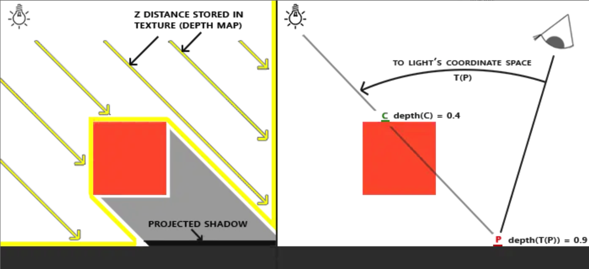

# 阴影贴图（Shadow Mapping）
为了简化理解，我们需要将最终投影到的水平面的每个点视为深度值，而不是关注光线与物体的交点。

# 光源角度
1. 那么如图所示，物体挡住了光线，而最终到地面的投影区域处的深度值就与没有被遮挡的有所不同。
2. 到地面投影区域的深度值与没有被遮挡的区域的深度值不同。
3. 这个深度值标记了此处是阴影区域。

## 主相机角度
1. 从主相机的角度来看，同一块区域的深度值是不一致的。
2. 这说明此处是被遮挡的区域。
3. 在像素做着色器中将此处的像素标记为阴影。

## 着色器做了什么处理呢。

RenderingPipeline