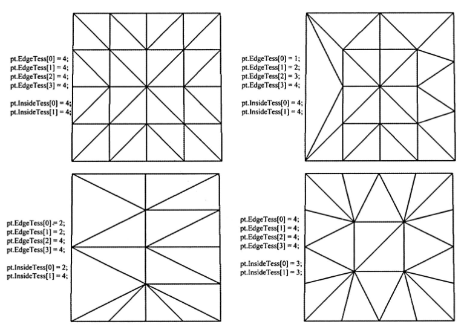
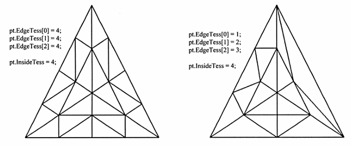

# 曲面细分阶段（Tessellation Stage）

**曲面细分阶段（Tessellation Stage）**是指渲染流水线中参与几何体图形进行**镶嵌处理（Tessellation geometry）**的**3**个阶段。将几何体细分为更小的三角形，偏移到合适的位置。
1. 基于GPU实现动态LOD:根据网格与摄像机的距离、其他因素来调整其细节。离得近的mesh，连续的镶嵌细分，增加物体的细节，而不是使用高模。
2. 物理模拟与动画特效:低模网格上执行物理模拟与动画特效的相关计算，再通过镶嵌获取细节更丰富的网格
3. 节约内存:磁盘存储低模网格,根据需求利用GPU进行镶嵌细分


执行阶段
```
顶点着色器 

外壳着色器(HS)         //曲面细分阶段
镶嵌器                  //曲面细分阶段
域着色器(DS)           //曲面细分阶段

几何着色器(GS)
```


## 图元类型

曲面细分使用的图元是具有若干**控制点(control point)****的**面片(patch)**,D3D支持1~32个控制点的面片。
1. D3D_PRIMTIVE_TOPOLOGY_1_CONTROL_POINT_PATCHLIST
2. D3D_PRIMTIVE_TOPOLOGY_n_CONTROL_POINT_PATCHLIST
3. D3D_PRIMTIVE_TOPOLOGY_32_CONTROL_POINT_PATCHLIST
三角形可以看着拥有3个控制点的三角形面片,四边形面片可以看着拥有4个控制点的四边形面片。这些面片最终会在曲面细分阶段经镶嵌化处理而分解为多个三角形。


## 外壳着色器（Hull Shader）
外壳着色器由两种着色器组成的:
1. 常量外壳着色器
2. 控制点外壳着色器


### 常量外壳着色器

**常量外壳着色器**针对每个面片逐一进行处理,输出网格的**曲面细分因子**。曲面细分因子指示了曲面细分阶段中将面片镶嵌处理后的份数。

```hlsl
struct PatchTess{
    float EdgeTess[4]: SV_TessFactor;           //边缘
    float InsideTess[2]: SV_InsideTessFactor;   //内部
}

//4个控制点
PatchTess ConstantHS(InputPatch<VertexOut, 4> patch, uint patchID: SV_PrimitiveID)
{
    PatchTess pt;

    //将该面片从各方面均匀的镶嵌处理为3等份
    //顺时针排布
    pt.EdgeTess[0]= 3    //四边形左侧边缘
    pt.EdgeTess[1]= 3    //四边形顶部边缘
    pt.EdgeTess[2]= 3    //四边形右侧边缘
    pt.EdgeTess[3]= 3    //四边形底部边缘

    pt.InsideTess[0]= 3    //U轴(列数)
    pt.InsideTess[1]= 3    //V轴(行数)
    return pt;
}
```

镶嵌分成了两个部分:
1. n个边缘曲面细分因子控制着对应的边上镶嵌后的份数
2. 一个内部曲面细分因子指示着面片内部的镶嵌份数

D3D11硬件支持的最大曲面细分因子为64,如果把所有的曲面细分因子都设置为0,则该面片会被后续的处理阶段丢弃.这样就能够以每个面片为基准来实现入视锥体剔除与背面剔除这类优化.
1. 面片不在视锥体范围内,后续章节丢弃
2. 面片是背面朝向的,从后面的过程中丢弃

确定镶嵌次数的常用标准
1. **根据与摄像机之间的距离**:在二者距离较远时渲染物体的低模版本,随着二者逐渐接近逐步堆物体进行更加细致的镶嵌化细分
2. **根据屏幕占用的范围**：估算物体覆盖屏幕的像素个数。数量比较少，则低模。随着物体占用屏幕范围的增加，可以逐步增大镶嵌化因子。
3. **根据三角形的朝向**：位于物体轮廓边缘上的三角形势必比其他位置的三角形拥有更多的细节
4. **根据粗糙程度**：粗糙不平的表面较光滑的表面需要更为细致的曲面细分。通过堆表面物理进行检测可以预算出对应的粗糙度数据，继而决定镶嵌化的次数 


### 控制点外壳着色器
**控制点外壳着色器**以大量的控制点作为输入输出，每输出一个控制点，此着色器都会被调用一次。
1. 改变曲面的表示方式：把三角形（三个控制点）转为三次贝塞尔三角形面片（10个控制点），新增的控制点会带来更丰富的细节，并且将三角形面片镶嵌细分为用户所期望的份数（称之为N-patches、PN三角形方法）
2. PN三角形方法改进已存在的三角形网格，不需要改动美术制作流程，比较方便


```
struct HullOut{
    float4 PosL : POSITION;
}

[domain("quad")]
[partitioning("integer")]
[outputtopology("triangle_cw")]
[outputcontrolpoints(4)]
[patchconstantfunc("ConstantHS")]
[maxtessfactor(64)]
HullOut HS(InputPatch<VertexOut, 4> patch, uint i: SV_OutputControlPointID, uint patchId: SV_PrimitiveID)
{
    HullOut output;
    output.PosL = patch[i].PosL;
    return output;
}
```
1. InputPatc：通过InputPatch参数即可将面片的所有控制点都传至外壳着色器职责。系统值SV_OutputControlPointID索引的是正在被外壳着色器所处理的输出控制点。
2. domian：面片的类型，有如下：tri（三角形）、quad（四边形）、isoline（等值线）
3. partitioning：曲面细分的细分模式。
integer：新顶点的添加或移除仅取决于曲面细分因子的整数部分，而忽略他的小数部分。由此网格随着曲面细分级别而改变时，会容易发生明显的突跃。
fractional_even/fractional_odd：新顶点的添加或移除取决于曲面细分因子的整数部分，但是细微的渐变过渡就要根据因子的小数部分。
4. outputtopology：通过细分所创的三角形的绕序，有如下：triangele_cw（顺时针）、triangele_cww（逆时针）、line（针对线段曲面细分）
5. outputcontrolpoints：外壳着色器执行的次数，每次执行都输出 1 个控制点。系统值SV_OutputControlPointID索引的是正在被外壳着色器所输出的控制点。
6. patchconstantfunc：指定常量外壳着色器的名称。
7. maxtessfactor：指定曲面细分因子的最大值。


## 镶嵌器阶段
无法干涉，由硬件基础常量外壳着色器程序输出的曲面细分因子，对面片进行镶嵌化处理。

1. 四边形细分

2. 三角形细分



## 域着色器（Domain Shader）

镶嵌器阶段会输出新建的所有顶点与三角形，再次阶段（即镶嵌器阶段）所创建顶点，都会逐一调用域着色器（Domain Shader）。

1. 那么曲面细分开启后，VS就成为了处理控制点的顶点着色器、DS就成为了对镶嵌化后的面片进行处理的VS。
2. 以曲面细分因子、HS的输出的控制点、镶嵌化处理后的顶点位置参数坐标（u，v）作为输入
3. DS会给出顶点位于面片域空间内的参数指标（u，v）

```
struct DomainOut{
    float4 PosL : SV_POSITION;   //裁剪空间中的语义
}

[domain("quad")]
DomainOut DS(PatchTess patchTess, float2 uv:SV_DomainLocation,const OutputPatch<HullOut, 4> quad){
    DomainOut output;

    //双线性插值
    float3 v1 = lerp(quad[0].PosL, quad[1].PosL, uv.x);
    float3 v2 = lerp(quad[2].PosL, quad[3].PosL, uv.x);
    float3 pos = lerp(v1, v2, uv.y);

    float4 posW = mul(float4(pos, 1.0), gWorldW);
    output.PosH = mul(posW, gViewProj);

    return dout;
}
```