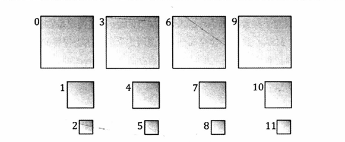

# 纹理数组（Texture Array）
在hlsl中，使用Texture2DArray类型来表示纹理数组。使用以下代码进行纹理采样：
```hlsl
//对纹理数组采用需要2D纹理坐标和纹理数组的索引
float3 uvw= float3(pin.TexC,pin.PrimID%4);       //对图元ID取模，限制在0-3之间，这样得到纹理数组范围内的切片索引
float4 diffuseAlbedo = gTreeMapArray.Sample(gsamAniostropicWrap, uvw)*gDiffuseAlbedo;
```

## 纹理子资源（Texture Subresource）
纹理有自己的mipmap链，D3D使用**数组切片（Array Slice）**来表示纹理数组中的某个纹理及其mipmap链。用**miap切片（Mip Slice）**来表示特定层级的所有mipmap。


D3D使用的线性索引规则



根据mip切片索引、数组切片索引、平面切片索引（planeSlice）、mipmap层级、纹理数组的大小，可以计算出对应的线性索引。
```
uint linearIndex = mipSlice + arraySlice * mipLevels + planeSlice * mipLevels * textureArraySize;
//planeSlice：允许用户能将YUV平面格式的分量以索引方式访问。
```


## 限制
根据索引访问，这使得纹理数组中的纹理必须满足以下三点：
1. 所有的纹理切片的宽高必须一致
2. 像素格式、压缩格式必须完全统一
3. Mipmap数量也需要相同


## alpha-to-coverage
利用clip函数，来遮罩不属于树木纹理的像素，对于树木边缘的过渡不够平滑。解决此问题有如下方法
1. 通过透明混合来取代alpha:通过线性纹理过滤，由白（不透明像素）至黑（被遮罩）的过渡更平滑
运用透明混合需要将场景物体从后至前的顺序进行排序和渲染，开销较大。
2. MSAA：通过多采样抗锯齿，来平滑过渡。
3. alpha-to-coverage：开启MSAA与alpha-to-coverage后，硬件检测PS返回的alpha值，根据alpha值来判断是否遮罩像素。