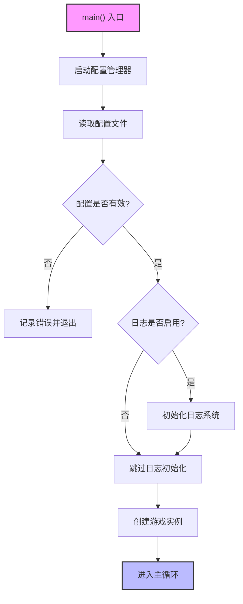

# Bootstrap (引导启动模块)

## 1. 概述

Bootstrap 是游戏引擎的生命周期起点，负责：

- 从操作系统接管控制权
- 完成引擎核心子系统的初始化
- 处理早期异常
- 将控制权移交给游戏主循环 (Game Loop)

**设计目标**：最小化依赖、最大化稳定性、提供清晰的启动流程。

---

## 2. 核心职责

### 2.1 配置加载

- 启动配置管理器 (ConfigManager)
- 解析 JSON 配置文件
- 根据配置内容决定需要初始化的模块

### 2.2 核心子系统初始化

根据配置按依赖顺序初始化底层系统：

| 顺序 | 子系统 | 说明 |
|:----:|--------|------|
| 1 | 配置管理器 (ConfigManager) | 读取配置文件，解析参数 |
| 2 | 日志系统 (Logging) | 根据配置初始化日志输出 |

### 2.3 异常捕获与错误处理

- 设置全局异常处理器
- 捕获启动阶段的致命错误
- 提供友好的错误信息

### 2.4 控制权移交

- 实例化游戏主逻辑类
- 进入主循环 (`Run()`)

---

## 3. 启动流程图



---

## 4. 架构关系图

### 4.1 模块依赖层级

@startuml
skinparam packageStyle rectangle

package "操作系统" {
  [WinMain / main]
}

package "Bootstrap" {
  [EngineBootstrap]
}

package "配置管理层" {
  [ConfigManager]
}

package "核心子系统" {
  [Logging]
}

package "游戏逻辑" {
  [GameInstance]
  [GameLoop]
}

WinMain --> EngineBootstrap : 入口点
EngineBootstrap --> ConfigManager : 加载配置
EngineBootstrap --> Logging : 根据配置初始化

ConfigManager --> Logging : 提供日志配置
Logging --> GameInstance : 提供日志服务
GameInstance --> GameLoop : 进入主循环

note top of EngineBootstrap
  **启动程序职责**
  - 加载配置
  - 按需初始化子系统
  - 异常处理
end note

note top of ConfigManager
  **配置管理器**
  - 解析 JSON 配置
  - 提供配置访问接口
  - 当前唯一核心模块
end note
@enduml

### 4.2 启动时序图

@startuml
participant "main()" as 入口
participant "EngineBootstrap" as 启动程序
participant "ConfigManager" as 配置管理器
participant "Logging" as 日志系统
participant "GameInstance" as 游戏实例
participant "GameLoop" as 游戏循环

入口 -> 启动程序 : Run(hInstance, cmdShow)
activate 启动程序

启动程序 -> 配置管理器 : Initialize()
activate 配置管理器
配置管理器 -> 配置管理器 : 加载 JSON 配置文件
配置管理器 --> 启动程序 : 配置加载完成
deactivate 配置管理器

alt 配置无效
    启动程序 --> 入口 : return ERROR
end

启动程序 -> 配置管理器 : GetBool("logging.enabled")
配置管理器 --> 启动程序 : enabled

alt 日志已启用
    启动程序 -> 日志系统 : Initialize(config)
    activate 日志系统
    日志系统 --> 启动程序 : 日志系统就绪
    deactivate 日志系统
end

启动程序 -> 游戏实例 : Create()
activate 游戏实例

游戏实例 -> 游戏循环 : Run()
activate 游戏循环

loop 每帧
    游戏循环 -> 游戏循环 : Update()
    游戏循环 -> 游戏循环 : Render()
end

游戏循环 -> 游戏实例 : OnShutdown()
deactivate 游戏循环

游戏实例 -> 日志系统 : Shutdown()
游戏实例 -> 配置管理器 : Shutdown()

deactivate 游戏实例
deactivate 启动程序

@enduml

### 4.3 现有子系统关系

@startuml
skinparam componentStyle uml2

' 定义 ConfigManager 组件
component "ConfigManager"

' 定义 Logging 组件
component "Logging"

' 定义组件间的关系
ConfigManager --> Logging : 提供日志配置参数

' 为 ConfigManager 添加注释，描述其功能
note bottom of ConfigManager
  核心配置模块
  - 启动时首先初始化
  - 管理所有配置访问
  - 加载 JSON 配置
  - 提供配置访问接口
  - 配置合并
end note

' 为 Logging 添加注释，描述其功能
note bottom of Logging
  日志模块
  - 当前唯一核心子系统
  - 依赖 ConfigManager 提供配置
  - 全局日志级别
  - 日志输出目标 (Console / File)
end note

@enduml


---

## 5. 架构定位与分析

### 5.1 架构层级

- **位置**：位于引擎的入口层
- **当前依赖**：
  ```
  Bootstrap
    -> ConfigManager
      -> Logging
        -> Game Logic
  ```

### 5.2 设计原则

| 原则 | 说明 |
|------|------|
| **配置驱动** | 根据配置文件决定初始化哪些模块 |
| **按需初始化** | 只初始化配置中启用的模块 |
| **快速失败** | 配置无效或初始化失败时立即终止 |

### 5.3 未来扩展

当前仅有 ConfigManager 和 Logging 模块，后续将逐步添加：

- Memory Allocator (内存管理器)
- File System (文件系统)
- Render Backend (渲染后端)
- Audio System (音频系统)
- Input System (输入系统)


# 计划性内容
内存管理器
文件系统