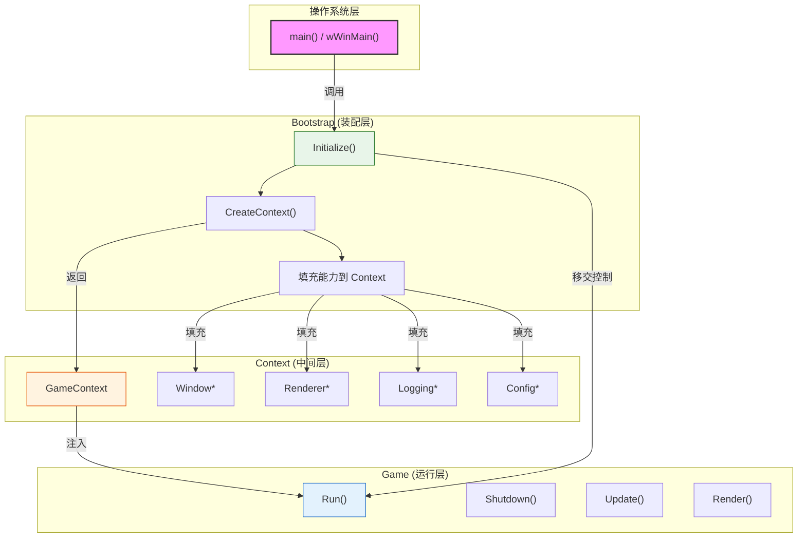
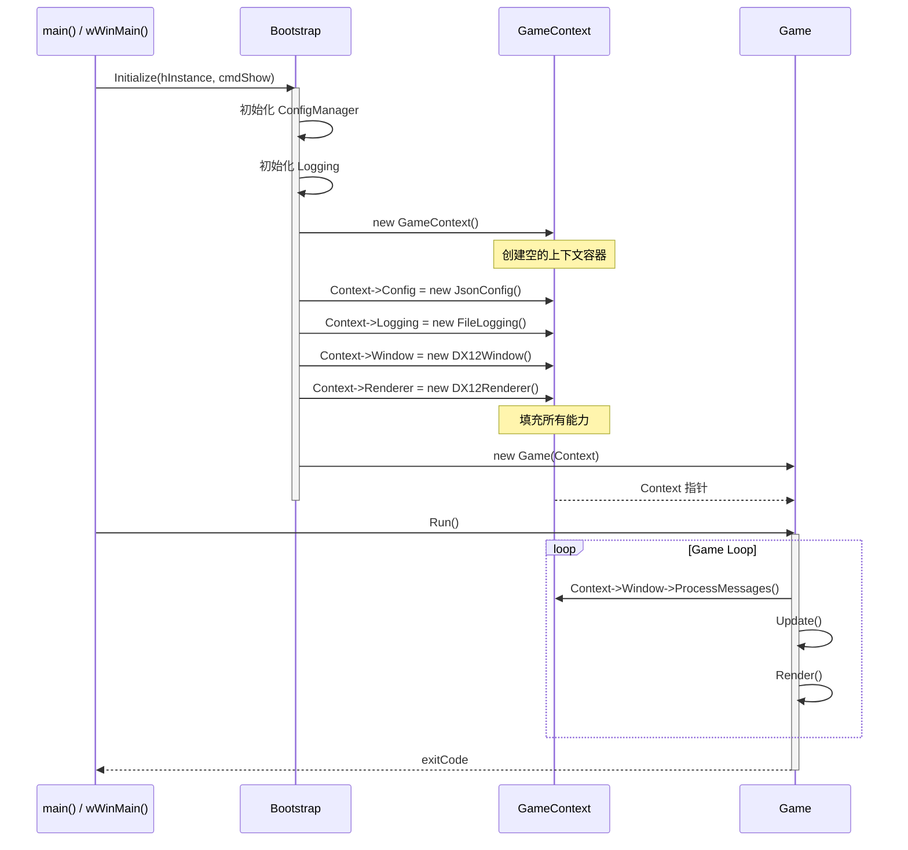
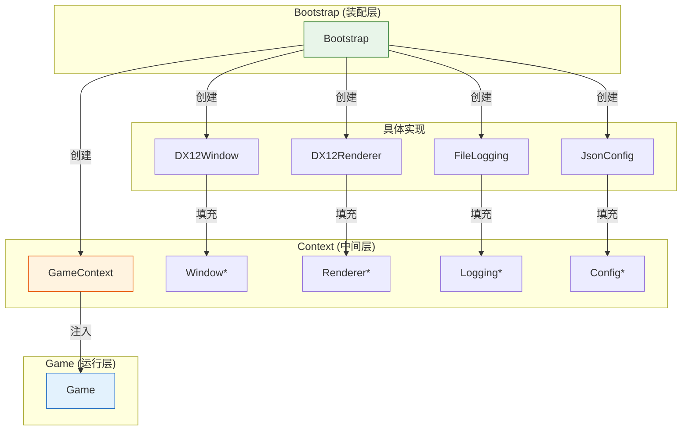
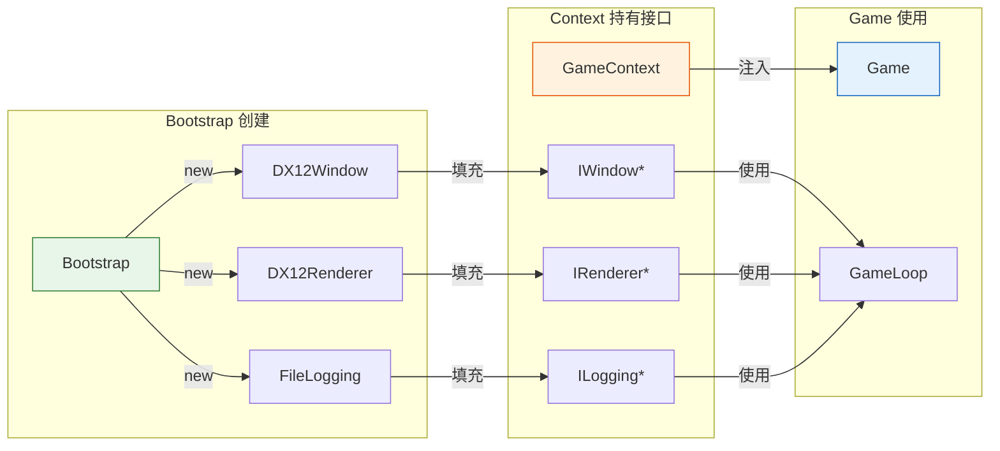
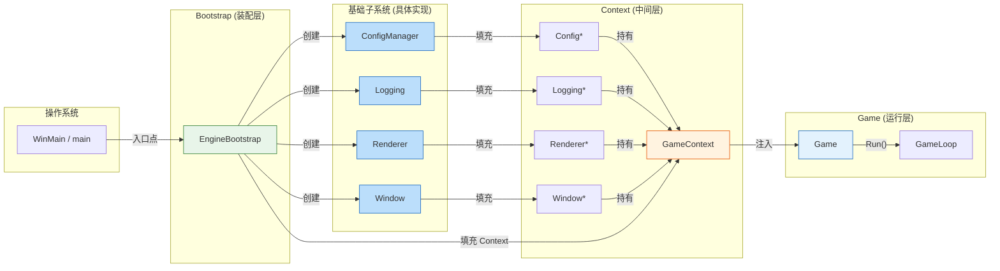

# Bootstrap (引导启动模块)

## 1. 概述

Bootstrap 是游戏引擎的**装配层**，负责初始化基础设施、创建 Context 并填充能力、最终创建 Game 实例。

| 职责定位 | 说明 |
|:--------|:-----|
| **做什么** | 初始化基础设施、创建 Context、组装依赖、将 GameContext 注入 Game |
| **不做什么** | 不持有消息循环、不管理运行时生命周期、不进入主循环 |

**设计哲学**：Bootstrap 是"工厂 + 装配工"，负责将散落的子系统组装成 Context，然后创建 Game 并注入 Context，最后移交控制权。

---

## 2. 核心职责

### 2.1 初始化基础设施

| 顺序 | 子系统 | 说明 |
|:----:|:-------|:-----|
| 1 | ConfigManager | 读取配置文件，解析参数 |
| 2 | Logging | 根据配置初始化日志输出 |
| 3 | Window | 创建操作系统窗口 |

### 2.2 创建并填充 Context

Bootstrap 创建 GameContext 并填充具体能力：

```cpp
GameContext* Bootstrap::CreateContext() {
    auto ctx = new GameContext();

    // 基础子系统
    ctx->Config   = new JsonConfigManager("config.json");
    ctx->Logging  = new FileLogging(ctx->Config);
    ctx->Window   = new DX12Window(ctx->Config);

    // 渲染和其他子系统
    ctx->Renderer = new DX12Renderer(ctx->Window);

    return ctx;
}
```

### 2.3 异常捕获

- 设置全局异常处理器
- 处理启动阶段的致命错误
- 提供友好的错误信息

### 2.4 创建 Game 并移交控制权

```cpp
// Bootstrap 的职责到此为止
GameContext* ctx = CreateContext();  // 创建并填充 Context
Game game(ctx);                        // 将 Context 注入 Game
return game.Run();                     // 移交控制权给 Game
```

---

## 3. 架构图表

### 3.1 模块职责边界（包含 Context）



### 3.2 启动时序图



### 3.3 依赖层级



### 3.4 能力注入模式（通过 Context）



```cpp
// 1. 定义能力接口
class IRenderer {
public:
    virtual void DrawTriangle() = 0;
    virtual ~IRenderer() = default;
};

// 2. Context 只声明接口指针
class GameContext {
public:
    IRenderer*  Renderer = nullptr;
    IWindow*    Window   = nullptr;
    ILogging*   Logging  = nullptr;
};

// 3. Game 只依赖 Context
class Game {
private:
    GameContext* m_Context;  // 单一的注入点

public:
    Game(GameContext* ctx) : m_Context(ctx) {}
    void Render() { m_Context->Renderer->DrawTriangle(); }
};

// 4. Bootstrap 负责制造具体能力并填充 Context
class Bootstrap {
public:
    Game* CreateGame() {
        auto ctx = new GameContext();
        ctx->Window   = new DX12Window();
        ctx->Renderer = new DX12Renderer();
        ctx->Logging  = new FileLogging();
        return new Game(ctx);
    }
};
```

### 3.5 完整架构 PlantUML 风格



---

## 4. 职责边界总结

| 组件 | Bootstrap | Context | Game | wWinMain |
|:-----|:---------:|:-------:|:----:|:--------:|
| 创建 ConfigManager | ✅ | ❌ | ❌ | ❌ |
| 创建 Logging | ✅ | ❌ | ❌ | ❌ |
| 创建 Window | ✅ | ❌ | ❌ | ❌ |
| 创建 GameContext | ✅ | ❌ | ❌ | ❌ |
| 填充 Context 能力 | ✅ | ❌ | ❌ | ❌ |
| 持有能力指针 | ❌ | ✅ | ❌ | ❌ |
| 创建 Game 实例 | ✅ | ❌ | ❌ | ❌ |
| 持有消息循环 | ❌ | ❌ | ✅ | ❌ |
| 管理生命周期 | ❌ | ❌ | ✅ | ❌ |
| 调用 Game.Run() | ❌ | ❌ | ❌ | ✅ |

---

## 5. 设计原则

| 原则 | 说明 |
|:-----|:-----|
| **配置驱动** | 根据配置文件决定初始化哪些模块 |
| **按需初始化** | 只初始化配置中启用的模块 |
| **快速失败** | 配置无效或初始化失败时立即终止 |
| **Context 填充** | 通过 Context 统一注入能力，而非单独注入 |
| **单一职责** | Bootstrap 只做装配，不做运行 |

---

## 6. 未来扩展

随着引擎发展，Bootstrap 将逐步初始化更多子系统：

| 顺序 | 子系统 | Context 字段 | 说明 |
|:----:|:-------|:-------------|:-----|
| 5 | Memory Allocator | MemoryAllocator* | 内存管理器 |
| 6 | File System | FileSystem* | 文件系统 |
| 7 | Render Backend | Renderer* | 渲染后端 (DX12/Vulkan) |
| 8 | Audio System | AudioSystem* | 音频系统 |
| 9 | Input System | InputSystem* | 输入系统 |
| 10 | Physics System | PhysicsSystem* | 物理系统 |

所有新增子系统都遵循相同的模式：Bootstrap 创建 → 填充到 Context → Game 通过 Context 使用。
