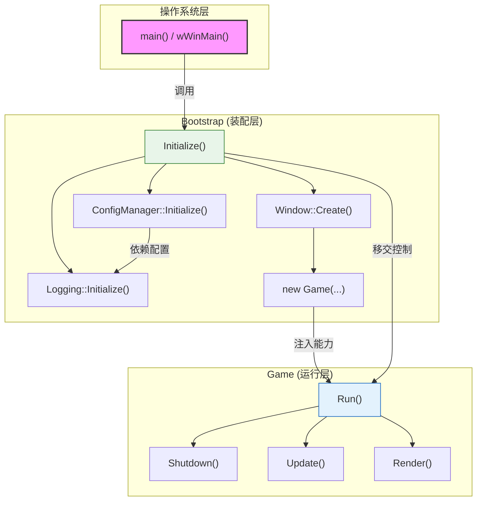
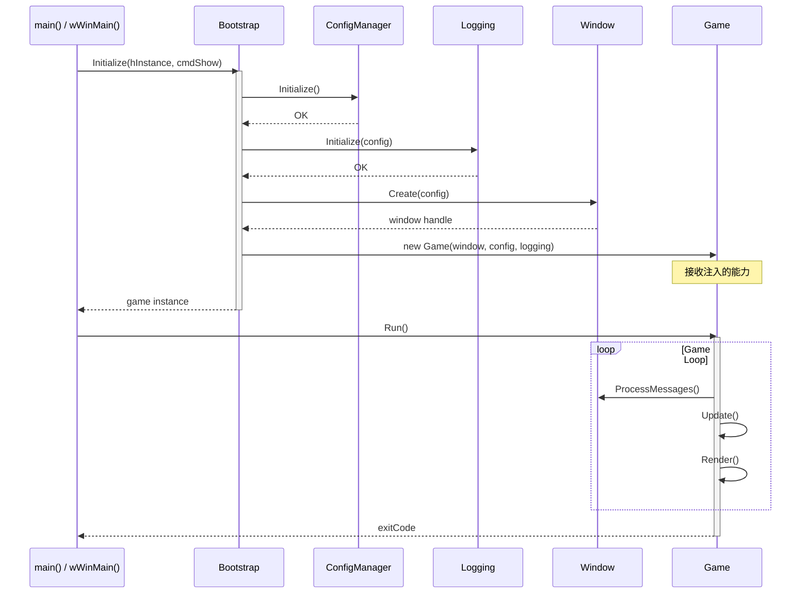
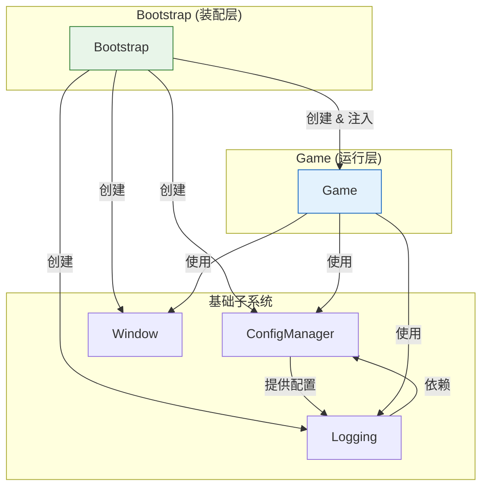
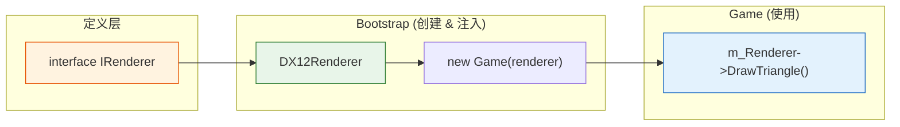
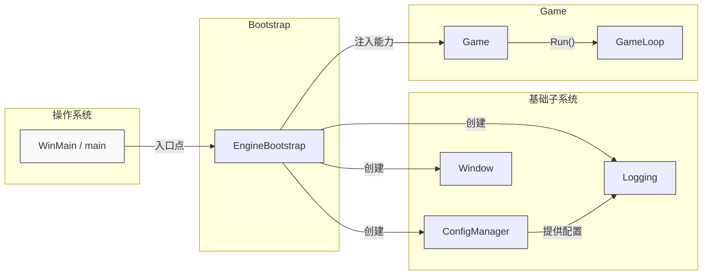

# Bootstrap (引导启动模块)

## 1. 概述

Bootstrap 是游戏引擎的**装配层**，而非运行层。

| 职责定位 | 说明 |
|:--------|:-----|
| **做什么** | 初始化基础设施、组装依赖、创建 Game 实例并注入能力 |
| **不做什么** | 不持有消息循环、不管理运行时生命周期、不进入主循环 |

**设计哲学**：Bootstrap 是"工厂 + 装配工"，负责将散落的子系统组装成可运行的 Game 实例，然后移交控制权。

---

## 2. 核心职责

### 2.1 初始化基础设施

| 顺序 | 子系统 | 说明 |
|:----:|:-------|:-----|
| 1 | ConfigManager | 读取配置文件，解析参数 |
| 2 | Logging | 根据配置初始化日志输出 |
| 3 | Window | 创建操作系统窗口 |

### 2.2 依赖组装

- 按依赖顺序初始化底层系统
- 创建具体子系统的实现实例
- 将能力**注入**给 Game 实例

### 2.3 异常捕获

- 设置全局异常处理器
- 处理启动阶段的致命错误
- 提供友好的错误信息

### 2.4 控制权移交

```cpp
// Bootstrap 的职责到此为止
Game game(window, configManager);  // 创建并注入能力
return game.Run();                  // 移交控制权给 Game
```

---

## 3. 架构图表

### 3.1 模块职责边界



### 3.2 启动时序图



### 3.3 依赖层级



### 3.4 能力注入模式



```cpp
// 1. 定义能力接口
class IRenderer {
public:
    virtual void DrawTriangle() = 0;
    virtual ~IRenderer() = default;
};

// 2. Game 只依赖接口，不知道具体实现
class Game {
private:
    IRenderer*     m_Renderer;     // 注入的能力
    ConfigManager* m_Config;       // 注入的能力
    Logging*       m_Logging;      // 注入的能力

public:
    Game(IRenderer* renderer, ConfigManager* config, Logging* logging)
        : m_Renderer(renderer)
        , m_Config(config)
        , m_Logging(logging) {}

    void Run();  // 拥有消息循环和主循环
};

// 3. Bootstrap 负责制造具体能力并注入
class Bootstrap {
public:
    Game* Initialize() {
        // 初始化基础设施
        auto config = new ConfigManager();
        auto logging = new Logging();
        auto window = new Window();

        // 制造具体能力
        auto renderer = new DX12Renderer();

        // 注入给 Game
        return new Game(window, config, renderer);
    }
};
```

### 3.5 PlantUML 组件图




---

## 4. 职责边界总结

| 组件 | Bootstrap | Game | wWinMain |
|:-----|:---------:|:----:|:--------:|
| 创建 ConfigManager | ✅ | ❌ | ❌ |
| 创建 Logging | ✅ | ❌ | ❌ |
| 创建 Window | ✅ | ❌ | ❌ |
| 创建 Game 实例 | ✅ | ❌ | ❌ |
| 持有消息循环 | ❌ | ✅ | ❌ |
| 管理生命周期 | ❌ | ✅ | ❌ |
| 调用 Game.Run() | ❌ | ❌ | ✅ |

---

## 5. 设计原则

| 原则 | 说明 |
|:-----|:-----|
| **配置驱动** | 根据配置文件决定初始化哪些模块 |
| **按需初始化** | 只初始化配置中启用的模块 |
| **快速失败** | 配置无效或初始化失败时立即终止 |
| **能力注入** | 通过构造函数或工厂方法注入依赖 |
| **单一职责** | Bootstrap 只做装配，不做运行 |

---

## 6. 未来扩展

随着引擎发展，Bootstrap 将逐步初始化更多子系统：

| 顺序 | 子系统 | 说明 |
|:----:|:-------|:-----|
| 4 | Memory Allocator | 内存管理器 |
| 5 | File System | 文件系统 |
| 6 | Render Backend | 渲染后端 (DX12/Vulkan) |
| 7 | Audio System | 音频系统 |
| 8 | Input System | 输入系统 |
| 9 | Physics System | 物理系统 |

所有新增子系统都遵循相同的注入模式：Bootstrap 创建 → 注入 Game → Game 使用。

