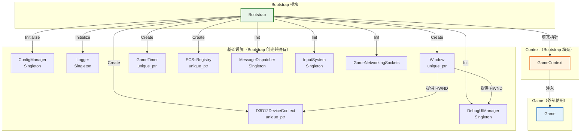
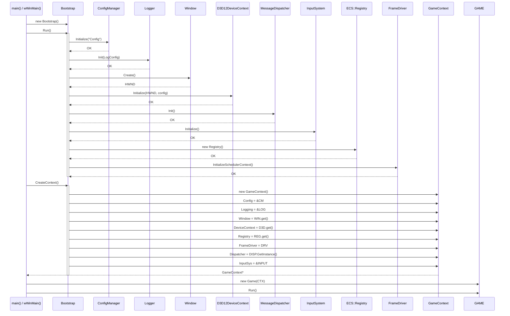
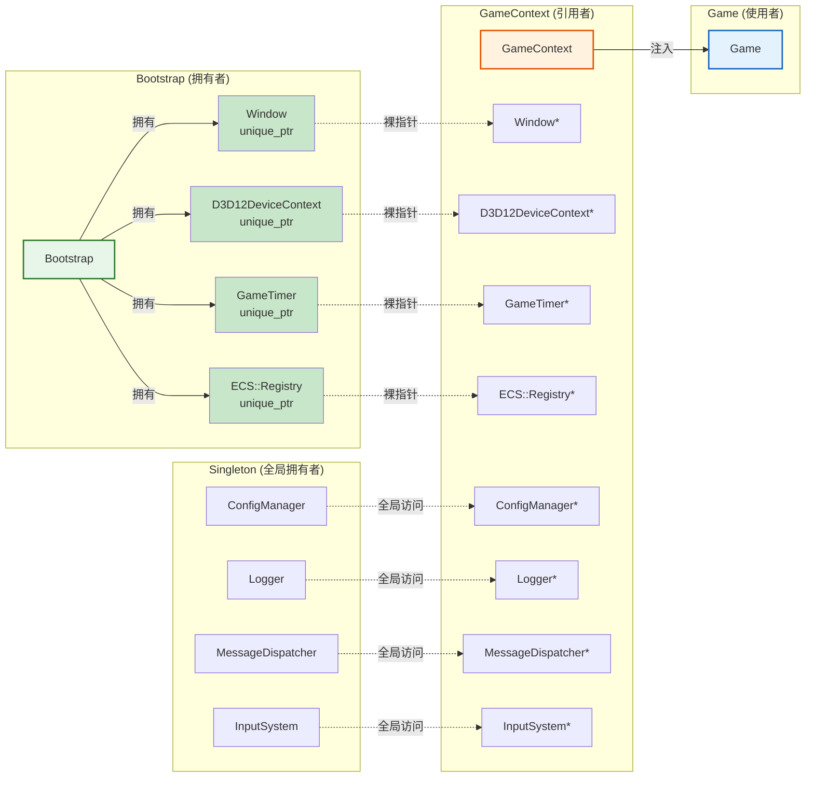
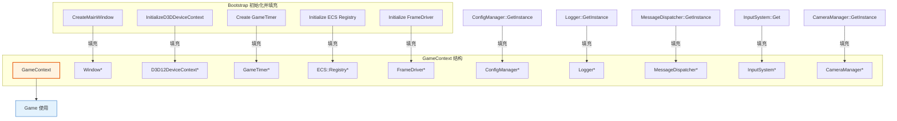
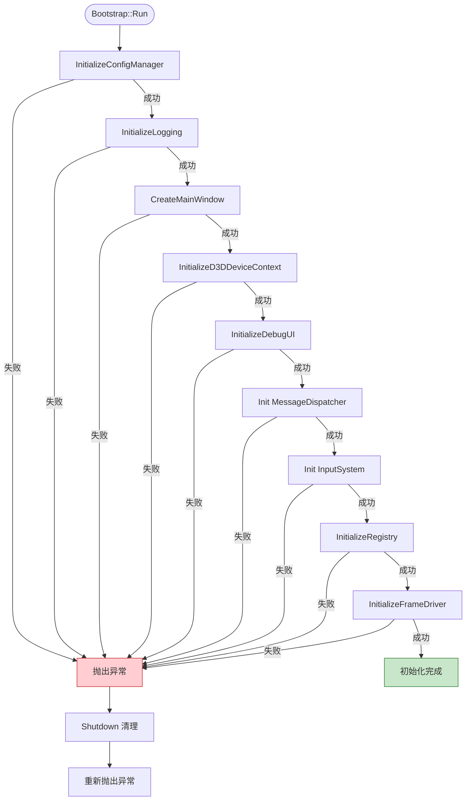

# Bootstrap (引导启动模块)

## 1. 定位与职责

### 定位

Bootstrap 是游戏引擎的**装配层（Assembly Layer）**，负责初始化 GameContext 所需的所有基础设施模块，并将它们组装到 Context 中。

- **上游依赖**：无（Bootstrap 是引擎的启动入口）
- **下游服务**：
  - 创建并填充 `GameContext`
  - 为 `Game` 提供完整的运行上下文

### 核心职责

| 职责 | 说明 |
|:----|:-----|
| **模块初始化** | 按正确顺序初始化 ConfigManager、Logger、Window、D3D12DeviceContext 等 |
| **Context 装配** | 创建 GameContext 并将所有子系统指针填充进去 |
| **异常处理** | 捕获初始化异常，清理已分配资源，提供友好错误信息 |
| **生命周期管理** | 使用 `std::unique_ptr` 管理子系统对象的所有权 |

### 职责边界

| 组件 | Bootstrap | GameContext | Game | main/wWinMain |
|:----|:---------:|:-----------:|:----:|:-------------:|
| 创建 ConfigManager | ✅ | ❌ | ❌ | ❌ |
| 创建 Logger | ✅ | ❌ | ❌ | ❌ |
| 创建 Window | ✅ | ❌ | ❌ | ❌ |
| 创建 D3D12DeviceContext | ✅ | ❌ | ❌ | ❌ |
| 创建 GameTimer | ✅ | ❌ | ❌ | ❌ |
| 创建 GameContext | ✅ | ❌ | ❌ | ❌ |
| 填充 Context 能力 | ✅ | ❌ | ❌ | ❌ |
| 持有子系统所有权 (unique_ptr) | ✅ | ❌ | ❌ | ❌ |
| 持有能力引用 (裸指针) | ❌ | ✅ | ❌ | ❌ |
| 创建 Game 实例 | ❌ | ❌ | ❌ | ✅ |
| 持有主循环 | ❌ | ❌ | ✅ | ❌ |
| 调用 Game.Run() | ❌ | ❌ | ❌ | ✅ |

---

## 2. 架构图表

### 2.1 模块依赖关系图



### 2.2 初始化时序图



### 2.3 所有权与指针流向图



### 2.4 GameContext 能力注入示意图



---

## 3. 核心功能模块

### 3.1 模块初始化顺序

```cpp
void Bootstrap::InitializeModules() {
    // 1. 配置管理器（基础）
    InitializeConfigManager("Config");
    
    // 2. 日志系统（依赖配置）
    InitializeLogging();
    
    // 3. 窗口（依赖配置）
    CreateMainWindow();
    
    // 4. D3D12 设备上下文（依赖窗口句柄）
    InitializeD3DDeviceContext();
    
    // 5. DebugUI（依赖窗口和设备）
    InitializeDebugUI();
    
    // 6. 消息分发器
    MessageDispatcher::Init();
    
    // 7. 输入系统
    InputSystem::Get().Initialize(inputConfigPath);
    
    // 8. ECS Registry
    InitializeRegistry();
    
    // 9. FrameDriver（调度层核心）
    InitializeFrameDriver();
    
    // 10. GameNetworkingSockets
    GameNetworkingSockets_Init();
}
```

### 3.2 Context 填充

```cpp
GameContext* Bootstrap::CreateContext() {
    m_context = std::make_unique<GameContext>();
    
    // 填充所有子系统指针
    m_context->Config        = &ConfigManager::GetInstance();
    m_context->Logging       = Logger::GetInstance();
    m_context->Window        = m_window.get();
    m_context->MainTimer     = m_mainTimer.get();
    m_context->Dispatcher    = MessageDispatcher::GetInstance();
    m_context->Registry      = m_registry.get();
    m_context->FrameDriver   = m_frameDriver;
    m_context->DeviceContext = m_deviceContext.get();
    m_context->InputSys      = &InputSystem::Get();
    m_context->CameraMgr     = &CameraManager::GetInstance();
    
    // 关联配置
    m_frameDriver->SetGameContext(m_context.get());
    
    return m_context.get();
}
```

### 3.3 错误处理与清理

```cpp
void Bootstrap::Shutdown() {
    // 按逆序清理资源
    ShutdownSchedulerContext();      // FrameDriver 清理
    m_context.reset();               // GameContext
    m_deviceContext.reset();         // D3D12 设备
    m_window.reset();                // 窗口
    m_registry.reset();              // ECS Registry
    MessageDispatcher::Shutdown();   // 事件系统
    Logger::Shutdown();              // 日志
    ConfigManager::GetInstance().Shutdown();  // 配置
    GameNetworkingSockets_Kill();    // 网络
}
```

---

## 4. 公开接口

| 方法 | 用途 | 调用方 |
|:----|:-----|:-------|
| `Run()` | 初始化所有基础设施模块 | main/wWinMain |
| `CreateContext()` | 创建并填充 GameContext | main/wWinMain |
| `GetRegistry()` | 获取 ECS Registry 引用 | 外部（如调度器初始化） |
| `Shutdown()` | 清理所有资源 | 析构函数自动调用 |

---

## 5. 设计原则

| 原则 | 说明 |
|:----|:-----|
| **配置驱动** | 根据 ConfigManager 的配置决定初始化参数 |
| **按顺序初始化** | 严格遵守依赖关系：Config → Logger → Window → D3D12 → 其他 |
| **快速失败** | 任何模块初始化失败立即抛出异常，不继续执行 |
| **所有权分离** | Bootstrap 用 `unique_ptr` 拥有对象，Context 用裸指针引用 |
| **单一职责** | Bootstrap 只做装配，不持有主循环 |
| **异常安全** | 初始化失败时自动调用 Shutdown() 清理已分配资源 |

---

## 6. 初始化失败处理流程图



---

## 7. 未来扩展

| 顺序 | 子系统 | Context 字段 | 说明 |
|:----:|:-------|:-------------|:-----|
| 11 | Memory Allocator | MemoryAllocator* | 内存管理器 |
| 12 | File System | FileSystem* | 虚拟文件系统 |
| 13 | Audio System | AudioSystem* | 音频系统 |
| 14 | Physics System | PhysicsSystem* | 物理系统 |
| 15 | Script Engine | ScriptEngine* | 脚本引擎（Lua/Python） |

所有新增子系统遵循相同模式：Bootstrap 创建/初始化 → 填充到 GameContext → Game 通过 Context 使用。


