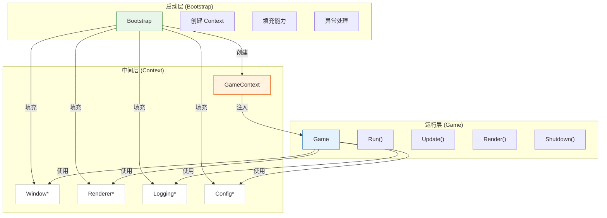
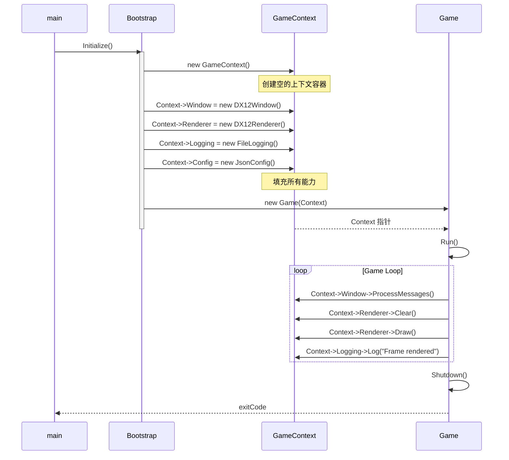
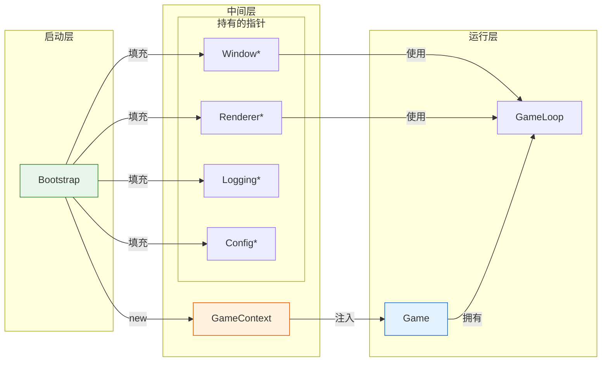
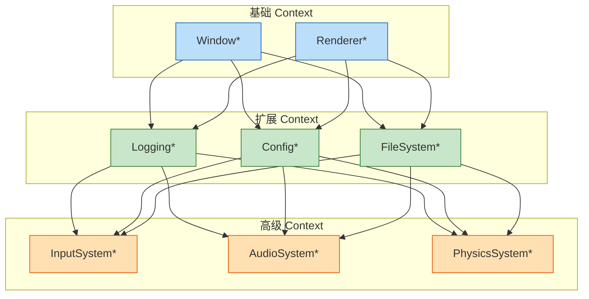

# Context (上下文层)

## 1. 概述

Context 是游戏引擎的**中间层**，作为 Bootstrap 和 Game 之间的**数据容器和接口契约**。

| 职责定位     | 说明                                                       |
| :----------- | :--------------------------------------------------------- |
| **做什么**   | 持有能力指针（Window、Renderer、Logging 等），定义接口契约 |
| **不做什么** | 不创建对象、不执行业务逻辑、不持有状态                     |

**设计哲学**：Context 是"容器 + 接口"，它定义了 Game 需要使用哪些能力，但不关心这些能力如何创建。它解耦了"使用者"（Game）和"提供者"（Bootstrap）。

---

## 2. 核心概念

### 2.1 为什么需要 Context？

```
直接注入的问题：
Bootstrap ──→ Game
  ❌ Game 必须知道所有具体类型
  ❌ 每次新增能力都要修改 Game 构造函数
  ❌ 违反开闭原则

使用 Context 的优势：
Bootstrap ──→ Context ──→ Game
  ✅ Game 只需知道 Context 接口
  ✅ 新增能力只需扩展 Context
  ✅ 关注点分离
```

### 2.2 Context vs 具体能力

| 维度         | Context               | 具体能力 (如 IRenderer)       |
| :----------- | :-------------------- | :---------------------------- |
| **本质**     | 容器（Container）     | 服务接口（Service Interface） |
| **职责**     | 持有指针、定义变量    | 定义"能做什么"（Draw、Clear） |
| **生命周期** | 创建由 Bootstrap 管理 | 创建由 Bootstrap 管理         |
| **使用方式** | 被 Game 持有并访问    | Game 通过 Context 间接使用    |

### 2.3 能力流动

```
┌─────────────┐
│  Bootstrap  │  ← 创建具体实现（DX12Renderer、FileSystem 等）
└──────┬──────┘
       │
       │ 填充能力
       ▼
┌─────────────┐
│   Context   │  ← 持有能力指针（仅接口类型）
│  (数据容器)   │
└──────┬──────┘
       │
       │ 注入
       ▼
┌─────────────┐
│    Game     │  ← 通过 Context 访问能力
└─────────────┘
```

---

## 3. Context 的设计

### 3.1 核心结构

```cpp
// Context 是一个纯数据容器，不包含任何业务逻辑
class GameContext {
public:
    // ── 基础子系统指针 ──
    IWindow*      Window      = nullptr;   // 窗口管理
    IRenderer*    Renderer    = nullptr;   // 渲染器
    IConfig*      Config      = nullptr;   // 配置管理
    ILogging*     Logging     = nullptr;   // 日志系统
    IFileSystem*  FileSystem  = nullptr;   // 文件系统

    // ── 游戏模块指针 ──
    IInputSystem*    InputSystem   = nullptr;
    IAudioSystem*    AudioSystem   = nullptr;
    IPhysicsSystem*  PhysicsSystem = nullptr;

    // ── 便捷访问方法 ──
    bool IsValid() const;
    void Release();  // 释放所有指针（但 Context 本身不负责销毁对象）
};

// 接口示例
class IRenderer {
public:
    virtual void Clear() = 0;
    virtual void Draw() = 0;
    virtual ~IRenderer() = default;
};
```

### 3.2 使用示例

```cpp
// Bootstrap 负责创建和填充 Context
class Bootstrap {
public:
    GameContext* CreateContext() {
        auto ctx = new GameContext();

        // 创建具体实现
        ctx->Window    = new DX12Window();
        ctx->Renderer  = new DX12Renderer();
        ctx->Logging    = new FileLogging();
        ctx->Config     = new JsonConfigManager();

        return ctx;
    }
};

// Game 只依赖 Context 接口
class Game {
private:
    GameContext* m_Context;  // 单一的注入点

public:
    Game(GameContext* ctx) : m_Context(ctx) {}

    void Render() {
        // 通过 Context 访问能力
        m_Context->Renderer->Clear();
        m_Context->Renderer->Draw();
    }
};
```

---

## 4. 架构图表

### 4.1 三层架构全景



### 4.2 数据流时序图



### 4.3 依赖关系图



### 4.4 扩展性示意



---

## 5. Context 的设计原则

| 原则           | 说明                                                                    |
| :------------- | :---------------------------------------------------------------------- |
| **纯数据容器** | 只包含指针和 getter/setter，不包含业务逻辑                              |
| **单一注入点** | Game 通过一个 Context 对象获取所有能力                                  |
| **接口契约**   | Context 中只声明接口类型（IRenderer*），不声明具体类型（DX12Renderer*） |
| **所有权分离** | Context 持有指针但不负责销毁，由创建者（Bootstrap）负责生命周期         |
| **可扩展性**   | 新增能力只需在 Context 中添加新指针，无需修改 Game                      |

---

## 6. 与其他模块的关系

### 6.1 职责边界

| 操作         | Bootstrap | Context |   Game   |
| :----------- | :-------: | :-----: | :------: |
| 创建具体对象 |    ✅     |   ❌    |    ❌    |
| 持有能力指针 |    ❌     |   ✅    |    ❌    |
| 使用能力     |    ❌     |   ❌    |    ✅    |
| 管理生命周期 |   创建    | 不负责  | 触发释放 |

### 6.2 类型可见性

```cpp
// Bootstrap (可见所有类型)
class Bootstrap {
    void CreateGame() {
        auto ctx = new GameContext();
        ctx->Renderer = new DX12Renderer();  // ✅ 可见具体类型
        ctx->Window   = new DX12Window();
    }
};

// Context (只可见接口)
class GameContext {
    IRenderer* Renderer;  // ✅ 接口类型
    IWindow*   Window;    // ✅ 接口类型
};

// Game (只可见 Context)
class Game {
    GameContext* m_Context;
    void Render() {
        m_Context->Renderer->Draw();  // ✅ 通过接口使用
    }
};
```

---

## 7. 未来扩展

随着引擎发展，Context 可逐步添加：

|  阶段   | 新增能力          | 说明           |
| :-----: | :---------------- | :------------- |
| Phase 1 | MemoryAllocator\* | 内存管理器指针 |
| Phase 1 | FileSystem\*      | 文件系统指针   |
| Phase 2 | InputSystem\*     | 输入系统指针   |
| Phase 2 | AudioSystem\*     | 音频系统指针   |
| Phase 3 | PhysicsSystem\*   | 物理系统指针   |
| Phase 3 | AISystem\*        | AI 系统指针    |

所有新增能力遵循相同模式：在 Context 中添加接口指针 → Bootstrap 填充 → Game 使用。
