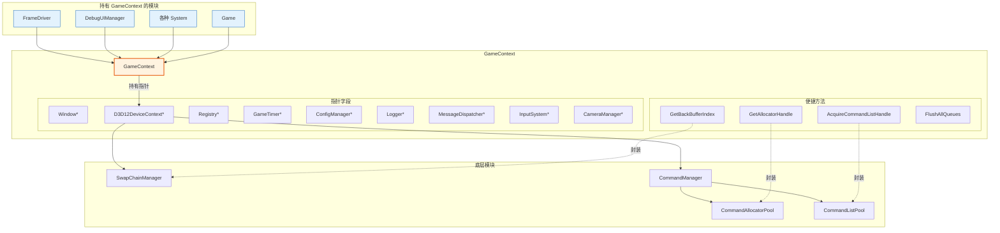
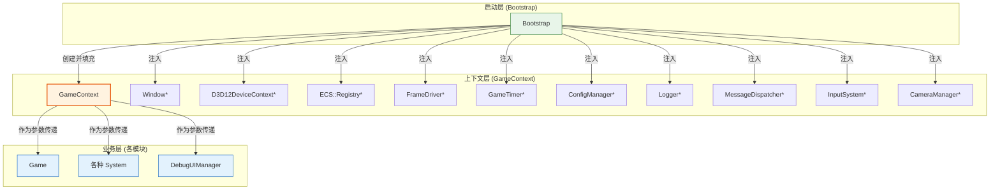
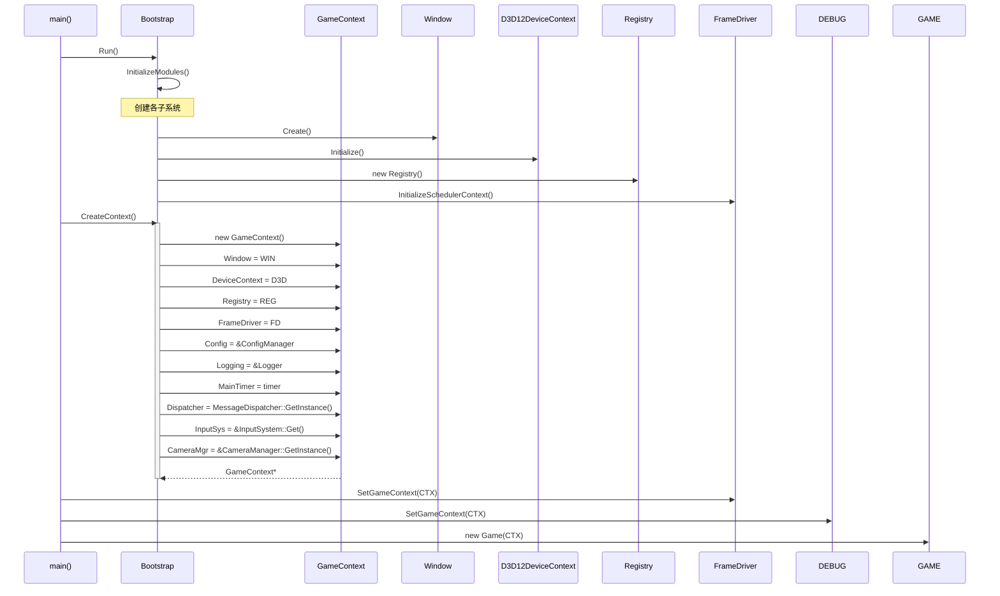
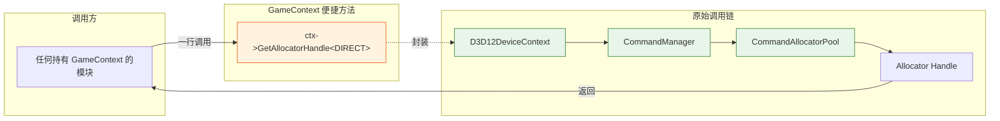
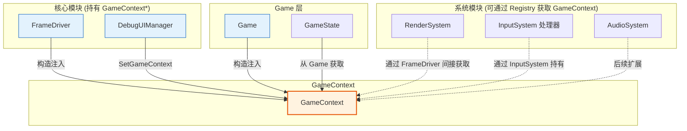
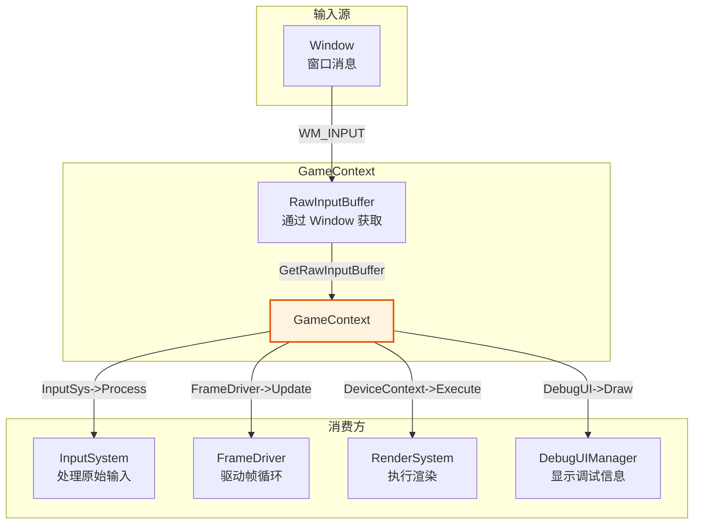

# GameContext (游戏上下文)

## 1. 定位与职责

### 定位

GameContext 是游戏引擎的**依赖注入容器**和**便捷访问层**，作为各模块之间的**统一访问入口**。

- **上游依赖**：由 `Bootstrap` 创建并填充所有子系统指针
- **下游服务**：为 `FrameDriver`、`DebugUIManager`、各 `System`、`Game` 等提供统一的能力访问

### 核心职责

| 职责 | 说明 |
|:----|:-----|
| **持有能力指针** | 存储所有核心子系统的裸指针（Window、DeviceContext、Registry 等） |
| **提供便捷方法** | 封装深层调用链，避免模块间层层传递依赖 |
| **统一访问入口** | 任何需要访问多个模块的地方，都可以持有 `GameContext*` |
| **有效性校验** | 提供 `IsValid()` 方法检查所有必要指针是否已设置 |

### 职责边界

| 职责 | Bootstrap | GameContext | 各模块 | Game |
|:----|:---------:|:-----------:|:------:|:----:|
| 创建具体对象 | ✅ | ❌ | ❌ | ❌ |
| 持有能力指针 | ❌ | ✅ | ❌ | ❌ |
| 封装便捷方法 | ❌ | ✅ | ❌ | ❌ |
| 执行业务逻辑 | ❌ | ❌ | ✅ | ✅ |
| 注入到其他模块 | ❌ | ✅ (作为参数传递) | ❌ | ❌ |

---

## 2. 核心概念

### 2.1 为什么需要 GameContext？

```
传统层层传递的问题：
Window ──→ DeviceContext ──→ CommandManager ──→ CommandAllocator
         ↑
    每一层都要传递依赖

使用 GameContext 的优势：
GameContext ──→ 任何模块
    ├── DeviceContext ──→ 深层调用
    ├── Window
    ├── Registry
    └── ...
    模块只需持有 GameContext，按需获取能力
```

### 2.2 便捷方法的作用

GameContext 封装了常见的深层调用链，避免各模块重复编写相同代码：

```cpp
// ❌ 没有 GameContext 时：需要层层传递或重复获取
auto& deviceCtx = GetDeviceContext();
auto& cmdMgr = deviceCtx.GetCommandManager();
auto allocator = cmdMgr.AcquireAllocator<DIRECT>(fenceValue);
auto cmdList = cmdMgr.AcquireCommandList(allocator);
// 每个需要命令列表的地方都要重复这些代码

// ✅ 使用 GameContext 便捷方法
auto allocator = ctx->GetAllocatorHandle<DIRECT>(fenceValue);
auto cmdList = ctx->AcquireCommandListHandle<DIRECT>(allocator);
// 一行搞定，内部封装了调用链
```

---

## 3. 数据结构

### 3.1 核心成员变量

```pseudocode
class GameContext {
    // ── 基础设施子系统 ──
    Window*              Window            // 窗口
    ConfigManager*       Config            // 配置管理
    Logger*              Logging           // 日志
    GameTimer*           MainTimer         // 计时器
    MessageDispatcher*   Dispatcher        // 事件分发

    // ── 调度与数据层 ──
    FrameDriver*         FrameDriver       // 帧循环驱动
    BackgroundExecutor*  BackgroundExecutor // 异步任务执行器
    Registry*            Registry          // ECS 实体管理

    // ── 渲染子系统 ──
    D3D12DeviceContext*  DeviceContext     // 图形设备
    CameraManager*       CameraMgr         // 摄像机
    FrameResourceManager* FrameResourceManager // 帧资源
    CullingSystem*       CullingSystem     // 可见性剔除
    LODSystem*           LODSystem         // 层次细节
    VisibleRaycaster*    VisibleRaycaster  // 射线检测
    ReflectionProbeManager* ReflectionProbeMgr // 反射探针
    AmbientOcclusionManager* AmbientOcclusionMgr // 环境光遮蔽

    // ── 资源管理 ──
    MaterialManager*     MaterialMgr       // 材质
    TextureManager*      TextureMgr        // 纹理
    GeometryResourceManager* GeometryResourceManager // 几何体
    SkeletonManager*     SkeletonMgr       // 骨骼
    DescriptorHeapCollection* DescriptorHeaps // 描述符堆
    DepthStencilPool*    DepthStencilPool  // 深度模板池
    RenderTargetPool*    RenderTargetPool  // 渲染目标池

    // ── 输入系统 ──
    InputManager*        InputMgr          // 输入

    // ── 便捷方法 ──
    GetBackBufferIndex() -> uint
    GetBackBuffer() -> ID3D12Resource*
    GetFenceValue(type) -> uint64
    FlushAllQueues()
    GetAllocatorHandle<T>(fence) -> Handle
    AcquireCommandListHandle<T>(allocator) -> Handle
    ReleaseCommandList<T>(handle)
    ReleaseAllocator<T>(handle, fence)
    ResolvePath(relativePath) -> wstring
};
```

### 3.2 便捷方法

| 方法 | 用途 | 封装内容 |
|:----|:-----|:---------|
| `GetBackBufferIndex()` | 获取当前后台缓冲区索引 | 通过 DeviceContext 获取交换链索引 |
| `GetBackBuffer()` | 获取当前后台缓冲区资源 | 通过 DeviceContext 获取交换链后台缓冲 |
| `GetFenceValue()` | 获取指定队列的 Fence 值 | 通过 DeviceContext 获取命令管理器围栏值 |
| `FlushAllQueues()` | 刷新所有命令队列 | 等待所有 GPU 队列完成 |
| `GetAllocatorHandle<T>()` | 获取命令分配器句柄 | 通过 DeviceContext 分配命令分配器 |
| `AcquireCommandListHandle<T>()` | 获取命令列表句柄 | 通过 DeviceContext 获取命令列表 |
| `ReleaseCommandList<T>()` | 释放命令列表 | 归还命令列表到池 |
| `ReleaseAllocator<T>()` | 释放命令分配器 | 归还分配器，带 fence 同步 |
| `GetNextSequence()` | 获取下一个序列号 | 全局唯一序列号 |
| `ResolvePath()` | 解析相对路径 | 基于项目根目录拼接路径 |

---

## 4. 架构图表

### 4.1 GameContext 作为统一访问入口



### 4.2 三层依赖关系图



### 4.3 初始化与填充时序图



### 4.4 便捷方法调用链封装



### 4.5 模块持有 GameContext 关系图



### 4.6 数据流向图



---

## 5. 使用示例

### 5.1 FrameDriver 持有 GameContext

```pseudocode
class FrameDriver {
    ctx: GameContext*
    
    SetGameContext(ctx):
        this.ctx = ctx
    
    Tick():
        // 通过 Context 访问各子系统
        registry = ctx.Registry
        device = ctx.DeviceContext
        timer = ctx.MainTimer
        
        // 使用便捷方法获取命令列表
        allocator = ctx.GetAllocatorHandle<DIRECT>(fenceValue)
        cmdList = ctx.AcquireCommandListHandle<DIRECT>(allocator)
}
```

### 5.2 System 通过 Registry 间接获取

```pseudocode
class RenderSystem : System {
    Update(registry: Registry, ctx: GameContext*):
        // 通过传入的 Context 参数访问
        backBuffer = ctx.GetBackBuffer()
        ctx.FlushAllQueues()
}
```

### 5.3 Game 持有 GameContext

```pseudocode
class Game {
    ctx: GameContext*
    
    Game(context):
        ctx = context
    
    Run():
        while not ctx.Window.ShouldClose():
            ctx.Window.ProcessMessages()
            ctx.BackgroundExecutor.Tick()
            ctx.FrameDriver.Tick()
}
```

---

## 6. 设计原则

| 原则 | 说明 |
|:----|:-----|
| **纯数据容器** | 只包含指针和便捷方法，不包含业务逻辑 |
| **单一注入点** | 各模块只需持有 `GameContext*`，无需依赖多个单例 |
| **封装调用链** | 便捷方法封装深层调用，避免重复代码 |
| **所有权分离** | Context 持有裸指针（非拥有），由 Bootstrap 管理生命周期 |
| **可扩展性** | 新增能力只需添加指针字段和便捷方法 |

---

## 7. 与其他模块的协作

### 7.1 Bootstrap 填充

```pseudocode
// Bootstrap 负责填充所有指针
Bootstrap::CreateContext():
    context = new GameContext()
    context.Window        = m_window
    context.DeviceContext = m_deviceContext
    context.Registry      = m_registry
    context.FrameDriver   = m_frameDriver
    context.Config        = ConfigManager.GetInstance()
    context.Logging       = Logger.GetInstance()
    context.MainTimer     = m_mainTimer
    context.Dispatcher    = MessageDispatcher.GetInstance()
    context.BackgroundExecutor = m_backgroundExecutor
    context.InputMgr      = InputManager.Get()
    context.CameraMgr     = CameraManager.GetInstance()
    context.DescriptorHeaps = m_descriptorHeaps
    context.FrameResourceManager = m_frameResourceManager
    context.GeometryResourceManager = m_geometryResourceManager
    context.MaterialMgr   = m_materialManager
    context.TextureMgr    = m_textureManager
    context.SkeletonMgr   = m_skeletonManager
    
    // 初始化的模块
    CameraManager.GetInstance().Initialize(width, height)
    ReflectionProbeManager.Initialize(device, descriptorHeaps)
    AmbientOcclusionManager.Initialize(device, descriptorHeaps, width, height)
    VisibleRaycaster.Initialize(registry)
    
    // 关联到 FrameDriver
    context.FrameDriver.SetGameContext(context)
    DebugUI.SetGameContext(context)
    
    return context
```

### 7.2 FrameDriver 关联

```pseudocode
// 创建 Context 后关联到 FrameDriver 和 DebugUI
FrameDriver.SetGameContext(context)
DebugUI.SetGameContext(context)
DebugUI.AutoRegisterToFrameDriver(context)
```

### 7.3 职责边界总结

| 操作 | Bootstrap | GameContext | 各模块 |
|:----|:---------:|:-----------:|:------:|
| 创建子系统对象 | ✅ | ❌ | ❌ |
| 持有子系统指针 | ❌ (unique_ptr) | ✅ (裸指针) | ❌ |
| 封装便捷方法 | ❌ | ✅ | ❌ |
| 执行业务逻辑 | ❌ | ❌ | ✅ |
| 校验有效性 | ❌ | ✅ | ❌ |

---

## 8. 未来扩展

| 阶段 | 新增字段 | 对应便捷方法 |
|:----:|:---------|:-------------|
| Phase 2 | `FileSystem*` | `ReadFile()`, `WriteFile()` |
| Phase 2 | `AudioSystem*` | `PlaySound()`, `StopSound()` |
| Phase 3 | `PhysicsSystem*` | `Raycast()`, `GetGravity()` |
| Phase 3 | `ScriptEngine*` | `ExecuteScript()`, `LoadScript()` |
