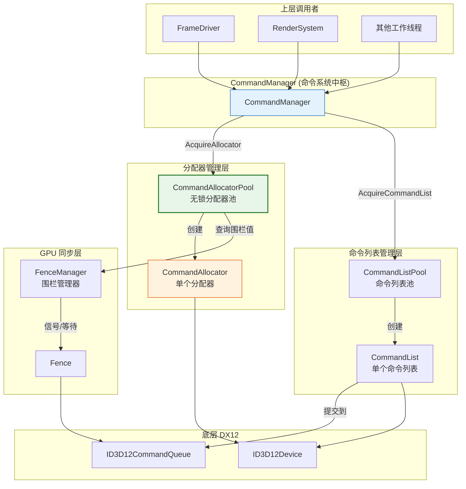
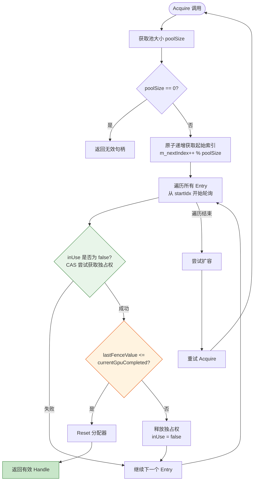
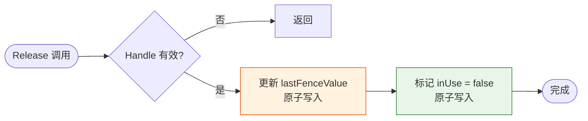
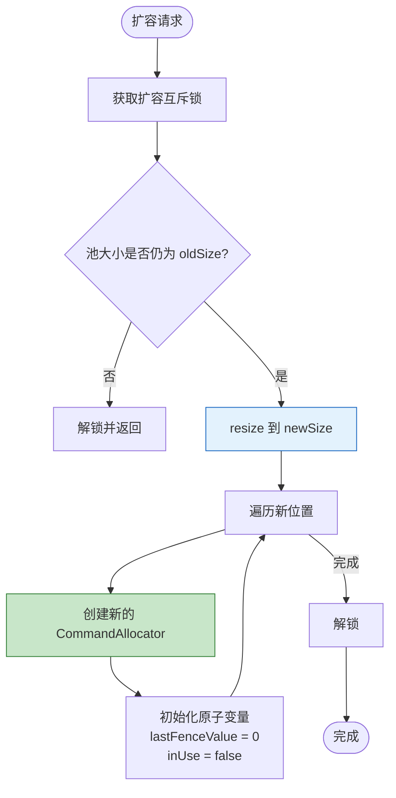
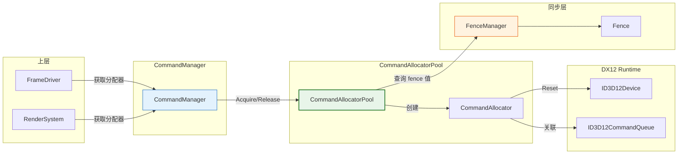
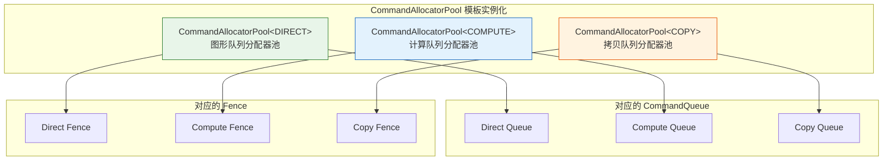

# CommandAllocatorPool (命令分配器池)

## 1. 定位与职责

### 定位

CommandAllocatorPool 是 DX12 命令系统中**线程安全的无锁命令分配器复用池**，负责管理 `ID3D12CommandAllocator` 的生命周期和复用。

- **上游依赖**：依赖 `ID3D12Device` 创建分配器，依赖 `FenceManager` 的围栏值判断 GPU 完成状态
- **下游服务**：为 `CommandManager` 提供分配器的获取和释放接口，供 `FrameDriver`、`RenderSystem` 等使用

### 核心职责

| 职责 | 说明 |
|:----|:-----|
| **分配器复用** | 管理多个命令分配器，避免频繁创建销毁 |
| **线程安全获取** | 使用 CAS 无锁算法，支持多线程并发获取 |
| **GPU 状态感知** | 通过围栏值判断分配器是否可安全复用 |
| **动态扩容** | 池满时自动扩容，无需预知最大并发数 |

### 职责边界

| 职责 | CommandAllocatorPool | CommandManager | 上层模块 |
|:----|:--------------------:|:--------------:|:--------:|
| 创建 CommandAllocator | ✅ | ❌ | ❌ |
| 管理分配器复用 | ✅ | ❌ | ❌ |
| 提供获取/释放接口 | ✅ | ✅ (封装) | ❌ |
| 管理围栏同步 | ❌ | ✅ | ❌ |
| 执行命令 | ❌ | ✅ | ✅ |

---

## 2. 在命令系统中的位置



---

## 3. 核心设计

### 3.1 统一句柄 (Handle)

```cpp
struct Handle {
    size_t index = static_cast<size_t>(-1);     // 池中索引
    CommandAllocator<Type>* allocator = nullptr; // 直接指针，O(1) 访问
    
    bool IsValid() const { return index != static_cast<size_t>(-1); }
};
```

**设计优势**：
- `index` 支持 O(1) 释放，无需遍历查找
- `allocator` 缓存在 Handle 中，避免二次查找

### 3.2 防伪共享 (False Sharing)

```cpp
static constexpr size_t CACHE_LINE_SIZE = 64;

struct alignas(CACHE_LINE_SIZE) Entry {
    std::unique_ptr<CommandAllocator<Type>> allocator;
    std::atomic<uint64_t> lastFenceValue{0};
    std::atomic<bool> inUse{false};
    char padding[...];  // 补齐到 64 字节
};
```

每个 Entry 独占一个缓存行，避免多线程竞争时互相影响。

### 3.3 获取流程 (Acquire)



### 3.4 释放流程 (Release)



### 3.5 动态扩容



---

## 4. 与其他模块的关系

### 4.1 模块依赖关系图



### 4.2 在 CommandManager 中的集成

```cpp
class CommandManager {
    // 按类型存储三种分配器池
    std::map<D3D12_COMMAND_LIST_TYPE, std::unique_ptr<ICommandAllocatorPool>> m_allocatorPools;

    template <D3D12_COMMAND_LIST_TYPE Type>
    typename CommandAllocatorPool<Type>::Handle AcquireAllocator(uint64_t currentCompleted) {
        auto it = m_allocatorPools.find(Type);
        auto* specificPool = static_cast<CommandAllocatorPool<Type>*>(it->second.get());
        return specificPool->Acquire(currentCompleted);
    }

    template <D3D12_COMMAND_LIST_TYPE Type>
    void ReleaseAllocator(const Handle& handle, uint64_t fenceValue) {
        // O(1) 释放
    }
};
```

### 4.3 上层使用示例

```cpp
// 在 FrameDriver 或 RenderSystem 中
void RenderSystem::Render(GameContext* ctx) {
    // 通过 GameContext 的便捷方法获取分配器
    auto allocatorHandle = ctx->GetAllocatorHandle<DIRECT>(ctx->GetFenceValue());
    
    // 获取命令列表
    auto cmdListHandle = ctx->AcquireCommandListHandle<DIRECT>(allocatorHandle.allocator->Get());
    
    // 记录命令...
    cmdListHandle.cmdList->Close();
    
    // 提交
    ctx->GetCommandManager().Submit(DIRECT, cmdList);
    
    // 释放（由 FrameDriver 在帧结束时批量处理）
    ctx->ReleaseCommandList<DIRECT>(cmdListHandle);
    ctx->ReleaseAllocator<DIRECT>(allocatorHandle, fenceValue);
}
```

### 4.4 三种类型池的关系



---

## 5. 设计特点总结

| 特性 | 实现方式 | 收益 |
|:-----|:---------|:-----|
| **无锁获取** | CAS + 轮询策略 | 高并发下无锁竞争 |
| **防伪共享** | Entry 按 64 字节对齐 | 避免缓存行乒乓 |
| **动态扩容** | 池满时自动翻倍扩展 | 无需预知最大并发数 |
| **安全复用** | 依赖围栏值确保 GPU 完成 | 避免 GPU 访问冲突 |
| **O(1) 释放** | 通过 Handle 索引直接访问 | 释放无遍历开销 |
| **类型隔离** | 按 CommandListType 模板实例化 | 三种队列独立管理 |

---

## 6. 接口说明

### 6.1 核心接口

| 方法 | 参数 | 返回值 | 说明 |
|:----|:-----|:-------|:-----|
| `Acquire` | `currentGpuCompletedValue` | `Handle` | 获取一个可用的分配器 |
| `Release` | `Handle&, fenceValue` | `void` | 释放分配器，记录围栏值 |
| `GetStats` | 无 | `Stats` | 获取池统计信息（调试用） |

### 6.2 统计信息

```cpp
struct Stats {
    size_t totalCount = 0;   // 池中总分配器数量
    size_t inUseCount = 0;   // 当前使用中的分配器数量
};
```

