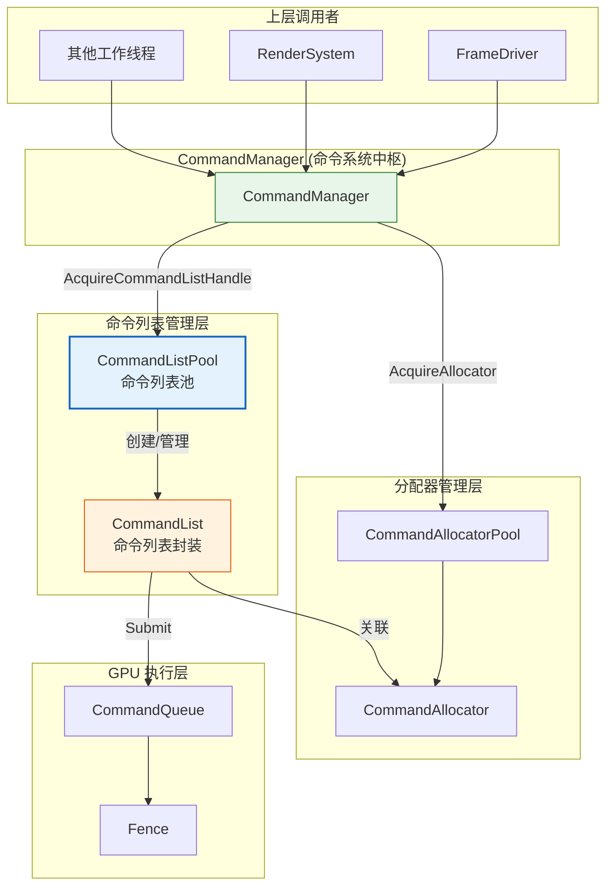
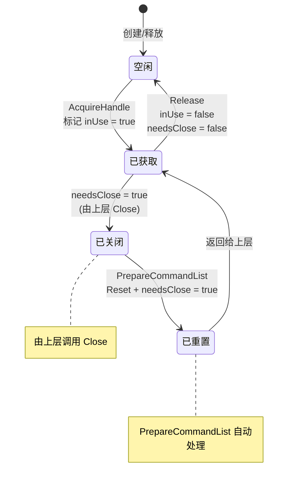
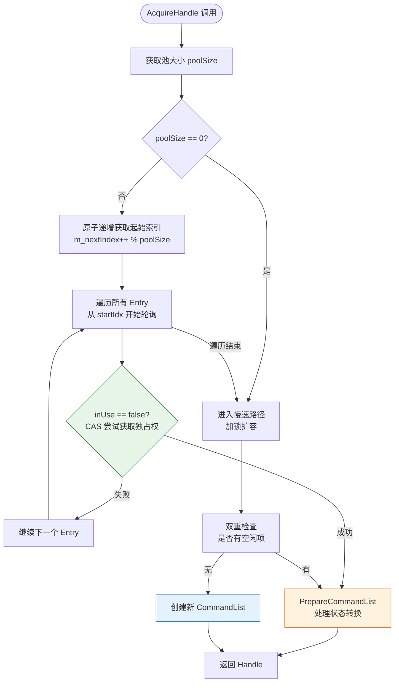
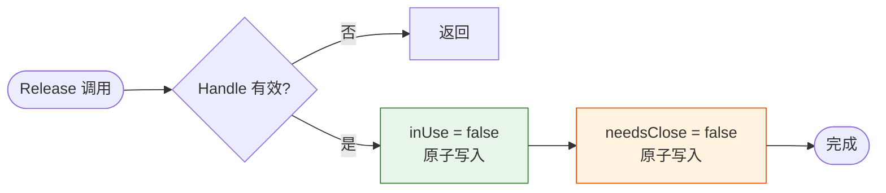
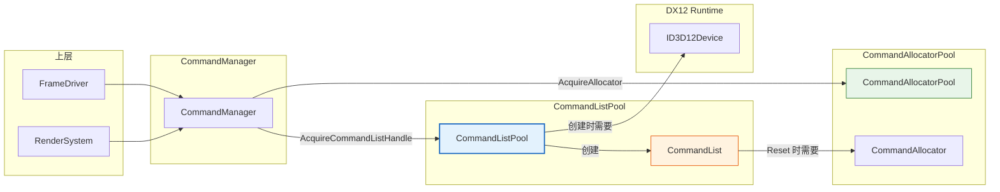
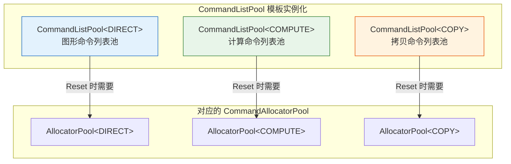
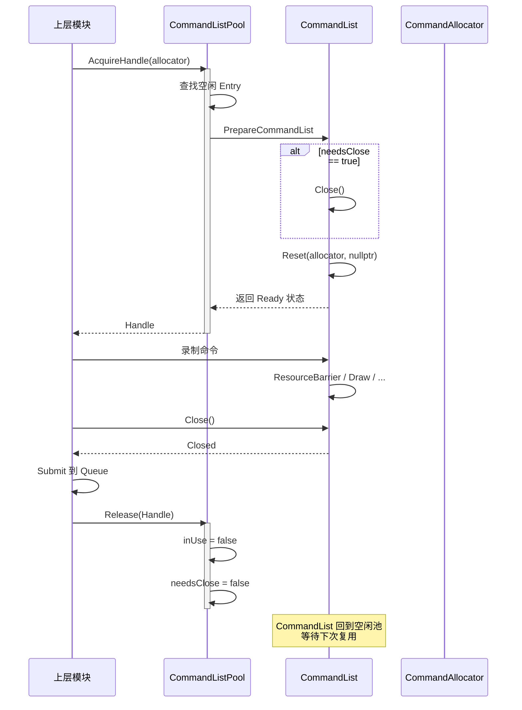

# CommandListPool (命令列表池)

## 1. 定位与职责

### 定位

CommandListPool 是 DX12 命令系统中**线程安全的命令列表复用池**，负责管理 `ID3D12GraphicsCommandList` 的生命周期、复用和状态转换。

- **上游依赖**：依赖 `ID3D12Device` 创建命令列表，依赖 `CommandAllocator` 进行 Reset
- **下游服务**：为 `CommandManager` 提供命令列表的获取和释放接口，供 `FrameDriver`、`RenderSystem` 等使用

### 核心职责

| 职责 | 说明 |
|:----|:-----|
| **命令列表复用** | 管理多个命令列表，避免频繁创建销毁 |
| **线程安全获取** | 使用 CAS 无锁算法，支持多线程并发获取 |
| **状态自动管理** | 自动处理 CommandList 的 Close/Reset 状态转换 |
| **动态扩容** | 池满时自动扩容，无需预知最大并发数 |

### 职责边界

| 职责 | CommandListPool | CommandManager | 上层模块 |
|:----|:---------------:|:--------------:|:--------:|
| 创建 CommandList | ✅ | ❌ | ❌ |
| 管理命令列表复用 | ✅ | ❌ | ❌ |
| 状态转换 (Close/Reset) | ✅ | ❌ | ❌ |
| 提供获取/释放接口 | ✅ | ✅ (封装) | ❌ |
| 执行命令 | ❌ | ✅ | ✅ |

---

## 2. 在命令系统中的位置



---

## 3. CommandList 封装类

### 3.1 设计定位

`CommandList` 是一个轻量级的句柄包装类，不持有所有权，仅作为 `ID3D12GraphicsCommandList` 的便捷接口。

```cpp
class CommandList {
public:
    CommandList();                                    // 空句柄
    explicit CommandList(ID3D12GraphicsCommandList* cmdList);  // 从裸指针构造
    
    ID3D12GraphicsCommandList* Get() const;          // 获取底层接口
    bool IsValid() const;                            // 检查有效性
    
    // 便捷方法转发
    void Reset(ID3D12CommandAllocator* pAllocator, ID3D12PipelineState* pInitialState);
    void Close();
    void ResourceBarrier(...);
    void DrawInstanced(...);
    void SetPipelineState(...);
    void SetComputeRootSignature(...);
    void Dispatch(...);
    
private:
    ID3D12GraphicsCommandList* m_cmdList;  // 裸指针，不管理生命周期
};
```

### 3.2 设计特点

| 特性 | 说明 |
|:-----|:-----|
| **零开销抽象** | 仅包装裸指针，无虚函数，无额外内存开销 |
| **可拷贝/移动** | 作为句柄使用，支持拷贝和移动语义 |
| **便捷方法** | 封装常见 DX12 API，减少重复代码 |

---

## 4. CommandListPool 核心设计

### 4.1 统一句柄 (Handle)

```cpp
struct Handle {
    size_t index = static_cast<size_t>(-1);  // 池中索引
    
    bool IsValid() const { return index != static_cast<size_t>(-1); }
};
```

**设计说明**：与 `CommandAllocatorPool` 不同，这里的 Handle 不缓存指针，因为 `CommandList` 获取频率较低，且需要通过池验证有效性。

### 4.2 防伪共享 (False Sharing)

```cpp
static constexpr size_t CACHE_LINE_SIZE = 64;

struct alignas(CACHE_LINE_SIZE) Entry {
    Microsoft::WRL::ComPtr<ID3D12GraphicsCommandList> cmdList;
    std::atomic<bool> inUse{false};
    std::atomic<bool> needsClose{false};   // 标记是否需要 Close
    char padding[...];                      // 补齐到 64 字节
};
```

`needsClose` 标志位用于跟踪 CommandList 的关闭状态，避免重复 Close。

### 4.3 状态自动管理

CommandList 的生命周期状态由 Pool 自动管理：



### 4.4 获取流程 (AcquireHandle)



### 4.5 PrepareCommandList 状态处理

```cpp
void PrepareCommandList(CommandList& cmdList, ID3D12CommandAllocator* allocator, Entry& entry) {
    // 如果上次使用后没有 Close，先 Close
    bool expectedNeedsClose = true;
    if (entry.needsClose.compare_exchange_strong(expectedNeedsClose, false)) {
        cmdList.Close();  // 确保 Closed 状态
    }
    
    // 此时 CommandList 一定是 Closed 状态，可以安全地 Reset
    cmdList.Reset(allocator, nullptr);
    
    // 标记为使用后需要 Close
    entry.needsClose.store(true, std::memory_order_release);
}
```

### 4.6 释放流程 (Release)



---

## 5. 与其他模块的关系

### 5.1 模块依赖关系图



### 5.2 在 CommandManager 中的集成

```cpp
class CommandManager {
    // 按类型存储三种命令列表池
    std::map<D3D12_COMMAND_LIST_TYPE, std::unique_ptr<ICommandListPool>> m_commandListPools;

    template <D3D12_COMMAND_LIST_TYPE Type>
    typename CommandListPool<Type>::Handle AcquireCommandListHandle(ID3D12CommandAllocator* allocator) {
        auto it = m_commandListPools.find(Type);
        auto* specificPool = static_cast<CommandListPool<Type>*>(it->second.get());
        return specificPool->AcquireHandle(allocator);
    }

    template <D3D12_COMMAND_LIST_TYPE Type>
    CommandList GetCommandList(const typename CommandListPool<Type>::Handle& handle) {
        auto it = m_commandListPools.find(Type);
        auto* specificPool = static_cast<CommandListPool<Type>*>(it->second.get());
        return specificPool->GetCommandList(handle);
    }

    template <D3D12_COMMAND_LIST_TYPE Type>
    void ReleaseCommandList(const typename CommandListPool<Type>::Handle& handle) {
        // O(1) 释放
    }
};
```

### 5.3 上层使用示例

```cpp
// 在 FrameDriver 或 RenderSystem 中
void RenderSystem::Render(GameContext* ctx) {
    // 1. 获取分配器
    auto allocatorHandle = ctx->GetAllocatorHandle<DIRECT>(ctx->GetFenceValue());
    
    // 2. 获取命令列表
    auto cmdListHandle = ctx->AcquireCommandListHandle<DIRECT>(allocatorHandle.allocator->Get());
    auto cmdList = ctx->GetCommandList<DIRECT>(cmdListHandle);
    
    // 3. 录制命令
    cmdList.Reset(allocatorHandle.allocator->Get(), nullptr);
    cmdList.ResourceBarrier(...);
    cmdList.SetPipelineState(...);
    cmdList.DrawInstanced(...);
    cmdList.Close();
    
    // 4. 提交执行
    ctx->GetCommandManager().Submit(DIRECT, cmdList);
    
    // 5. 释放（由 FrameDriver 在帧结束时批量处理）
    ctx->ReleaseCommandList<DIRECT>(cmdListHandle);
    ctx->ReleaseAllocator<DIRECT>(allocatorHandle, fenceValue);
}
```

### 5.4 三种类型池的关系



---

## 6. 生命周期状态转换详解



---

## 7. 设计特点总结

| 特性 | 实现方式 | 收益 |
|:-----|:---------|:-----|
| **无锁获取** | CAS + 轮询策略 | 高并发下无锁竞争 |
| **防伪共享** | Entry 按 64 字节对齐 | 避免缓存行乒乓 |
| **惰性扩容** | 按需扩展，初始容量 0 | 节省内存 |
| **状态自动管理** | needsClose 标志 + PrepareCommandList | 上层无需关心 Close/Reset |
| **O(1) 释放** | 通过 Handle 索引直接访问 | 释放无遍历开销 |
| **类型隔离** | 按 CommandListType 模板实例化 | 三种队列独立管理 |

---

## 8. 与 CommandAllocatorPool 的对比

| 维度 | CommandAllocatorPool | CommandListPool |
|:----|:--------------------:|:---------------:|
| **管理对象** | ID3D12CommandAllocator | ID3D12GraphicsCommandList |
| **复用条件** | 需要检查 GPU 围栏值 | 无需检查围栏值 |
| **状态管理** | 简单（Reset 即可） | 复杂（需要 Close/Reset） |
| **Handle 内容** | index + allocator* | 仅有 index |
| **扩容策略** | 初始 8，翻倍扩容 | 初始 0，按需创建 |
| **依赖关系** | 独立 | 依赖 CommandAllocatorPool |

---

## 9. 接口说明

### 9.1 CommandList 接口

| 方法 | 说明 |
|:----|:-----|
| `Get()` | 获取底层 ID3D12GraphicsCommandList |
| `IsValid()` | 检查是否有效 |
| `Reset()` | 重置命令列表，需提供分配器和可选的 PSO |
| `Close()` | 关闭命令列表，准备提交 |
| `ResourceBarrier()` | 添加资源屏障 |
| `DrawInstanced()` | 绘制实例 |
| `SetPipelineState()` | 设置管线状态 |
| `SetComputeRootSignature()` | 设置 Compute 根签名 |
| `Dispatch()` | 分发 Compute 着色器 |

### 9.2 CommandListPool 接口

| 方法 | 参数 | 返回值 | 说明 |
|:----|:-----|:-------|:-----|
| `AcquireHandle` | `allocator` | `Handle` | 获取命令列表句柄 |
| `GetCommandList` | `Handle&` | `CommandList` | 通过句柄获取封装对象 |
| `Release` | `Handle&` | `void` | 释放命令列表 |
| `GetStats` | 无 | `Stats` | 获取池统计信息 |

---

