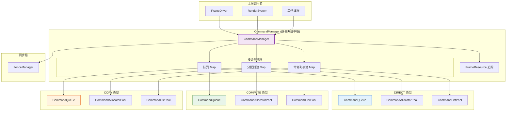
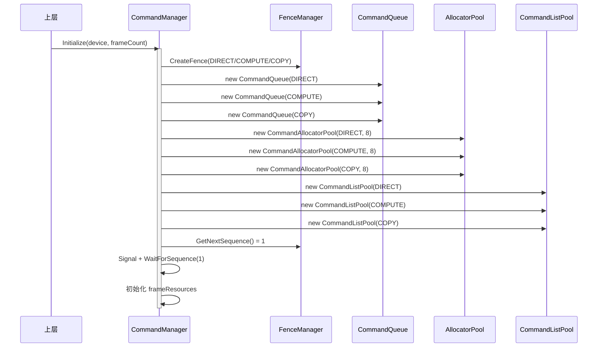
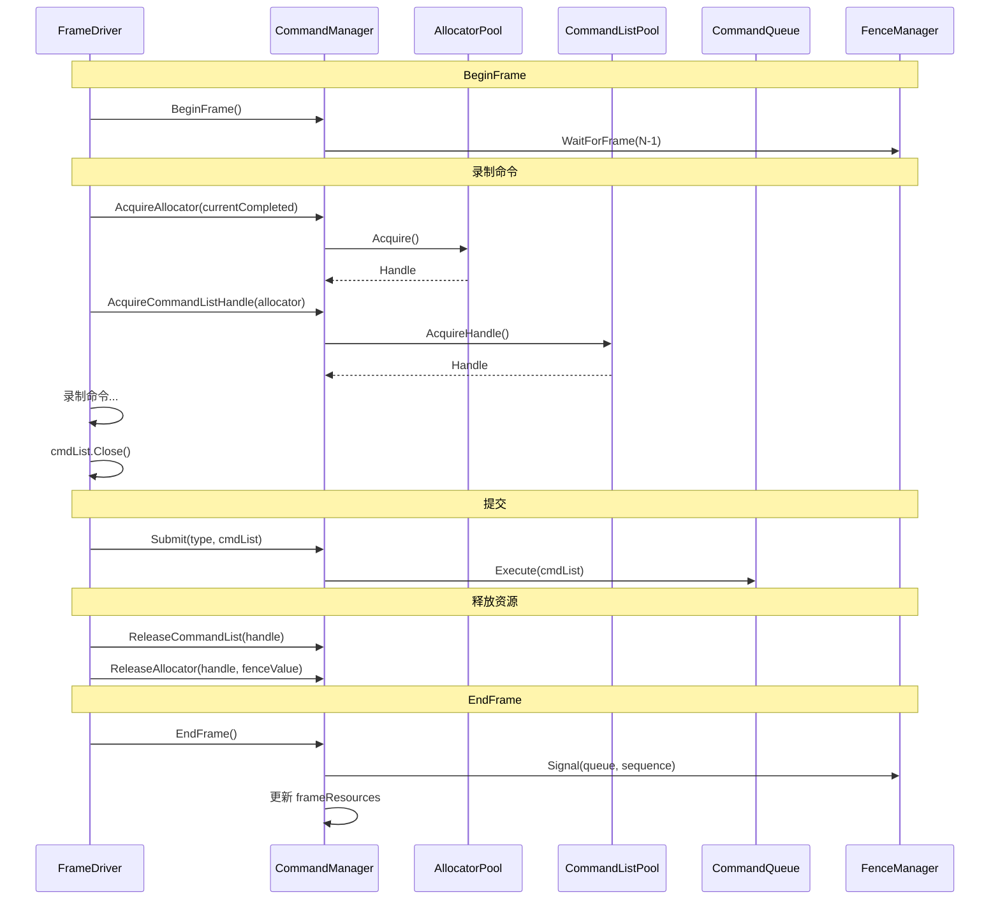
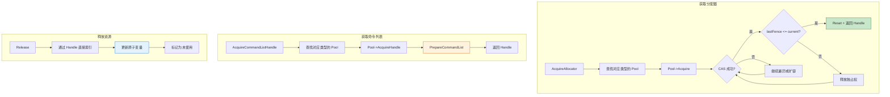
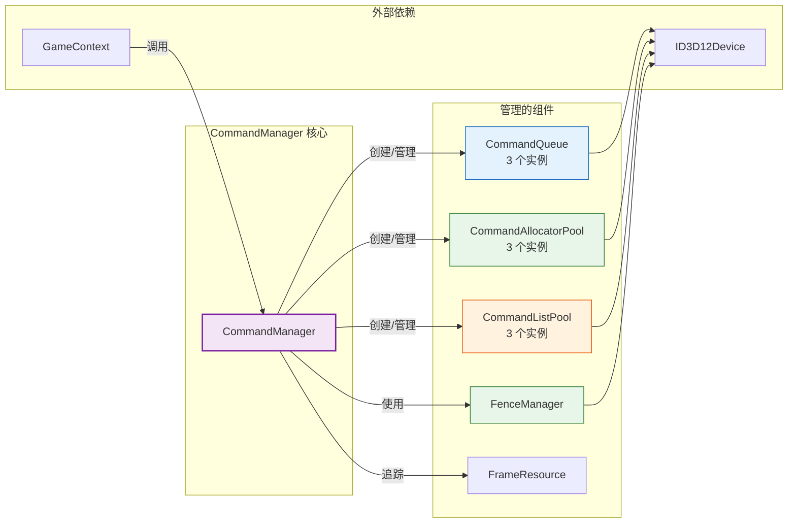

# CommandManager (命令系统中枢)

## 1. 定位与职责

### 定位

CommandManager 是 DX12 命令系统的**中枢协调层**，负责统一管理三种命令队列类型的所有资源（队列、分配器池、命令列表池、围栏）。

- **上游依赖**：依赖 `ID3D12Device` 创建所有底层资源
- **下游服务**：为 `FrameDriver`、`RenderSystem` 等提供统一的命令管理接口

### 核心职责

| 职责 | 说明 |
|:----|:-----|
| **资源统一管理** | 管理 DIRECT/COMPUTE/COPY 三种类型的队列、分配器池、命令列表池 |
| **工作线程接口** | 提供获取序号、申请/释放分配器、申请/释放命令列表、提交命令 |
| **主线程接口** | 提供帧边界同步（BeginFrame/EndFrame）、批量回收、等待完成 |
| **帧资源追踪** | 管理多帧围栏值，支持三缓冲/多缓冲模式 |
| **调试诊断** | 提供池统计信息，便于性能分析 |

### 职责边界

| 职责 | CommandManager | 子组件 (Pool/Queue/Fence) | 上层模块 |
|:----|:--------------:|:------------------------:|:--------:|
| 创建底层 DX12 对象 | ✅ (调用子组件) | ✅ | ❌ |
| 资源复用逻辑 | ❌ | ✅ (Pool 内部) | ❌ |
| 帧同步策略 | ✅ | ❌ | ❌ |
| 命令录制 | ❌ | ❌ | ✅ |
| 提交执行 | ✅ (调用 Queue) | ✅ (Queue::Execute) | ❌ |

---

## 2. 核心设计

### 2.1 统一管理架构

```cpp
class CommandManager {
    // 三种类型的队列
    std::map<D3D12_COMMAND_LIST_TYPE, std::unique_ptr<CommandQueue>> m_queues;
    
    // 三种类型的分配器池（基类指针）
    std::map<D3D12_COMMAND_LIST_TYPE, std::unique_ptr<ICommandAllocatorPool>> m_allocatorPools;
    
    // 三种类型的命令列表池（基类指针）
    std::map<D3D12_COMMAND_LIST_TYPE, std::unique_ptr<ICommandListPool>> m_commandListPools;
    
    // 围栏管理器
    FenceManager m_fenceManager;
    
    // 帧资源追踪
    struct FrameResource {
        uint64_t fenceValue = 0;  // 该帧的围栏值
        bool inUse = false;
    };
    std::vector<FrameResource> m_frameResources;
};
```

### 2.2 模板方法设计

CommandManager 使用模板方法将调用转发到具体类型的 Pool：

```cpp
template <D3D12_COMMAND_LIST_TYPE Type>
typename CommandAllocatorPool<Type>::Handle AcquireAllocator(uint64_t currentCompleted) {
    auto it = m_allocatorPools.find(Type);
    auto* specificPool = static_cast<CommandAllocatorPool<Type>*>(it->second.get());
    return specificPool->Acquire(currentCompleted);
}
```

### 2.3 帧同步策略

```cpp
void BeginFrame() {
    // 等待上一帧完成（环形缓冲区）
    uint32_t frameToWait = (m_currentFrame + m_frameCount - 1) % m_frameCount;
    uint64_t fenceValue = m_frameResources[frameToWait].fenceValue;
    if (fenceValue > 0) {
        m_fenceManager.WaitForSequence(D3D12_COMMAND_LIST_TYPE_DIRECT, fenceValue);
    }
}

void EndFrame() {
    // 记录当前帧的围栏值
    uint64_t sequence = m_fenceManager.GetCurrentSequence();
    uint64_t fenceValue = m_fenceManager.Signal(DIRECT, queue->Get(), sequence);
    m_frameResources[m_currentFrame].fenceValue = fenceValue;
    m_currentFrame = (m_currentFrame + 1) % m_frameCount;
}
```

---

## 3. 架构图表

### 3.1 整体架构图



### 3.2 初始化时序图



### 3.3 单帧执行流程



### 3.4 资源获取与释放流程



### 3.5 模块依赖关系图



---

## 4. 关键设计要点

### 4.1 Signal 不更新 GPU 围栏值

这是一个重要的设计特点：**CommandManager 中所有 Signal 方法都不会直接修改 GPU 端的围栏值**。

```cpp
// ❌ 误解：Signal 会立即更新 GPU 围栏值
// ✅ 实际：Signal 只是向 GPU 队列插入一个信号命令
//          GPU 执行到该命令时才会更新围栏值

uint64_t Signal(D3D12_COMMAND_LIST_TYPE type, ID3D12CommandQueue* queue, uint64_t value) {
    queue->Signal(fence->Get(), value);  // 异步！GPU 稍后执行
    return value;
}
```

**设计意义**：
- Signal 是**异步操作**，不会阻塞 CPU
- GPU 围栏值的更新发生在 GPU 执行到 Signal 命令时
- CPU 端通过 `GetCompletedValue()` 和 `WaitForSequence()` 查询/等待完成
- 这保证了 CPU 和 GPU 的并行执行

### 4.2 环形缓冲区帧同步

```mermaid
graph LR
    subgraph "Frame 0"
        F0[正在使用]
    end
    subgraph "Frame 1"
        F1[等待完成]
    end
    subgraph "Frame 2"
        F2[等待完成]
    end
    
    F0 -->|EndFrame| NEXT[Frame 1]
    
    Note: frameCount = 3<br/>BeginFrame 时等待 (current + 2) % 3

    style F0 fill:#c8e6c9,stroke:#2e7d32
    style F1 fill:#fff3e0,stroke:#e65100
    style F2 fill:#e3f2fd,stroke:#1565c0
```

### 4.3 类型隔离

三种命令队列类型完全隔离，互不影响：

| 类型 | 队列 | 分配器池 | 命令列表池 | 用途 |
|:----:|:----:|:-------:|:---------:|:-----|
| DIRECT | 1 个 | 独立池 | 独立池 | 图形渲染 |
| COMPUTE | 1 个 | 独立池 | 独立池 | 计算任务 |
| COPY | 1 个 | 独立池 | 独立池 | 资源拷贝 |

---

## 5. 接口说明

### 5.1 工作线程接口

| 方法 | 说明 |
|:----|:-----|
| `GetNextSequence()` | 获取下一个全局序号 |
| `GetCommandQueue(type)` | 获取指定类型的命令队列 |
| `AcquireAllocator<Type>(currentCompleted)` | 获取分配器句柄 |
| `ReleaseAllocator<Type>(handle, fenceValue)` | 释放分配器 |
| `AcquireCommandListHandle<Type>(allocator)` | 获取命令列表句柄 |
| `GetCommandList<Type>(handle)` | 通过句柄获取 CommandList |
| `ReleaseCommandList<Type>(handle)` | 释放命令列表 |
| `Submit(type, cmdList)` | 提交单个命令列表 |
| `SubmitBatch(handles, waitSequence)` | 批量提交（仅 DIRECT） |

### 5.2 主线程接口

| 方法 | 说明 |
|:----|:-----|
| `BeginFrame()` | 开始新帧，等待上一帧完成 |
| `EndFrame()` | 结束当前帧，记录围栏值 |
| `WaitForFrame(frameIndex, type)` | 等待指定帧完成 |
| `WaitForAllFrames(type)` | 等待所有帧完成 |
| `Flush(type)` | 刷新指定队列 |
| `FlushAllQueues()` | 刷新所有队列 |

### 5.3 调试接口

| 方法 | 说明 |
|:----|:-----|
| `GetPoolStats()` | 获取所有池的统计信息 |
| `GetCompletedFenceValue(type)` | 获取 GPU 完成值 |

---

## 6. 使用示例

```cpp
// 在 RenderSystem 中
void RenderSystem::Render(GameContext* ctx) {
    CommandManager& cmdMgr = ctx->DeviceContext->GetCommandManager();
    
    // 1. 获取分配器
    uint64_t gpuCompleted = cmdMgr.GetCompletedFenceValue(DIRECT);
    auto allocHandle = cmdMgr.AcquireAllocator<DIRECT>(gpuCompleted);
    
    // 2. 获取命令列表
    auto listHandle = cmdMgr.AcquireCommandListHandle<DIRECT>(
        cmdMgr.GetAllocator<DIRECT>(allocHandle)
    );
    
    // 3. 录制命令
    CommandList cmdList = cmdMgr.GetCommandList<DIRECT>(listHandle);
    cmdList.Reset(allocHandle.allocator->Get(), nullptr);
    cmdList.ResourceBarrier(...);
    cmdList.DrawInstanced(...);
    cmdList.Close();
    
    // 4. 提交
    cmdMgr.Submit(DIRECT, cmdList);
    
    // 5. 释放（通常由 FrameDriver 在帧结束时批量处理）
    uint64_t fenceValue = ctx->GetFenceValue();  // 当前帧的围栏值
    cmdMgr.ReleaseCommandList<DIRECT>(listHandle);
    cmdMgr.ReleaseAllocator<DIRECT>(allocHandle, fenceValue);
}
```

---

## 7. 设计特点总结

| 特性 | 实现方式 | 收益 |
|:-----|:---------|:-----|
| **类型隔离** | 每种命令类型独立管理 | 支持队列并行执行 |
| **模板转发** | 模板方法 + static_cast | 类型安全，零额外开销 |
| **环形缓冲** | frameResources 数组 + currentFrame 索引 | 支持多缓冲，避免阻塞 |
| **异步 Signal** | Signal 不等待 GPU | CPU/GPU 并行执行 |
| **统一管理** | Map 存储三种类型组件 | 代码简洁，易于扩展 |

