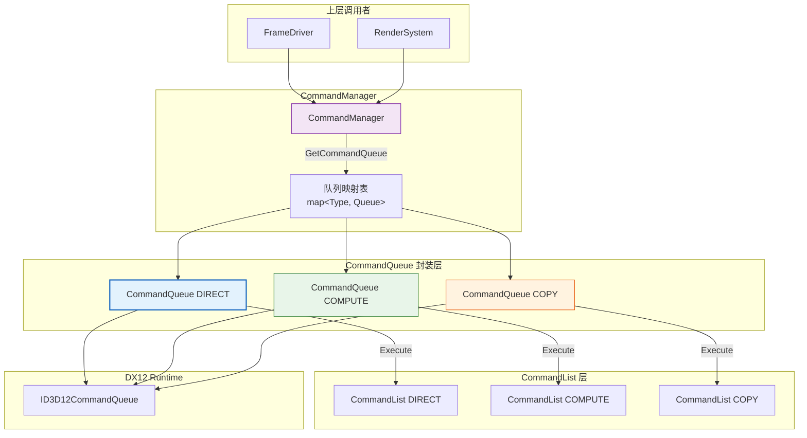
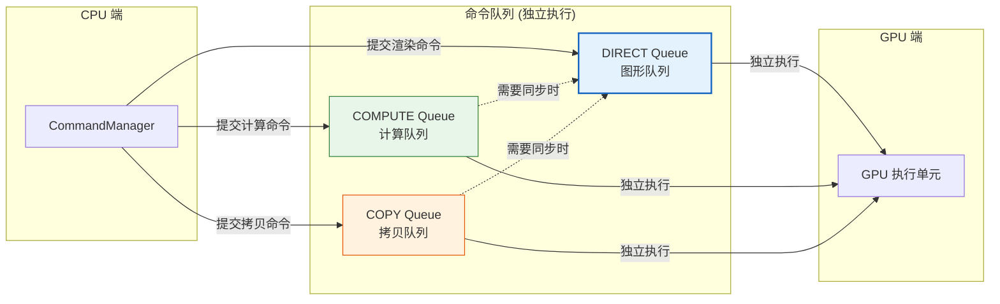
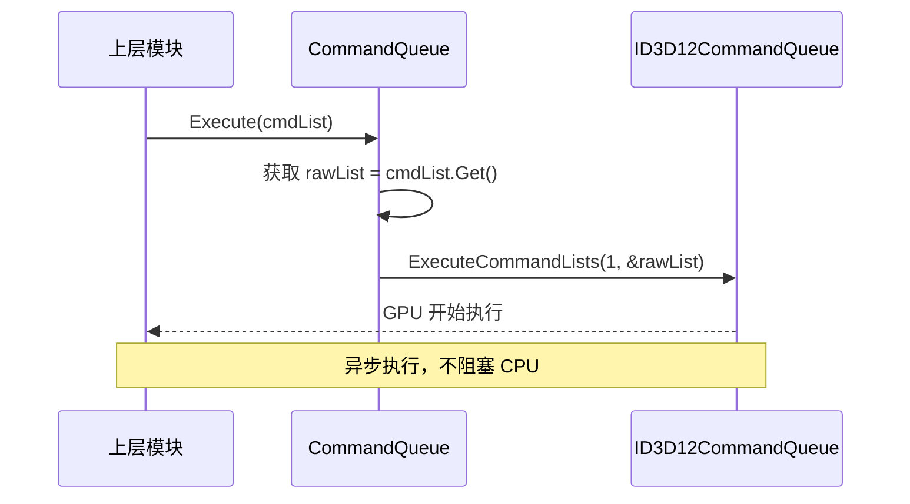
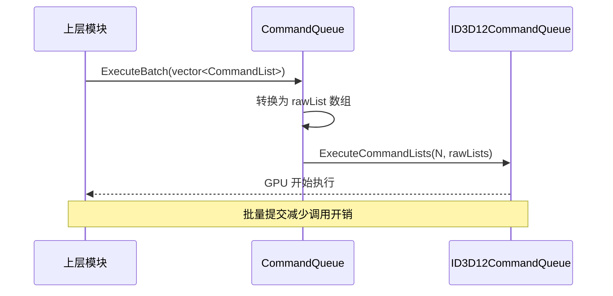
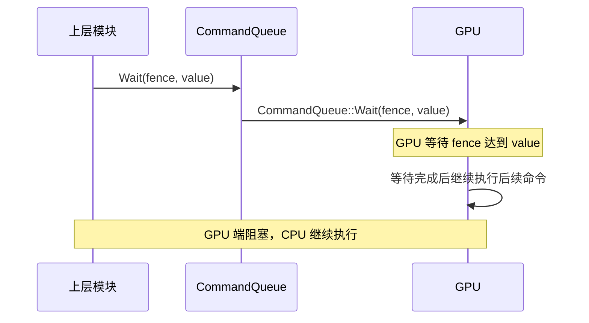

# CommandQueue (命令队列)

## 1. 定位与职责

### 定位

CommandQueue 是 DX12 命令系统中**GPU 执行通道的轻量级封装**，负责将命令列表提交到 GPU。

- **上游依赖**：依赖 `ID3D12Device` 创建命令队列
- **下游服务**：为 `CommandManager` 提供命令提交接口，供 `FrameDriver`、`RenderSystem` 使用

### 核心职责

| 职责 | 说明 |
|:----|:-----|
| **队列创建** | 封装 `ID3D12CommandQueue` 的创建过程 |
| **命令提交** | 提供单个/批量命令列表的提交接口 |
| **GPU 端等待** | 封装 `Wait` 接口，支持 GPU 端同步 |

### 职责边界

| 职责 | CommandQueue | CommandManager | 上层模块 |
|:----|:------------:|:--------------:|:--------:|
| 创建命令队列 | ✅ | ❌ | ❌ |
| 提交命令列表 | ✅ | ❌ | ❌ |
| GPU 端等待 | ✅ | ❌ | ❌ |
| 管理多个队列 | ❌ | ✅ | ❌ |
| 围栏管理 | ❌ | ✅ | ❌ |
| 分配器复用 | ❌ | ✅ | ❌ |

---

## 2. 接口设计

### 2.1 核心接口

```cpp
class CommandQueue {
public:
    explicit CommandQueue(ID3D12Device* device, D3D12_COMMAND_LIST_TYPE type);
    
    // 提交单个命令列表
    void Execute(CommandList& cmdList);
    
    // 批量提交
    void ExecuteBatch(const std::vector<CommandList>& cmdLists);
    
    // GPU 端等待围栏
    void Wait(ID3D12Fence* fence, UINT64 value);
    
    // 访问器
    ID3D12CommandQueue* Get() const;
    D3D12_COMMAND_LIST_TYPE GetType() const;
    
private:
    Microsoft::WRL::ComPtr<ID3D12CommandQueue> m_queue;
    D3D12_COMMAND_LIST_TYPE m_type;
};
```

### 2.2 队列类型

现代 GPU 支持三种独立的命令队列类型：

| 队列类型 | 能执行的命令 | 典型用途 |
|:--------:|:-----------:|:--------:|
| **DIRECT** | Draw、Dispatch、Copy、Clear | 主渲染、图形工作负载 |
| **COMPUTE** | Dispatch、Copy、Clear | 计算着色器、后处理、GPU 通用计算 |
| **COPY** | Copy、Clear | 资源上传、纹理拷贝、数据搬运 |

---

## 3. 在命令系统中的位置

### 3.1 整体架构图



### 3.2 三种队列关系



---

## 4. 执行流程

### 4.1 单个命令列表提交



### 4.2 批量命令列表提交



### 4.3 GPU 端等待



---

## 5. 在 CommandManager 中的集成

```cpp
class CommandManager {
    std::map<D3D12_COMMAND_LIST_TYPE, std::unique_ptr<CommandQueue>> m_queues;

    void Initialize(ID3D12Device* device, uint32_t frameCount) {
        // 创建三种类型的队列
        m_queues[D3D12_COMMAND_LIST_TYPE_DIRECT] = 
            std::make_unique<CommandQueue>(device, D3D12_COMMAND_LIST_TYPE_DIRECT);
        m_queues[D3D12_COMMAND_LIST_TYPE_COMPUTE] = 
            std::make_unique<CommandQueue>(device, D3D12_COMMAND_LIST_TYPE_COMPUTE);
        m_queues[D3D12_COMMAND_LIST_TYPE_COPY] = 
            std::make_unique<CommandQueue>(device, D3D12_COMMAND_LIST_TYPE_COPY);
    }

    CommandQueue* GetCommandQueue(D3D12_COMMAND_LIST_TYPE type) const {
        auto it = m_queues.find(type);
        return it != m_queues.end() ? it->second.get() : nullptr;
    }

    CommandQueue* GetGraphicsQueue() const { 
        return GetCommandQueue(D3D12_COMMAND_LIST_TYPE_DIRECT); 
    }
    
    void Submit(D3D12_COMMAND_LIST_TYPE type, CommandList& cmdList) {
        CommandQueue* queue = GetCommandQueue(type);
        if (queue) queue->Execute(cmdList);
    }
};
```

---

## 6. 上层使用示例

```cpp
// 在 FrameDriver 或 RenderSystem 中
void RenderSystem::Render(GameContext* ctx) {
    // 获取命令队列
    CommandQueue* queue = ctx->DeviceContext->GetCommandManager().GetGraphicsQueue();
    
    // 获取命令列表（已录制完成）
    CommandList cmdList = ctx->GetCommandList<DIRECT>(cmdListHandle);
    
    // 提交到 GPU
    queue->Execute(cmdList);
    
    // 或批量提交
    std::vector<CommandList> batch = { cmdList1, cmdList2, cmdList3 };
    queue->ExecuteBatch(batch);
}
```

## 7. 与其他模块的对比

| 维度 | CommandQueue | CommandAllocatorPool | CommandListPool |
|:----|:------------:|:--------------------:|:---------------:|
| **管理对象** | ID3D12CommandQueue | ID3D12CommandAllocator | ID3D12GraphicsCommandList |
| **主要操作** | Execute | Acquire/Release | AcquireHandle/Release |
| **线程安全** | 否（由上层保证） | 是（无锁） | 是（无锁） |
| **复用机制** | 单例（每类型一个） | 对象池 | 对象池 |
| **生命周期** | 引擎启动到关闭 | 帧间复用 | 帧间复用 |

---

## 8. 接口说明

### 8.1 CommandQueue 接口

| 方法 | 参数 | 返回值 | 说明 |
|:----|:-----|:-------|:-----|
| `Execute` | `CommandList&` | void | 提交单个命令列表 |
| `ExecuteBatch` | `vector<CommandList>&` | void | 批量提交命令列表 |
| `Wait` | `ID3D12Fence*, UINT64` | void | GPU 端等待围栏 |
| `Get` | 无 | `ID3D12CommandQueue*` | 获取底层指针 |
| `GetType` | 无 | `D3D12_COMMAND_LIST_TYPE` | 获取队列类型 |

---
