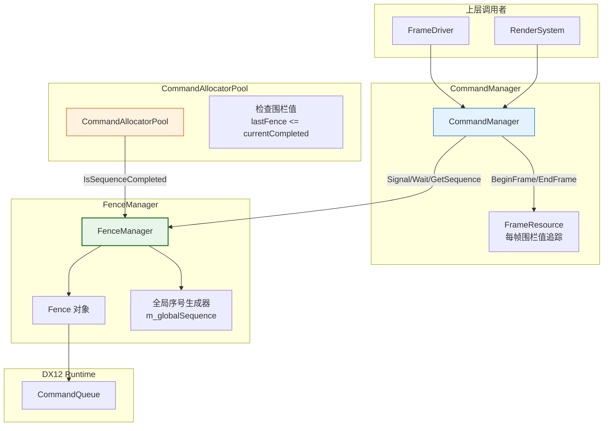
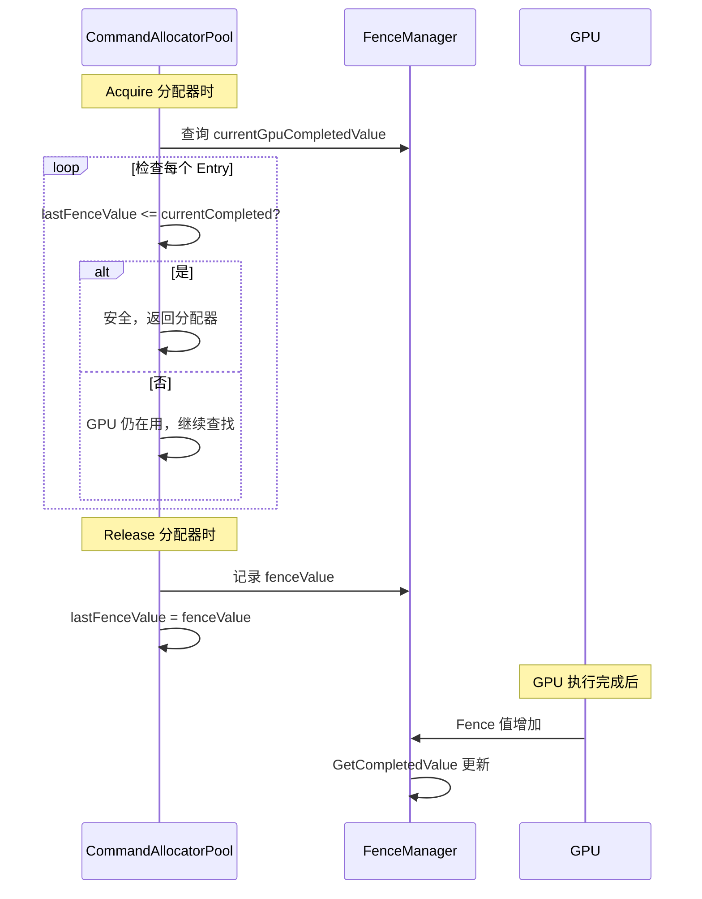
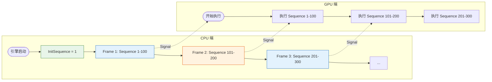
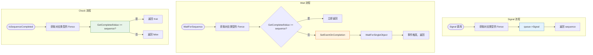
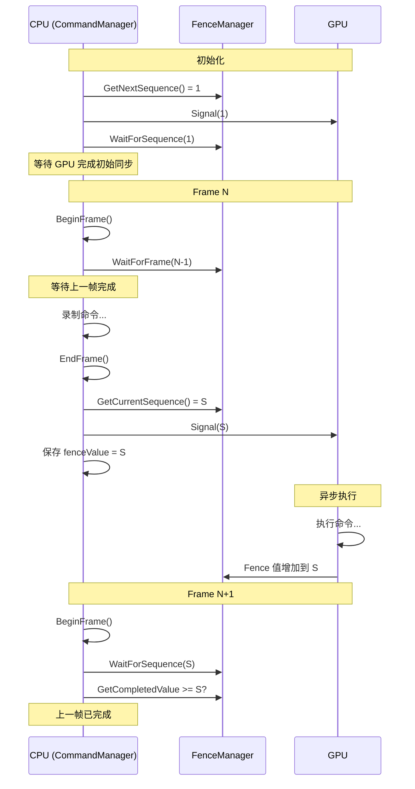
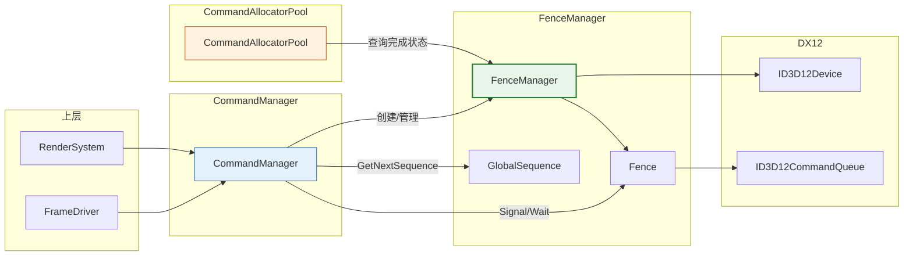

# FenceManager (围栏管理器)

## 1. 定位与职责

### 定位

FenceManager 是 DX12 命令系统中**CPU-GPU 同步的核心组件**，负责管理围栏对象并提供基于全局序号的同步机制。

- **上游依赖**：依赖 `ID3D12Device` 创建围栏，依赖 `ID3D12CommandQueue` 执行 Signal/Wait
- **下游服务**：为 `CommandManager` 提供围栏管理和全局序号生成，供 `CommandAllocatorPool` 查询 GPU 完成状态

### 核心职责

| 职责 | 说明 |
|:----|:-----|
| **围栏对象管理** | 为每种命令队列类型（DIRECT/COMPUTE/COPY）创建和管理独立的 Fence |
| **全局序号生成** | 提供单调递增的 CPU 端序列号，用于标记命令批次的生命周期 |
| **同步操作封装** | 封装 Signal/Wait/Check 等 DX12 同步 API |
| **帧资源追踪** | 配合 CommandManager 追踪每帧的围栏值（通过 FrameResource） |

### 职责边界

| 职责 | FenceManager | CommandManager | 上层模块 |
|:----|:------------:|:--------------:|:--------:|
| 管理 Fence 对象 | ✅ | ❌ | ❌ |
| 全局序号生成 | ✅ | ❌ | ❌ |
| 围栏 Signal/Wait | ✅ | 调用封装 | ❌ |
| 帧资源追踪 | ❌ | ✅ | ❌ |
| 分配器复用判断 | ❌ | 通过 FenceManager 查询 | ✅ |

---

## 2. 核心设计

### 2.1 Fence - 极简资源包装

```cpp
class Fence {
public:
    explicit Fence(ID3D12Device* device, uint64_t initialValue = 0);
    ~Fence();

    // 禁止拷贝和移动，确保资源唯一所有权
    Fence(const Fence&) = delete;
    Fence& operator=(const Fence&) = delete;
    Fence(Fence&&) = delete;
    Fence& operator=(Fence&&) = delete;

    // 访问器：仅暴露底层原生指针/句柄供 Manager 使用
    ID3D12Fence* Get() const;
    HANDLE GetEventHandle() const;

private:
    Microsoft::WRL::ComPtr<ID3D12Fence> m_fence;
    HANDLE m_event = nullptr;
};
```

**设计原则**：无状态、无行为，仅作为 DX12 原生资源的 RAII 容器。

### 2.2 全局序号生成器

```cpp
class FenceManager {
    std::atomic<uint64_t> m_globalSequence{1};

public:
    // 获取下一个全局唯一序号（单调递增）
    uint64_t GetNextSequence() { 
        return m_globalSequence.fetch_add(1, std::memory_order_relaxed); 
    }
    
    // 获取当前序号（不递增）
    uint64_t GetCurrentSequence() const { 
        return m_globalSequence.load(std::memory_order_relaxed); 
    }
};
```

**核心概念**：
- `m_globalSequence` 是 CPU 端的"发号器"，只增不减
- 用于标记 CommandList 的生命周期和提交顺序
- 不直接与 GPU 状态同步，仅代表 CPU 端的提交顺序

### 2.3 围栏操作封装

```cpp
// 在指定队列上发出信号
uint64_t Signal(D3D12_COMMAND_LIST_TYPE type, ID3D12CommandQueue* queue, uint64_t value) {
    Fence* fence = GetFence(type);
    queue->Signal(fence->Get(), value);
    return value;
}

// 检查指定序号是否已完成
bool IsSequenceCompleted(D3D12_COMMAND_LIST_TYPE type, uint64_t sequence) {
    Fence* fence = GetFence(type);
    return fence->Get()->GetCompletedValue() >= sequence;
}

// 等待指定序号完成（CPU 阻塞）
void WaitForSequence(D3D12_COMMAND_LIST_TYPE type, uint64_t sequence) {
    Fence* fence = GetFence(type);
    
    // 快速路径：已经完成
    if (fence->Get()->GetCompletedValue() >= sequence) return;
    
    // 慢速路径：设置事件并等待
    fence->Get()->SetEventOnCompletion(sequence, fence->GetEventHandle());
    WaitForSingleObject(fence->GetEventHandle(), INFINITE);
}
```

### 2.4 三种队列独立围栏

```mermaid
graph TB
    subgraph "FenceManager"
        FM[FenceManager]
    end

    subgraph "围栏实例 (按类型隔离)"
        FD[Fence (DIRECT)]
        FC[Fence (COMPUTE)]
        FCP[Fence (COPY)]
    end

    subgraph "对应命令队列"
        QD[Direct Queue]
        QC[Compute Queue]
        QCP[Copy Queue]
    end

    FM -->|管理| FD
    FM -->|管理| FC
    FM -->|管理| FCP
    
    FD -->|Signal/Wait| QD
    FC -->|Signal/Wait| QC
    FCP -->|Signal/Wait| QCP

    style FM fill:#e8f5e9,stroke:#2e7d32,stroke-width:2px
    style FD fill:#e3f2fd,stroke:#1565c0
    style FC fill:#fff3e0,stroke:#e65100
    style FCP fill:#e8f5e9,stroke:#2e7d32
```

---

## 3. 在命令系统中的位置

### 3.1 整体架构图



### 3.2 与 CommandAllocatorPool 的协作



### 3.3 在 CommandManager 中的集成

```cpp
class CommandManager {
    FenceManager m_fenceManager;           // 围栏管理器
    std::vector<FrameResource> m_frameResources;  // 每帧围栏值

    void Initialize(ID3D12Device* device, uint32_t frameCount) {
        // 1. 创建三种类型的围栏
        m_fenceManager.CreateFence(device, D3D12_COMMAND_LIST_TYPE_DIRECT);
        m_fenceManager.CreateFence(device, D3D12_COMMAND_LIST_TYPE_COMPUTE);
        m_fenceManager.CreateFence(device, D3D12_COMMAND_LIST_TYPE_COPY);
        
        // 2. 初始同步
        uint64_t initSequence = m_fenceManager.GetNextSequence();
        m_fenceManager.Signal(DIRECT, queue->Get(), initSequence);
        m_fenceManager.WaitForSequence(DIRECT, initSequence);
        
        // 3. 初始化每帧围栏值
        for (uint32_t i = 0; i < m_frameCount; ++i) {
            m_frameResources[i].fenceValue = initSequence;
        }
    }

    void BeginFrame() {
        // 等待上一帧完成
        uint32_t frameToWait = (m_currentFrame + m_frameCount - 1) % m_frameCount;
        uint64_t fenceValue = m_frameResources[frameToWait].fenceValue;
        if (fenceValue > 0) {
            m_fenceManager.WaitForSequence(DIRECT, fenceValue);
        }
    }

    void EndFrame() {
        // 记录当前帧的围栏值
        uint64_t sequence = m_fenceManager.GetCurrentSequence();
        uint64_t fenceValue = m_fenceManager.Signal(DIRECT, queue->Get(), sequence);
        m_frameResources[m_currentFrame].fenceValue = fenceValue;
        m_currentFrame = (m_currentFrame + 1) % m_frameCount;
    }
};
```

---

## 4. 核心流程图

### 4.1 全局序号生命周期



### 4.2 同步操作流程



### 4.3 帧同步时序图



---

## 5. 与其他模块的关系

### 5.1 模块依赖关系图



### 5.2 使用场景

| 场景 | 使用的围栏类型 | 说明 |
|:-----|:-------------:|:-----|
| 分配器复用检查 | DIRECT/COMPUTE/COPY | CommandAllocatorPool 查询 lastFence <= currentCompleted |
| 帧同步 | DIRECT | CommandManager::BeginFrame/EndFrame |
| 资源上传完成 | COPY | 上传队列完成通知 |
| GPU Profiling | DIRECT | 查询 GPU 时间戳 |
| 延迟删除 | DIRECT | 等待 GPU 不再使用资源 |

---

## 6. 设计特点总结

| 特性 | 实现方式 | 收益 |
|:-----|:---------|:-----|
| **类型隔离** | 每类命令队列独立 Fence | 避免不同类型队列互相阻塞 |
| **无锁序号生成** | `std::atomic<uint64_t>` | 线程安全，高性能 |
| **快速路径优化** | 先检查 `GetCompletedValue` | 避免不必要的系统调用 |
| **RAII 资源管理** | `Fence` 类封装 | 自动释放，无泄漏 |
| **事件驱动等待** | `SetEventOnCompletion` | CPU 阻塞时释放时间片 |

---

## 7. 接口说明

### 7.1 Fence 类接口

| 方法 | 说明 |
|:----|:-----|
| `Get()` | 获取底层 ID3D12Fence 指针 |
| `GetEventHandle()` | 获取关联的 Event 句柄 |

### 7.2 FenceManager 接口

| 方法 | 参数 | 返回值 | 说明 |
|:----|:-----|:-------|:-----|
| `CreateFence` | device, type | void | 创建指定类型的围栏 |
| `GetNextSequence` | 无 | uint64_t | 获取下一个全局序号 |
| `GetCurrentSequence` | 无 | uint64_t | 获取当前序号（不递增） |
| `Signal` | type, queue, value | uint64_t | 在队列上发出信号 |
| `GetFence` | type | Fence* | 获取指定类型围栏 |
| `IsSequenceCompleted` | type, sequence | bool | 检查序号是否完成 |
| `WaitForSequence` | type, sequence | void | 等待序号完成 |
| `Shutdown` | 无 | void | 清理所有围栏 |

---

