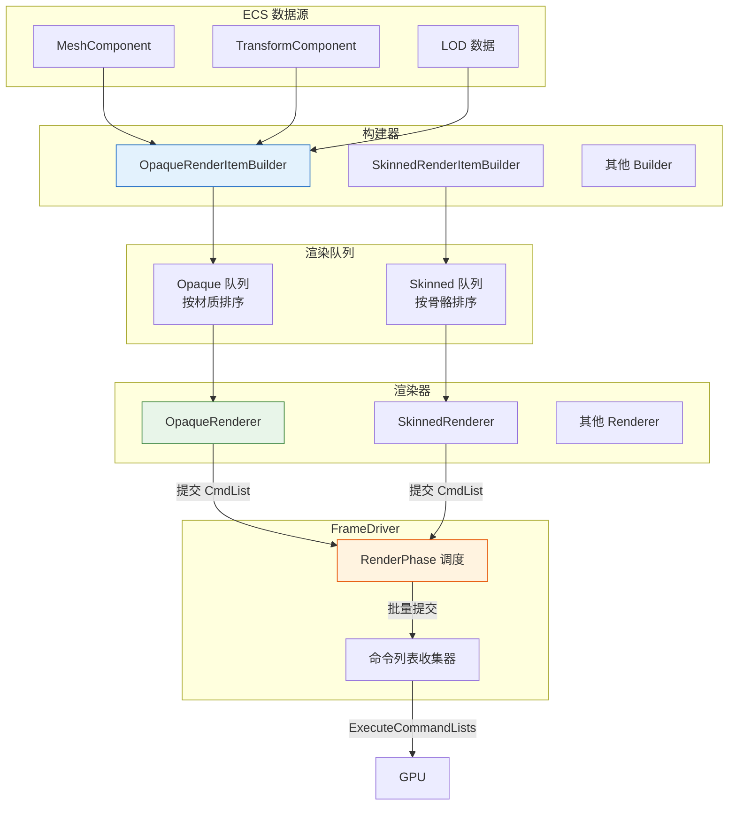

# 渲染管线：ECS → 构建器 → 渲染器

> 渲染管线不是一组固定的渲染器，而是一条**可扩展的数据处理流水线**，核心是 **ECS → 构建器 → 渲染器 → System** 四层协作。

## 1. 核心哲学

渲染管线的核心不是"有哪些渲染器"，而是**数据如何从 ECS 流转到 GPU**。渲染器可以任意定义，真正重要的是这条流水线的结构：

```
ECS 组件（数据源）
    ↓
构建器（扫描 ECS → 生成渲染项）
    ↓
渲染队列（排序、分类）
    ↓
渲染器（设置 PSO → 执行绘制）
    ↓
System（编排阶段、提交命令列表）
```

---

## 2. 四层架构

### 2.1 ECS 组件层（数据源）

ECS 组件是渲染管线的**数据源头**。每个可渲染实体通过组件持有资源句柄：

| 组件 | 持有数据 | 用途 |
|:-----|:---------|:-----|
| `MeshComponent` | 几何体句柄、材质句柄、子网格参数 | 常规网格渲染 |
| `TerrainComponent` | 地形几何体、高度图纹理、细分参数 | 地形渲染 |
| `BillboardComponent` | 纹理句柄、材质句柄、尺寸模式 | 公告牌渲染 |
| `WaterComponent` | 水面网格、材质、波浪参数 | 水面渲染 |
| `LightComponent` | 光源类型、颜色、强度、范围 | 光照计算 |
| `ReflectionProbeComponent` | 探针位置、捕获参数 | 反射探针 |

组件只存**句柄**（轻量引用），不存实际数据。渲染 System 通过句柄到资源管理器查询实际数据。

### 2.2 构建器层（数据转换）

构建器是**从 ECS 到渲染项的转换层**，负责扫描注册表、执行剔除、生成 GPU 可消费的渲染项。

```
构建器职责：
  输入：ECS::Registry（实体集）
  处理：剔除不可见实体 → 计算 LOD → 填充 InstanceData → 生成渲染项
  输出：TRenderQueue<RenderItem>（排序后的渲染队列）
```

每个构建器对应一种渲染类型：

| 构建器 | 渲染项 | 输入组件 |
|:-------|:-------|:---------|
| `OpaqueRenderItemBuilder` | `OpaqueRenderItem` | MeshComponent + Transform |
| `SkinnedRenderItemBuilder` | `SkinnedRenderItem` | MeshComponent + AnimationComponent |
| `TransparentRenderItemBuilder` | `TransparentRenderItem` | MeshComponent + 排序 |
| `TerrainRenderItemBuilder` | `TerrainRenderItem` | TerrainComponent |
| `WaterRenderItemBuilder` | `WaterRenderItem` | WaterComponent |
| `BillboardRenderItemBuilder` | `BillboardRenderItem` | BillboardComponent |
| `ProbeBuilder` | `ProbeCaptureInfo` | ReflectionProbeComponent |

构建器是**可选的**——不是每个渲染类型都需要独立的构建器。如果某种渲染类型的数据已经就绪，可以直接提交渲染项。

### 2.3 渲染队列层（排序与分类）

渲染队列是构建器的输出，也是渲染器的输入。它是一个**模板化的排序容器**：

```
TRenderQueue<T> 的特性：
  - 按材质/渲染状态排序（减少 PSO 切换）
  - 按距离排序（透明物体）
  - 按渲染阶段分类（Opaque / Transparent / …）
  - 支持批量提交
```

### 2.4 渲染器层（GPU 执行）

渲染器是**最薄的一层**，只负责：

```
设置 PSO → 绑定根签名 → 设置视口 → 遍历渲染队列 → 执行 DrawCall
```

渲染器不关心数据从哪来，只关心渲染队列中的渲染项。任何渲染器都可以用同一模式编写：

```
Renderer::Render(cmdList, renderQueue):
    cmdList.SetPipelineState(pso)
    cmdList.SetGraphicsRootSignature(rootSig)
    cmdList.RSSetViewports(viewport)
    cmdList.RSSetScissorRects(scissorRect)
    
    for each item in renderQueue:
        cmdList.SetGraphicsRootConstantBufferView(perFrameCB)
        cmdList.SetGraphicsRootShaderResourceView(materialBuffer)
        cmdList.SetGraphicsRootDescriptorTable(textureTable)
        cmdList.IASetVertexBuffers(vertexView)
        cmdList.IASetIndexBuffer(indexView)
        cmdList.DrawIndexedInstanced(indexCount, instanceCount, startIndex, startVertex, 0)
```

---

## 3. System 编排

渲染 System 是**将上述三层串联起来的编排者**，注册到 FrameDriver 的特定渲染阶段执行：

```pseudocode
// 不透明渲染 System 示例
OpaqueRenderSystem::Execute(registry, ctx):
    // 1. 准备构建器
    builder.SetFrustum(ctx.CameraMgr.GetFrustum())
    builder.SetLODSystem(ctx.LODSystem)
    
    // 2. 构建渲染项
    builder.Build(registry, renderQueue)
    
    // 3. 录制命令
    cmdList = ctx.GetCommandList(...)
    opaqueRenderer.Render(cmdList, renderQueue)
    cmdList.Close()
    
    // 4. 提交到渲染阶段
    ctx.FrameDriver.SubmitRenderCommand(RenderPhase.Opaque, cmdList)
```

### 渲染阶段执行顺序

```
FrameDriver 每帧按阶段执行：

(1) EarlyUpdate     → 输入处理、摄像机更新
(2) Update          → 游戏逻辑
(3) LateUpdate      → 逻辑后处理
(4) PreCulling      → 剔除前准备
(5) PostCulling     → 剔除后处理
(6) SceneDataUpload → 场景数据上传 GPU
(7) PreRender       → 渲染前准备
(8) Render          → 渲染阶段（按子阶段提交）
    ├── DepthPrePass    → 深度预填充
    ├── Shadow          → 阴影贴图
    ├── Opaque          → 不透明物体
    ├── Transparent     → 透明物体
    ├── Water           → 水面
    ├── Sky             → 天空盒
    ├── PostFx          → 后处理
    ├── DebugUI         → 调试覆盖层
    └── Present         → 提交到交换链
```

---

## 4. 数据流完整图



---

## 5. 设计原则

| 原则 | 说明 |
|:-----|:-----|
| **数据与渲染分离** | ECS 只存句柄，不存 GPU 数据；渲染器通过句柄查询 |
| **构建器可扩展** | 新增渲染类型只需新增构建器 + 渲染器，不需要改管线 |
| **渲染器无状态** | 渲染器不持有状态，每次渲染从队列中读取数据 |
| **阶段分批提交** | 同一渲染阶段的命令列表批量提交，不逐条提交 |
| **构建器可选** | 简单场景可以跳过构建器，直接提交渲染项 |
| **渲染器数量无关紧要** | 定义多少渲染器都可以，管线结构不依赖具体渲染器 |

---

## 6. 常见渲染器示例

以下渲染器是当前引擎的实现，但**这只是示例**——你可以定义任意多个：

| 渲染器 | 渲染项来源 | 渲染阶段 | 说明 |
|:-------|:-----------|:---------|:-----|
| `OpaqueRenderer` | OpaqueRenderItemBuilder | Opaque | 不透明物体 |
| `SkinnedRenderer` | SkinnedRenderItemBuilder | Opaque | 蒙皮动画 |
| `SkyRenderer` | 直接数据 | Sky | 天空盒 |
| `LightingRenderer` | 全屏 Quad | PostFx | 光照合成 |
| `ShadowRenderer` | 深度图 | Shadow | 阴影贴图 |
| `SsaoRenderer` | 深度缓冲 | PostFx | 环境光遮蔽 |
| `TerrainRenderer` | TerrainRenderItemBuilder | Opaque | 地形 |
| `WaterRenderer` | WaterRenderItemBuilder | Transparent | 水面 |
| `BillboardRenderer` | BillboardRenderItemBuilder | Transparent | 公告牌 |
| `ReflectionProbeRenderer` | ProbeBuilder | PreRender | 反射探针捕获 |
| `GridRenderer` | 直接数据 | Opaque | 编辑器网格 |