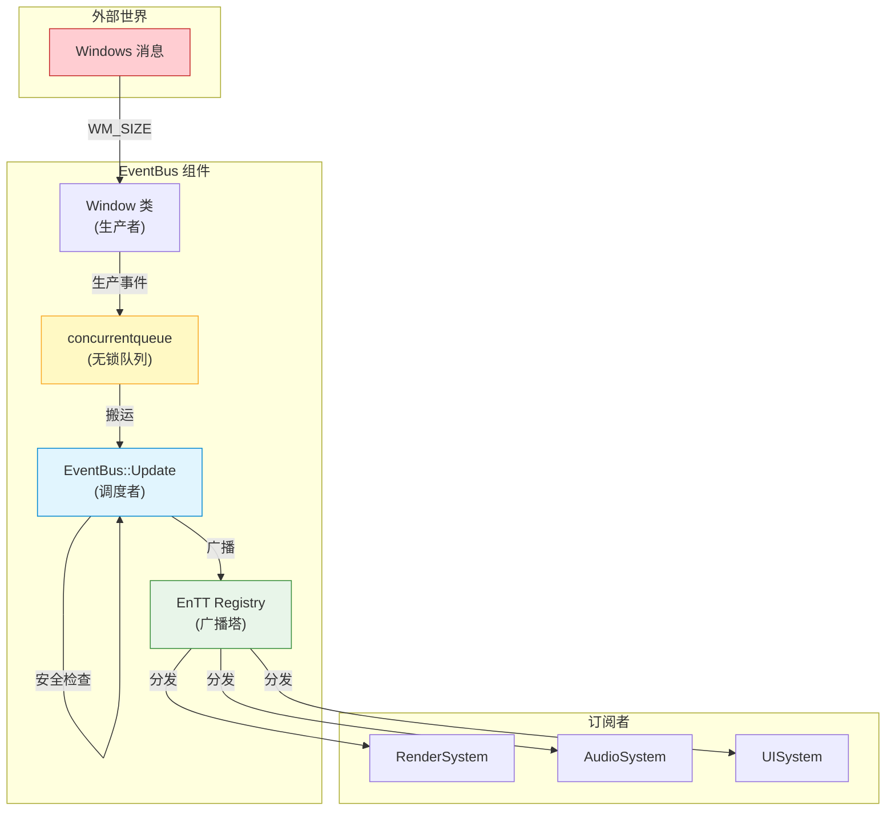
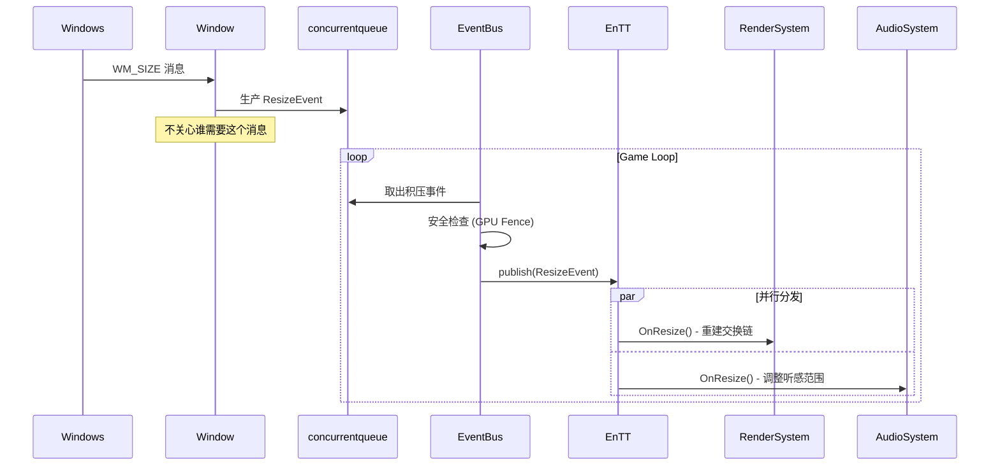
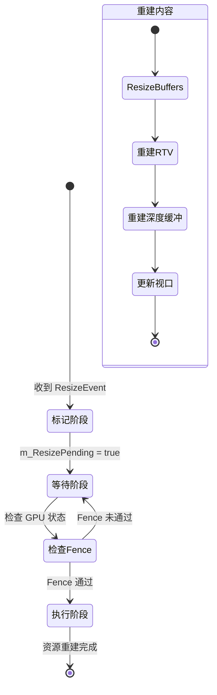
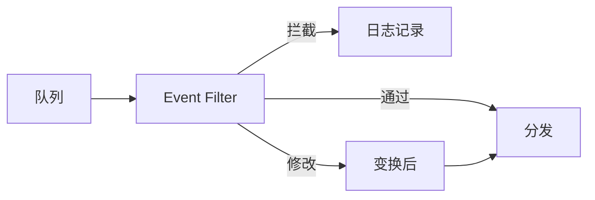

# 事件总线 (EventBus)

## 1. 概述

EventBus 是引擎的**消息中枢**，实现"跨线程生产 → 主线程同步 → 内部广播"的漏斗模型。

| 层级 | 职责 | 组件 |
|:-----|:-----|:-----|
| **底层（队列层）** | 接收外部原始消息 | concurrentqueue |
| **中层（同步层）** | 过滤、时序控制 | EventBus::Update |
| **顶层（总线层）** | 广播给各系统 | EnTT Dispatcher |

**核心解耦**：concurrentqueue 解决"进得来"（跨线程安全），EnTT 解决"分得出去"（业务解耦）。

---

## 2. 架构图表

### 2.1 事件流架构

### 2.2 时序图：以窗口 resize 为例

---

## 3. 各阶段职责

### 3.1 生产阶段（异步）

| 要点 | 说明 |
|:-----|:-----|
| 角色 | Window 类（生产者） |
| 线程 | Windows 消息线程 |
| 动作 | 捕获消息 → 创建事件 → 扔进队列 |
| 优势 | 无锁操作，极快，不阻塞窗口绘制 |

### 3.2 同步阶段（主线程）

| 要点 | 说明 |
|:-----|:-----|
| 角色 | EventBus::Update（调度者） |
| 线程 | 主线程（逻辑核心） |
| 动作 | 搬运事件 → 时序检查 → 决定是否分发 |
| 优势 | 拥有绝对控制权，可延迟处理 |

### 3.3 分发阶段（同步）

| 要点 | 说明 |
|:-----|:-----|
| 角色 | EnTT Dispatcher（广播塔） |
| 线程 | 主线程 |
| 动作 | publish → 查找订阅 → 依次调用回调 |
| 优势 | 彻底解耦，单系统崩溃不影响其他系统 |

### 3.4 设计优势

| 角色 | 优势 |
|:-----|:-----|
| Window 类 | 只负责"产生"消息，不负责"解释"消息，不需要知道 D3D12 的存在 |
| Game 类 | 在 Update 阶段拥有上帝视角，可决定是否处理事件 |
| 业务系统 | 任何新系统只需订阅事件，无需修改 Window/Game 类 |

---

## 4. 潜在风险与优化

### 4.1 事件积压策略

| 问题 | 解决方案 |
|:-----|:---------|
| 高频事件频繁触发 | 只保留最新事件，丢弃旧的 |
| 每帧多次重建资源 | 使用脏标记（Dirty Flag），每帧只处理一次 |

### 4.2 DX12 资源重建时序

### 4.3 注意事项

| 风险 | 处理方式 |
|:-----|:---------|
| EnTT publish 非线程安全 | EventBus::Update 必须在主线程调用 |
| 订阅者抛异常中断分发 | 用 try-catch 包裹分发层，记录日志继续执行 |
| 订阅者崩溃影响其他系统 | 确保回调函数 noexcept |

---

## 5. 后续改进方向

### 5.1 事件优先级系统

当前设计是 FIFO 队列，所有事件平等。大型引擎通常需要优先级分层：

| 优先级 | 典型场景 | 处理时机 |
|:-------|:---------|:---------|
| P0: Critical | 设备丢失、内存不足 | 立即处理 |
| P1: High | Resize、Focus 变化 | 当帧处理 |
| P2: Normal | 一般输入事件 | 正常排队 |
| P3: Low | 统计、日志 | 空闲时处理 |
| P4: Background | 资源异步加载完成 | 下帧处理 |

### 5.2 事件过滤中间件

在队列分发前插入 Filter 层，实现"这事件该不该发出去"的判断：

典型用例：
- **暂停菜单打开时**：屏蔽所有游戏输入事件
- **录制回放系统**：拦截并序列化所有事件
- **调试模式**：打印特定事件的完整链路

### 5.3 订阅者生命周期管理

| 问题 | 推荐方案 |
|:-----|:---------|
| 订阅者销毁时忘记取消订阅 | 使用 RAII 包装（如 `FDelegateHandle`） |
| 循环依赖（A 订阅 B，B 订阅 A） | 引入拓扑排序或显式依赖声明 |
| 订阅顺序不确定 | 支持 `order/priority` 参数控制回调执行顺序 |

> 利用 EnTT Registry 的 entity 生命周期管理，可实现 entity 销毁时自动清理关联事件监听。

### 5.4 性能优化方向

| 场景 | 当前方案 | 可选优化 |
|:-----|:---------|:---------|
| 同一帧 1000+ 个事件 | 逐个 publish | 批量 publish + EnTT `group` / `sparse_set` |
| 跨进程通信（编辑器 ↔ 运行时） | 不支持 | 共享内存队列或 Named Pipe |
| 事件携带大数据（如截图） | 事件体直接传值 | 改为 `shared_ptr` 或 Handle 引用传递 |
