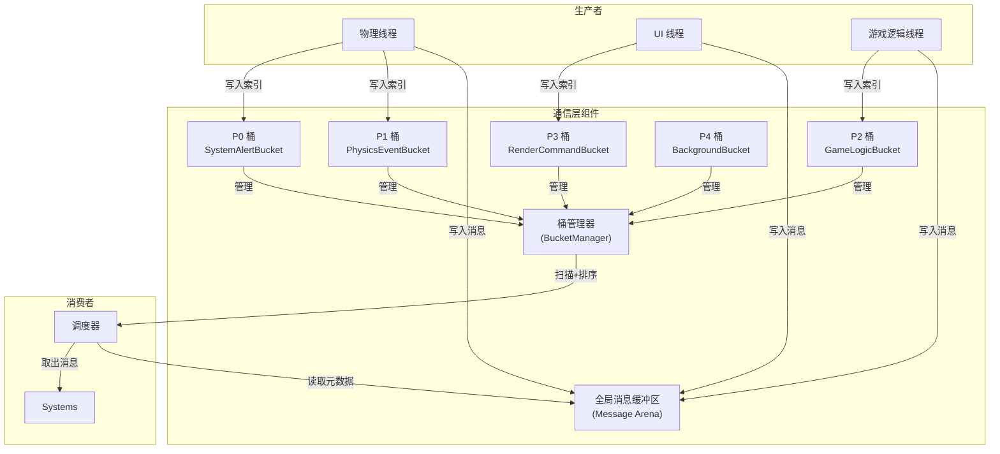

# 通信层（Communication Layer）

> 通信层是事件系统的底层部分，消息桶集合组成了通信层。

---

## 通信层架构



## 一、桶的优先级

系统中的桶按优先级分为五层：

| 优先级 | 桶名称 | 示例事件 | 丢弃策略 |
|:------:|:-------|:---------|:---------|
| P0 | SystemAlertBucket | 内存溢出、强制退出 | None |
| P1 | PhysicsEventBucket | 碰撞、触发器 | None |
| P2 | GameLogicBucket | 扣血、技能释放 | None |
| P3 | RenderCommandBucket | 播放特效、UI刷新 | Sample |
| P4 | BackgroundBucket | 资源加载结果 | Throttle |

---

## 二、全局消息缓冲区

采用 **SoA (Structure of Arrays)** 存储消息的元数据，追求极致缓存命中率。

```
┌─────────────────────────────────────────────────────┐
│              Global Message Arena                   │
├─────────────────────────────────────────────────────┤
│  Type Buffer    │ 1, 1, 2, 3, 1, 4, ...            │
│  (uint16_t)     │ 连续存储所有消息的类型            │
├─────────────────────────────────────────────────────┤
│  Sender Buffer   │ E1, E2, E3, E4, ...             │
│  (uint32_t)     │ 发送者 Entity ID                 │
├─────────────────────────────────────────────────────┤
│  Payload Ptr    │ PtrA, PtrB, PtrC, ...            │
│  (void*)        │ 指向资源管理器中的资源句柄        │
├─────────────────────────────────────────────────────┤
│  Timestamp      │ T1, T2, T3, ...                  │
│  (uint64_t)     │ 时间戳，用于调试和排序            │
├─────────────────────────────────────────────────────┤
│  Free Space / Write Head                           │
└─────────────────────────────────────────────────────┘
```

**设计要点：**

- 调度器只需要读 **Type** 和 **Sender**：CPU 可一次性把几万条 Message_Type_ID 读入缓存过滤
- Payload 只存指针：真正的数据在资源管理器中，通信层只负责"通知"，调度层在处理消息的将数据层 Entt 的引用指针更新为新的资源。

---

## 三、桶（Bucket）与桶管理器

```
┌──────────┐    写入索引     ┌──────────┐    Meta Queue    ┌──────────┐
│ 生产者   │ ────────────→ │   桶     │ ───────────────→ │ 调度器   │
└──────────┘                └──────────┘                  └──────────┘
                              ↑
                         桶管理器管理
```

### 3.1 桶管理器

| 职责 | 说明 |
|:-----|:-----|
| 持有所有桶 | 管理 P0-P4 以及用户自定义桶的指针 |
| 收集分数 | 遍历所有桶，询问"你们现在的最终优先级是多少？" |
| 排序/筛选 | 维护"活跃桶列表"，只有非空的桶参与排序 |

**优化：位掩码**

```
activeMask = 0b0000000000010101  // 第0位=P0有数据，第2位=P2有数据
__builtin_ctz(activeMask)       // O(1) 复杂度找到最高优先级桶
```

### 3.2 桶的优先级机制

桶的优先级由 **静态基础值** + **动态老化值** 组成：

```
最终优先级 = 预设优先级 (Base) + 老化系数 (Aging)
```

| 概念 | 类型 | 说明 |
|:-----|:-----|:-----|
| **Base Priority** | 静态 | 桶的"出身"，初始化时定死 |
| **Aging** | 动态 | 桶的"焦急程度"，随积压时间累加 |
| **Effective Priority** | 计算结果 | 调度器的排序依据 |

> Aging 机制防止低优先级任务"饿死"：如果 P3 桶积压 100ms，它的权重会自动飙升。

### 3.3 丢弃策略

创建桶时配置策略枚举：

| 策略 | 行为 |
|:-----|:-----|
| `DiscardPolicy::None` | 全收，不丢弃任何消息 |
| `DiscardPolicy::Throttle` | 节流，超过阈值后丢弃 |
| `DiscardPolicy::Sample` | 采样/覆盖，只保留最新值 |

---

## 四、事件过滤和丢弃

### 4.1 策略选择指南

| 事件类型 | 频率 | 推荐策略 | 实现位置 |
|:--------|:-----|:---------|:---------|
| 碰撞检测 | 极高 (1000Hz) | 采样 | 桶内部 |
| 鼠标移动 | 高 (200Hz) | 采样 | 桶内部 |
| 技能释放 | 中 (10Hz) | 节流 | 调用方 |
| 聊天消息 | 低 | 防抖 | 调用方 |
| 系统日志 | 极高 | 丢弃 | 桶内部 |

> **最佳实践**：调用方负责业务防抖，桶负责通用节流。

### 4.2 调用方示例

```cpp
// UI 按钮点击防抖：调用方自己维护状态
if (Time::Now() - lastClickTime > 0.5f) {
    MessageBus.Post(new ClickEvent());
    lastClickTime = Time::Now();
}
```

---

## 五、调度器与通信层

调度器不直接操作内存池，它操作的是 **桶**。

### 5.1 双阀门预算机制

```
┌─────────────────────────────────────────────┐
│           ActualCount = Min(软限制, 硬限制)  │
└─────────────────────────────────────────────┘
                    │
        ┌───────────┴───────────┐
        ↓                       ↓
   ┌─────────┐            ┌─────────┐
   │ 软限制   │            │ 硬限制   │
   │ 桶提供   │            │ 调度器提供│
   └─────────┘            └─────────┘

   PhysicsBucket: 10条    帧时间: 0.5ms
   LogBucket: 100条       实际可用: 20条
```

| 限制类型 | 来源 | 说明 |
|:---------|:-----|:-----|
| **软限制** | 桶提供 | PhysicsBucket 建议 10 条（处理逻辑重），LogBucket 建议 100 条（处理逻辑轻） |
| **硬限制** | 调度器提供 | 帧时间预算耗尽时强制限制 |

### 5.2 动态反馈调节

调度器记录"实际耗时"，动态调整预算：

```
第 N 帧：物理桶建议 20 条 → 实际耗时 5ms → 调度器强制降级为 5 条
第 N+1 帧：物理桶建议 20 条 → 调度器强制限制为 5 条
     ↓
直到积压消除或系统空闲
```

---

## 六、多线程写入大内存区

采用 **"预分配 + 原子指针"** 方案解决锁竞争。

### 6.1 写入流程

```
线程 A (物理)                                    线程 B (UI)
    │                                                 │
    ├─→ 1. TLS/Stack 构造消息体 ──────────────────────→ 1. TLS/Stack 构造消息体
    │                                                 │
    ├─→ 2. atomic_fetch_add(ptr, 1) ───┐
    │         ↓ 获得索引 100            │         ↓ 获得索引 101
    │                                   │
    ├─→ 3. Arena[100] = posA; ──────────┼────────→ 3. Arena[101] = posB;
    │         (无锁写入)                │           (无锁写入)
    │                                   │
    ├─→ 4. enqueue(100) ────────────────┴────────→ 4. enqueue(101)
              ↓ P1_PhysicsBucket                      ↓ P3_RenderBucket
```

### 6.2 关键点

| 步骤 | 技术 | 说明 |
|:-----|:-----|:-----|
| 原子索引分配 | `atomic_fetch_add` | 把"写内存竞争"转化为"分配下标竞争" |
| 无锁写入 | SoA 布局 | 索引唯一，写入位置不重叠 |
| 入桶 | concurrentqueue | 只存数字下标，不存完整消息体 |

### 6.3 分配器与回收

- **分配器**：`std::atomic<uint32_t>` 计数器
- **分配策略**：CAS 或 Fetch Add
- **回收机制**：帧环形缓冲 (Frame-Ring Buffer) 或 延迟回收 (Epoch-based)

---

## 七、职责划分总结

| 模块 | 职责 |
|:-----|:-----|
| **SoA 内存池** | 只存消息元数据（Type, ID, Ptr） |
| **ENTT** | 管理真实数据 |
| **Resource Manager** | 管理资源 |
| **Bucket + Arena** | 负责通信 |

> **通信层的核心思想**：让事件告诉系统该怎么做，而不是让系统去猜测。
