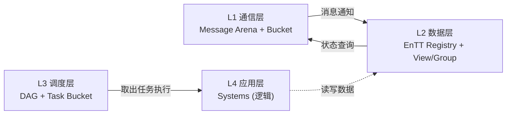

# 数据层（Data Layer）

> 数据层是事件系统的核心存储与执行环境，基于 EnTT ECS 框架。
>
> 导航：[返回总览](../EventSystem.md) | [调度层](./Schedule%20layer.md)

---

## 架构定位



> **重要**：L2 数据层**只负责存储数据**，不包含任何逻辑代码。ECS Systems 属于 L4 应用层。

数据层职责：
- **对上**：被 L4 应用层的 Systems 访问，提供数据查询
- **对下**：监听 L1 通信层的事件，更新实体状态

---

## EnTT 核心组件

### 1. 注册表（Registry）

注册表是数据层的核心存储，管理所有 **实体（Entity）** 和 **组件（Component）**。

```cpp
entt::registry registry;
```

**存储形态**：稀疏集（Sparse Set）管理的组件池。

| 组件类型 | 存储方式 | 优势 |
|:--------|:--------|:-----|
| Position | 紧凑数组 | CPU 缓存一口气读取 |
| Velocity | 紧凑数组 | 批量 SIMD 计算 |
| RenderMesh | 紧凑数组 | 渲染批次合并 |

**核心职责**：
- 实体生命周期管理（创建/销毁/查询）
- 组件数据的紧凑存储
- 系统执行的上下文来源

---

### 2. 视图（View）

视图是系统的"筛选器"，用于快速遍历满足条件的实体。

```cpp
// 筛选出同时拥有 Position 和 Velocity 的实体
auto view = registry.view<Position, Velocity>();

// 高效批量更新
view.each([](Position &pos, const Velocity &vel) {
    pos.x += vel.dx;
    pos.y += vel.dy;
});
```

**EnTT 视图的优势**：
- 零动态分配（基于稀疏集直接索引）
- 缓存友好（连续遍历匹配实体）
- 支持只读/只写/读写多组件组合

---

### 3. 分组（Group）

分组比视图更进一步，将多组件数据按 **行主序（AoS）** 存储，最大限度利用 CPU 缓存。

```cpp
// 创建分组，Position 和 Velocity 紧凑存储
auto group = registry.group<Position>(entt::get<Velocity>);

group.each([](Position &pos, const Velocity &vel) {
    pos.x += vel.dx;
});
```

| 特性 | View | Group |
|:-----|:-----|:------|
| 组件存储 | 各自独立数组 | 行主序紧凑 |
| 遍历速度 | 快 | 极快 |
| 灵活性 | 支持任意组合 | 必须连续定义 |

---

## 资源的形态：句柄（Handle）

### 上下文（Context）

EnTT 允许在 Registry 中存储单例的全局状态：

```cpp
// 注册全局上下文
registry.ctx().emplace<ResourceManager>(config);
registry.ctx().emplace<GameState>(initialState);

// 系统中访问
auto &rm = registry.ctx().get<ResourceManager>();
```

---

### 资源句柄（Handle）

实体不直接存储巨大的资源数据，而是存 **句柄（Handle）**：

```cpp
struct Renderable {
    entt::resource<Material> material;  // 间接引用
    MeshHandle mesh;
};

// 系统检查资源是否就绪
auto &rm = registry.ctx().get<ResourceManager>();
if (!rm.IsLoaded(entity.handle)) {
    // 挂起等待 ResourceLoaded 事件
    scheduler.suspend(currentTask, ResourceLoadedEvent::type);
}
```

---

## 数据分级与缓存优化

数据按访问模式分为三级，不同级别采用不同的存储策略：

|| 等级 | 特征 | 示例 | 策略 |
|:---:|:----:|:-----|:-----|:-----|
| 🔴 | **一级** | 高频变动 + 渲染强依赖 | Transform、AnimationState | 双缓冲（Front/Back） |
| 🟡 | **二级** | 低频变动 + 渲染依赖 | MeshHandle、TextureHandle | 写时复制/脏标记 |
| 🟢 | **三级** | 纯逻辑数据 | Health、AIState | 普通存储 |

---

## 与其他层的关系

### 1. 与 L4 应用层

> **这是 L2 最重要的关系**

**Systems 访问数据层**：

```cpp
// L4 应用层：这是你写的逻辑代码
void MovementSystem::Update(Registry &registry, float dt) {
    // 从 L2 数据层查询数据
    auto view = registry.view<Position, Velocity>();

    view.each([dt](Position &pos, const Velocity &vel) {
        // 纯计算逻辑（L4）
        pos.x += vel.dx * dt;
        pos.y += vel.dy * dt;
    });
    // 数据写回 L2
}
```

> **L2 只提供数据存储和查询接口，L4 负责业务逻辑。**

```cpp
// 调度器将 System 包装成 TaskFlow task
scheduler.add_task([&registry](TaskContext &ctx) {
    auto view = registry.view<Position, Velocity>();
    view.each([](Position &pos, const Velocity &vel) {
        pos += vel * deltaTime;
    });
});
```

**数据层向上层报告挂起**：

当 System 发现资源未就绪时，通过句柄检查通知调度器：

```cpp
void MovementSystem::update(entt::registry &reg, TaskScheduler &sched, TaskHandle self) {
    auto view = reg.view<MeshHandle, Position>();
    view.each([&](MeshHandle &h, Position &pos) {
        if (!resourceManager->IsLoaded(h)) {
            sched.suspend(self, ResourceLoadedEvent{h.id});
        }
    });
}
```

---

### 2. 与 L3 调度层

**调度器执行 Systems 时访问数据**：

```cpp
// L3 调度器
TaskHandle task = scheduler.add_task([&registry](TaskContext &ctx) {
    // L4 的逻辑代码在这里执行
    // 它会访问 registry (L2)
    auto view = registry.view<Position, Velocity>();
    view.each([](Position &pos, const Velocity &vel) {
        pos += vel * deltaTime;
    });
});
```

> **L3 负责调度，L2 负责存储，L4 负责逻辑。**

**监听事件（Sink）**：

```cpp
// 系统启动时绑定事件回调
auto &dispatcher = registry.ctx().get<entt::dispatcher>();
dispatcher.sink<CollisionEvent>().connect<&OnCollision>(this);

void OnCollision(const CollisionEvent &event) {
    registry.get<Health>(event.entity).value -= event.damage;
}
```

**发送事件（Dispatcher）**：

```cpp
// 逻辑处理完后通知副作用系统
auto &dispatcher = registry.ctx().get<entt::dispatcher>();
dispatcher.enqueue<DeathEvent>(entity);
```

---

## 实施要点

### 内存布局策略

| 组件类型 | 布局 | 原因 |
|:--------|:-----|:-----|
| Transform | SoA + 双缓冲 | 渲染每帧读取，高频写入 |
| Health | AoS 普通 | 仅逻辑系统访问，渲染不关心 |
| AIState | AoS 普通 | 低频访问 |

### 版本号防幽灵引用

```cpp
struct Handle {
    uint32_t index;      // 实体索引
    uint32_t generation;  // 代数版本
};

bool valid(const Handle &h) {
    return registry.valid(h.index) 
        && registry.entity(h.index) == h.generation;
}
```

### 墓碑机制（延迟回收）

```cpp
// 实体销毁时只标记
registry.destroy(entity);  // 变为 tombstone

// 本帧渲染仍能访问
if (registry.valid(entity)) { /* 渲染 */ }

// 下帧确认回收
recycler.sweep();  // 归还到空闲池
```

---

## 总结

数据层是整个事件系统的"数据仓库"：

1. **EnTT Registry**：唯一真相源，存储所有实体和组件
2. **View / Group**：高效的查询和遍历接口
3. **Context + Handle**：优雅的资源管理机制

> **L2 只负责存数据，不包含任何逻辑代码。逻辑代码属于 L4 应用层。**

---

## ⚙️ 执行策略：静态分片（Static Sharding）

为了解决 Transform 等高频组件的写冲突，L2 采用数据分片而非锁：

| 步骤 | 操作 | 说明 |
|:-----|:-----|:-----|
| 哈希分片 | Entity ID → Bucket | 将实体分配到不同的逻辑桶 |
| 任务拆解 | System → Task 0-N | 每个任务处理一个桶的数据 |
| 无锁执行 | 并行处理 | 数据区互不重叠，零锁竞争 |

> **分片是 L2 数据层的优化策略，任务桶是 L3 调度层的管理机制。两者属于不同层级。**


