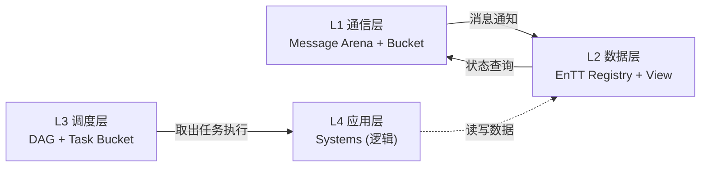

# 数据层（Data Layer）

> 数据层是事件系统的核心存储与执行环境，基于 EnTT ECS 框架。
>
> 导航：[返回总览](../EventSystem.md) | [调度层](./Schedule%20layer.md)

---

## 架构定位



> **数据层只负责存储数据，不包含任何逻辑代码。ECS Systems 属于 L4 应用层。**

数据层职责：
- **对上**：被 L4 应用层的 Systems 访问，提供数据查询接口
- **对下**：监听 L1 通信层的事件，更新实体状态

**核心原则**：数据层是一本"字典"，只解释 API（存储与查询），不讲故事（业务逻辑）。

---

## EnTT 核心组件

### 1. 注册表（Registry）

注册表是数据层的核心存储，管理所有 **实体（Entity）** 和 **组件（Component）**。

```cpp
entt::registry registry;
```

**存储形态**：稀疏集（Sparse Set）管理的组件池。

| 组件类型 | 存储方式 | 优势 |
|:--------|:--------|:-----|
| Position | 紧凑数组 | CPU 缓存一口气读取 |
| Velocity | 紧凑数组 | 批量 SIMD 计算 |
| RenderMesh | 紧凑数组 | 渲染批次合并 |

**核心职责**：
- 实体生命周期管理（创建/销毁/查询）
- 组件数据的紧凑存储
- 系统执行的上下文来源

---

### 2. 视图（View）

视图是数据层的"筛选器"，用于遍历满足条件的实体。

```cpp
// 筛选出同时拥有 Position 和 Velocity 的实体
auto view = registry.view<Position, Velocity>();

view.each([](Position &pos, const Velocity &vel) {
    // L4 应用层在此执行业务逻辑
});
```

**EnTT 视图的特性**：
- 零动态分配（基于稀疏集直接索引）
- 缓存友好（连续遍历匹配实体）
- 支持只读/只写/读写多组件组合

> **Group（分组）**：EnTT 的高级存储特性，将多组件按行主序（AoS）紧凑存储。默认使用 View，仅在渲染层等极端性能场景下考虑 Group。

---

## 上下文（Context）

Context 用于存储 ECS 运行时的元数据：

```cpp
registry.ctx().emplace<FrameCounter>(0);
registry.ctx().emplace<DeltaTime>(16.67f);
registry.ctx().emplace<RandomSeed>(std::random_device{}());
```

> **警告**：Context 只应存放轻量级元数据（如帧号、DeltaTime、随机种子）。不要将 `ResourceManager` 等大型对象塞入 Context。

---

## 与调度层的接口

数据层暴露给调度层的接口：

```cpp
// 数据层提供的查询接口
class Registry {
public:
    // 创建实体
    Entity create();

    // 销毁实体
    void destroy(Entity e);

    // 查询视图
    template<typename... Components>
    auto view();

    // 访问组件
    template<typename Component>
    Component& get(Entity e);
};
```

> **注意**：这是数据层的接口契约。具体的业务逻辑（如 Movement、Collision）属于 L4 应用层，不在数据层文档中描述。

---


## ⚠️ 常见反模式

| 反模式 | 错误做法 | 正确做法 |
|:------|:--------|:--------|
| 在数据层写业务逻辑 | `view.each([](Position&, Velocity&) { pos += vel; })` | 业务逻辑放在 L4 Systems |
| 把大对象塞入 Context | `registry.ctx().emplace<ResourceManager>()` | 资源管理放在独立的 L1/L3 模块 |
| 过早使用 Group | 任何场景都使用 `registry.group<...>()` | 默认使用 View，Group 仅用于极端性能场景 |

## 总结

数据层是整个事件系统的"数据仓库"：

1. **EnTT Registry**：唯一真相源，存储所有实体和组件（SoA 格式）
2. **View**：标准的查询和遍历接口（默认使用）
3. **Entity**：32位 ID，作为组件的"键"

> **数据层是一本字典，只解释 API，不讲故事。业务逻辑属于 L4 应用层。**

