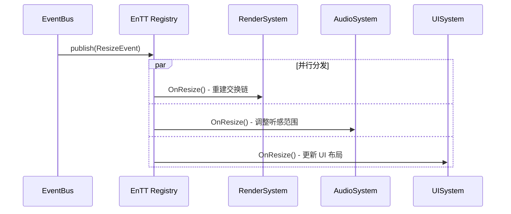

# 总线层 (EventBus)

**核心组件**：EnTT Dispatcher（基于 EnTT 库）

**角色定位**："广播塔"与"路由器"

---

## 职责

1. **广播**：接收中层处理好的事件，通过 `publish` 方法将其广播出去
2. **查找与回调**：利用 EnTT 的 Registry 机制，查找所有订阅了该事件的系统（如 RenderSystem, AudioSystem），并依次调用它们的回调函数

---

## 关键特性

### 彻底解耦

业务系统（订阅者）不需要知道：
- 事件是谁产生的
- 还有哪些其他订阅者

### 单线程模型

分发过程在主线程同步进行，保证了数据访问的连续性（Cache Friendly）。

### 容错性

建议用 try-catch 包裹分发层，确保某个订阅者崩溃不会导致整个引擎停止。

---

## 分发阶段（同步）

| 要点 | 说明 |
|:-----|:-----|
| 角色 | EnTT Dispatcher（广播塔） |
| 线程 | 主线程 |
| 动作 | publish → 查找订阅 → 依次调用回调 |
| 优势 | 彻底解耦，单系统崩溃不影响其他系统 |

---

## 时序图

---

## 订阅者生命周期管理

| 问题 | 推荐方案 |
|:-----|:---------|
| 订阅者销毁时忘记取消订阅 | 使用 RAII 包装（如 `FDelegateHandle`） |
| 循环依赖（A 订阅 B，B 订阅 A） | 引入拓扑排序或显式依赖声明 |
| 订阅顺序不确定 | 支持 `order/priority` 参数控制回调执行顺序 |

> 利用 EnTT Registry 的 entity 生命周期管理，可实现 entity 销毁时自动清理关联事件监听。

---

## 性能优化方向

| 场景 | 当前方案 | 可选优化 |
|:-----|:---------|:---------|
| 同一帧 1000+ 个事件 | 逐个 publish | 批量 publish + EnTT `group` / `sparse_set` |
| 跨进程通信（编辑器 ↔ 运行时） | 不支持 | 共享内存队列或 Named Pipe |
| 事件携带大数据（如截图） | 事件体直接传值 | 改为 `shared_ptr` 或 Handle 引用传递 |
