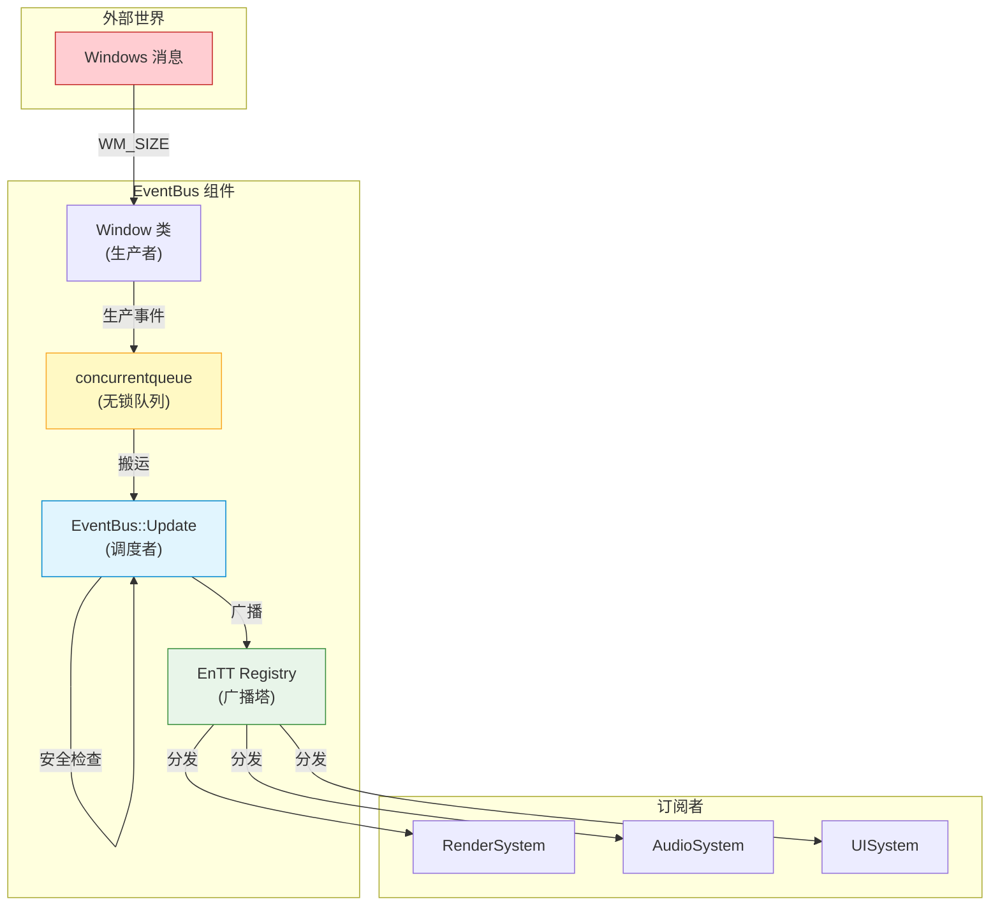
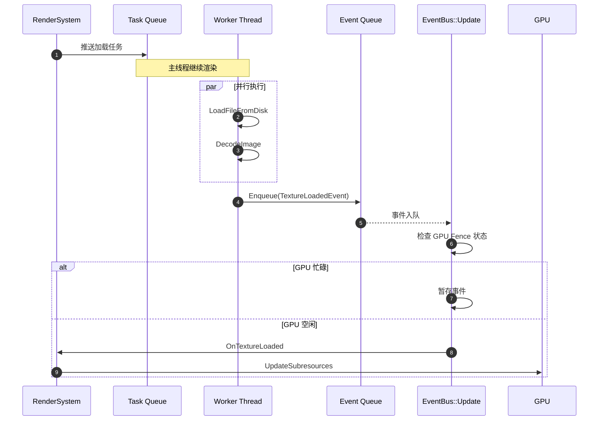

# 事件系统（Event System）

事件系统的三层架构构建了一个"跨线程生产 → 主线程同步 → 内部广播"的漏斗模型。

| 层级 | 核心组件 | 角色定位 | 职责 |
|:-----|:---------|:---------|:-----|
| **底层** | [队列层](./QueueLayer) | 搬运工与缓冲区 | 跨线程接收、快速入队 |
| **中层** | [同步层](./SynchronizationLayer) | 调度者与守门人 | 搬运清洗、时序控制、安全检查 |
| **高层** | [总线层](./EventBus) | 广播塔与路由器 | 广播、查找回调、解耦分发 |

**核心解耦**：concurrentqueue 解决"进得来"（跨线程安全），EnTT 解决"分得出去"（业务解耦）。

---

## 事件流架构

## 异步加载示例：4K 贴图加载流程

以加载 4K 贴图为例，完整展示事件系统在异步场景下的工作流程：

### 第一阶段：主线程发起任务

| 项目 | 说明 |
|:-----|:-----|
| **角色** | RenderSystem（订阅者） |
| **动作** | 收到 `OnEnterRoom` 事件，发现缺贴图 |
| **操作** | 构造"加载任务"（包含文件路径），推送到全局任务队列 |

### 第二阶段：子线程执行

| 项目 | 说明 |
|:-----|:-----|
| **角色** | Worker Thread（线程池） |
| **动作** | 执行 IO 和计算 |
| **关键点** | 主线程继续渲染，不被阻塞 |

### 第三阶段：结果回流

| 项目 | 说明 |
|:-----|:-----|
| **角色** | concurrentqueue（EventBus 底层） |
| **动作** | 跨线程传递结果 |
| **关键点** | 子线程只负责把"结果"扔进队列，不直接调用订阅者 |

### 第四阶段：守门人检查

| 项目 | 说明 |
|:-----|:-----|
| **角色** | EventBus::Update（主线程 Game Loop） |
| **动作** | 搬运事件 → 安全检查 → 决定是否分发 |
| **检查项** | GPU 是否空闲？内存是否足够？ |
| **策略** | GPU 正忙时暂存，正常时准备分发 |

### 第五阶段：最终更新

| 项目 | 说明 |
|:-----|:-----|
| **角色** | RenderSystem（订阅者） |
| **动作** | 将数据上传至显卡 |
| **操作** | 调用 `UpdateSubresources` 将数据上传到 GPU 显存 |

---

## 设计优势

| 角色 | 优势 |
|:-----|:-----|
| Window 类 | 只负责"产生"消息，不负责"解释"消息，不需要知道 D3D12 的存在 |
| Game 类 | 在 Update 阶段拥有上帝视角，可决定是否处理事件 |
| 业务系统 | 任何新系统只需订阅事件，无需修改 Window/Game 类 |

---

## 各层级详情

详细的层级实现和优化策略请参考各层级文档：

- [队列层 (QueueLayer)](./QueueLayer.md) - 无锁队列、跨线程安全
- [同步层 (SynchronizationLayer)](./SynchronizationLayer.md) - 时序控制、GPU Fence 检查
- [总线层 (EventBus)](./EventBus.md) - EnTT 广播、解耦分发
