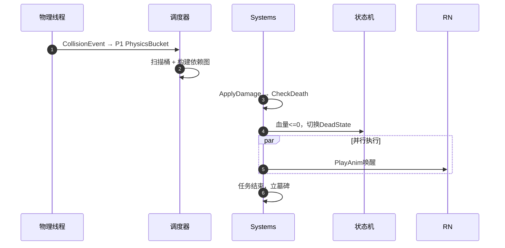

# 事件系统（Event System）

核心原则：**分层隔离**。系统分为四层，每层只与相邻层交互。

## 四层架构

| 层级 | 名称 | 核心组件 | 职责 |
| :--- | :--- | :------- | :--- |
| L4 | 应用层 | 状态机 | 业务逻辑、AI决策、状态流转 |
| L3 | 调度层 | 依赖图 | 任务排序、时序保障、死锁检测 |
| L2 | 数据层 | 任务桶 | 逻辑代码、ECS Systems、批处理 |
| L1 | 通信层 | 消息桶 | 跨线程通信、事件暂存、异步解耦 |

---

## L1 通信层

### 优先级桶

| 优先级 | 桶名称 | 示例事件 |
| :----- | :----- | :------- |
| P0 | SystemAlertBucket | 内存溢出、强制退出 |
| P1 | PhysicsEventBucket | 碰撞、触发器 |
| P2 | GameLogicBucket | 扣血、技能释放 |
| P3 | RenderCommandBucket | 播放特效、UI刷新 |

### 混合调度模式

避免低优先级饿死：元事件通知 + 调度器最小堆扫描 + Aging防饿死。

### 内存优化

- **SoA**：消息桶必须是紧凑数组
- **预分配**：严禁运行时new，使用对象池

---

## L2 任务桶

### 执行策略

- **批处理**：利用EnTT View一次性遍历所有匹配实体
- **线程本地存储**：每个工作线程独立桶，避免锁竞争

### 生命周期（墓碑机制）

| 阶段 | 动作 |
| :--- | :--- |
| 执行 | 任务完成逻辑 |
| 标记 | `isFinished = true` |
| 回收 | 帧末统一清理，归还对象池 |

---

## L3 依赖图

### DAG与协程

- **节点**：任务（如`ApplyDamage`）
- **边**：依赖（必须在某任务之前执行）
- **协程**：等待资源加载时挂起，事件到达后唤醒

---

## L4 应用层：状态机

- **状态即数据**：每个状态是一个组件
- **转移即事件**：由消息桶中的事件触发

### 示例：角色受击流程



---

## 高并发风险控制

### 问题1：依赖图组合爆炸

**方案**：混合调度
- 数据驱动隐式屏障：分析读写集自动插入屏障
- 分帧调度：奇偶帧交替执行

### 问题2：内存虚假共享

**方案**：缓存行对齐 + 线程亲和性
```cpp
struct alignas(64) HotData { ... };
```

### 问题3：对象池幽灵引用

**方案**：延迟回收 + 版本号
- 三帧延迟：标记 → 待渲染 → 确认回收
- `EntityID = Index + Generation`

### 问题4：P0系统反压缺失

**方案**：令牌桶限流 + 熔断
- 每秒最多10条P0事件
- 超阈值触发Core Dump

---

## 渲染管线数据分级

核心判据：`逻辑线程(写) + 渲染线程(异步读) = 需要双缓冲`

### 数据分级

| 等级 | 定义 | 示例 | 处理策略 |
| :--- | :--- | :--- | :------- |
| 🔴 一级 | 渲染强依赖 + 高频变动 | Transform、AnimationState | 双缓冲 |
| 🟡 二级 | 渲染依赖 + 低频变动 | MeshID、TextureHandle | 写时复制/脏标记 |
| 🟢 三级 | 纯逻辑数据 | Health、Inventory、AIState | 普通存储 |

### 代码示例

```cpp
// 一级 -> 双缓冲
struct RenderTransform {
    alignas(64) glm::mat4 matrix;
};

// 二级 -> 原子操作
struct RenderMesh {
    std::atomic<MeshID> id;
};

// 三级 -> 普通存储
struct Health { int value; };
```

---

## EnTT双缓冲与渲染集成

**核心矛盾**：EnTT是面向数据的(SoA)，渲染API是面向资源的(Resource)。

### 两级映射机制

#### 1. EnTT组件设计

```cpp
// 🔴 一级：双缓冲（64字节对齐）
struct RenderTransform {
    alignas(64) glm::mat4 world;
    glm::vec3 velocity;
};

// 🟡 二级：资源引用（低频变动）
struct Renderable {
    MeshHandle mesh;
    MatHandle material;
    bool visible;
};

// 🟢 三级：纯逻辑位置
struct Transform {
    glm::vec3 position;
    glm::vec3 rotation;
};
```

#### 2. 全局资源管理器

顶点数据**不**存在EnTT中，存在`GpuResourceManager`：
```cpp
class GpuResourceManager {
    std::unordered_map<MeshID, GpuBuffer> vertexBuffers;
    std::unordered_map<MeshID, GpuBuffer> indexBuffers;
    std::vector<MaterialData> materials;
};
```
EnTT只存`MeshID`，渲染线程按ID查询真正指针。

### 运行时流程

1. **逻辑帧**：MovementSystem修改Transform → RenderSync写入BackBuffer
2. **帧交换**：`std::swap(frontBuffer, backBuffer)`
3. **渲染帧**：Culling → Resource Fetch → Draw Call

### 安全机制

- **版本号**：`MeshID = Index + Generation`，防止幽灵引用
- **墓碑机制**：Entity销毁时标记，本帧继续画，下帧确认回收
- **线程亲和性**：资源更新绑定特定核心

---

## 渲染插值策略

### 绿灯区（适合插值）

| 场景 | 示例 | 策略 |
| :--- | :--- | :--- |
| 纯视觉 | 雪花、火焰、旗帜 | Lerp插值 |
| 摄像机 | 第三人称跟随 | 平滑过渡 |

### 红灯区（禁止插值）

| 问题类型 | 示例 | 灾难表现 |
| :------- | :--- | :------- |
| 瞬移事件 | 闪现、传送门 | "滑行"到目标点 |
| 状态突变 | 走路→死亡 | 诡异"下腰" |
| 输入反馈 | FPS开枪 | 枪口未抬子弹已飞 |

### 事件携带插值策略

| 事件类型 | 策略 |
| :------- | :--- |
| MoveEvent | Lerp |
| TeleportEvent | Snap |
| AttackEvent | Instant |

### Async Compute方案

利用GPU Compute Queue代替主线程做插值：
1. CPU提交Prev/Curr数据
2. GPU Compute计算NextPosition
3. GPU Graphics渲染Lerp

**避坑**：`TeleportEvent`必须跳过Async Compute，直接Snap。

---

## 实施清单

### 第一阶段：基础设施

| 任务 | 动作 |
| :--- | :--- |
| 无锁队列 | 集成concurrentqueue |
| 内存分配器 | 64字节对齐分配器 |
| ECS环境 | 集成EnTT，定义Registry |

### 第二阶段：通信层

| 任务 | 动作 |
| :--- | :--- |
| 多级优先级桶 | P0-P3无锁队列 |
| 混合调度 | 最小堆选优先级 + Aging |
| 对象池 | 禁止运行时new |

### 第三阶段：调度与数据

| 任务 | 动作 |
| :--- | :--- |
| 依赖图 | DAG + 拓扑排序 + 隐式依赖 |
| 任务桶 | System无状态 + EnTT View |
| 挂起-唤醒 | WaitQueue注册事件 |

### 第四阶段：内存加固

| 任务 | 动作 |
| :--- | :--- |
| 双缓冲 | Front/Back帧末交换 |
| 版本号 | Index + Generation |

### 第五阶段：应用层

| 任务 | 动作 |
| :--- | :--- |
| 状态机 | 组件化状态 |
| P0熔断 | 超阈值触发Core Dump |

### 优先级总结

| 阶段 | 模块 | 核心任务 | 防坑指南 |
| :--- | :--- | :------- | :------- |
| P0 | 内存/队列 | 无锁队列 + 对齐 | 必须alignas(64) |
| P1 | 调度器 | DAG + 混合调度 | 加隐式依赖 |
| P2 | 渲染/回收 | 双缓冲 + 版本号 | 只给Transform做 |
| P3 | 状态机 | 组件化 + 事件流 | 用挂起-唤醒 |

---

## 总结

架构核心：
1. **顶点数据**：全局资源管理器，EnTT只存句柄
2. **变换数据**：EnTT内双缓冲(Back/Front)
3. **安全性**：版本号防野指针，数据分级防带宽浪费

让事件告诉渲染器该怎么做，而不是让渲染器去猜。
