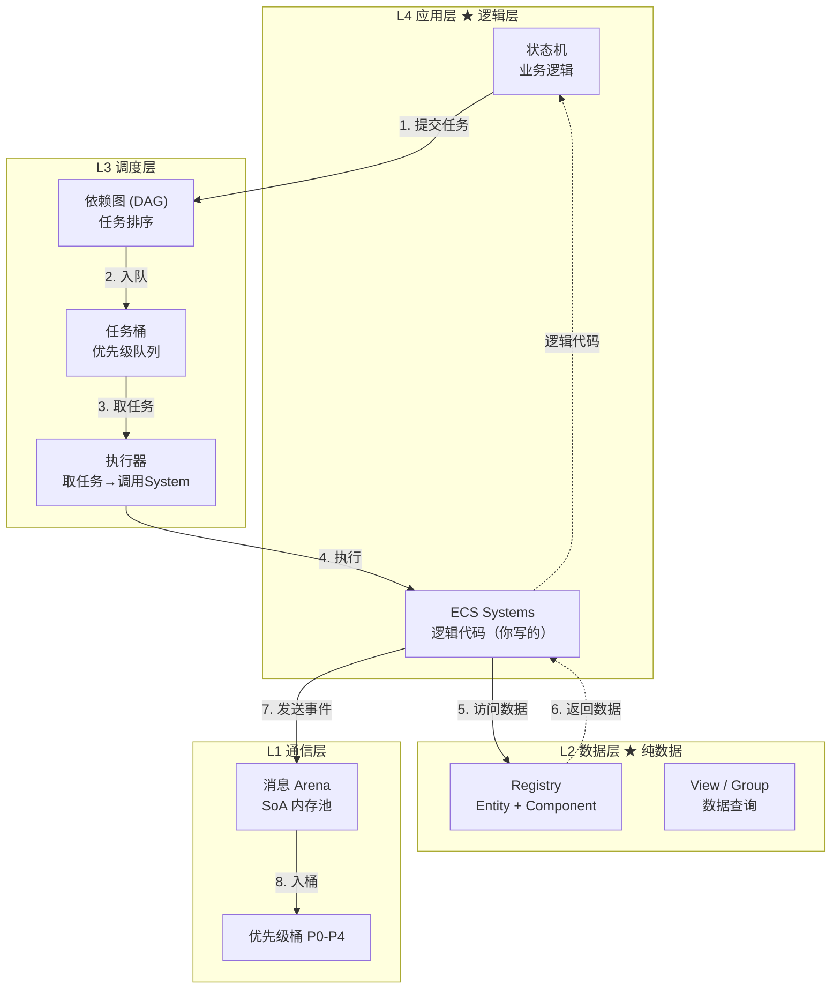
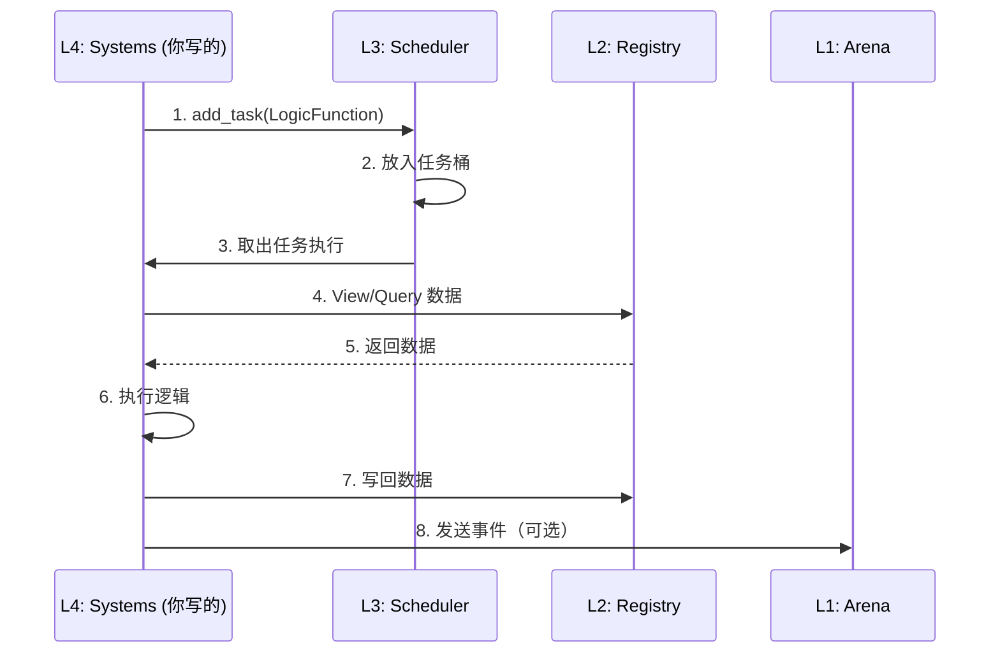
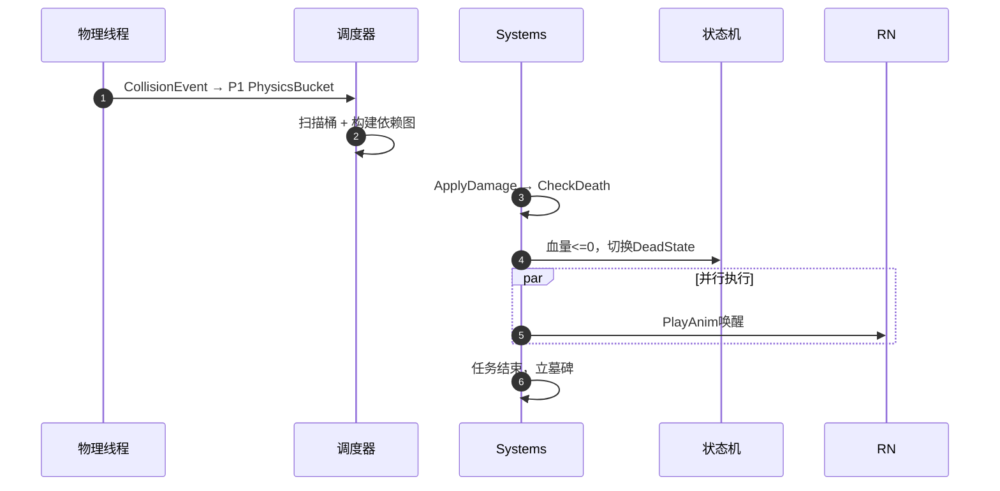

# 事件系统（Event System）

核心原则：**分层隔离**。系统分为四层，每层只与相邻层交互。安全原则：**数学证明级**。通过五层安全机制避免并发陷阱。

## 子文档导航

| 层级 | 文档 | 核心内容 |
|:-----|:-----|:---------|
| L3 调度层 | [调度层](./Schedule%20layer.md) | DAG 依赖图、任务调度、协程挂起-唤醒 |
| L2 数据层 | [数据层](./Data%20layer.md) | EnTT Registry、View/Group、资源句柄 |
| L1 通信层 | [通信层](./Communication%20layer.md) | 消息桶、优先级调度、SoA 内存池 |
| L1 通信层 | [全局消息缓冲区](./MessageArena.md) | Arena 组件关系、NUMA 无锁写入、缓存友好设计 |

---

## 架构总览



### 数据流时序



## 四层架构

| 层级 | 名称 | 隐喻 | 核心组件 | 职责 | 代码位置 |
| :--- | :--- | :--- | :------- | :--- | :------- |
| **L4** | **应用层** | 🎬 编剧 | 状态机、ECS Systems | **写逻辑** | `Game/Source` |
| **L3** | **调度层** | 🎭 导演 | DAG、任务桶、执行器 | **排序+执行** | `Engine/Core/Schedule` |
| **L2** | **数据层** | 📖 剧本 | Registry、View、Group | **存数据** | `Engine/Core/ECS` |
| **L1** | **通信层** | 📞 对讲机 | 消息桶、SoA Arena | **跨线程通知** | `Engine/Core/Message` |

> **数据流**：编剧(L4)写剧本 → 导演(L3)安排顺序 → 演员读剧本(L2)表演 → 用对讲机(L1)通知结果

---

## 核心安全守则

> **架构宪法：** 本事件系统通过五层安全机制，实现"数学证明级"的内存安全。

| # | 安全类型 | 痛点 | 防御机制 | 实证 |
|:--:|:---------|:-----|:---------|:-----|
| 1 | 内存安全 | 指针悬挂、野指针 | Generation 版本号 | `registry.valid(entity)` 数学证明安全 |
| 2 | 渲染安全 | 画面撕裂、读写冲突 | 双缓冲（Front/Back） | 状态机写 Back，渲染线程读 Front |
| 3 | 执行安全 | 死锁、竞态条件 | 静态分片（Static Sharding） | Entity ID 哈希分片，物理隔离 |
| 4 | 资源安全 | 空指针崩溃 | Handle + 挂起-唤醒 | System 发现未就绪自动挂起 |
| 5 | 通信安全 | 伪共享、锁竞争 | SoA + 无锁队列 | 原子索引分配，空间换安全 |

### 1. 内存安全（Generation 版本号）

**痛点：** 指针悬挂、野指针访问。

**防御：** EnTT 的 Entity ID = Index + Generation。

```cpp
struct EntityID {
    uint32_t index;      // 槽位索引
    uint32_t generation; // 代数版本
};

// 数学证明的安全检查
bool valid(const EntityID &id) {
    return registry.valid(id.index)
        && registry.entity(id.index) == id.generation;
}
```

> **实证：** 只要开发者用 `registry.valid(entity)` 检查，就不可能访问到已经被回收并重新分配的内存。这是数学证明的安全，不是概率问题。

### 2. 渲染安全（Double Buffering）

**痛点：** 画面撕裂、渲染线程读取到一半被修改的数据。

**防御：** L4 状态机只写 Back Buffer，渲染线程只读 Front Buffer。

```cpp
// 一级数据 -> 双缓冲
struct RenderTransform {
    alignas(64) glm::mat4 world;  // 64字节对齐防止伪共享
};

// 帧末交换
std::swap(frontBuffer, backBuffer);
```

> **实证：** 文档中的"渲染管线数据分级"策略。只要 Transform 被标记为一级数据，引擎强制执行 `swap(front, back)`。开发者无法"写烂"这个逻辑，因为逻辑在引擎层（L2）。

### 3. 执行安全（Static Sharding）

**痛点：** 死锁、竞态条件。

**防御：** 静态分片替代动态锁。

| 策略 | 错误做法 | 正确做法 |
|:-----|:---------|:---------|
| 冲突处理 | Task A 和 Task B 抢同一资源 → 加锁 → 性能下降 | 根据 Entity ID 哈希分片 → 生成 Task A-0, A-1, B-0, B-1 → **零锁竞争** |
| 图构建时机 | 运行时动态拼接 | 初始化阶段完成拓扑排序 |

> **实证：** 将 Entity 按 ID 哈希分片。如果状态机 A 处理 Bucket 0，状态机 B 处理 Bucket 1，它们物理上就不可能发生数据冲突。这是空间换安全。

### 4. 资源安全（Handle 挂起-唤醒）

**痛点：** 资源加载未完成就使用，导致空指针崩溃。

**防御：** System 发现资源未就绪，引擎自动挂起协程。

```cpp
TaskHandle loadTask = scheduler.add_task([&](TaskContext &ctx) {
    auto handle = resourceManager->Load("player.fbx");

    if (!handle.IsReady()) {
        // 挂起，等待 ResourceLoaded 事件唤醒
        ctx.suspend(handle, ResourceLoadedEvent::type);
        return;
    }

    // 资源就绪，继续执行（永远不会访问到空指针）
    mesh = handle.Get();
});
```

> **实证：** System 发现资源未就绪，引擎自动挂起协程，不执行逻辑。开发者想"写烂"都难，因为代码根本跑不到那一步。

### 5. 通信安全（SoA + 无锁队列）

**痛点：** 伪共享（False Sharing）、锁竞争。

**防御：** Arena SoA 布局 + 原子索引分配。

```cpp
// 物理线程和 UI 线程写入不同的内存流
Thread A (物理) ──→ atomic_fetch_add(ptr, 1) ──→ Arena[100] = dataA
Thread B (UI)   ──→ atomic_fetch_add(ptr, 1) ──→ Arena[101] = dataB
                                      ↑ 索引互不重叠，写入无锁
```

| 技术 | 作用 |
|:-----|:-----|
| SoA 布局 | Type/Sender/Ptr 分开存储，CPU 缓存一次性读入所有类型 ID |
| 原子索引 | 把"写内存竞争"转化为"分配下标竞争" |
| 无锁入桶 | ConcurrentQueue 只存数字下标，不存完整消息体 |

> **实证：** 物理线程和 UI 线程写入不同的内存流（Stream），通过原子索引分配。这是硬件级的防御。

---

## L1 通信层

> 详细文档：[通信层](./Communication%20layer.md) | [全局消息缓冲区](./MessageArena.md)

### 优先级桶

| 优先级 | 桶名称 | 示例事件 |
| :----- | :----- | :------- |
| P0 | SystemAlertBucket | 内存溢出、强制退出 |
| P1 | PhysicsEventBucket | 碰撞、触发器 |
| P2 | GameLogicBucket | 扣血、技能释放 |
| P3 | RenderCommandBucket | 播放特效、UI刷新 |

### 混合调度模式

避免低优先级饿死：元事件通知 + 调度器最小堆扫描 + Aging防饿死。

### 内存优化

- **SoA**：消息桶必须是紧凑数组
- **预分配**：严禁运行时new，使用对象池

---

## L2 数据层

> 详细文档：[数据层](./Data%20layer.md)

**核心职责**：只负责"存数据"，不包含任何逻辑代码。

### 执行策略

- **批处理**：利用 EnTT View 一次性遍历所有匹配实体
- **分片执行**：根据 Entity ID 哈希分桶，每个桶由不同的任务处理

> **注意**：任务桶属于 L3 调度层，不属于 L2 数据层。

---

## L3 调度层

> 详细文档：[调度层](./Schedule%20layer.md)

### DAG与协程

- **节点**：任务（如`ApplyDamage`）
- **边**：依赖（必须在某任务之前执行）
- **协程**：等待资源加载时挂起，事件到达后唤醒

### DAG与协程

- **节点**：任务（如`ApplyDamage`）
- **边**：依赖（必须在某任务之前执行）
- **协程**：等待资源加载时挂起，事件到达后唤醒


调度器（L3）严禁处理高频的、细粒度的资源竞争事件（如 Transform_Lock）。
准入标准：只有跨帧或异步的事件（如 IO、网络）才能触发调度器的“挂起-唤醒”机制。
拒绝标准：帧内的逻辑冲突必须在 L2 内部消化。


---

## L4 应用层：状态机

- **状态即数据**：每个状态是一个组件
- **转移即事件**：由消息桶中的事件触发

### 示例：角色受击流程



---

## 高并发风险控制

### 问题1：依赖图组合爆炸

**方案**：混合调度
- 数据驱动隐式屏障：分析读写集自动插入屏障
- 分帧调度：奇偶帧交替执行

### 问题2：内存虚假共享

**方案**：缓存行对齐 + 线程亲和性
```cpp
struct alignas(64) HotData { ... };
```

### 问题3：对象池幽灵引用

**方案**：延迟回收 + 版本号
- 三帧延迟：标记 → 待渲染 → 确认回收
- `EntityID = Index + Generation`

### 问题4：P0系统反压缺失

**方案**：令牌桶限流 + 熔断
- 每秒最多10条P0事件
- 超阈值触发Core Dump

---

## 渲染管线数据分级

核心判据：`逻辑线程(写) + 渲染线程(异步读) = 需要双缓冲`

### 数据分级

| 等级 | 定义 | 示例 | 处理策略 |
| :--- | :--- | :--- | :------- |
| 🔴 一级 | 渲染强依赖 + 高频变动 | Transform、AnimationState | 双缓冲 |
| 🟡 二级 | 渲染依赖 + 低频变动 | MeshID、TextureHandle | 写时复制/脏标记 |
| 🟢 三级 | 纯逻辑数据 | Health、Inventory、AIState | 普通存储 |

### 代码示例

```cpp
// 一级 -> 双缓冲
struct RenderTransform {
    alignas(64) glm::mat4 matrix;
};

// 二级 -> 原子操作
struct RenderMesh {
    std::atomic<MeshID> id;
};

// 三级 -> 普通存储
struct Health { int value; };
```

---

## EnTT双缓冲与渲染集成

**核心矛盾**：EnTT是面向数据的(SoA)，渲染API是面向资源的(Resource)。

### 两级映射机制

#### 1. EnTT组件设计

```cpp
// 🔴 一级：双缓冲（64字节对齐）
struct RenderTransform {
    alignas(64) glm::mat4 world;
    glm::vec3 velocity;
};

// 🟡 二级：资源引用（低频变动）
struct Renderable {
    MeshHandle mesh;
    MatHandle material;
    bool visible;
};

// 🟢 三级：纯逻辑位置
struct Transform {
    glm::vec3 position;
    glm::vec3 rotation;
};
```

#### 2. 全局资源管理器

顶点数据**不**存在EnTT中，存在`GpuResourceManager`：
```cpp
class GpuResourceManager {
    std::unordered_map<MeshID, GpuBuffer> vertexBuffers;
    std::unordered_map<MeshID, GpuBuffer> indexBuffers;
    std::vector<MaterialData> materials;
};
```
EnTT只存`MeshID`，渲染线程按ID查询真正指针。

### 运行时流程

1. **逻辑帧**：MovementSystem修改Transform → RenderSync写入BackBuffer
2. **帧交换**：`std::swap(frontBuffer, backBuffer)`
3. **渲染帧**：Culling → Resource Fetch → Draw Call

### 安全机制

- **版本号**：`MeshID = Index + Generation`，防止幽灵引用
- **墓碑机制**：Entity销毁时标记，本帧继续画，下帧确认回收
- **线程亲和性**：资源更新绑定特定核心

---

## 渲染插值策略

### 绿灯区（适合插值）

| 场景 | 示例 | 策略 |
| :--- | :--- | :--- |
| 纯视觉 | 雪花、火焰、旗帜 | Lerp插值 |
| 摄像机 | 第三人称跟随 | 平滑过渡 |

### 红灯区（禁止插值）

| 问题类型 | 示例 | 灾难表现 |
| :------- | :--- | :------- |
| 瞬移事件 | 闪现、传送门 | "滑行"到目标点 |
| 状态突变 | 走路→死亡 | 诡异"下腰" |
| 输入反馈 | FPS开枪 | 枪口未抬子弹已飞 |

### 事件携带插值策略

| 事件类型 | 策略 |
| :------- | :--- |
| MoveEvent | Lerp |
| TeleportEvent | Snap |
| AttackEvent | Instant |

### Async Compute方案

利用GPU Compute Queue代替主线程做插值：
1. CPU提交Prev/Curr数据
2. GPU Compute计算NextPosition
3. GPU Graphics渲染Lerp

**避坑**：`TeleportEvent`必须跳过Async Compute，直接Snap。

---

## 实施清单

### 第一阶段：基础设施

| 任务 | 动作 |
| :--- | :--- |
| 无锁队列 | 集成concurrentqueue |
| 内存分配器 | 64字节对齐分配器 |
| ECS环境 | 集成EnTT，定义Registry |

### 第二阶段：通信层

| 任务 | 动作 |
| :--- | :--- |
| 多级优先级桶 | P0-P3无锁队列 |
| 混合调度 | 最小堆选优先级 + Aging |
| 对象池 | 禁止运行时new |

### 第三阶段：调度与数据

| 任务 | 动作 |
| :--- | :--- |
| 依赖图 | DAG + 拓扑排序 + 隐式依赖 |
| 任务桶 | System无状态 + EnTT View |
| 挂起-唤醒 | WaitQueue注册事件 |

### 第四阶段：内存加固

| 任务 | 动作 |
| :--- | :--- |
| 双缓冲 | Front/Back帧末交换 |
| 版本号 | Index + Generation |

### 第五阶段：应用层

| 任务 | 动作 |
| :--- | :--- |
| 状态机 | 组件化状态 |
| P0熔断 | 超阈值触发Core Dump |

### 优先级总结

| 阶段 | 模块 | 核心任务 | 防坑指南 |
| :--- | :--- | :------- | :------- |
| P0 | 内存/队列 | 无锁队列 + 对齐 | 必须alignas(64) |
| P1 | 调度器 | DAG + 混合调度 | 加隐式依赖 |
| P2 | 渲染/回收 | 双缓冲 + 版本号 | 只给Transform做 |
| P3 | 状态机 | 组件化 + 事件流 | 用挂起-唤醒 |

---

## 总结

架构核心：
1. **顶点数据**：全局资源管理器，EnTT只存句柄
2. **变换数据**：EnTT内双缓冲(Back/Front)
3. **安全性**：版本号防野指针，数据分级防带宽浪费

让事件告诉渲染器该怎么做，而不是让渲染器去猜。


## xxx

---

## ⚙️ 执行策略：静态分片（Static Sharding）

为了解决 Transform 等高频组件的写冲突，L2 采用数据分片而非锁：

| 步骤 | 操作 | 说明 |
|:-----|:-----|:-----|
| 哈希分片 | Entity ID → Bucket | 将实体分配到不同的逻辑桶 |
| 任务拆解 | System → Task 0-N | 每个任务处理一个桶的数据 |
| 无锁执行 | 并行处理 | 数据区互不重叠，零锁竞争 |

> **分片是 L2 数据层的优化策略，任务桶是 L3 调度层的管理机制。两者属于不同层级。**


## 实施要点

### 内存布局策略

| 组件类型 | 布局 | 原因 |
|:--------|:-----|:-----|
| Transform | SoA + 双缓冲 | 渲染每帧读取，高频写入 |
| Health | AoS 普通 | 仅逻辑系统访问，渲染不关心 |
| AIState | AoS 普通 | 低频访问 |

### 版本号防幽灵引用

```cpp
struct Handle {
    uint32_t index;      // 实体索引
    uint32_t generation;  // 代数版本
};

bool valid(const Handle &h) {
    return registry.valid(h.index) 
        && registry.entity(h.index) == h.generation;
}
```

### 墓碑机制（延迟回收）

```cpp
// 实体销毁时只标记
registry.destroy(entity);  // 变为 tombstone

// 本帧渲染仍能访问
if (registry.valid(entity)) { /* 渲染 */ }

// 下帧确认回收
recycler.sweep();  // 归还到空闲池
```

---


## 数据分级与缓存优化

数据按访问模式分为三级，不同级别采用不同的存储策略：

|| 等级 | 特征 | 示例 | 策略 |
|:---:|:----:|:-----|:-----|:-----|
| 🔴 | **一级** | 高频变动 + 渲染强依赖 | Transform、AnimationState | 双缓冲（Front/Back） |
| 🟡 | **二级** | 低频变动 + 渲染依赖 | MeshHandle、TextureHandle | 写时复制/脏标记 |
| 🟢 | **三级** | 纯逻辑数据 | Health、AIState | 普通存储 |

---
