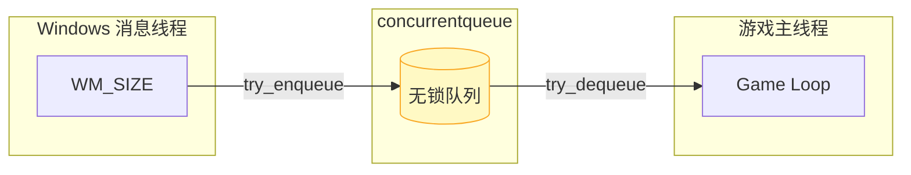
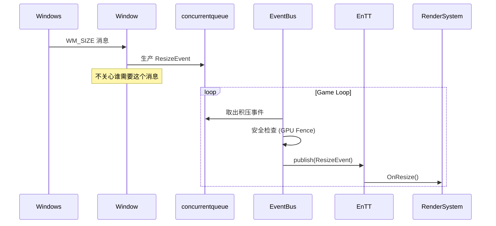

# 队列层 (QueueLayer)

**核心组件**：`concurrentqueue`（无锁队列）

**角色定位**："搬运工"与"缓冲区"

---

## 职责

1. **跨线程接收**：负责接收来自"外部世界"（如 Windows 消息线程）的原始消息
2. **快速入队**：将消息封装成事件对象，扔进无锁队列中

---

## 关键特性

### 线程安全

使用 `concurrentqueue` 确保在多线程环境下（Windows 消息线程 vs 游戏主线程）数据不冲突。

### 非阻塞

生产速度极快，绝不阻塞窗口绘制或系统响应。

### 解耦

生产者（Window 类）完全不关心：
- 谁需要这个消息
- 消息的格式是什么
- 有多少订阅者

只负责"扔进去"。

---

## 生产阶段（异步）

| 要点 | 说明 |
|:-----|:-----|
| 角色 | Window 类（生产者） |
| 线程 | Windows 消息线程 |
| 动作 | 捕获消息 → 创建事件 → 扔进队列 |
| 优势 | 无锁操作，极快，不阻塞窗口绘制 |

---

## 时序图

---

## 注意事项

| 风险 | 处理方式 |
|:-----|:---------|
| EnTT publish 非线程安全 | EventBus::Update 必须在主线程调用 |
| 订阅者抛异常中断分发 | 用 try-catch 包裹分发层，记录日志继续执行 |
