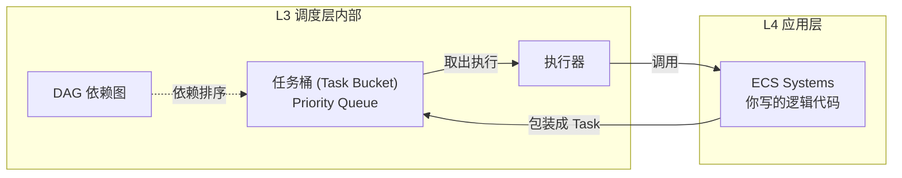
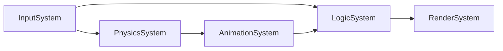
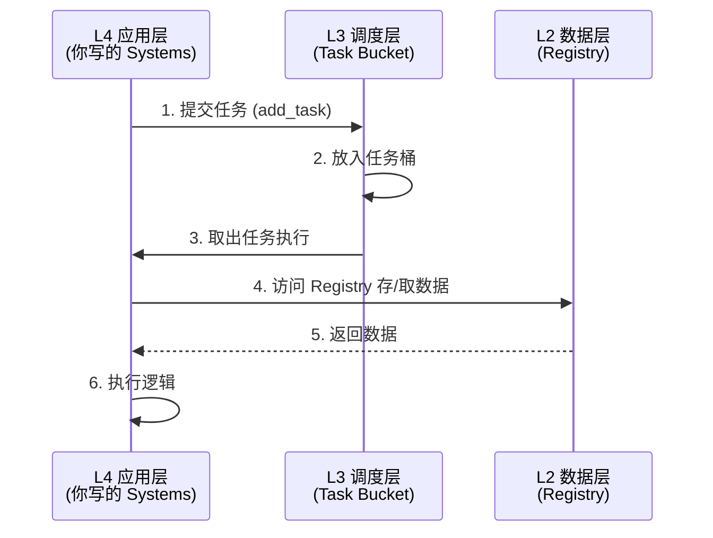

# 调度层（Schedule Layer）

> 导航：[返回总览](../EventSystem.md) | [数据层](./Data%20layer.md)

调度层负责构建 DAG（依赖图），决定任务的执行顺序和并行策略。

---

## 两种执行范式对比

| 维度 | 静态流水线（The Pipeline） | 动态事件（The EDA） |
|:-----|:---------------------------|:-------------------|
| 对应层级 | L3 调度层（DAG）+ L2 数据层（Systems） | L1 通信层（Message Arena） |
| 典型场景 | Input → Physics → Animation → Logic → Render | 资源加载完成、网络包到达、玩家输入 |
| 依赖方式 | 硬编码依赖（Hard Dependency）<br>`task_A.then(task_B)` | 软依赖（Loose Coupling）<br>`subscribe("ResourceLoaded")` |
| 实现机制 | 原子计数/信号量（纳秒级）<br>无需查表，无需内存分配 | 消息总线/观察者模式（微秒级）<br>涉及锁、哈希查找、内存分配 |
| 冲突解决 | 编译期/初始化期规划<br>通过分片（Sharding）或强制串行 | 运行时处理<br>通过事件队列排队 |

---

## 设计哲学：静态图优先（Static Graph First）

> **核心指导思想：** L2 数据层负责微观秩序（静态图），L3 调度层负责宏观协调（EDA）。用静态依赖消灭运行时竞争，是本系统的第一设计原则。

### 1. 决策红线：99% 原则

**架构红线：** 在本系统中，开发者必须遵守 **"99% 静态流水线"** 原则：

| 场景类型 | 处理方式 | 允许使用 EDA |
|:---------|:---------|:------------|
| 帧内高频逻辑（>100Hz） | 物理、动画、渲染同步 | ❌ 严禁 `MessageBus.Post()` 或 `Subscribe()` |
| 固定依赖关系 | "逻辑必须在物理之后" | ✅ 必须使用 `TaskGraph.AddEdge(A, B)` 硬编码 |
| 低频异步事件（<10Hz） | 资源加载完成、网络断线、用户输入 | ✅ 才允许流入 L1 通信层 |

> **关键问题：** 当开发者面对一个新需求时，应该优先选择写一个 Event（EDA），还是优先画一条 DAG 边（DAG）？
> **答案：** 优先选择 DAG。只有当两个模块之间不存在固定顺序、且对实时性要求极低时，才考虑 EDA。

### 2. 冲突解决策略：静态分片 vs 动态锁

**防复杂化策略：** 为了防止任务竞争导致调度器过载，我们采用 **"静态分片（Static Sharding）"** 代替 **"动态锁（Dynamic Locking）"**：

| 策略 | 错误做法 | 正确做法 |
|:-----|:---------|:---------|
| 冲突处理 | Task A 和 Task B 抢同一资源 → 发送 `ResourceLockEvent` → 调度器排队 → 性能下降 | 在构建 DAG 时，根据 Entity ID 哈希将数据分片 → 生成 Task A-0, A-1, B-0, B-1 → 数据天然隔离 → **零锁竞争** |
| 图构建时机 | 运行时（Runtime）动态拼接 → 每次都要计算拓扑序 | 初始化阶段（Startup）完成拓扑排序 → 运行时只执行，零规划开销 |

### 3. 资源防御的边界

| 层级 | 职责 | 行为 |
|:-----|:-----|:-----|
| L2 数据层 | 检查句柄状态 | 资源未就绪时**立刻返回**，不进行任何计算 |
| L3 调度层 | 挂起与唤醒 | 只有当 L2 明确返回"未就绪"时，才介入并注册回调 |

> **关键点：** 这种"检查-挂起"循环必须是**极短路径**。如果资源经常未就绪，说明上层（L4 应用层）没有做好预加载，这是 Bug，而不是 Feature。

---

## 核心职责

### 1. 任务桶 (Task Bucket)

任务桶是调度层内部的任务排队机制，用于存储待执行的任务。



> **关键点**：任务桶属于 L3 调度层内部机制，不是 L2 数据层的一部分。



### 2. 任务调度

```cpp
class TaskScheduler {
    // 添加任务节点
    TaskHandle add_task(TaskFunc fn, std::vector<TaskHandle> dependencies);

    // 执行调度
    void execute();

    // 挂起与唤醒
    void suspend(TaskHandle task, EventType event);
    void resume(TaskHandle task);
};
```

### 3. 协程支持

当任务需要等待资源加载时，挂起协程并注册事件回调：

```cpp
TaskHandle loadTask = scheduler.add_task([&](TaskContext &ctx) {
    auto handle = resourceManager->Load("player.fbx");

    if (!handle.IsReady()) {
        // 挂起，等待 ResourceLoaded 事件唤醒
        ctx.suspend(handle, ResourceLoadedEvent::type);
        return;
    }

    // 资源就绪，继续执行
    mesh = handle.Get();
});
```

---

## 实施要点

### 死锁检测

调度器在初始化时遍历 DAG，检测环形依赖：

```cpp
bool detect_cycle(const DAG &graph) {
    std::set<TaskHandle> visited;
    std::set<TaskHandle> recursion;

    for (auto node : graph.nodes) {
        if (dfs(node, visited, recursion)) {
            return true;  // 检测到环
        }
    }
    return false;
}
```

### 负载均衡

采用工作窃取（Work Stealing）实现负载均衡：

```cpp
// 每个线程有自己的任务队列
thread_local std::deque<TaskHandle> localQueue;

// 队列为空时，从其他线程偷任务
TaskHandle steal() {
    for (auto &q : allQueues) {
        if (!q.empty()) {
            return q.pop_back();  // 从尾部偷
        }
    }
    return nullptr;
}
```

### 分帧调度

避免一次性提交过多任务导致线程饱和：

```cpp
// 每帧最多处理 N 个任务
const int TASKS_PER_FRAME = 1000;

while (pendingTasks > 0 && processed < TASKS_PER_FRAME) {
    execute_next_task();
    processed++;
}
```

---

## 与其他层的关系

| 层级 | 关系 | 交互方式 |
|:-----|:-----|:---------|
| L4 应用层 | **任务来源** | Systems 提交任务到调度器，调度器将任务放入任务桶 |
| L2 数据层 | **数据来源** | Systems 执行时访问 Registry（存/取 Component） |
| L1 通信层 | **事件唤醒** | 消息桶触发事件，唤醒挂起的协程 |

### 数据流向图


