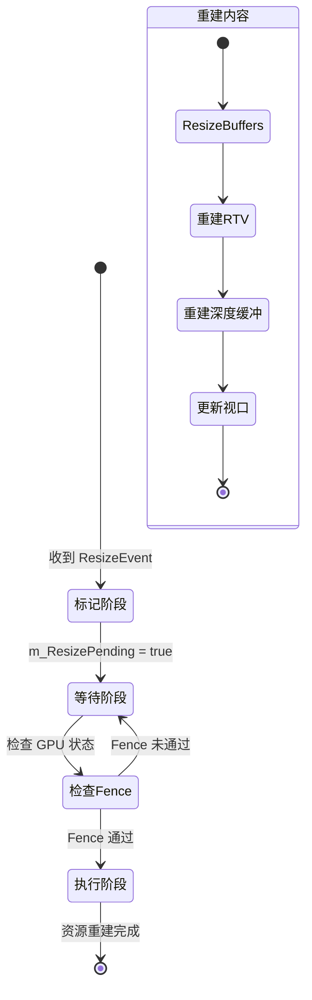
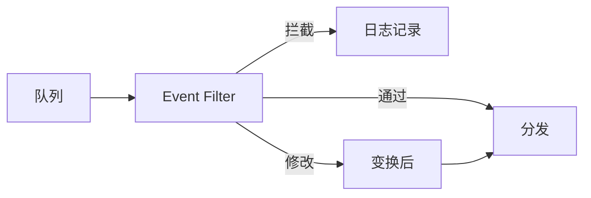

# 同步层 (SynchronizationLayer)

**核心组件**：`EventBus::Update`

**角色定位**："上帝视角"的调度者与守门人,系统行为的记录者


## 核心概念

### 时间边界

| 边界 | 说明 |
|:-----|:-----|
| **开始** | 同步层的 Tick() 被调用，标志着这一帧世界的"时间"开始流动 |
| **结束** | 同步层处理完所有积压的合法事件，标志着这一帧世界的"状态"已经固化 |

### 逻辑时序

底层是异步的，Win32 消息可能在 10ms 时进来，网络包在 10.5ms 时进来。对于同步层来说，物理时间不重要，重要的是**逻辑顺序**。

**如何记录？**

同步层维护一个全局递增的计数器 `uint64_t m_frameCount`：
- 当事件从底层队列被拉取上来时，同步层给它盖个章：`Event.SequenceID = m_frameCount`
- 这个 ID 就是这个事件在历史长河中的唯一坐标


```cpp
// 事件头
struct EventHeader {
    uint64_t SequenceID;  // 同步层盖的章，逻辑时钟
    uint32_t  Priority;   // 优先级 (P0-Critical, P1-High...)
    uint32_t  Type;       // 事件类型哈希
    uint64_t  Timestamp;  // (可选) 物理时间，用于性能分析
};

// 具体事件示例：贴图加载完成
struct TextureLoadedEvent : public IEvent {
    std::string AssetPath;
    GPUHandle   GpuResource; // 注意：这里是指向显存的句柄，不是显存本身
};
```

### 因果一致性

根据正常时序的优先级排序：
- 如果 `A.ID < B.ID`，即使 B 先到，同步层也会把 B 扔进"等待区"（缓存）
- 直到 A 被处理完，下一帧轮到 B 时，才把 B 释放给 EnTT

---

## 职责

1. **搬运与清洗**：在主线程的 Game Loop 中，将底层队列里的事件"搬运"出来
2. **时序控制**（核心）：拥有绝对的控制权，决定事件是立即分发、延迟处理还是直接丢弃
3. **安全检查**：例如在 DX12 环境中，收到 ResizeEvent 后，先检查 GPU 的 Fence 状态，只有当 GPU 空闲时才允许事件通过

---

## 关键特性

### 主线程执行

确保所有复杂的逻辑判断都在主线程进行，避免锁竞争。

### 积压处理

对于高频事件（如鼠标移动），可以在这一层做"去重"处理，只保留最新的一个，丢弃旧的，防止系统过载。

---

## 同步阶段（主线程）

| 要点 | 说明 |
|:-----|:-----|
| 角色 | EventBus::Update（调度者） |
| 线程 | 主线程（逻辑核心） |
| 动作 | 搬运事件 → 时序检查 → 决定是否分发 |
| 优势 | 拥有绝对控制权，可延迟处理 |

---

## DX12 资源重建时序



同步层发现 Fence 未通过。
将该事件放入 PendingQueue（等待队列）。
直接返回，不阻塞主线程。
下一帧 Update() 开始时，先检查 PendingQueue 里的 Fence 状态。

---

## 事件积压策略

| 问题 | 解决方案 |
|:-----|:---------|
| 高频事件频繁触发 | 只保留最新事件，丢弃旧的 |
| 每帧多次重建资源 | 使用脏标记（Dirty Flag），每帧只处理一次 |

---

## 后续优化方向

### 事件优先级系统

当前设计是 FIFO 队列，所有事件平等。大型引擎通常需要优先级分层：

| 优先级 | 典型场景 | 处理时机 |
|:-------|:---------|:---------|
| P0: Critical | 设备丢失、内存不足 | 立即处理 |
| P1: High | Resize、Focus 变化 | 当帧处理 |
| P2: Normal | 一般输入事件 | 正常排队 |
| P3: Low | 统计、日志 | 空闲时处理 |
| P4: Background | 资源异步加载完成 | 下帧处理 |

### 事件过滤中间件

在队列分发前插入 Filter 层，实现"这事件该不该发出去"的判断：



典型用例：
- **暂停菜单打开时**：屏蔽所有游戏输入事件
- **录制回放系统**：拦截并序列化所有事件
- **调试模式**：打印特定事件的完整链路