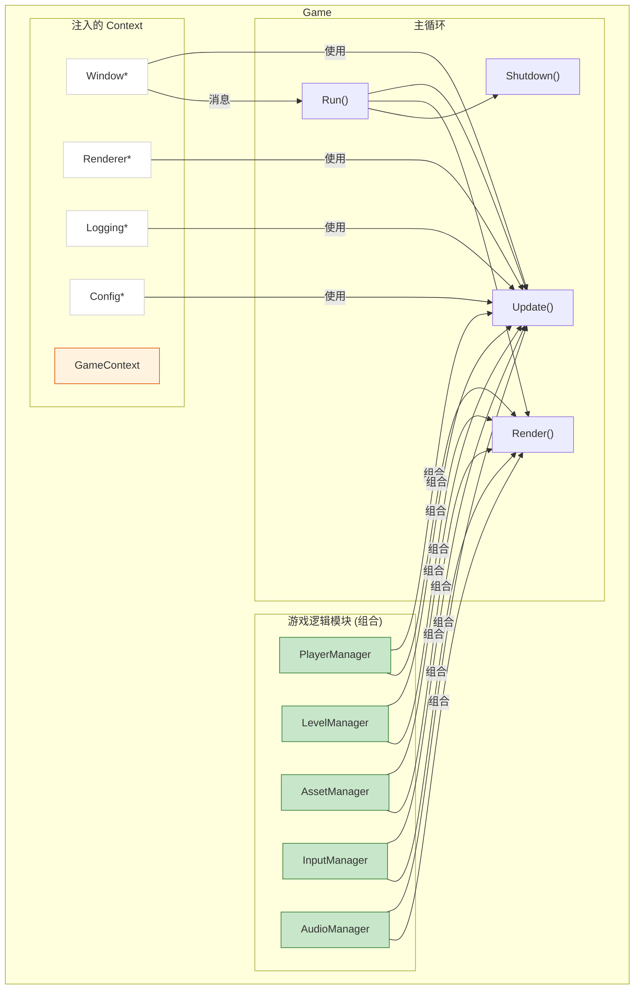
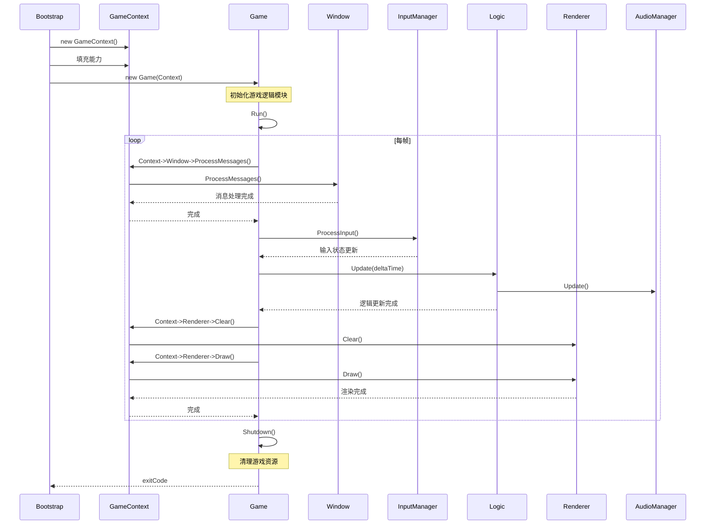
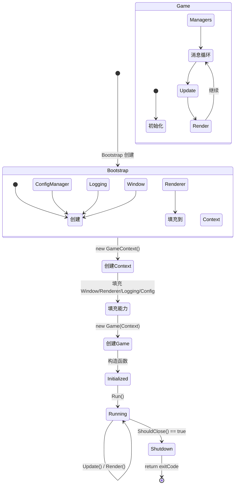
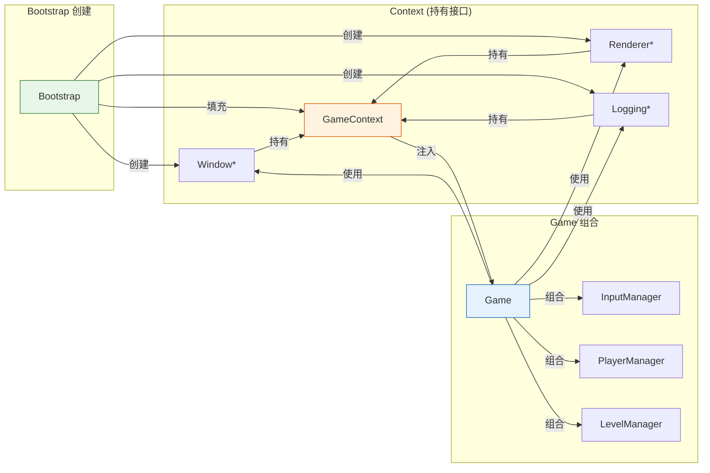
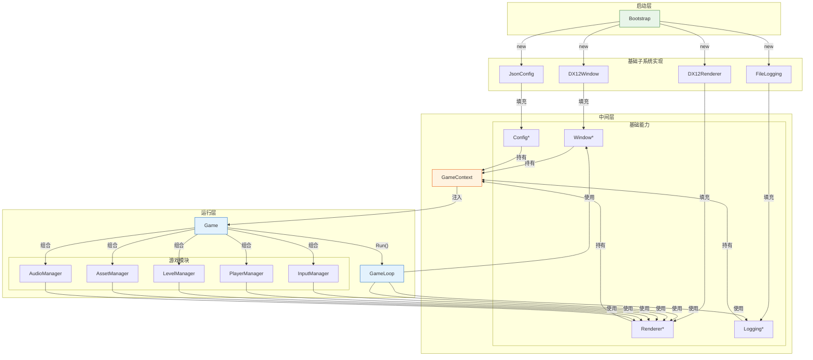

# Game (游戏主逻辑)

## 1. 概述

Game 是游戏引擎的**运行层**，负责：

- 接收 Context 注入的基础能力
- 持有并运行主循环 (Game Loop)
- 组合游戏逻辑模块
- 管理整个游戏的生命周期

| 职责定位 | 说明 |
|:--------|:-----|
| **做什么** | 运行主循环、组合游戏逻辑、管理 Update/Render |
| **不做什么** | 不创建基础设施（由 Bootstrap 创建并填充到 Context） |

**设计哲学**：Game 是"运行者 + 组合者"，通过 Context 获取基础能力，并将游戏逻辑模块组合成完整的游戏体验。

---

## 2. 核心职责

### 2.1 接收 Context

Game 不创建基础子系统，而是接收注入的 GameContext：

| 能力 | 来源 (Context) | 用途 |
|:-----|:--------------|:-----|
| Window | Context->Window | 窗口消息处理、渲染目标 |
| Renderer | Context->Renderer | 渲染画面 |
| Config | Context->Config | 读取游戏配置 |
| Logging | Context->Logging | 记录游戏日志 |

### 2.2 运行主循环

```cpp
void Game::Run() {
    while (!m_Context->Window->ShouldClose()) {
        m_Context->Window->ProcessMessages();  // 消息循环
        Update();                       // 更新逻辑
        Render();                       // 渲染画面
    }
    Shutdown();
}
```

### 2.3 组合游戏逻辑模块

Game 负责组合和协调各个游戏逻辑子系统：

| 模块 | 职责 | Game 的角色 |
|:-----|:-----|:------------|
| AssetManager | 资源加载与管理 | 组合 (Composition) |
| InputManager | 输入处理 | 组合 (Composition) |
| PlayerManager | 玩家控制 | 组合 (Composition) |
| LevelManager | 关卡加载 | 组合 (Composition) |
| AudioManager | 音频播放 | 组合 (Composition) |

---

## 3. 架构图表

### 3.1 模块组合关系



### 3.2 Game Loop 时序



### 3.3 生命周期流程



### 3.4 依赖关系（通过 Context）



### 3.5 完整架构图



---

## 4. 代码示例

### 4.1 基础结构

```cpp
class Game {
private:
    // ── 注入的 Context (单一注入点) ──
    GameContext* m_Context;

    // ── 游戏逻辑模块 (组合) ──
    std::unique_ptr<InputManager>    m_InputManager;
    std::unique_ptr<PlayerManager>    m_PlayerManager;
    std::unique_ptr<LevelManager>     m_LevelManager;
    std::unique_ptr<AssetManager>     m_AssetManager;
    std::unique_ptr<AudioManager>     m_AudioManager;

    // ── 运行状态 ──
    bool m_IsRunning;

public:
    // 构造函数接收 Context
    Game(GameContext* context)
        : m_Context(context)
        , m_IsRunning(true) {
        InitializeModules();
    }

    // 主循环
    int Run() {
        while (m_Context->Window->ShouldClose() == false && m_IsRunning) {
            m_Context->Window->ProcessMessages();
            Update();
            Render();
        }
        Shutdown();
        return 0;
    }

    void Update();    // 更新所有逻辑模块
    void Render();    // 渲染画面
    void Shutdown();  // 清理资源
};
```

### 4.2 模块组合示例

```cpp
void Game::Update() {
    float deltaTime = CalculateDeltaTime();

    // 通过 Context 访问基础能力
    m_Context->Logging->Log("Updating frame...");

    // 更新基础能力
    m_InputManager->Update();

    // 组合游戏逻辑
    m_PlayerManager->Update(deltaTime);
    m_LevelManager->Update(deltaTime);
    m_AudioManager->Update(deltaTime);
}

void Game::Render() {
    // 使用 Context 中的 Window 和 Renderer
    m_Context->Window->BeginFrame();
    m_Context->Renderer->Clear();

    // 渲染各个逻辑模块
    m_LevelManager->Render();
    m_PlayerManager->Render();

    m_Context->Renderer->Present();
    m_Context->Window->EndFrame();
}
```

### 4.3 模块注册到 Context

```cpp
void Game::InitializeModules() {
    // 通过 Config 读取配置
    auto& config = m_Context->Config->GetSection("Game");

    // 创建并初始化游戏逻辑模块
    m_InputManager = std::make_unique<InputManager>(m_Context);
    m_AssetManager = std::make_unique<AssetManager>(
        m_Context->FileSystem,
        m_Context->Logging
    );
    m_LevelManager = std::make_unique<LevelManager>(
        m_AssetManager.get(),
        m_Context->Logging
    );
    m_PlayerManager = std::make_unique<PlayerManager>(
        m_InputManager.get(),
        config.GetInt("MaxPlayers")
    );
    m_AudioManager = std::make_unique<AudioManager>(
        m_Context->FileSystem
    );

    // 通过 Logging 记录初始化
    m_Context->Logging->Log("All game modules initialized");
}
```

---

## 5. 职责边界总结

| 能力/模块 | Bootstrap | Context | Game |
|:----------|:---------:|:-------:|:----:|
| 创建 Window | ✅ | ❌ (持有指针) | ❌ (使用) |
| 创建 Renderer | ✅ | ❌ (持有指针) | ❌ (使用) |
| 创建 Config | ✅ | ❌ (持有指针) | ❌ (使用) |
| 创建 Logging | ✅ | ❌ (持有指针) | ❌ (使用) |
| 持有能力指针 | ❌ | ✅ | ❌ |
| 创建 InputManager | ❌ | ❌ | ✅ |
| 创建 PlayerManager | ❌ | ❌ | ✅ |
| 创建 LevelManager | ❌ | ❌ | ✅ |
| 持有消息循环 | ❌ | ❌ | ✅ |
| 管理运行时状态 | ❌ | ❌ | ✅ |

---

## 6. 设计原则

| 原则 | 说明 |
|:-----|:-----|
| **依赖注入** | 基础能力通过 Context 注入，不自行创建 |
| **单一注入点** | 所有基础能力通过一个 Context 对象获取 |
| **组合优先** | 通过组合而非继承构建复杂逻辑 |
| **明确生命周期** | 构造函数初始化，Shutdown() 清理 |
| **接口编程** | 通过 Context 访问接口，不直接依赖实现 |
