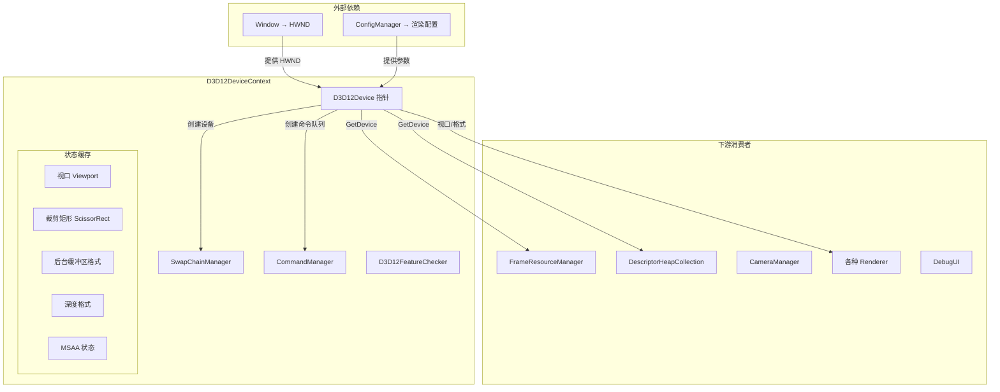

# D3D12DeviceContext（图形设备上下文）

## 1. 定位与职责

D3D12DeviceContext 是引擎的 **图形设备核心**，作为 D3D12 API 的封装层，统一管理设备、交换链、命令队列和同步原语。

- **上游依赖**：依赖 Window 提供 HWND 句柄，依赖 ConfigManager 获取渲染参数
- **下游服务**：为所有渲染模块提供设备指针、命令队列、格式查询

### 核心职责

| 职责 | 说明 |
|:----|:-----|
| **设备管理** | 创建 D3D12 设备、调试层、功能级别检测 |
| **交换链管理** | 创建/重建交换链、后台缓冲区管理 |
| **命令执行** | 提供命令队列提交、围栏同步（FlushCommandQueue） |
| **视口管理** | 维护默认视口和裁剪矩形 |
| **格式查询** | 提供后台缓冲区格式、深度格式、MSAA 状态、描述符大小 |

---

## 2. 架构图



---

## 3. 初始化流程

```
(1) 配置参数组装
    - 从 Window 获取 HWND
    - 从 ConfigManager 获取 BackBufferFormat、DepthStencilFormat
    - 读取 DebugLayer / GBV 开关

(2) 创建 D3D12 设备
    - 创建 ID3D12Device
    - 可选：启用 DebugLayer + GPU-Based Validation

(3) 创建命令队列
    - 创建 DIRECT 命令队列
    - 可选：创建 COMPUTE / COPY 队列

(4) 创建交换链
    - SwapChainManager.Initialize(hwnd, device, commandQueue, params)
    - 创建 RTV/DSV 描述符堆
    - 创建后台缓冲区 + 深度模板缓冲区

(5) 初始化视口与裁剪矩形
    - 根据窗口尺寸设置默认视口

(6) 初始化命令管理器
    - CommandManager.Initialize(device, commandQueue)
    - 创建命令列表池、分配器池、围栏
```

---

## 4. 生命周期

```
创建 → Initialize(InitParams) → 使用中 → OnResize (窗口变化时)
                                      → BeginFrame / EndFrame (每帧)
                                      → FlushCommandQueue (同步点)
                                      → Shutdown (销毁)
```

---

## 5. 设计原则

| 原则 | 说明 |
|:----|:-----|
| **委托管理** | 交换链逻辑委托给 SwapChainManager，命令逻辑委托给 CommandManager |
| **单设备** | 整个引擎只有一个 D3D12Device，由 Bootstrap 创建并拥有 |
| **延迟销毁** | Shutdown 等待 GPU 完成所有命令后再释放资源 |
| **格式统一** | 所有渲染器通过 GetDepthStencilFormat() 获取深度格式，禁止硬编码 |
| **视口透明** | 全屏 Quad 渲染前必须显式设置视口，不依赖默认视口 |