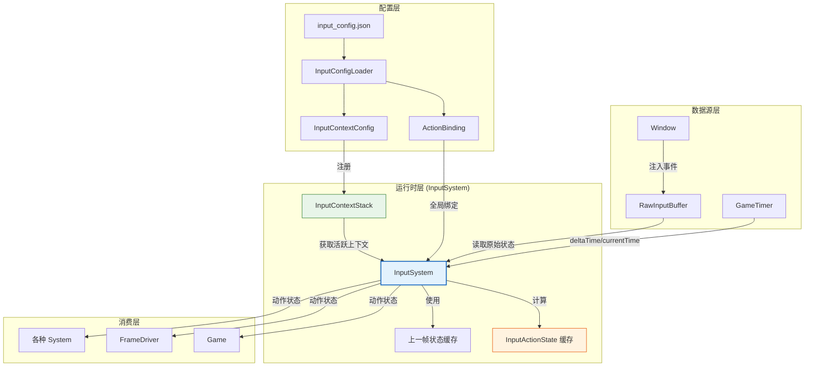
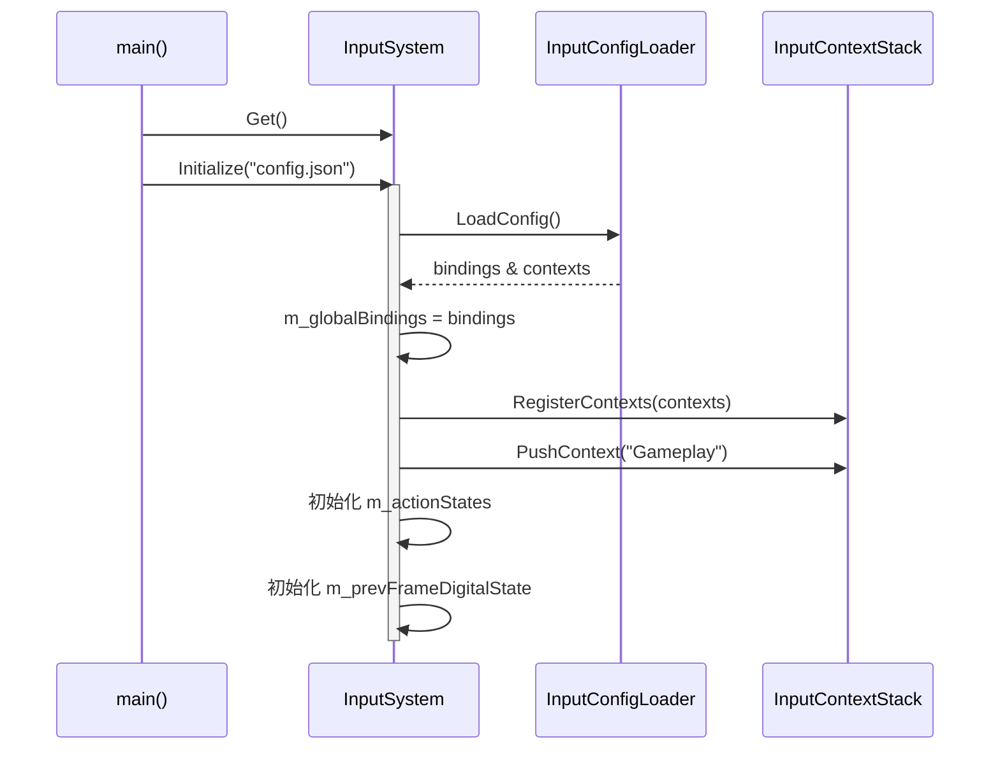
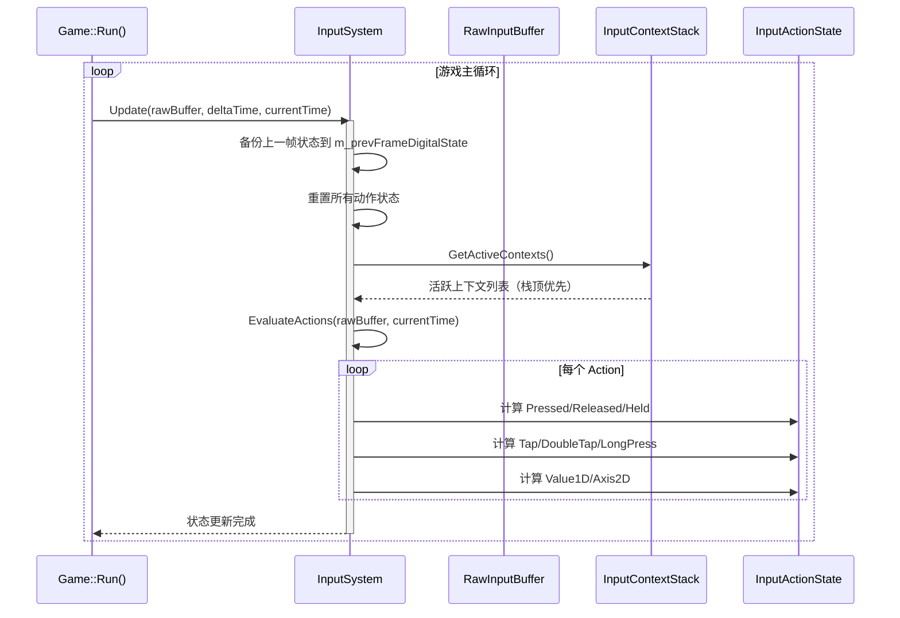
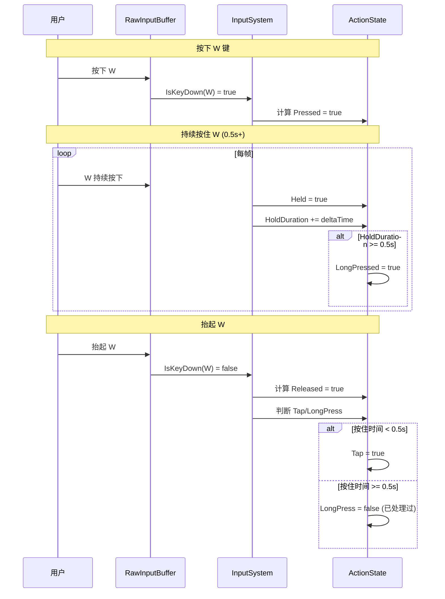
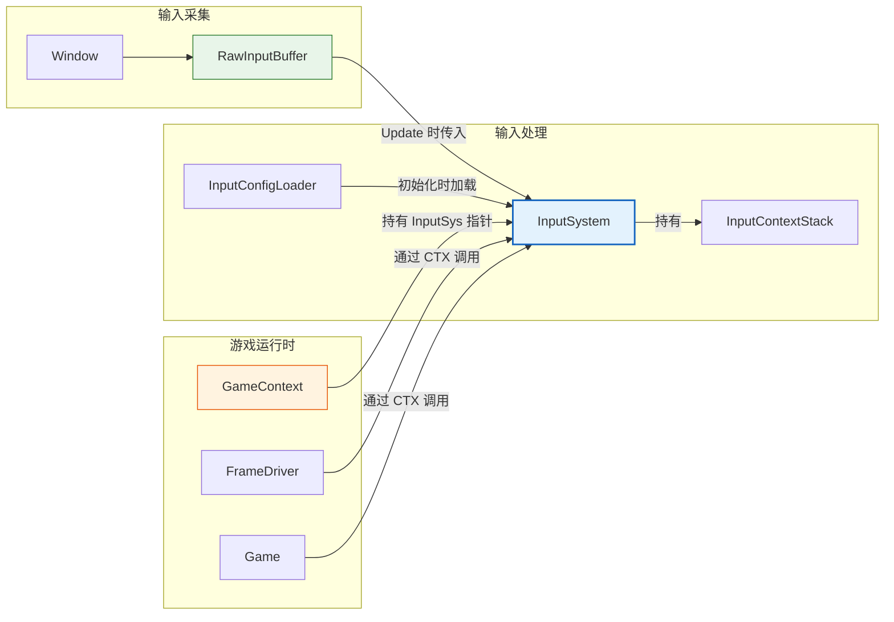
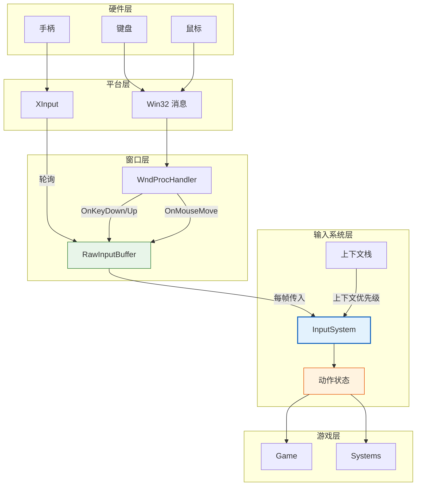

# InputSystem (输入系统)

## 1. 概述

InputSystem 是输入系统的**核心运行时模块**，负责将原始输入数据转换为游戏可用的动作状态。

### 定位

- **上游依赖**：
  - `RawInputBuffer`：原始按键/鼠标/手柄状态
  - `InputConfigLoader`：JSON 配置解析结果
  - `InputContextStack`：上下文栈管理
  - `GameTimer`：提供 deltaTime 和 currentTime

- **下游服务**：为 `Game`、`FrameDriver`、各个 `System` 提供动作状态查询接口

### 设计哲学

**配置驱动 + 上下文感知**：输入映射由 JSON 配置定义，根据当前上下文（游戏/UI/暂停）自动切换行为。

---

## 2. 整体架构图



---

## 3. 核心数据结构

### 3.1 InputActionState (动作状态)

```cpp
struct InputActionState {
    enum class EActionValueType { Digital, Analog1D, Axis2D };
    EActionValueType Type = EActionValueType::Digital;
    
    // 数字状态
    bool Pressed = false;      // 刚按下（单帧）
    bool Released = false;     // 刚抬起（单帧）
    bool Held = false;         // 持续按住
    bool Tap = false;          // 短按（< 0.5s）
    bool DoubleTap = false;    // 双击
    bool LongPressed = false;  // 长按（≥ 0.5s）
    
    // 模拟状态
    float Value1D = 0.0f;      // 单轴值（-1.0 ~ 1.0）
    float AxisX = 0.0f;        // 2D 轴 X
    float AxisY = 0.0f;        // 2D 轴 Y
    
    // 时间追踪
    float PressStartTime = 0.0f;
    float LastReleaseTime = 0.0f;
    float HoldDuration = 0.0f;
};
```

### 3.2 动作类型

| 类型 | 返回数据 | 典型动作 | 示例 |
|:----|:---------|:---------|:-----|
| **Digital** | bool | 跳跃、射击、交互 | Jump → true |
| **Analog1D** | float [-1,1] | 扳机、油门 | LeftTrigger → 0.7 |
| **Axis2D** | (X, Y) | 移动、视角 | Move → (0.5, -0.3) |

---

## 4. 核心流程

### 4.1 初始化流程



### 4.2 每帧更新流程



### 4.3 EvaluateActions 详细流程

```mermaid
flowchart TD
    START([EvaluateActions]) --> LOOP_ACTION[遍历每个 Action]
    
    LOOP_ACTION --> CONTEXT_CHECK{检查上下文}
    CONTEXT_CHECK -->|未启用| NEXT_ACTION[下一个 Action]
    CONTEXT_CHECK -->|启用| GET_BINDING[获取有效绑定<br/>（优先 Override）]
    
    GET_BINDING --> LOOP_SOURCE[遍历 BindingSource]
    
    LOOP_SOURCE --> CHECK_TYPE{源类型?}
    
    CHECK_TYPE -->|数字键| CHECK_DOWN{IsKeyDown<br/>&& Modifier 满足?}
    CHECK_DOWN -->|是| SET_DIGITAL[设置 anyDigitalKeyDown = true]
    CHECK_DOWN -->|否| NEXT_SOURCE
    
    CHECK_TYPE -->|键盘轴| GET_KEY[rawBuffer.IsKeyDown]
    GET_KEY --> 1.0[rawIntensity = 1.0]
    
    CHECK_TYPE -->|鼠标轴| GET_MOUSE[GetMouseDeltaX/Y<br/>GetMouseWheelDelta]
    GET_MOUSE --> APPLY_SCALE[rawIntensity * AxisScale]
    
    CHECK_TYPE -->|手柄轴| GET_GAMEPAD[GetGamepadAxis]
    GET_GAMEPAD --> DEADZONE{abs > 0.2?}
    DEADZONE -->|是| APPLY_SCALE
    DEADZONE -->|否| NEXT_SOURCE
    
    APPLY_SCALE --> ACCUMULATE[累加到 sumX/sumY]
    ACCUMULATE --> NEXT_SOURCE
    
    SET_DIGITAL --> NEXT_SOURCE
    NEXT_SOURCE --> LOOP_SOURCE
    
    LOOP_SOURCE -->|结束| UPDATE_STATE[更新 ActionState]
    
    UPDATE_STATE -->|有轴输入| SET_AXIS[SetAxis2D(sumX, sumY)]
    UPDATE_STATE -->|有数字键| SET_HELD[SetDigital(Held=true)]
    UPDATE_STATE -->|无输入| SET_IDLE[SetDigital(全部false)]
    
    SET_AXIS --> NEXT_ACTION
    SET_HELD --> NEXT_ACTION
    SET_IDLE --> NEXT_ACTION
    
    NEXT_ACTION --> LOOP_ACTION

    style CONTEXT_CHECK fill:#e8f5e9,stroke:#2e7d32
    style CHECK_TYPE fill:#e3f2fd,stroke:#1565c0
    style DEADZONE fill:#fff3e0,stroke:#e65100
```

### 4.4 边缘检测时序图



---

## 5. 与其他模块的协作

### 5.1 模块依赖关系



### 5.2 GameContext 集成

```cpp
// GameContext.h
class GameContext {
public:
    Input::InputSystem* InputSys = nullptr;
    // ...
};

// Bootstrap::CreateContext()
m_context->InputSys = &Input::InputSystem::Get();

// FrameDriver 或 Game 中使用
void Game::Update(float deltaTime) {
    auto& input = *m_Context->InputSys;
    if (input.IsActionPressed(ActionId_Jump)) {
        character->Jump();
    }
    
    FVector2D move = input.GetActionAxis2D(ActionId_Move);
    character->Move(move.x, move.y);
}
```

### 5.3 输入数据流完整图



---

## 6. 使用示例

### 6.1 定义动作常量

```cpp
// InputActions.h
namespace InputActions {
    DEFINE_ACTION(Move);
    DEFINE_ACTION(Look);
    DEFINE_ACTION(Jump);
    DEFINE_ACTION(Sprint);
    DEFINE_ACTION(Interact);
    DEFINE_ACTION(OpenMenu);
}
```

### 6.2 在 Game 中使用

```cpp
void Game::Update(float deltaTime) {
    auto& input = *m_Context->InputSys;
    
    // 数字动作
    if (input.IsActionPressed(ActionId_Jump)) {
        m_player->Jump();
    }
    
    if (input.IsActionHeld(ActionId_Sprint)) {
        m_player->SetSprinting(true);
    } else {
        m_player->SetSprinting(false);
    }
    
    // 轴向动作
    FVector2D move = input.GetActionAxis2D(ActionId_Move);
    m_player->Move(move.x, move.y);
    
    FVector2D look = input.GetActionAxis2D(ActionId_Look);
    m_camera->AddYaw(look.x * MOUSE_SENSITIVITY);
    m_camera->AddPitch(look.y * MOUSE_SENSITIVITY);
    
    // 长按/短按区分
    if (input.IsActionHeld(ActionId_Interact)) {
        // 长按显示交互轮盘
    } else if (input.IsActionPressed(ActionId_Interact)) {
        // 短按直接交互
    }
}
```

### 6.3 上下文切换

```cpp
// 打开背包
void InventorySystem::Open() {
    auto& input = InputSystem::Get();
    input.PushContext("Inventory");  // 栈: [Gameplay, Inventory]
    // 现在 WASD 在背包中导航，不控制角色移动
}

void InventorySystem::Close() {
    auto& input = InputSystem::Get();
    input.PopContext();  // 栈: [Gameplay]
}

// 暂停菜单
void PauseMenu::OnOpen() {
    auto& input = InputSystem::Get();
    input.PushContext("Pause");  // 栈: [Gameplay, Pause]
}

void PauseMenu::OnClose() {
    auto& input = InputSystem::Get();
    input.PopContext();  // 栈: [Gameplay]
}
```

---

## 7. API 参考

### InputSystem

| 方法 | 参数 | 返回值 | 说明 |
|:----|:-----|:-------|:-----|
| `Get()` | 无 | `InputSystem&` | 获取单例实例 |
| `Initialize(configPath)` | string | bool | 加载配置，初始化系统 |
| `Update(rawBuffer, deltaTime, currentTime)` | RawInputBuffer&, float, float | void | 每帧更新输入状态 |
| `PushContext(contextName)` | string | void | 压入新上下文 |
| `PopContext()` | 无 | void | 弹出当前上下文 |
| `GetActionState(actionId)` | ActionId | const InputActionState& | 获取动作完整状态 |
| `IsActionPressed(actionId)` | ActionId | bool | 是否刚按下 |
| `IsActionReleased(actionId)` | ActionId | bool | 是否刚抬起 |
| `IsActionHeld(actionId)` | ActionId | bool | 是否持续按住 |
| `GetActionValue1D(actionId)` | ActionId | float | 获取单轴值 |
| `GetActionAxis2D(actionId)` | ActionId | FVector2D | 获取 2D 轴值 |

---

## 8. 配置常量

| 常量 | 默认值 | 说明 |
|:-----|:------:|:-----|
| `LONG_PRESS_THRESHOLD` | 0.5s | 长按判定阈值 |
| `DOUBLE_TAP_INTERVAL` | 0.3s | 双击最大间隔 |
| `MOUSE_SENSITIVITY` | 0.01f | 鼠标灵敏度（可配置化） |
| `GAMEPAD_DEADZONE` | 0.2f | 手柄摇杆死区 |

---

## 9. 设计特点总结

| 特性 | 实现方式 | 收益 |
|:-----|:---------|:-----|
| **配置驱动** | JSON 定义映射 | 无需重新编译 |
| **上下文感知** | 栈式优先级管理 | 自动适应游戏状态 |
| **动作抽象** | ActionId 哈希标识 | 解耦按键与逻辑 |
| **边缘检测** | 上一帧状态缓存 | Pressed/Released 准确 |
| **时序检测** | 时间戳记录 | Tap/DoubleTap/LongPress |
| **多输入源合并** | 轴值累加 | 支持键盘+手柄同时控制 |

---
