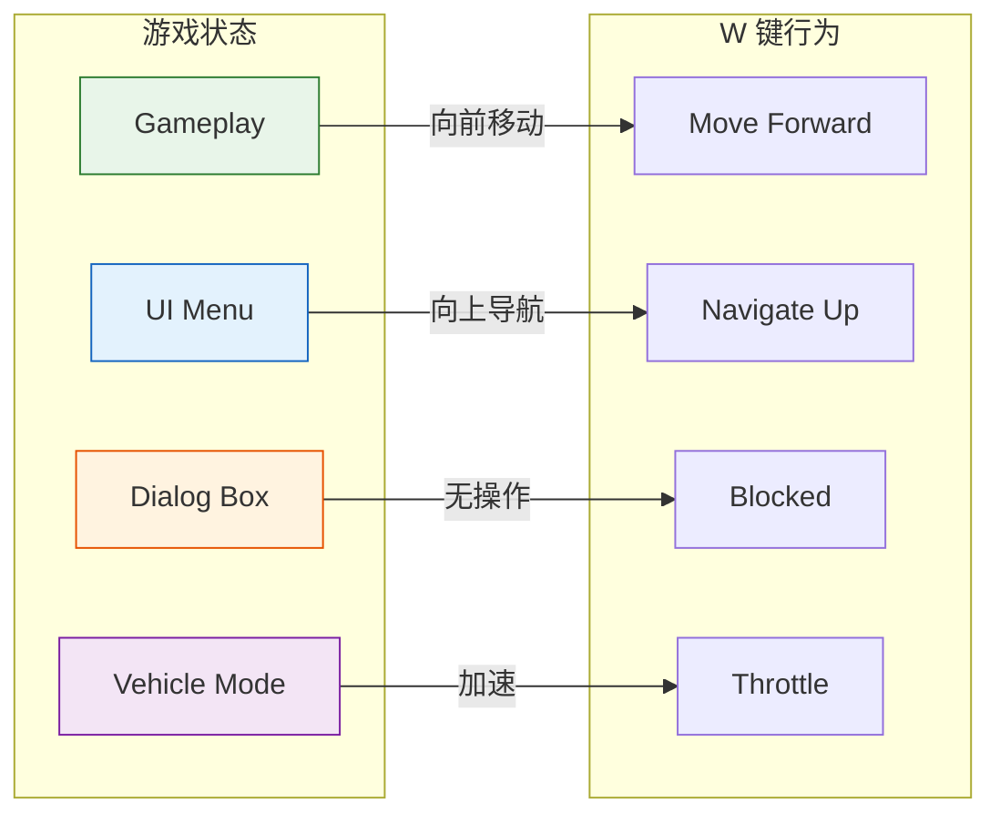
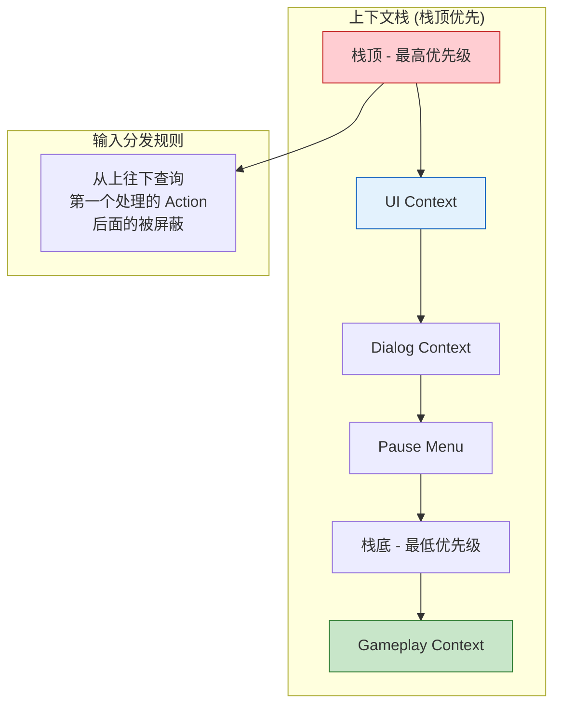
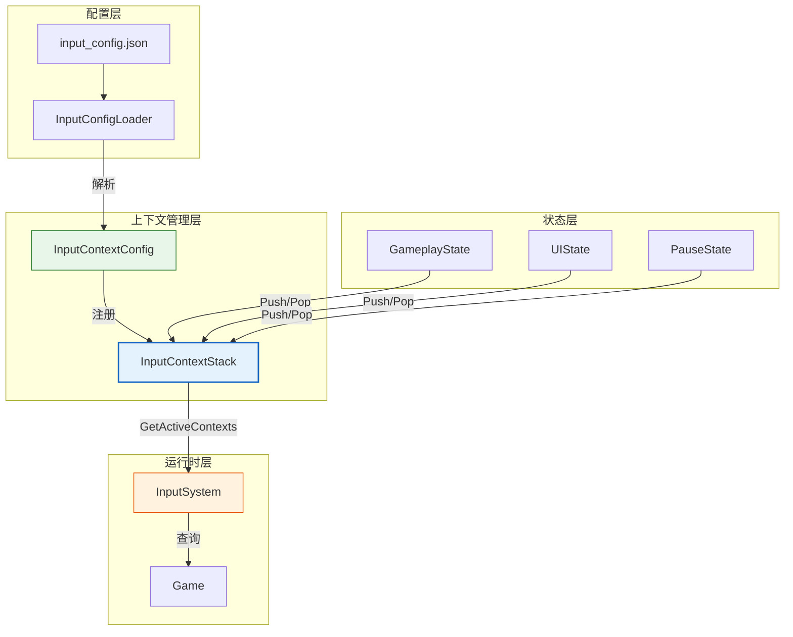
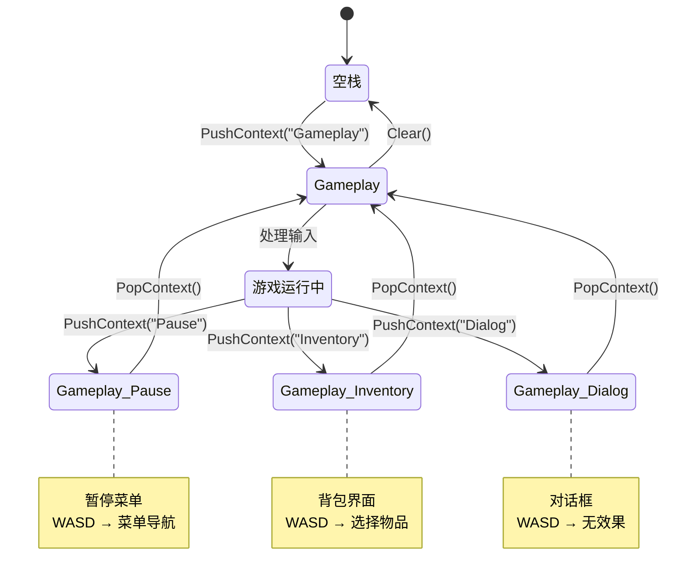
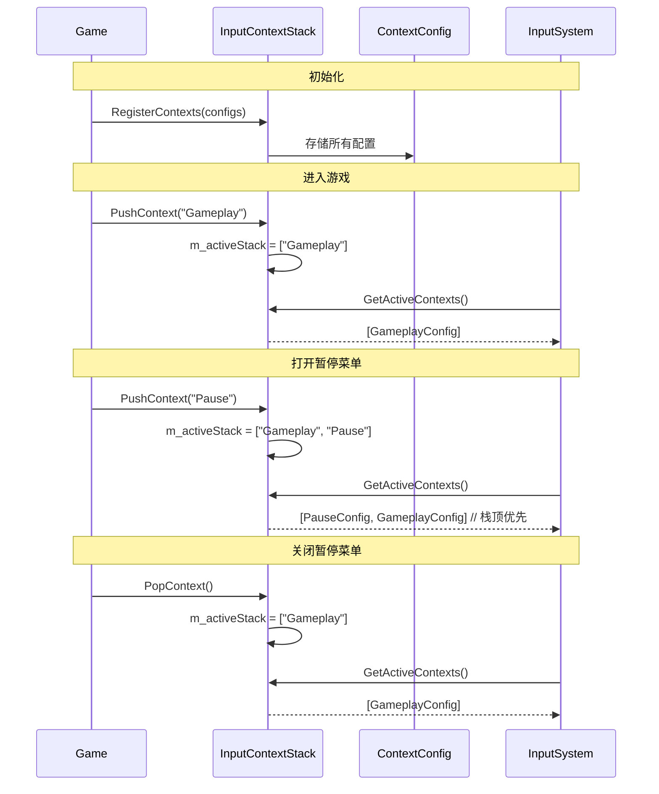
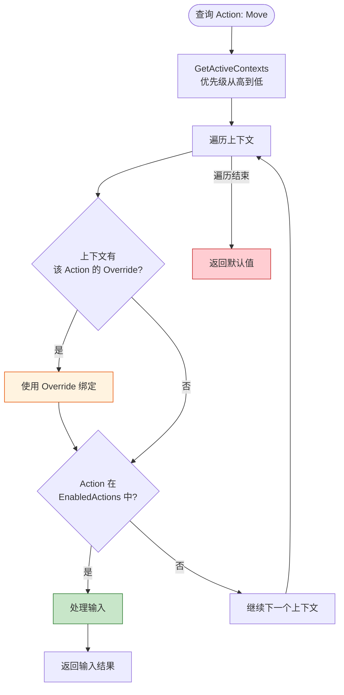
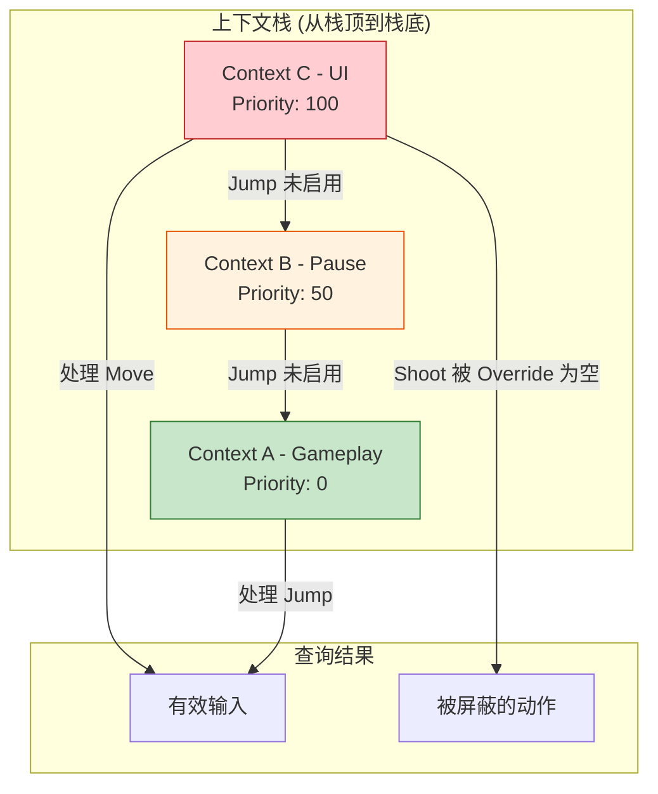
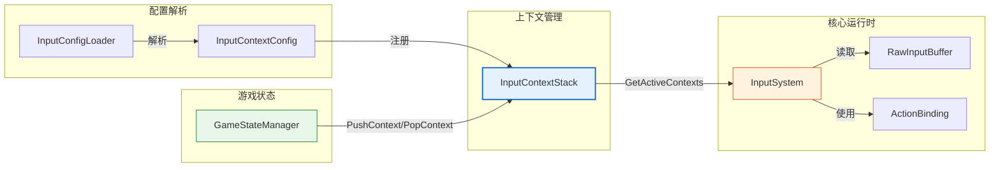

# 输入上下文栈 (InputContextStack)

## 1. 概述

InputContextStack 是输入系统的**上下文管理模块**，负责管理不同游戏状态下输入映射的激活和优先级。

### 定位

- **上游依赖**：依赖 `InputConfigLoader` 解析的 `InputContextConfig` 配置
- **下游服务**：为 `InputSystem` 提供当前活跃上下文的查询接口

### 设计哲学

**上下文驱动输入**：同一按键在不同游戏状态下应有不同行为。例如：
- 游戏中：WASD → 移动角色
- UI 中：WASD → 菜单导航

---

## 2. 核心概念

### 2.1 为什么需要上下文？



### 2.2 栈式优先级管理



---

## 3. 数据结构

### 3.1 InputContextConfig (上下文配置)

```cpp
struct InputContextConfig {
    std::string Name;                                    // 上下文名称
    int Priority = 0;                                    // 优先级（数字越大越优先）
    std::vector<ActionId> EnabledActions;                // 该上下文启用的动作
    std::unordered_map<ActionId, ActionBinding> Overrides; // 局部覆盖绑定
};
```

### 3.2 InputContextStack (上下文栈)

```cpp
class InputContextStack {
private:
    // 所有可用的上下文配置（从 JSON 加载）
    std::unordered_map<std::string, InputContextConfig> m_contextConfigs;
    
    // 活跃上下文栈（栈底=基础游戏，栈顶=当前UI）
    std::vector<std::string> m_activeStack;
    
public:
    void RegisterContexts(const std::unordered_map<std::string, InputContextConfig>& configs);
    void PushContext(const std::string& contextName);
    void PopContext();
    std::vector<const InputContextConfig*> GetActiveContexts() const;
    void Clear();
};
```

---

## 4. 架构图表

### 4.1 模块依赖关系图



### 4.2 上下文生命周期图



### 4.3 上下文入栈/出栈流程



### 4.4 输入查询优先级图



### 4.5 多上下文合并规则



---

## 5. 使用示例

### 5.1 初始化上下文

```cpp
// InputSystem 初始化时
void InputSystem::Initialize(const std::string& configPath) {
    std::unordered_map<std::string, InputContextConfig> contexts;
    InputConfigLoader::LoadConfig(configPath, m_globalBindings, contexts);
    
    // 注册所有上下文配置
    m_contextStack.RegisterContexts(contexts);
    
    // 默认压入 Gameplay 上下文
    m_contextStack.PushContext("Gameplay");
}
```

### 5.2 游戏状态切换

```cpp
// GameplayState.cpp
void GameplayState::OnEnter() {
    InputSystem::Get().PushContext("Gameplay");
}

void GameplayState::OnExit() {
    InputSystem::Get().PopContext();
}

// UIMenuState.cpp
void UIMenuState::OnEnter() {
    InputSystem::Get().PushContext("UI");
}

void UIMenuState::OnExit() {
    InputSystem::Get().PopContext();
}

// 暂停菜单 - 叠加在 Gameplay 之上
void PauseMenu::OnOpen() {
    InputSystem::Get().PushContext("Pause");  // 栈: [Gameplay, Pause]
}

void PauseMenu::OnClose() {
    InputSystem::Get().PopContext();          // 栈: [Gameplay]
}
```

### 5.3 查询动作状态（考虑上下文）

```cpp
// InputSystem::IsActionPressed 的实现逻辑
bool InputSystem::IsActionPressed(ActionId actionId) {
    auto activeContexts = m_contextStack.GetActiveContexts();
    
    for (const auto* ctx : activeContexts) {
        // 1. 检查 Override
        auto overrideIt = ctx->Overrides.find(actionId);
        if (overrideIt != ctx->Overrides.end()) {
            // 空 Sources 表示禁用该动作
            if (overrideIt->second.Sources.empty()) {
                continue;  // 被禁用，继续下一个上下文
            }
            return CheckBinding(overrideIt->second.Sources);
        }
        
        // 2. 检查是否启用
        if (std::find(ctx->EnabledActions.begin(), ctx->EnabledActions.end(), actionId) 
            != ctx->EnabledActions.end()) {
            auto globalIt = m_globalBindings.find(actionId);
            if (globalIt != m_globalBindings.end()) {
                return CheckBinding(globalIt->second.Sources);
            }
        }
    }
    
    return false;
}
```

---

## 6. 与其他模块的关系



---

## 7. 设计特点总结

| 特性 | 实现方式 | 收益 |
|:-----|:---------|:-----|
| **栈式优先级** | `vector` 作为栈，栈顶优先 | 直观的优先级管理 |
| **配置驱动** | 从 JSON 加载上下文定义 | 无需修改代码 |
| **局部覆盖** | `Overrides` 机制 | 上下文特定绑定 |
| **动作屏蔽** | 空 Sources 表示禁用 | 上层可屏蔽下层动作 |
| **优先级反转** | 遍历时从 rbegin 开始 | 栈顶自然获得最高优先级 |

---

## 8. API 参考

### InputContextStack

| 方法 | 参数 | 返回值 | 说明 |
|:----|:-----|:-------|:-----|
| `RegisterContexts` | `configs` | void | 注册所有可用上下文配置 |
| `PushContext` | `contextName` | void | 压入新上下文（栈顶） |
| `PopContext` | 无 | void | 弹出当前上下文 |
| `GetActiveContexts` | 无 | `vector<const Config*>` | 获取活跃上下文（栈顶优先） |
| `Clear` | 无 | void | 清空上下文栈 |

---

## 9. 典型使用场景

| 场景 | 栈状态 | 行为 |
|:----|:-------|:-----|
| **正常游戏** | `[Gameplay]` | WASD 移动角色 |
| **打开背包** | `[Gameplay, Inventory]` | WASD 选择物品，移动被屏蔽 |
| **暂停游戏** | `[Gameplay, Pause]` | WASD 菜单导航，游戏冻结 |
| **显示对话框** | `[Gameplay, Dialog]` | 其他输入被屏蔽 |
| **驾驶载具** | `[Gameplay, Vehicle]` | WASD 控制载具 |
| **UI 叠加** | `[Gameplay, UI, Tooltip]` | 最外层优先处理 |

