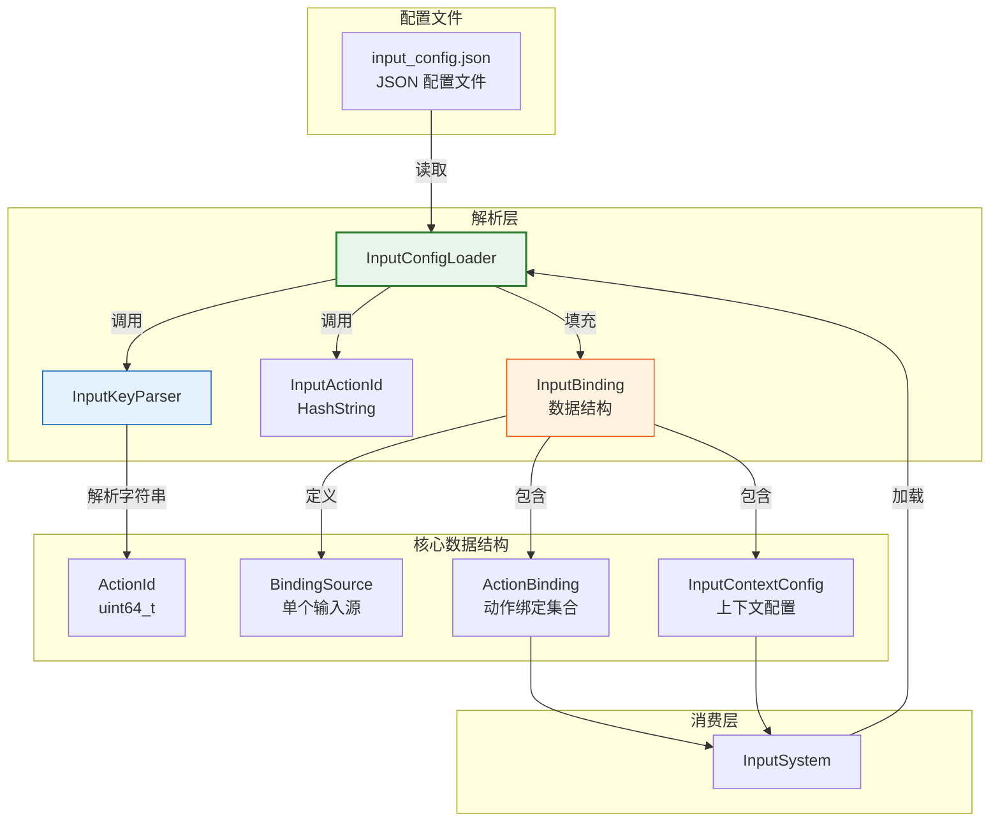
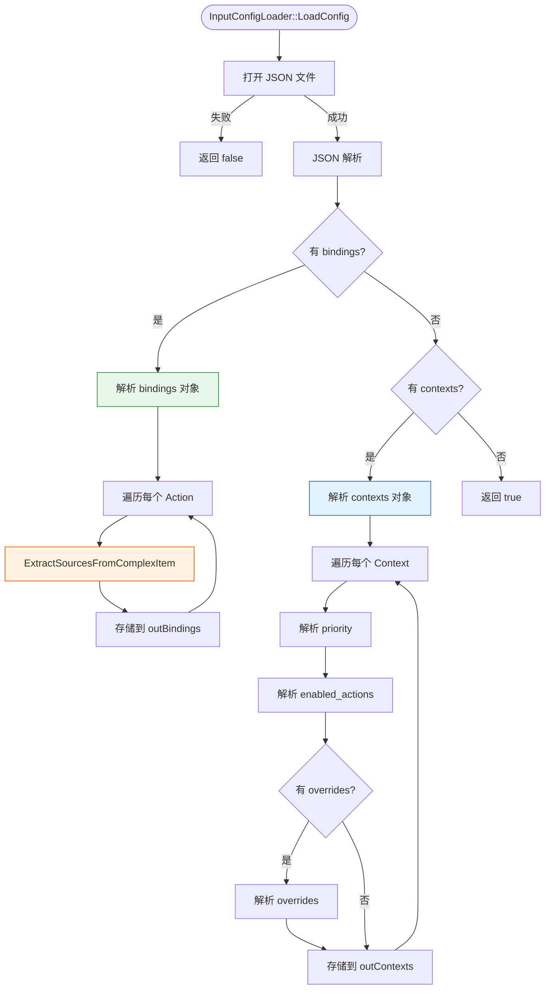
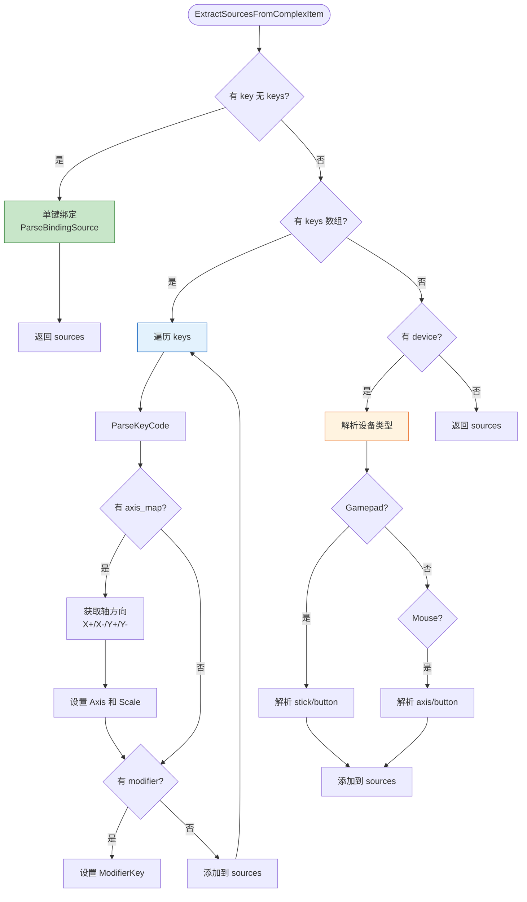
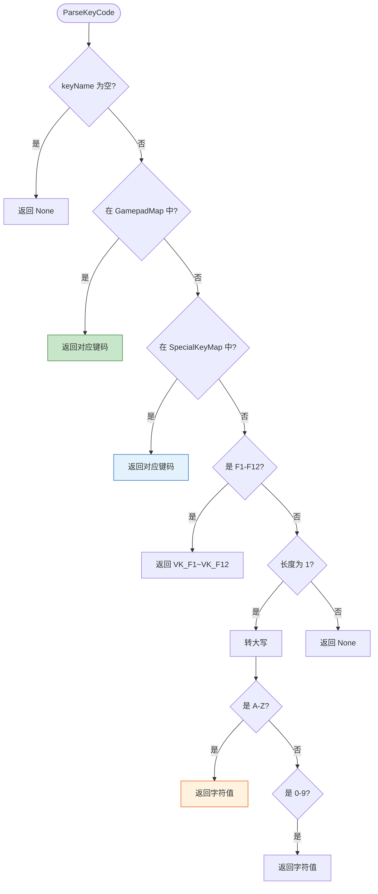
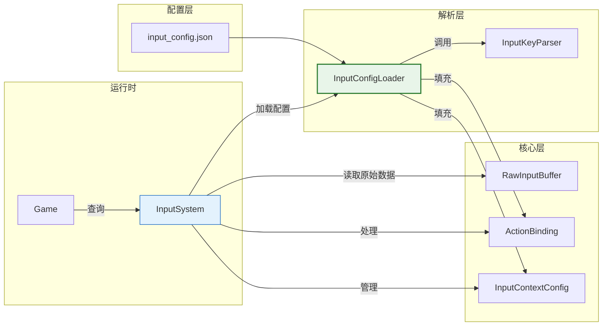

以下是为输入配置解析模块生成的完整文档：

```markdown
---
date: 2026-05-22
category:
  - DX12
  - 游戏引擎
tag:
  - 输入系统
  - 配置解析
---

# 输入配置解析模块

## 1. 概述

输入配置解析模块负责将 JSON 格式的输入配置文件转换为引擎内部的 `ActionBinding` 和 `InputContextConfig` 数据结构。

### 定位

- **上游依赖**：依赖 JSON 配置文件（如 `default_input.json`）
- **下游服务**：为 `InputSystem` 提供解析后的绑定数据和上下文配置

### 设计哲学

**配置驱动输入**：所有输入映射（按键 → 游戏动作）均由 JSON 配置文件定义，无需修改代码即可重新绑定按键。

---

## 2. 模块依赖关系



---

## 3. 核心数据结构

### 3.1 ActionId (动作标识)

```cpp
using ActionId = uint64_t;

// 编译期字符串哈希 (FNV-1a 64-bit)
constexpr uint64_t HashString(std::string_view str) {
    uint64_t hash = 14695981039346656037ULL;
    for (char c : str) {
        hash ^= static_cast<uint64_t>(c);
        hash *= 1099511628211ULL;
    }
    return hash;
}

// 定义动作常量
#define DEFINE_ACTION(name) \
    inline constexpr ActionId ActionId_##name = HashString(#name)

// 使用示例
DEFINE_ACTION(Jump);   // ActionId_Jump = HashString("Jump")
DEFINE_ACTION(Move);   // ActionId_Move = HashString("Move")
```

### 3.2 BindingSource (单个输入源)

```cpp
struct BindingSource {
    EKeyCode KeyCode = EKeyCode::None;      // 主输入键码
    EKeyCode ModifierKey = EKeyCode::None;  // 修饰键 (Shift/Ctrl/Alt)
    
    enum class AxisType { None, X, Y, Trigger, Wheel };
    AxisType Axis = AxisType::None;         // 轴向类型
    float AxisScale = 0.0f;                 // 轴向缩放 (+1/-1)
    float Threshold = 0.0f;                 // 模拟阈值
    
    enum class DeviceType { Auto, Keyboard, Mouse, Gamepad };
    DeviceType Device = DeviceType::Auto;   // 设备类型
};
```

### 3.3 ActionBinding (动作绑定)

```cpp
struct ActionBinding {
    ActionId Id;                           // 动作唯一标识
    std::vector<BindingSource> Sources;    // 多个输入源（一个动作可绑定多个键）
};
```

### 3.4 InputContextConfig (上下文配置)

```cpp
struct InputContextConfig {
    std::string Name;                                      // 上下文名称
    int Priority = 0;                                      // 优先级（数字越大越优先）
    std::vector<ActionId> EnabledActions;                 // 该上下文启用的动作
    std::unordered_map<ActionId, ActionBinding> Overrides; // 局部覆盖绑定
};
```

---

## 4. JSON 配置格式

### 4.1 完整示例

```json
{
    "bindings": {
        "Move": [
            {
                "keys": ["W", "A", "S", "D"],
                "axis_map": {
                    "W": "Y+",
                    "S": "Y-",
                    "A": "X-",
                    "D": "X+"
                }
            },
            {
                "keys": ["Up", "Down", "Left", "Right"],
                "axis_map": {
                    "Up": "Y+",
                    "Down": "Y-",
                    "Left": "X-",
                    "Right": "X+"
                }
            },
            {
                "device": "Gamepad",
                "stick": "LeftStick"
            }
        ],
        "Jump": [
            { "key": "Space" },
            { "device": "Gamepad", "button": "A" }
        ],
        "Look": [
            { "device": "Mouse", "axis": "Delta" },
            { "device": "Gamepad", "stick": "RightStick" }
        ],
        "Sprint": [
            { "key": "LeftShift" },
            { "device": "Gamepad", "button": "LB" }
        ]
    },
    "contexts": {
        "Default": {
            "priority": 0,
            "enabled_actions": ["Move", "Look", "Jump", "Sprint"]
        },
        "Menu": {
            "priority": 10,
            "enabled_actions": ["Navigate", "Select", "Back"],
            "overrides": {
                "Move": []
            }
        }
    }
}
```

### 4.2 绑定语法说明

| 语法 | 说明 | 示例 |
|:----|:-----|:-----|
| `{ "key": "Space" }` | 单键绑定 | 空格键触发 Jump |
| `{ "keys": ["W","S"], "axis_map": {...} }` | 多键轴向绑定 | WASD 控制移动 |
| `{ "device": "Gamepad", "stick": "LeftStick" }` | 手柄摇杆 | 左摇杆控制移动 |
| `{ "device": "Gamepad", "button": "A" }` | 手柄按钮 | A 键跳跃 |
| `{ "device": "Mouse", "axis": "Delta" }` | 鼠标移动 | 鼠标控制视角 |
| `{ "key": "LeftShift", "modifier": "Ctrl" }` | 组合键 | Ctrl+Shift 触发 |

---

## 5. 解析流程

### 5.1 整体流程图



### 5.2 ExtractSourcesFromComplexItem 详细流程



### 5.3 键码解析流程 (ParseKeyCode)



---

## 6. 解析器 API

### 6.1 InputConfigLoader

```cpp
class InputConfigLoader {
public:
    /**
     * @brief 加载 JSON 配置文件
     * @param filePath 配置文件路径
     * @param outBindings 输出的动作绑定映射
     * @param outContexts 输出的上下文配置映射
     * @return 是否加载成功
     */
    static bool LoadConfig(
        const std::string& filePath,
        std::unordered_map<ActionId, ActionBinding>& outBindings,
        std::unordered_map<std::string, InputContextConfig>& outContexts
    );
};
```

### 6.2 InputKeyParser

```cpp
/**
 * @brief 将 JSON 中的字符串键名解析为 EKeyCode
 * 
 * 支持格式:
 * - 字母: "W" → Key_W
 * - 数字: "1" → Key_1
 * - 方向: "Up" → Key_Up
 * - 功能: "Space", "Enter", "Escape"
 * - 手柄: "Gamepad_A", "Gamepad_LeftStick"
 * - 鼠标: "Mouse_Left", "Mouse_Right"
 * 
 * @param keyName 键名字符串
 * @return EKeyCode 解析后的键码，失败返回 None
 */
EKeyCode ParseKeyCode(const std::string& keyName);
```

### 6.3 HashString

```cpp
/**
 * @brief 编译期字符串哈希 (FNV-1a 64-bit)
 * @param str 字符串视图
 * @return uint64_t 哈希值
 */
constexpr uint64_t HashString(std::string_view str);
```

---

## 7. 使用示例

### 7.1 在 InputSystem 中加载配置

```cpp
bool InputSystem::Initialize(const std::string& configPath) {
    std::unordered_map<ActionId, ActionBinding> bindings;
    std::unordered_map<std::string, InputContextConfig> contexts;
    
    if (!InputConfigLoader::LoadConfig(configPath, bindings, contexts)) {
        LOG_ERROR("Failed to load input config: {}", configPath);
        return false;
    }
    
    // 存储解析结果
    m_globalBindings = std::move(bindings);
    m_contexts = std::move(contexts);
    
    return true;
}
```

### 7.2 定义动作常量

```cpp
// InputActions.h
namespace InputActions {
    DEFINE_ACTION(Move);
    DEFINE_ACTION(Look);
    DEFINE_ACTION(Jump);
    DEFINE_ACTION(Sprint);
    DEFINE_ACTION(Crouch);
    DEFINE_ACTION(Interact);
}
```

### 7.3 查询动作状态

```cpp
// 游戏逻辑中
if (inputSystem->IsActionPressed(InputActions::ActionId_Jump)) {
    character->Jump();
}

float2 moveVector = inputSystem->GetActionVector(InputActions::ActionId_Move);
character->Move(moveVector.x, moveVector.y);
```

---

## 8. 与其他模块的关系



---

## 9. 设计特点总结

| 特性 | 实现方式 | 收益 |
|:-----|:---------|:-----|
| **编译期哈希** | `constexpr` FNV-1a 64-bit | 零开销动作标识 |
| **声明式配置** | JSON 格式描述绑定 | 无需重新编译 |
| **多输入源支持** | `BindingSource` 支持键盘/鼠标/手柄 | 统一抽象 |
| **上下文优先级** | `InputContextConfig.Priority` | 自动选择活跃上下文 |
| **局部覆盖** | `Overrides` 机制 | 上下文特定绑定 |
| **字符串映射** | `unordered_map` 缓存 | 快速查找 |

