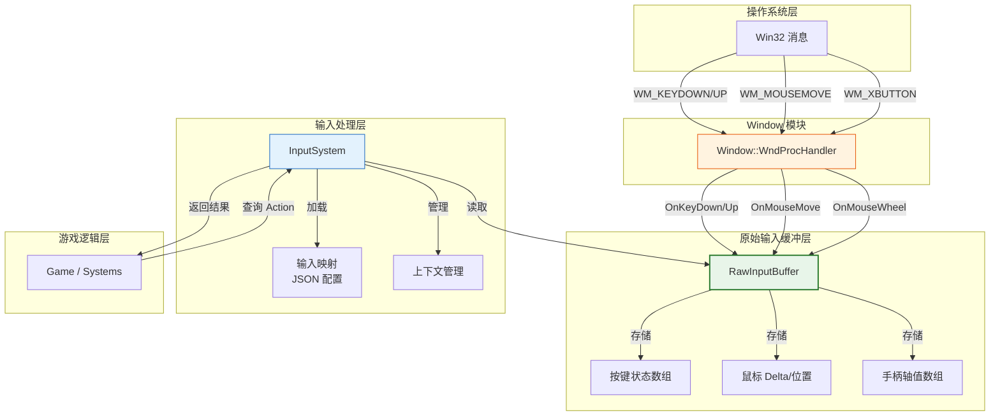
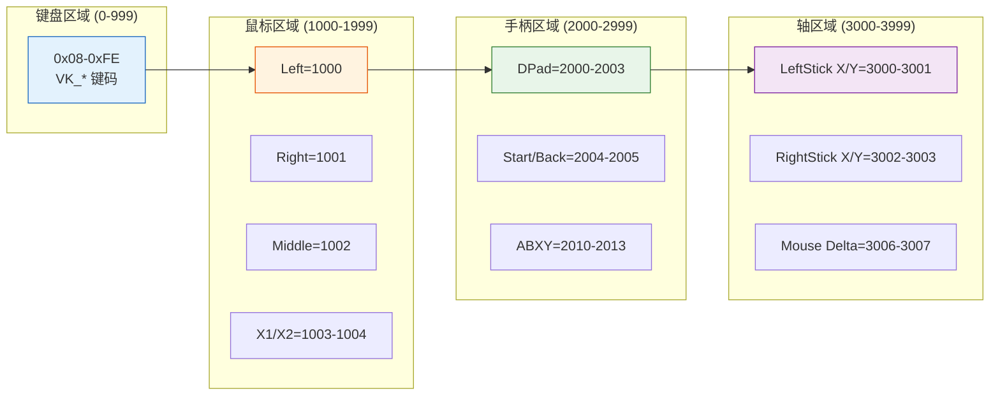
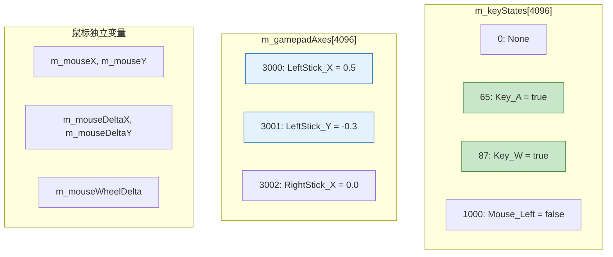
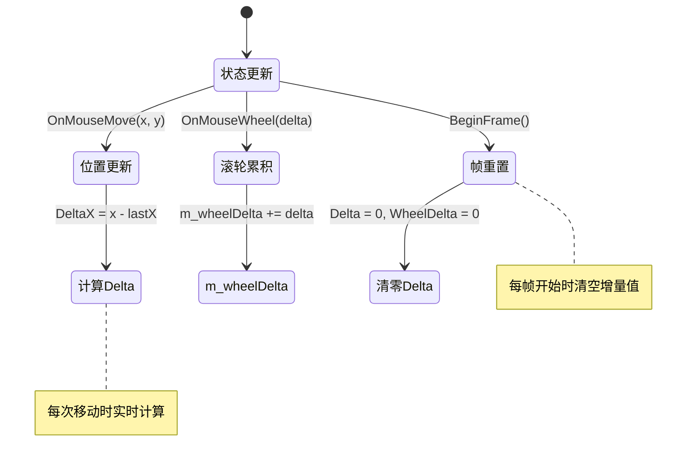
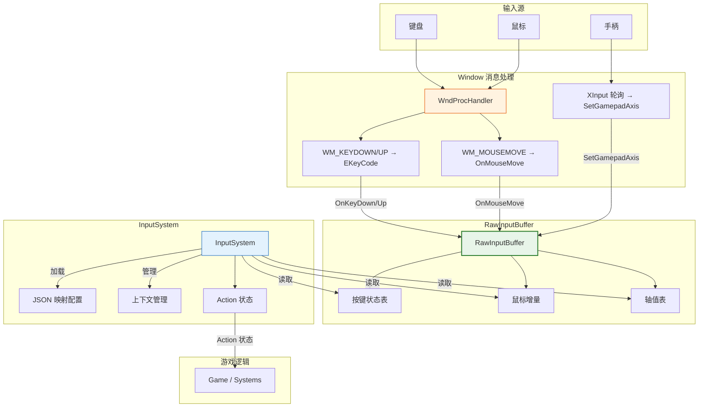
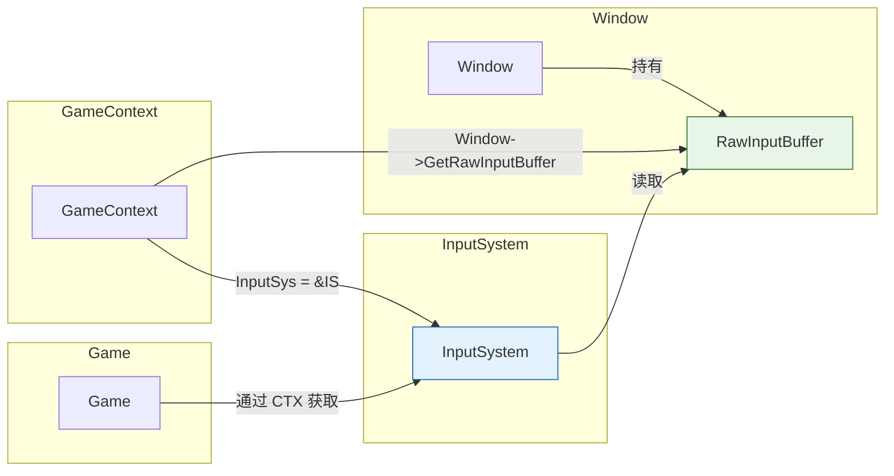
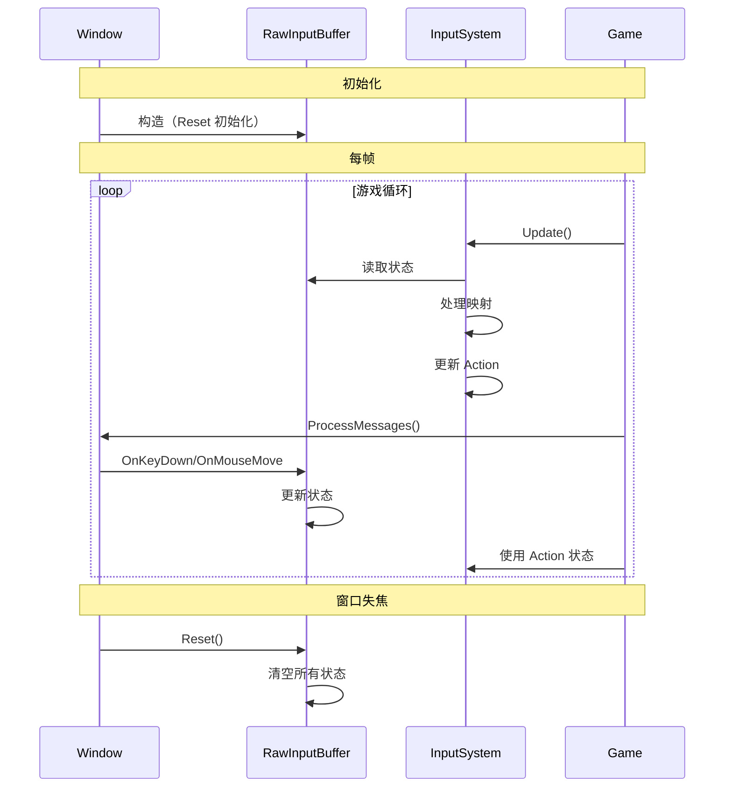

# 原始输入缓冲区

## 1. 概述

RawInputBuffer 是输入系统的**原始数据存储层**，负责存储当前帧的原始输入状态。

### 定位

- **上游依赖**：由 `Window::WndProcHandler` 注入原始输入事件
- **下游服务**：为 `InputSystem` 提供原始状态查询接口

### 设计哲学

**关注点分离**：

| 层级 | 职责 | 示例 |
|:----|:-----|:-----|
| **Window 层** | 接收 Win32 消息，转换为 EKeyCode | `WM_KEYDOWN` → `OnKeyDown` |
| **RawInputBuffer** | 存储原始状态（按下/抬起、增量值） | `m_keyStates[code] = true` |
| **InputSystem** | 映射处理（上下文切换、Action 绑定） | `WASD` → `MoveForward` |
| **游戏逻辑** | 使用最终输入结果 | `if (input->IsActionPressed("Jump"))` |

---

## 2. 模块依赖关系



---

## 3. 键码定义 (InputKeyCodes)

### 3.1 设计原则

1. **键盘部分直接对齐 Windows Virtual Key Codes**，减少转换开销
2. **鼠标和手柄使用偏移量**，避免与 VK_ 冲突
3. **涵盖 Keyboard、Mouse、Gamepad (XInput) 和模拟轴**

### 3.2 键码范围

```cpp
enum class EKeyCode : uint16_t {
    // 键盘: 0x08 - 0xFE (直接对应 VK_ 值)
    Key_A = 'A',      // 65
    Key_W = 'W',      // 87
    // ...
    
    // 鼠标: 1000 - 1999
    Mouse_Left = 1000,
    Mouse_Right = 1001,
    
    // 手柄按钮: 2000 - 2999
    Gamepad_A = 2010,
    Gamepad_B = 2011,
    
    // 模拟轴: 3000 - 3999
    Axis_LeftStick_X = 3000,
    Axis_LeftStick_Y = 3001,
    Axis_Mouse_X = 3006,
    // ...
};
```

### 3.3 键码类型判断

```cpp
namespace KeyCodeUtils {
    bool IsKeyboard(EKeyCode code);   // 0 < code < 1000
    bool IsMouse(EKeyCode code);      // 1000 <= code < 2000
    bool IsGamepadButton(EKeyCode code);  // 2000 <= code < 3000
    bool IsAxis(EKeyCode code);       // 3000 <= code < 4000
}
```

### 3.4 键码范围图



---

## 4. RawInputBuffer 数据结构

### 4.1 核心成员

```cpp
class RawInputBuffer {
private:
    // 按键状态表 (true=按下, false=抬起)
    std::array<bool, 4096> m_keyStates{};
    
    // 手柄轴值表 (归一化值 [-1.0, 1.0])
    std::array<float, 4096> m_gamepadAxes{};
    
    // 鼠标状态
    int m_mouseX = 0, m_mouseY = 0;           // 绝对位置
    int m_mouseDeltaX = 0, m_mouseDeltaY = 0; // 帧间增量
    int m_mouseWheelDelta = 0;                // 累积滚轮值
};
```

### 4.2 状态存储示意



### 4.3 鼠标状态转换



---

## 5. 核心接口

### 5.1 事件注入 (由 Window 调用)

| 方法 | 参数 | 说明 |
|:----|:-----|:-----|
| `OnKeyDown(code)` | EKeyCode | 设置按键为按下状态 |
| `OnKeyUp(code)` | EKeyCode | 设置按键为抬起状态 |
| `OnMouseMove(x, y)` | int, int | 更新鼠标位置，自动计算 Delta |
| `OnMouseWheel(delta)` | int | 累积滚轮滚动量 |
| `SetGamepadAxis(axis, value)` | EKeyCode, float | 设置手柄轴值 |

### 5.2 状态查询 (供 InputSystem 使用)

| 方法 | 返回值 | 说明 |
|:----|:-------|:-----|
| `IsKeyDown(code)` | bool | 查询按键是否按下 |
| `GetMouseDeltaX()` | int | 获取鼠标 X 轴移动增量 |
| `GetMouseDeltaY()` | int | 获取鼠标 Y 轴移动增量 |
| `GetMouseWheelDelta()` | int | 获取滚轮累积量 |
| `GetGamepadAxis(axis)` | float | 获取手柄轴值 |

### 5.3 帧管理

| 方法 | 说明 |
|:----|:-----|
| `BeginFrame()` | 重置增量数据（鼠标 Delta、滚轮），按键状态保持 |
| `Reset()` | 完全重置所有状态（窗口失焦时调用） |

---

## 6. 数据流向图



---

## 7. 使用示例

### 7.1 Window 层注入事件

```cpp
// Window.cpp - WndProcHandler
LRESULT Window::WndProcHandler(HWND hWnd, UINT msg, WPARAM wParam, LPARAM lParam) {
    switch (msg) {
    case WM_KEYDOWN:
        m_rawInputBuffer.OnKeyDown(static_cast<Input::EKeyCode>(wParam));
        return 0;
        
    case WM_MOUSEMOVE:
        m_rawInputBuffer.OnMouseMove(GET_X_LPARAM(lParam), GET_Y_LPARAM(lParam));
        return 0;
        
    case WM_MOUSEWHEEL:
        m_rawInputBuffer.OnMouseWheel(GET_WHEEL_DELTA_WPARAM(wParam));
        return 0;
    }
}
```

### 7.2 InputSystem 读取原始数据

```cpp
// InputSystem.cpp
void InputSystem::Update(float deltaTime) {
    RawInputBuffer& raw = m_context->Window->GetRawInputBuffer();
    
    // 1. 读取鼠标增量
    int dx = raw.GetMouseDeltaX();
    int dy = raw.GetMouseDeltaY();
    
    // 2. 读取按键状态
    if (raw.IsKeyDown(EKeyCode::Key_W)) {
        // 处理前进
    }
    
    // 3. 读取手柄轴值
    float leftX = raw.GetGamepadAxis(EKeyCode::Axis_LeftStick_X);
    float leftY = raw.GetGamepadAxis(EKeyCode::Axis_LeftStick_Y);
    
    // 4. 每帧结束时清空增量
    raw.BeginFrame();
}
```

### 7.3 上下文切换时重置

```cpp
// Window.cpp - 窗口失焦自动重置
case WM_ACTIVATE:
    if (LOWORD(wParam) == WA_INACTIVE) {
        if (m_cursorCaptured) {
            SetCursorCapture(false);
        }
        m_rawInputBuffer.Reset();  // 完全重置所有状态
    }
    return 0;
```

---

## 8. 与其他模块的协作

### 8.1 模块接口关系



### 8.2 生命周期



---

## 9. 设计特点总结

| 特性 | 实现方式 | 收益 |
|:-----|:---------|:-----|
| **零拷贝键码** | 键盘键码直接映射 VK_ | 无转换开销 |
| **帧增量自动计算** | OnMouseMove 实时计算 Delta | 简化上层逻辑 |
| **独立轴值存储** | float 数组存储归一化值 | 支持手柄和模拟输入 |
| **帧管理分离** | BeginFrame 只清增量，Reset 全清 | 支持上下文切换 |
| **大容量数组** | 4096 容量覆盖所有键码 | 避免边界检查 |

