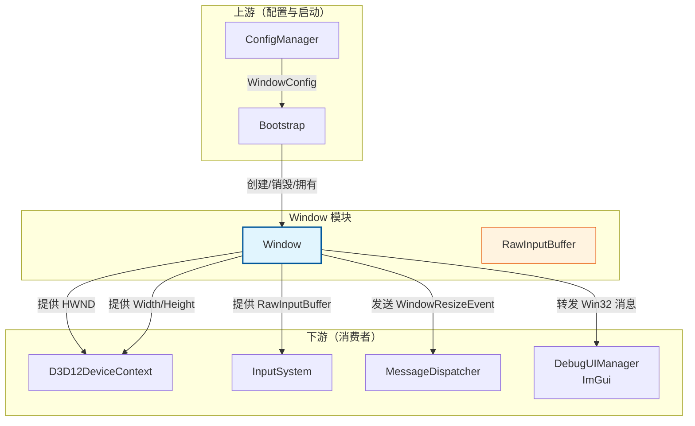
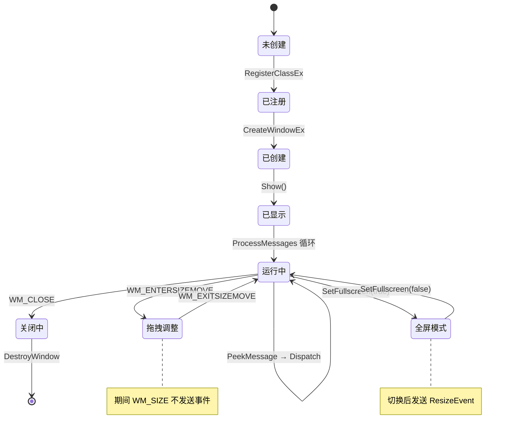
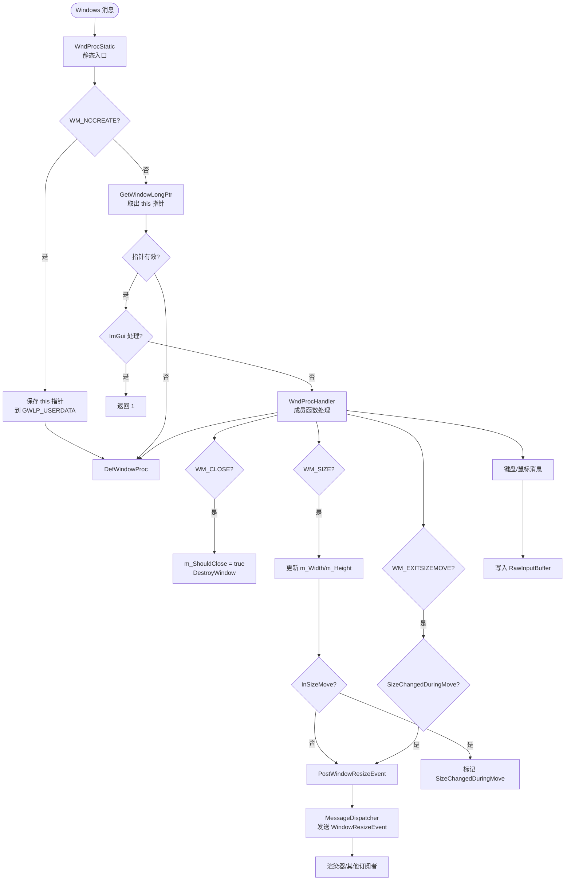
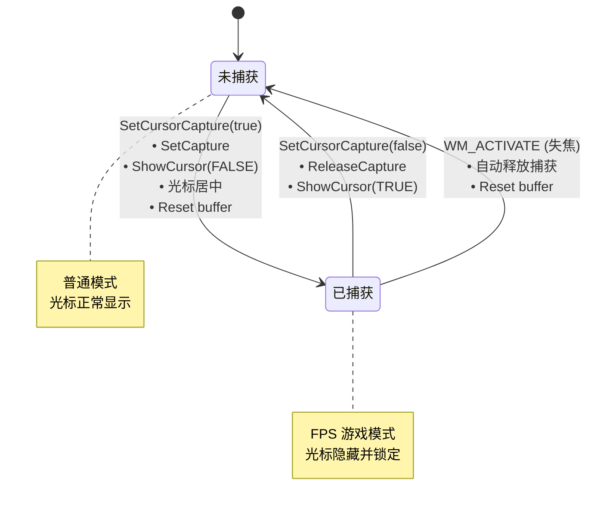

# Window (窗口类)

## 定位和职责

### 定位

- **上游依赖**：
  - 依赖 `Boot::WindowConfig` 获取窗口初始化参数（标题、宽高、是否可调整大小）
  - 配置参数来源于 `ConfigManager`

- **下游服务**：
  - 为 `D3D12DeviceContext`（渲染器）提供 `HWND` 句柄和窗口尺寸
  - 为 `InputSystem` 提供 `RawInputBuffer` 存储原始输入数据
  - 通过 `MessageDispatcher` 发送窗口事件（如 `WindowResizeEvent`）
  - 为 `DebugUIManager`（ImGui）提供 Win32 消息处理入口

### 职责

Window 类是**操作系统（Win32）**与**游戏引擎**之间的"适配器"。它是一个"系统句柄与事件的管理容器"。

| 职责领域 | ✅ 必须做 | ❌ 绝不涉及 |
|---------|---------|-----------|
| 生命周期 | 负责 `CreateWindow` 和 `DestroyWindow` | 不负责管理 DX12 设备或游戏逻辑的生命周期 |
| 消息处理 | 拦截 `WM_CLOSE`（退出）、`WM_SIZE`（尺寸变化）、键盘/鼠标原始输入 | 不负责复杂的 UI 交互（如按钮点击、菜单弹出），那是 GUI 库的事 |
| 数据提供 | 提供 `HWND`（给 DX12 用）、`Width/Height`（给渲染管线用）、`RawInputBuffer`（给输入系统） | 不负责存储渲染资源（如 Texture 或 Buffer）|
| 输入处理 | 收集原始按键/鼠标事件到 `RawInputBuffer`，支持光标捕获模式 | 不做复杂的输入映射（如"W键=前进"），这属于 `InputSystem` |
| 事件发送 | 窗口尺寸变化时通过 `MessageDispatcher` 发送 `WindowResizeEvent` | 不关心谁消费事件，只负责发送 |

---

## 架构设计

### 所有权与依赖关系



### 窗口生命周期



### 消息处理流程



### 时序图：窗口尺寸变化事件

```mermaid
sequenceDiagram
    participant User as 用户
    participant Win32 as Windows 系统
    participant Window as Window
    participant Dispatcher as MessageDispatcher
    participant D3D as D3D12DeviceContext
    
    rect rgb(240, 248, 255)
        Note over User,D3D: 场景1：拖拽窗口边缘调整大小
        User->>Win32: 拖拽窗口边缘
        Win32->>Window: WM_ENTERSIZEMOVE
        Window->>Window: m_InSizeMove = true
        
        loop 拖拽过程中
            Win32->>Window: WM_SIZE (多次)
            Window->>Window: 更新 m_Width/m_Height
            Window->>Window: 仅标记，不发送事件
        end
        
        User->>Win32: 释放鼠标
        Win32->>Window: WM_EXITSIZEMOVE
        Window->>Window: 检查 SizeChangedDuringMove
        Window->>Dispatcher: PostEvent(WindowResizeEvent)
        Dispatcher->>D3D: 触发 Resize 处理
    end

    rect rgb(255, 248, 240)
        Note over User,D3D: 场景2：全屏切换
        User->>Window: SetFullscreen(true)
        Window->>Window: 移除边框，铺满屏幕
        Window->>Dispatcher: PostEvent(WindowResizeEvent)
        Dispatcher->>D3D: 重建交换链
    end
```



### 光标捕获模式状态图



---

## 核心模块

### A. 窗口创建与生命周期

**入口**：`Bootstrap` 调用 `Create()` → `Show()`

```cpp
// 创建流程
bool Window::Create() {
    1. GetModuleHandle 获取实例句柄
    2. RegisterClassExW 注册窗口类（类名: L"DX12WindowClass"）
    3. 根据 m_IsFullscreen / m_IsResizable 计算窗口样式
    4. CreateWindowExW 创建窗口（传入 this 指针）
    5. 更新 m_Width / m_Height
}

// 销毁流程
~Window() {
    DestroyWindow(m_hWnd);
}
```

### B. 消息处理模块 (Message Proxy)

利用 `SetWindowLongPtr` / `GWLP_USERDATA` 将 `this` 指针绑定到 `HWND`，实现从静态回调路由到成员函数。

**消息路由**：
```
Windows 消息 → WndProcStatic (静态入口) → GetWindowLongPtr 取 this → WndProcHandler (成员函数)
```

**核心消息处理**：

| 消息 | 处理逻辑 |
|------|---------|
| `WM_NCCREATE` | 保存 this 指针到窗口用户数据 |
| `WM_CLOSE` | 设置 `m_ShouldClose = true`，销毁窗口 |
| `WM_DESTROY` | 调用 `PostQuitMessage(0)` |
| `WM_SIZE` | 更新 `m_Width/m_Height`，非拖拽模式下发送 ResizeEvent |
| `WM_ENTERSIZEMOVE` | 标记进入拖拽调整模式 |
| `WM_EXITSIZEMOVE` | 拖拽结束，若尺寸变化则发送 ResizeEvent |
| `WM_KEYDOWN/UP` | 写入 `RawInputBuffer` |
| `WM_MOUSEMOVE` | 写入 `RawInputBuffer` |
| `WM_MOUSEWHEEL` | 写入 `RawInputBuffer` |
| `WM_LBUTTON...` | 鼠标按键写入 `RawInputBuffer` |
| `WM_ACTIVATE` | 失焦时重置输入状态 |
| 其他 | 调用 `ImGui_ImplWin32_WndProcHandler`，若 ImGui 未处理则 `DefWindowProcW` |

### C. 消息轮询模块 (Polling)

游戏循环中每帧调用，使用 `PeekMessage` 而非 `GetMessage`（不阻塞）。

```cpp
void Window::ProcessMessages() {
    MSG msg;
    while (PeekMessage(&msg, nullptr, 0, 0, PM_REMOVE)) {
        TranslateMessage(&msg);
        DispatchMessage(&msg);
    }
}
```

### D. 光标捕获模块 (Cursor Capture)

用于 FPS 等需要隐藏光标并锁定在窗口中心的场景。

```cpp
void SetCursorCapture(bool capture);
```

- **capture = true**：`SetCapture` + `ShowCursor(FALSE)` + 光标居中 + 重置输入缓冲区
- **capture = false**：`ReleaseCapture` + `ShowCursor(TRUE)`
- 窗口失焦（`WM_ACTIVATE`）时自动释放捕获

### E. 全屏切换模块 (Fullscreen Toggle)

```cpp
void SetFullscreen(bool fullscreen);
```

- **进入全屏**：保存当前窗口矩形 → 移除边框（`WS_POPUP`）→ 设置为 `HWND_TOPMOST` → 铺满屏幕
- **退出全屏**：恢复边框（`WS_OVERLAPPEDWINDOW`）→ 恢复到保存的窗口位置和大小
- 切换完成后通过 `MessageDispatcher` 发送 `WindowResizeEvent`

### F. 窗口事件发送

通过 `MessageDispatcher` 解耦事件通知：

```cpp
void Window::PostWindowResizeEvent(uint32_t width, uint32_t height) {
    MessageDispatcher::GetInstance()->PostEvent(
        WindowResizeEvent::StaticTypeHash, 0, 
        width, height, EventPriority::P1_High
    );
}
```

**触发时机**：
1. `WM_SIZE` 且非拖拽模式（全屏切换、最大化等）
2. `WM_EXITSIZEMOVE` 且拖拽期间尺寸确实变化

---

## 公开接口

| 方法 | 用途 | 调用方 |
|------|------|--------|
| `Create()` | 创建 Win32 窗口 | Bootstrap |
| `Show()` | 显示窗口 | Bootstrap |
| `ProcessMessages()` | 每帧处理消息队列 | Bootstrap 主循环 |
| `ShouldClose()` | 检查是否应退出 | Bootstrap |
| `GetHandle()` | 获取 HWND | D3D12DeviceContext |
| `GetWidth()/GetHeight()` | 获取窗口尺寸 | D3D12DeviceContext, 渲染管线 |
| `GetRawInputBuffer()` | 获取原始输入缓冲区 | InputSystem |
| `SetCursorCapture()` | 设置光标捕获模式 | InputSystem / 游戏逻辑 |
| `SetFullscreen()` | 切换全屏模式 | 游戏设置 / 快捷键处理 |

---

## 数据结构

```cpp
class Window {
private:
    // Win32 句柄
    HWND m_hWnd;
    HINSTANCE m_hInstance;
    
    // 窗口状态
    std::wstring m_Title;
    uint32_t m_Width, m_Height;
    uint32_t m_InitWidth, m_InitHeight;
    bool m_IsResizable;
    bool m_ShouldClose;
    
    // 全屏相关
    bool m_IsFullscreen;
    RECT m_WindowedRect;
    
    // 拖拽大小相关（优化事件发送）
    bool m_InSizeMove;
    bool m_SizeChangedDuringMove;
    
    // 输入
    Input::RawInputBuffer m_rawInputBuffer;
    bool m_cursorCaptured;
};
```

