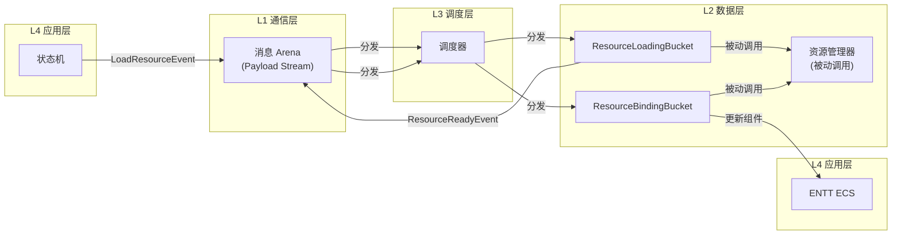
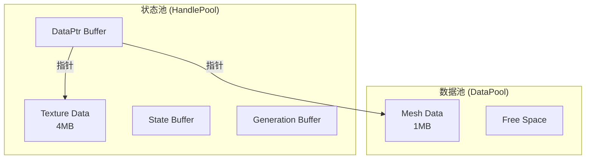
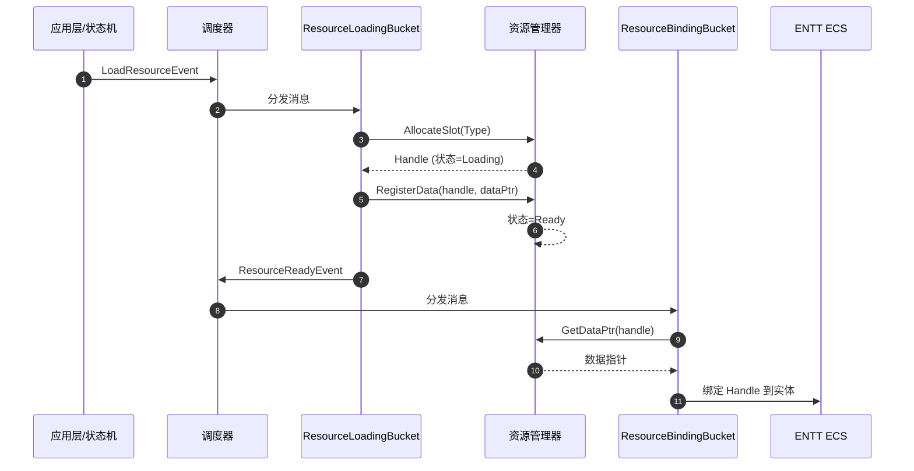

# 资源管理器（Resource Manager）

管理所有的重型资源的加载、缓存、卸载。

**与 ENTT 的关系**：ENTT 组件里存的是 Handle，渲染线程/逻辑线程拿着 Handle 去资源管理器里查真正的指针。

---

## 组件关系图



---

## 句柄设计

句柄的大小必须与消息系统 Arena 里的 32 位 Payload 指针大小一致。将 32 位拆分为三部分，实现"指针压缩"：

| 字段 | 位数 | 范围 | 说明 |
|:-----|:----:|:-----|:-----|
| Index | 18 bits | 0 ~ 262,143 | 池中索引（26万足够一帧活跃对象） |
| Generation | 10 bits | 0 ~ 1023 | 版本号，防止 ABA 错误 |
| Allocator ID | 4 bits | 0 ~ 15 | 分配器索引（指向 16 种策略） |

---

## 架构概览



---

## 被动调用模式

**核心原则**：资源管理器是被任务桶（TaskBucket）**被动调用** 的纯数据管理组件，不持有消息系统引用，不发送/接收消息。

| 层级 | 组件 | 职责 |
|:-----|:-----|:-----|
| L1 通信层 | MessageArena | 存储事件元数据（Type/Sender/Timestamp） |
| L2 数据层 | **任务桶中的 System** | 监听事件、执行逻辑、发送事件 |
| L3 调度层 | 调度器 | 分发消息到对应的任务桶 |
| L4 应用层 | 状态机 | 发出业务请求（如"加载资源A"） |

> ResourceManager **不参与消息流转**，仅是被 System 调用操作 HandlePool 和 DataPool 的工具类。

---

## 调用流程



| 阶段 | 主导方 | 资源管理器行为 |
|:-----|:-------|:---------------|
| 1. 申请 | 任务桶 | 分配空槽，生成 Index+Gen，状态=Loading |
| 2. 加载 | 任务桶 | IO 线程池根据优先级读取文件 |
| 3. 填坑 | IO 线程 | 数据塞入 DataPool（对齐、碎片整理） |
| 4. 就绪 | 调度器 | 等待消息系统唤醒 |
| 5. 使用 | 任务桶 | GetData() 返回指针（边界检查、缺页处理） |
| 6. 释放 | 任务桶 | 延迟 3 帧回收，防幽灵引用 |

---

## 内在策略

### 1. 内存策略

| 策略 | 说明 |
|:-----|:-----|
| **大块内存页** | 预分配 2MB Huge Pages，减少系统调用 |
| **对象池** | 维护 Free-List，避免碎片化 |
| **流式切片** | 大资源切为多个 Chunk，按需加载 |

### 2. IO 策略

| 策略 | 说明 |
|:-----|:-----|
| **Handle 状态机** | Index+Generation+State 追踪资源生命周期 |
| **原地/异步** | LoadSync 阻塞；LoadAsync 丢给 IO 线程池 |
| **流式优先级** | 根据摄像机位置动态调整加载优先级 |

### 3. 安全策略

| 策略 | 说明 |
|:-----|:-----|
| **延迟回收** | 释放后标记 3 帧后再真正释放 |
| **墓碑机制** | 延迟期内访问返回默认块，防止崩溃 |
| **引用计数** | 归零后标记 PendingRelease，下帧 IO 空闲时回收 |

---

## 线程安全

| 操作 | 策略 | 说明 |
|:-----|:-----|:-----|
| **写入** | 单线程 | 主线程或专用 IO 线程 |
| **读取** | 无锁并发 | 多线程只读，无数据竞争 |

---

## 初始化流程

### 1. 分配器路由表

从 Handle 中 4-bit Allocator ID 映射到具体内存池实例：

```
[0] → LinearPool ptr
[1] → BlockPool ptr
[2] → RingBuffer ptr
...
[15] → nullptr
```

- 初始化：所有槽位设为 `nullptr`
- 销毁：遍历表，删除所有非空指针

### 2. 池初始化

```cpp
void ResourceManager::InitPools(const std::vector<MemoryPoolDesc>& poolConfigs);
```

| 步骤 | 说明 |
|:-----|:-----|
| 1 | 循环读取 poolConfigs |
| 2 | 按顺序分配 ID (0, 1, 2...15) |
| 3 | 根据 descriptor.strategy 创建分配器 |
| 4 | 将指针存入路由表 |

### 3. 池描述符

```cpp
struct MemoryPoolDesc {
    std::string name;      // 调试名称
    Strategy     strategy; // Linear/Block/Ring
    union Config {
        size_t totalSize;   // Linear: 总字节数
        size_t blockSize;   // Block: 单块大小
        size_t ringSize;    // Ring: 环形缓冲区大小
    } config;
};
```

---

## 设计原则

> **核心理念**：ENTT 只存句柄，不存真实数据。让事件告诉系统该怎么做，而不是让系统去猜测。
