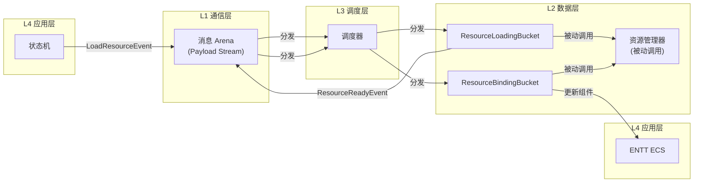
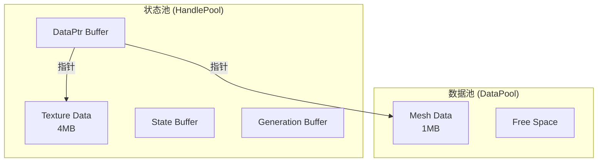
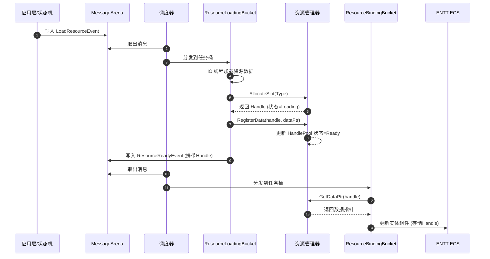

# 资源管理器（Resource Manager）

管理所有的重型资源的加载、缓存、卸载。数据范围包括 Mesh、Texture、Audio、Shader、甚至复杂的 Prefab 数据。

**与 ENTT 的关系**：ENTT 组件里存的是 Handle，渲染线程/逻辑线程拿着 Handle 去资源管理器里查真正的指针。

---

## 组件关系图



---

## 句柄设计

句柄的大小必须与消息系统 Arena 里的 32 位 Payload 指针大小一致。将 32 位拆分为两部分，实现"指针压缩"：

| 字段 | 位数 | 说明 |
|:-----|:-----|:-----|
| Index | 22 bits | 索引，支持最大 4M 个资源槽 |
| Generation | 10 bits | 版本号，防止幽灵引用（ABA 问题） |

## 架构示意



## 被动调用模式

**核心原则**：资源管理器是被任务桶（TaskBucket）**被动调用** 的纯数据管理组件，不持有消息系统引用，不发送/接收消息。

| 层级 | 组件 | 职责 |
|:-----|:-----|:-----|
| L1 通信层 | MessageArena | 存储事件元数据（Type/Sender/Timestamp） |
| L2 数据层 | **任务桶中的 System** | 监听事件、执行逻辑、发送事件 |
| L3 调度层 | 调度器 | 分发消息到对应的任务桶 |
| L4 应用层 | 状态机 | 发出业务请求（如"加载资源A"） |

**ResourceManager 不参与任何消息流转**，它只是一个被 System 调用来操作 HandlePool 和 DataPool 的工具类。

---

## 内在策略：内存、IO、安全的三层博弈

> **核心哲学**：资源管理器是"纯粹被动"的，但它绝不是"毫无策略"的。
>
> - **被动**：指它不主动发起任何跨模块的通信（不发消息、不调用回调）。
> - **有策略**：指它内部必须有一套**"内存与IO的博弈规则"**。

如果资源管理器真的"纯看任务桶怎么调用"，那它就退化成了一个简单的 `malloc + fread` 封装器，这在现代游戏引擎里是跑不起来的。

### 1. 内存策略：DataPool 的"土地改革"

任务桶只管要资源（`GetTexture("A")`），但**内存怎么布局**，必须由资源管理器说了算。

| 策略 | 说明 |
|:-----|:-----|
| **大块内存页 (Huge Pages)** | 资源管理器不能每次加载都去 `new` 一块小内存。它必须预分配巨大的内存页（比如 2MB 的 Huge Pages），减少系统调用开销 |
| **对象池 (Object Pool)** | 对于频繁创建销毁的小资源（如粒子数据），维护一个 Free-List，避免碎片化 |
| **流式切片 (Chunking)** | 当任务桶说"我要加载地图"，资源管理器内部把它切成了 100 个 Chunk，每次只返回第一个 Chunk 的指针 |

> **结论**：任务桶决定**"什么时候加载"**，资源管理器决定**"加载进来的数据放在内存的哪个坑里"**。

### 2. IO 策略：HandlePool 的"状态机"

任务桶不知道资源是"正在从磁盘读"，还是"已经在显存里"。这个 **"状态管理"** 是资源管理器的核心。

| 策略 | 说明 |
|:-----|:-----|
| **Handle 状态流转** | `HandlePool` 里维护 `Index + Generation + State`。调用 `LoadAsync` 时，状态立刻置为 `Loading` |
| **原地 vs 异步** | `LoadSync` 阻塞等待数据就绪；`LoadAsync` 把任务丢给 IO 线程池，状态保持 `Loading` |
| **流式优先级队列** | 资源管理器根据摄像机位置，动态调整哪些 Handle 应该优先从 `Loading` 变成 `Ready` |

> **结论**：任务桶决定 **"加载什么资源"**，资源管理器决定**"这个资源的状态流转逻辑"**。

### 3. 安全策略：幽灵引用的"防火墙"

这是最隐蔽的策略。任务桶可能会犯错（比如销毁了一个 Entity，但还有残留的指针在引用资源）。

| 策略 | 说明 |
|:-----|:-----|
| **延迟回收** | 当任务桶说"我不需要这个资源了"，资源管理器**不能立刻释放内存**，必须启动一个"延迟计时器"（比如 3 帧） |
| **墓碑机制** | 在延迟期内，如果有人还试图访问这个 Handle，资源管理器要能拦住它（返回默认白块/黑块），而不是让程序崩溃 |
| **引用计数追踪** | 当引用计数归零，标记为 `Pending Release`，等到下一帧 IO 空闲时才真正归还给操作系统 |

> **结论**：资源管理器是**"内存的守门人"**，防止一切幽灵引用和野指针。

### ATM 机哲学

资源管理器就像一个**ATM 机**：

```
┌─────────────────────────────────────────────────────────────┐
│  任务桶（用户）  ──插入 Handle（卡）──▶  资源管理器（ATM）    │
│                                                             │
│         ◀──返回数据指针（吐钱）───                              │
└─────────────────────────────────────────────────────────────┘

ATM 不会主动打电话给用户说"你有钱了"，是用户自己来查的。
```

---

## 被动调用流程



### 详细步骤

1. **应用层**：状态机发出 `LoadResourceEvent`
2. **调度器**：取出消息，分发给 `ResourceLoadingBucket`
3. **任务桶逻辑**：
   - IO 线程执行资源加载
   - 调用 `ResourceManager::AllocateSlot()` 获取 Handle
   - 调用 `ResourceManager::RegisterData()` 注册数据
4. **任务桶逻辑**：加载完成后，发出 `ResourceReadyEvent`（携带 Handle）
5. **调度器**：取出消息，分发给 `ResourceBindingBucket`
6. **任务桶逻辑**：
   - 查询 `ResourceManager::GetDataPtr()` 获取数据指针
   - 将 Handle 绑定到 ENTT 实体组件

---

## 线程安全策略

| 操作 | 策略 | 说明 |
|:-----|:-----|:-----|
| **写入** | 单线程 | 只在主线程或专用的 IO 线程进行 |
| **读取** | 无锁并发 | 多线程只读，无数据竞争 |

---

## 调用关系总结表

| 阶段 | 谁在主导 | 资源管理器在做什么 (内在策略) |
|:-----|:---------|:-----------------------------|
| **1. 申请** | 任务桶 (System) | 在 `HandlePool` 里找一个空槽，生成 `Index+Gen`，状态设为 `Loading`。**策略：防止句柄冲突** |
| **2. 加载** | 任务桶 (System) | 把文件路径丢给 IO 线程池，IO 线程池根据**优先级**决定先读哪个文件。**策略：IO 优先级调度** |
| **3. 填坑** | IO 线程 (内部) | IO 线程读完数据，资源管理器把数据塞进 `DataPool` 的预分配大块内存里。**策略：内存对齐、碎片整理** |
| **4. 就绪** | 调度器 (Scheduler) | **资源管理器什么都不做**。等待调度器通过消息系统唤醒任务桶 |
| **5. 使用** | 任务桶 (System) | 任务桶调用 `GetData(handle)`，资源管理器根据 `Index` 去 `DataPool` 里查指针。**策略：边界检查、缺页处理** |
| **6. 释放** | 任务桶 (System) | 收到释放指令，不立刻释放，而是放进 `ReleaseQueue`，标记 3 帧后回收。**策略：防幽灵引用** |

---

## 设计原则

> **核心理念**：ENTT 只存句柄，不存真实数据。让事件告诉系统该怎么做，而不是让系统去猜测。

