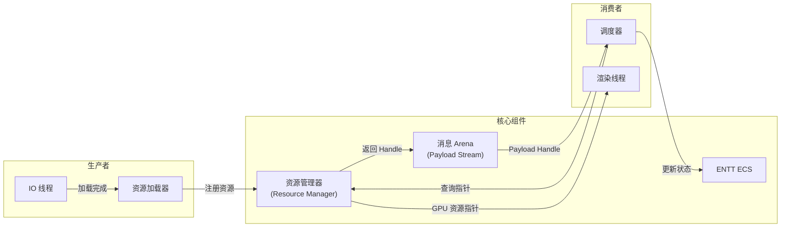
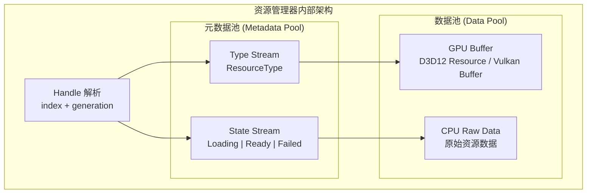
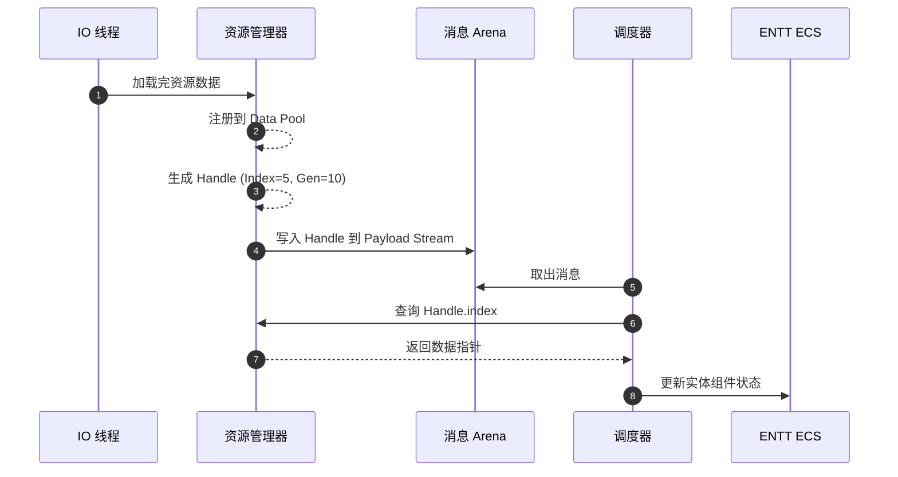

# 资源管理器（Resource Manager）

管理所有的重型资源的加载、缓存、卸载。数据范围包括 Mesh、Texture、Audio、Shader、甚至复杂的 Prefab 数据。

**与 ENTT 的关系**：ENTT 组件里存的是 Handle，渲染线程/逻辑线程拿着 Handle 去资源管理器里查真正的指针。

---

## 组件关系图



---

## 句柄设计

句柄的大小必须与消息系统 Arena 里的 32 位 Payload 指针大小一致。将 32 位拆分为两部分，实现"指针压缩"：

| 字段 | 位数 | 说明 |
|:-----|:-----|:-----|
| Index | 22 bits | 索引，支持最大 4M (4,194,304) 个资源槽 |
| Generation | 10 bits | 版本号，防止幽灵引用（防止 ABA 问题） |

```cpp
// 句柄结构
struct ResourceHandle {
    uint32_t index : 22;      // 资源索引
    uint32_t generation : 10; // 版本号
};
```

---

## 内部架构

为了配合 Arena 的无锁特性，资源管理器内部采用 SoA (Structure of Arrays) 或 Packed Array 结构：



### 核心组件

| 组件 | 功能 | 说明 |
|:-----|:-----|:-----|
| **元数据池** | Handle → Type, Handle → State | 类型和状态信息 |
| **数据池** | 实际数据指针 | GPU Buffer 或 CPU 端数据 |

---

## 线程安全策略

| 操作 | 策略 | 说明 |
|:-----|:-----|:-----|
| **写入** | 单线程 | 只在主线程或专用的 IO 线程进行 |
| **读取** | 无锁并发 | 多线程只读，无数据竞争 |

---

## 与 Arena 的协作流程



### 详细步骤

1. **生产者（IO 线程）**：加载完一个纹理
2. **注册**：资源管理器将纹理数据存入 Data Pool，返回一个新生成的 Handle
3. **入 Arena**：IO 线程将这个 Handle（32位整数）写入 Arena 的 Payload 流
4. **调度器（主线程）**：取出 Arena 中的消息，拿到 Handle
5. **查表**：调度器拿着 `Handle.index` 去资源管理器的数组里直接取数据指针
6. **更新 ENTT**：将指针更新到实体的组件中

---

## 设计原则

> **核心理念**：ENTT 只存句柄，不存真实数据。让事件告诉系统该怎么做，而不是让系统去猜测。
