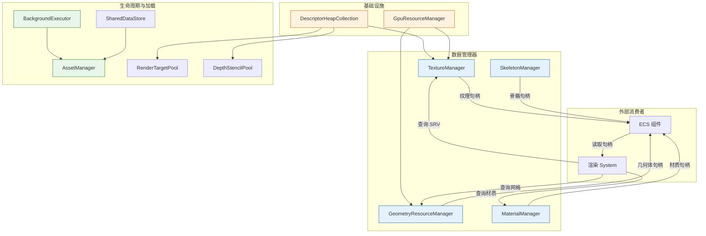

# 资源管理层架构

> 替代旧版 `ResourceManager.md`。当前引擎采用**多管理器协作模式**取代旧版单一 `ResourceManager` 设计。

## 1. 设计哲学

资源管理不再由一个中心化的 `ResourceManager` 大包大揽，而是拆分为多个**职责单一的管理器**，通过**协作模式**配合完成资源的全生命周期管理。

```
┌──────────────────────────────────────────────────────────────┐
│                    协作模式的核心原则                           │
│                                                              │
│  各管理器 → 只管理自己的槽位/索引/引用计数                      │
│  禁止直接调用 GpuResourceManager::Release                      │
│  GPU 资源释放 → 由 GpuResourceManager 统一管理（fence 回调）   │
│  资源管理器只需在 Release/Reclaim 中释放自己的槽位               │
└──────────────────────────────────────────────────────────────┘
```

---

## 2. 模块总览

资源管理层由以下模块组成，按职责分为三类：

### 2.1 基础设施

| 模块 | 职责 | 持有方式 |
|:-----|:-----|:---------|
| **DescriptorHeapCollection** | 描述符堆管理、分区分配、单堆/多堆模式 | Bootstrap 内联成员 |
| **GpuResourceManager** | GPU 资源全局分配、fence 回调释放、上传缓冲区管理 | 单例 |

### 2.2 数据管理器

| 模块 | 职责 | 持有方式 | 管理的数据 |
|:-----|:-----|:---------|:-----------|
| **TextureManager** | 纹理注册、SRV 管理、引用计数 | Bootstrap 内联成员 | 纹理 GPU 资源 + SRV 描述符 |
| **GeometryResourceManager** | 几何体注册、类型安全查询、引用计数 | Bootstrap 内联成员 | TriangleMesh / PatchMesh / GridGeometry |
| **MaterialManager** | 材质注册、GPU 数据同步、脏标记 | Bootstrap 内联成员 | 材质数据 + GPU 常量 |
| **SkeletonManager** | 骨骼数据注册、引用计数 | Bootstrap 内联成员 | 骨骼层次 + 绑定姿势 |

### 2.3 生命周期与加载

| 模块 | 职责 | 持有方式 |
|:-----|:-----|:---------|
| **AssetManager** | 统一异步加载入口、资产依赖解析 | 单例 |
| **BackgroundExecutor** | 后台任务队列、GPU 工作项提交 | Bootstrap 拥有（unique_ptr） |
| **SharedDataStore** | 跨线程数据中转站（原 AssetDataManager） | 单例 |
| **RenderTargetPool** | RT 池化管理、按需分配/回收 | 单例 |
| **DepthStencilPool** | DSV 池化管理、按需分配/回收 | 单例 |

---

## 3. 协作关系图



---

## 4. 数据流：从加载到渲染

### 4.1 异步加载链路

```
(1) 请求加载
    AssetManager.LoadBatch(sceneFile)
        ↓
(2) 依赖解析
    AssetManager 解析资产依赖关系（网格→材质→纹理）
    为每个资产创建 LoadTask（cpuWork + gpuWork + onComplete）
    有依赖的资产通过 SubmitGraph 表达依赖关系
        ↓
(3) 后台线程执行
    BackgroundExecutor 调度 TaskFlow 任务图
    cpuWork → 加载文件、解析数据、创建 GPU 资源
    gpuWork → 录制 COPY + DIRECT 命令列表
    cpuWork 完成后将跨线程数据存入 SharedDataStore
        ↓
(4) 主线程 Tick
    BackgroundExecutor.Tick() 收集就绪的 GpuWorkItem
    → 提交 COPY 队列 → Signal
    → 提交 DIRECT 队列（Wait COPY）→ Signal
    → 非阻塞检查完成
    → 释放上传缓冲区
    → 调用 onComplete 回调
        ↓
(5) 注册到管理器
    onComplete 回调中：
    → TextureManager.RegisterTexture(gpuHandle, srvIndex)     // 纹理
    → GeometryResourceManager.RegisterGeometry(mesh)          // 几何体
    → MaterialManager.RegisterMaterial(materialData)          // 材质
    → SkeletonManager.RegisterSkeleton(skeletonData)          // 骨骼
        ↓
(6) ECS 绑定
    场景构造 System 将资源句柄写入 ECS 组件
    → MeshComponent.lodMeshHandle = geometryHandle
    → MeshComponent.materialHandle = materialHandle
```

### 4.2 渲染时数据查询

```
渲染 System 执行时：
  → 遍历 ECS 视图，获取实体组件
  → 从 MeshComponent 取出几何体句柄 + 材质句柄
  → GeometryResourceManager.GetGeometry<TriangleMesh>(handle)  → 获取网格数据
  → MaterialManager.GetMaterial(handle)                          → 获取材质数据
  → TextureManager.GetSRV(handle)                                → 获取纹理 SRV GPU 句柄

  所有查询均为类型安全，句柄包含世代号（generation）防止悬挂引用
```

---

## 5. 引用计数与生命周期

所有数据管理器使用统一的引用计数模式：

```
Register (创建)
  → 引用计数 = 1
  → 返回句柄（内含索引 + 世代号）

Retain(handle)  → 引用计数 +1（ECS 组件拷贝时调用）
Release(handle, fenceValue)  → 引用计数 -1
  → 归零时加入待释放队列（不立即释放）

Reclaim(completedFence)
  → 遍历待释放队列，检查 fence 完成
  → 完成：释放槽位 → 归还 GPU 资源句柄到 GpuResourceManager
  → 未完成：保留，下一帧继续检查
```

**关键规则**：
- 资源管理器只管理自己的槽位，**不直接调用 GpuResourceManager::Release**
- GPU 资源释放由 GpuResourceManager 统一管理（通过 `GpuWorkItem::uploadBufferHandles` 或 `Update` 的 fence 回调）
- 句柄使用世代号（generation）检测悬挂引用

---

## 6. 协作模式详解

### 6.1 管理器与 GpuResourceManager 的协作

```
┌─────────────────┐         ┌──────────────────────┐
│  TextureManager  │         │  GpuResourceManager  │
│  管理纹理槽位     │  协作     │  管理 GPU 资源生命周期  │
│  引用计数         │ ──────→ │  fence 回调释放       │
│  Release 释放槽位  │         │  Update 完成释放      │
└─────────────────┘         └──────────────────────┘

禁止直接调用 GpuResourceManager::Release
资源管理器只需 Release/Reclaim 自己的槽位
```

### 6.2 管理器与 DescriptorHeapCollection 的协作

```
TextureManager 初始化时：
  → 从 DescriptorHeapCollection 分配 Texture 分区
  → RegisterTexture 时分配 SRV 槽位
  → Release 时归还 SRV 槽位

多堆模式下所有操作必须显式传递 HeapTag：
  Allocate(tag, partition)  ← 正确
  Allocate(partition)       ← 错误！使用默认 Default 堆
```

### 6.3 管理器与 AssetManager 的协作

```
AssetManager 是统一异步加载入口：
  → 接收加载请求
  → 解析依赖关系
  → 创建 LoadTask 提交到 BackgroundExecutor
  → 加载完成后调用各管理器的 Register 接口
  → 触发 ECS 组件绑定
```

---

## 7. 各模块详细文档

| 模块 | 文档 |
|:-----|:-----|
| DescriptorHeapCollection | [DescriptorHeapCollection.md](./DescriptorHeapCollection.md) |
| TextureManager | [TextureManager.md](./TextureManager.md) |
| GeometryResourceManager | [GeometryResourceManager.md](./GeometryResourceManager.md) |
| MaterialManager | [MaterialManager.md](./MaterialManager.md) |
| SkeletonManager | [SkeletonManager.md](./SkeletonManager.md) |
| AssetManager | [AssetManager.md](./AssetManager.md) |
| GpuResourceManager | [GpuResourceManager.md](./GpuResourceManager.md) |
| RenderTargetPool / DepthStencilPool | [ResourcePool.md](./ResourcePool.md) |

---

## 8. 设计原则总结

| 原则 | 说明 |
|:-----|:-----|
| **职责单一** | 每个管理器只管理一种资源类型，不越界 |
| **协作释放** | 管理器不直接释放 GPU 资源，通过 GpuResourceManager 统一管理 |
| **类型安全** | 每个资源类型有独立句柄，编译期类型检查 |
| **引用计数** | 统一的 Retain/Release/Reclaim 模式，延迟释放 |
| **世代号验证** | 句柄包含世代号，检测悬挂引用 |
| **异步加载** | 所有资源加载走 BackgroundExecutor，不阻塞主线程 |
| **配置化** | 管理器容量通过配置指定，支持运行时扩容 |