# 引擎核心架构总览

## 1. 设计哲学：装配层驱动的能力域

引擎以 **Bootstrap（装配层）** 为起点，将所有基础设施模块初始化为 **能力域（Capability Domain）**，并通过 **GameContext（能力容器）** 注入到各业务模块。

```
┌─────────────────────────────────────────────────────────────┐
│                     Bootstrap (装配层)                       │
│  初始化所有模块 → 填充到 GameContext → 注入 Game/Editor     │
└─────────────────────────────────────────────────────────────┘
                            │
                            ▼
┌─────────────────────────────────────────────────────────────┐
│                  GameContext (能力容器)                       │
│  持有所有能力域的访问指针，提供便捷访问方法                   │
└─────────────────────────────────────────────────────────────┘
                            │
              ┌─────────────┼──────────────┐
              ▼             ▼              ▼
        ┌──────────┐ ┌──────────┐ ┌──────────────┐
        │  Game    │ │  Editor  │ │  FrameDriver │
        └──────────┘ └──────────┘ └──────────────┘
```

**核心原则**：
- Bootstrap 拥有所有权（`unique_ptr`），Context 持有引用（裸指针）
- 所有能力域通过 Context 单一注入点获取，不依赖全局单例
- 初始化顺序严格遵循依赖关系，失败即快速失败

---

## 2. 能力域矩阵

引擎按职责划分为 **6 个能力域**，每个能力域由若干模块组成：

### 2.1 基础设施域

| 模块 | 能力 | 持有方式 | 依赖 |
|:---|:-----|:--------|:-----|
| ConfigManager | 配置加载、合并、热重载、持久化 | 单例 | 文件系统 |
| Logger | 多通道日志输出、异步 I/O、断言 | 单例 | ConfigManager |
| Window | Win32 窗口生命周期、消息处理、光标捕获 | Bootstrap 拥有 | ConfigManager |
| D3D12DeviceContext | D3D12 设备、交换链、命令队列、视口 | Bootstrap 拥有 | Window |
| GameTimer | 高精度计时、DeltaTime、帧率控制 | Bootstrap 拥有 | 无 |
| DebugUI | ImGui 调试覆盖层、性能监控 | 单例 | Window, D3D12DeviceContext |

### 2.2 调度与数据域

| 模块 | 能力 | 持有方式 | 依赖 |
|:---|:-----|:--------|:-----|
| FrameDriver | 帧循环驱动、System 调度、渲染阶段管理 | 基础设施创建 | Registry, D3D12DeviceContext |
| BackgroundExecutor | 异步任务队列、GPU 工作项提交、资源加载 | Bootstrap 拥有 | CommandManager |
| ECS::Registry | Entity-Component 管理、System 注册与执行 | Bootstrap 拥有 | 无 |
| MessageDispatcher | 事件发布/订阅、消息队列、优先级调度 | 单例 | 无 |
| SharedDataStore | 共享数据存储层、数据池 | 单例 | ConfigManager |

### 2.3 渲染域

| 模块 | 能力 | 持有方式 | 依赖 |
|:---|:-----|:--------|:-----|
| FrameResourceManager | 帧临时资源分配（RingBuffer）、PassCB | Bootstrap 成员 | D3D12DeviceContext |
| CameraManager | 摄像机管理、投影矩阵、视锥体 | 单例 | 无 |
| CullingSystem | 可见性剔除、视锥体裁剪 | Bootstrap 成员 | Registry |
| LODSystem | LOD 级别切换、距离计算 | Bootstrap 成员 | CameraManager, GeometryResourceManager |
| VisibleRaycaster | 可见集射线检测 | Bootstrap 成员 | Registry |
| ReflectionProbeManager | 反射探针捕获、Cubemap Array | Bootstrap 成员 | D3D12DeviceContext |
| AmbientOcclusionManager | SSAO 环境光遮蔽 | Bootstrap 成员 | D3D12DeviceContext |

### 2.4 资源域

| 模块 | 能力 | 持有方式 | 依赖 |
|:---|:-----|:--------|:-----|
| DescriptorHeapCollection | 描述符堆管理、分区分配、多堆模式 | Bootstrap 成员 | D3D12Device |
| TextureManager | 纹理 SRV 注册、引用计数、生命周期 | Bootstrap 成员 | DescriptorHeapCollection |
| GeometryResourceManager | 几何体数据注册、类型安全查询、引用计数 | Bootstrap 成员 | 无 |
| MaterialManager | 材质资产注册、GPU 数据同步、脏标记 | Bootstrap 成员 | 无 |
| SkeletonManager | 骨骼数据管理 | Bootstrap 成员 | 无 |
| AssetManager | 统一异步加载入口、资产依赖解析 | 单例 | BackgroundExecutor |
| GpuResourceManager | GPU 资源全局分配、fence 回调释放 | 单例 | D3D12DeviceContext |
| RenderTargetPool | RT 池化管理、按需分配/回收 | 单例 | DescriptorHeapCollection |
| DepthStencilPool | DSV 池化管理、按需分配/回收 | 单例 | DescriptorHeapCollection |

### 2.5 平台域

| 模块 | 能力 | 持有方式 | 依赖 |
|:---|:-----|:--------|:-----|
| InputManager | 输入映射、动作绑定、上下文栈 | 单例 | Window |
| Window | （见基础设施域） | — | — |

### 2.6 网络域

| 模块 | 能力 | 持有方式 | 依赖 |
|:---|:-----|:--------|:-----|
| NetworkTopology | P2P/CS 网络拓扑、消息序列化 | 单例 | MessageDispatcher |
| GameNetworkingSockets | Steam 网络传输层 | 全局初始化 | 无 |

---

## 3. 模块依赖关系图

```mermaid
graph TB
    subgraph "基础设施域"
        CM[ConfigManager]
        LOG[Logger]
        WIN[Window]
        D3D[D3D12DeviceContext]
        TIMER[GameTimer]
        DUI[DebugUI]
    end

    subgraph "调度与数据域"
        FD[FrameDriver]
        BE[BackgroundExecutor]
        REG[ECS::Registry]
        MD[MessageDispatcher]
        SDS[SharedDataStore]
    end

    subgraph "渲染域"
        FRM[FrameResourceManager]
        CAM[CameraManager]
        CS[CullingSystem]
        LS[LODSystem]
        VR[VisibleRaycaster]
        RPM[ReflectionProbeManager]
        AOM[AmbientOcclusionManager]
    end

    subgraph "资源域"
        DHC[DescriptorHeapCollection]
        TM[TextureManager]
        GRM[GeometryResourceManager]
        MM[MaterialManager]
        SM[SkeletonManager]
        AM[AssetManager]
        GRMGR[GpuResourceManager]
        RTP[RenderTargetPool]
        DSP[DepthStencilPool]
    end

    subgraph "平台域"
        IM[InputManager]
    end

    subgraph "网络域"
        NT[NetworkTopology]
        GNS[GameNetworkingSockets]
    end

    %% 依赖关系
    CM --> LOG
    WIN --> D3D
    D3D --> DHC
    D3D --> FRM
    D3D --> DUI
    D3D --> RPM
    D3D --> AOM
    
    DHC --> TM
    DHC --> RTP
    DHC --> DSP
    
    REG --> CS
    REG --> VR
    CAM --> LS
    GRM --> LS
    
    BE --> AM
    MD --> FD
    
    WIN --> IM
    TIMER --> FD

    style Bootstrap fill:#e8f5e9,stroke:#2e7d32,stroke-width:2px
    style GameContext fill:#fff3e0,stroke:#e65100,stroke-width:2px
```



---

## 4. 初始化顺序约束

```
(1) ConfigManager ──→ (2) Logger ──→ (3) Window
                                              │
                                              ▼
                                        (4) D3D12DeviceContext
                                              │
                                              ▼
                              ┌──────────────────────────────┐
                              │  DescriptorHeapCollection     │
                              │  GpuResourceManager           │
                              │  TextureManager               │
                              │  FrameResourceManager          │
                              │  GeometryResourceManager       │
                              │  MaterialManager               │
                              │  SkeletonManager               │
                              │  DepthStencilPool              │
                              │  RenderTargetPool              │
                              │  SharedDataStore               │
                              │  AssetLoader                   │
                              └──────────────────────────────┘
                                              │
                                              ▼
                              ┌──────────────────────────────┐
                              │  DebugUI                      │
                              │  MessageDispatcher            │
                              │  ECS::Registry                │
                              │  FrameDriver                  │
                              │  BackgroundExecutor           │
                              │  AssetManager                 │
                              │  GameNetworkingSockets        │
                              └──────────────────────────────┘
                                              │
                                              ▼
                                        CreateContext
                                              │
                                              ▼
                              ┌──────────────────────────────┐
                              │  CameraManager.Initialize    │
                              │  ReflectionProbeManager.Init │
                              │  AmbientOcclusionManager.Init│
                              │  VisibleRaycaster.Initialize │
                              │  FrameDriver.SetGameContext  │
                              │  DebugUI.SetGameContext      │
                              └──────────────────────────────┘
```

**关键约束**：
- 所有描述符堆分区必须在 FrameDriver 初始化前注册完毕
- BackgroundExecutor 必须在主循环前创建，主循环中每帧先调用 `BackgroundExecutor::Tick()` 再调用 `FrameDriver::Tick()`
- CameraManager 在 CreateContext 中初始化，因为需要窗口尺寸

---

## 5. 能力域访问方式

GameContext 中每种能力域的访问方式统一：

```
能力域 → GameContext 字段 → 模块实例
```

| 访问路径 | 能力域 |
|:---------|:-------|
| `ctx->Config` | 配置管理 |
| `ctx->Logging` | 日志 |
| `ctx->Window` | 窗口 |
| `ctx->DeviceContext` | D3D12 核心 |
| `ctx->MainTimer` | 计时 |
| `ctx->FrameDriver` | 帧调度 |
| `ctx->BackgroundExecutor` | 异步任务 |
| `ctx->Registry` | ECS |
| `ctx->Dispatcher` | 事件 |
| `ctx->CameraMgr` | 摄像机 |
| `ctx->FrameResourceManager` | 帧资源 |
| `ctx->DescriptorHeaps` | 描述符堆 |
| `ctx->TextureMgr` | 纹理 |
| `ctx->GeometryResourceManager` | 几何体 |
| `ctx->MaterialMgr` | 材质 |
| `ctx->SkeletonMgr` | 骨骼 |
| `ctx->InputMgr` | 输入 |
| `ctx->CullingSystem` | 剔除 |
| `ctx->LODSystem` | LOD |
| `ctx->VisibleRaycaster` | 射线检测 |
| `ctx->ReflectionProbeMgr` | 反射探针 |
| `ctx->AmbientOcclusionMgr` | 环境光遮蔽 |
| `ctx->DepthStencilPool` | 深度模板池 |
| `ctx->RenderTargetPool` | 渲染目标池 |

---

## 6. 设计原则与约束

| 原则 | 说明 |
|:----|:-----|
| **装配层驱动** | Bootstrap 是唯一初始化入口，其他模块不自行创建基础设施 |
| **能力域隔离** | 各能力域之间通过 GameContext 桥接，不直接依赖具体实现 |
| **对称初始化** | 初始化顺序与清理顺序相反 |
| **快速失败** | 任何模块初始化失败立即抛出异常，不继续执行 |
| **异步加载透明** | 资源加载通过 BackgroundExecutor 异步执行，Game 层无需关心线程模型 |
| **GPU 屏障对称** | 每个 System 在自己录制的命令列表中完成入口+出口屏障，禁止遗漏 |
| **描述符 Tag 显式传递** | 多堆模式下所有描述符操作必须显式传递 HeapTag |