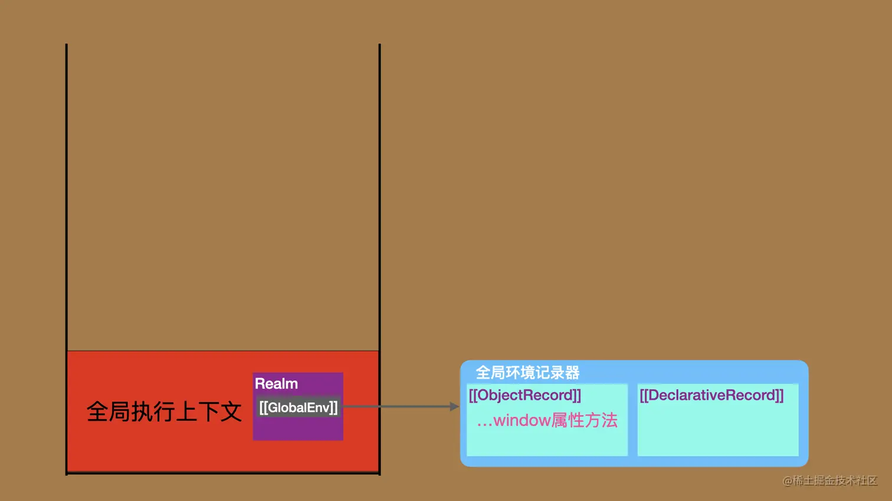
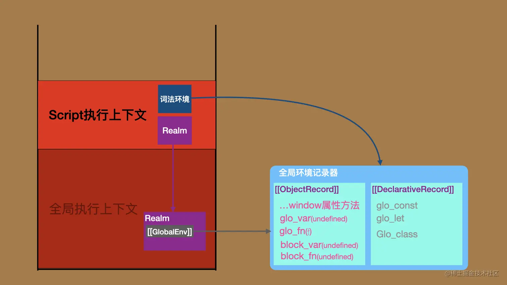

# **程序执行过程**
```js
// 全局代码
const glo_const = 1 

let glo_let = 2

var glo_var = 3

class Glo_class{}

function glo_fn(){ // ③
  // 位于函数体内声明语句
  let inner_fn_let = 4
  var inner_fn_var = 5
}

if(true){ // ④
  // 位于块内的声明语句
  let block_let = 6 // ⑤
  var block_var = 7 // ⑥
  function block_fn(){} // ⑦
}
```
## **初始化Realm环境：InitializeHostDefinedRealm**

[标准](https://ecma262.com/2024/#sec-initializehostdefinedrealm)

创建全局执行上下文、realm记录器。realm记录器包含全局对象、全局环境记录器、固有对象。

:::important 图示

:::

## **解析脚本**
[标准](https://ecma262.com/2024/#sec-parse-script)

每一段脚本执行前，需要先解析脚本，将其转换为解析树。返回一个脚本记录器。

## **脚本求值**
[标准](https://ecma262.com/2024/#sec-runtime-semantics-scriptevaluation)

1. 创建**ECMAScript代码执行上下文(scriptContext)** ，设置**scriptContext**的词法环境、变量环境指向全局环境记录器等。
2. 接着推送到执行上下文栈，使其成为运行中的执行上下文。
3. 然后进行**全局声明实例化**，最后对脚本语句求值。
:::important 全局声明实例化以后的调用栈。

:::

### **全局声明实例化**
声明实例化，不等于初始化，只有执行到对应的位置，才能知道确切的值。

[GlobalDeclarationInstantiation](https://ecma262.com/2024/#sec-globaldeclarationinstantiation)

1. 调用**LexicallyDeclaredNames** 、**VarDeclaredNames**语义收集标识符。
   1. 从结果来看**LexicallyDeclaredNames**只会收集let、const声明语句(只会处理Declaration)的标识符，会忽略所有的函数声明。
   2. **VarDeclaredNames**对语句递归的调用，收集可见var声明、函数声明的标识符。不会处理**函数和类中的**。
   3. 如果词法声明和变量声明的连接有重复项，则抛出 **SyntaxError** 异常。
2. 调用**VarScopedDeclarations**语义收集变量声明语句**varDeclarations**，调用**LexicallyScopedDeclarations** 语义收集词法声明语句 **lexDeclarations**。
3. 最后得到三个列表：**lexDeclarations、varDeclarations、functionsToInitialize**。根据标识符的类型进行绑定
   1. 对于**lexDeclarations**中的标识符，绑定到全局环境记录器的[[DeclarativeRecord]]字段上。
   2. 对于**functionsToInitialize**，实例化相应的函数对象，并绑定到全局环境记录器的[[ObjectRecord]]字段上((实际上是成为全局对象的属性))。
   3. 对于**varDeclarations**中的标识符，绑定到全局环境记录器的[[ObjectRecord]]字段上((实际上是成为全局对象的属性))。

:::important 关于严格模式
非严格模式函数标识符会被实例化并初始化为undefined，严格模式下函数不会被实例化。
:::

:::important 全局声明实例化以后的调用栈。

:::

