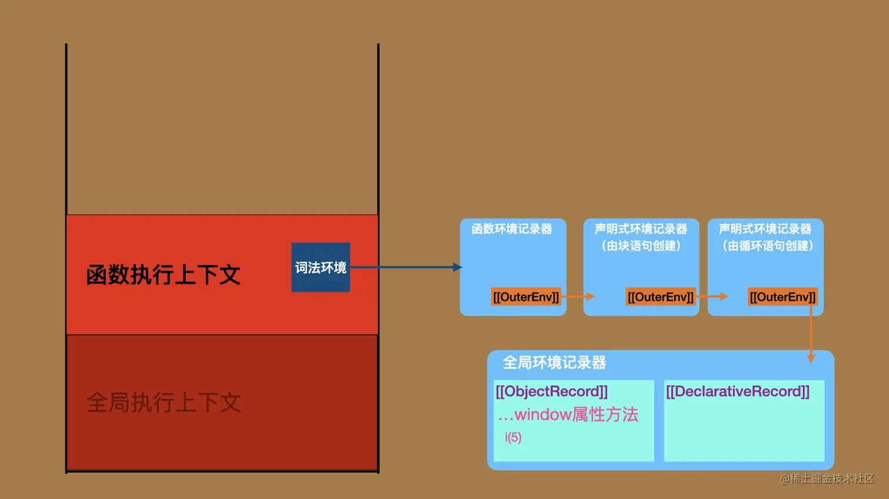
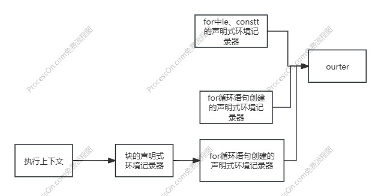
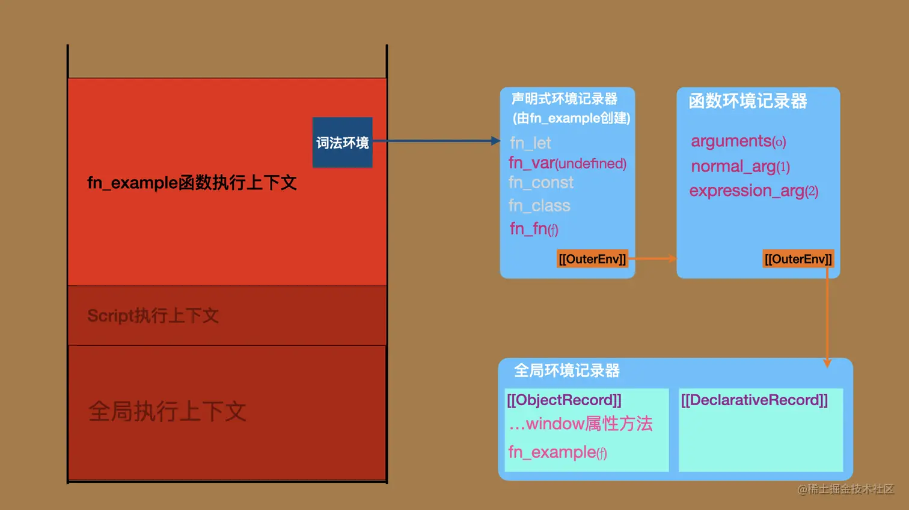
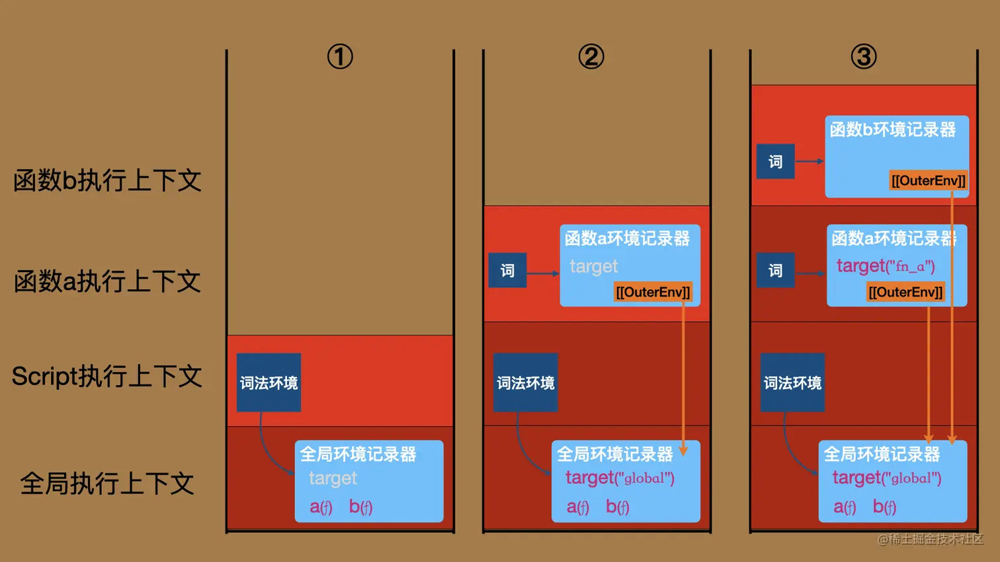

# **作用域分析**

标准使用 **环境记录器(Environment Record)** 来表示作用域。

每个环境记录器都有一个 **[[OuterEnv]]** 字段指向另一个环境记录器，通过该字段连接起来的所有的环境记录器共同构成一条作用域链。
::: important 作用域链例子
```js
for (var i = 1; i < 5; i++) {
    setTimeout(() => {
        console.log(i) 
    }, i * 1000)
}
```

:::
**ECMAscript执行上下文**的词法环境组件指向一个环境记录器，这就是执行上下文的代码查找变量的起点，也就是作用域链的起点。

调用栈上有几个**ECMAScript代码执行上下文**，运行环境中就有几条**作用域链**。

## **环境记录器**
环境记录器存放着标识符的绑定，标准中有五种环境记录器：
1. **全局环境记录器**：绑定全局顶层代码的标识符。
2. **声明式环境记录器**：常用于绑定块级语句内的标识符。
3. **函数环境记录器**：绑定函数体内的标识符。
4. **模块环境记录器**：绑定模块顶层代码的标识符。
5. **对象环境记录器**：把一个对象中的属性方法抽取出来作为标识符绑定在环境中，这是with语句和全局对象所使用的记录器。

### **声明式环境记录**

声明式环境记录绑定其范围内包含的声明所定义的**一组标识符**。
这些标识符可能是变量、常量、let、class、模块、import和/或函数声明

### **函数环境记录**

一种声明式环境记录，表示函数的顶级作用域，并且如果函数不是一个箭头函数，则提供一个 this绑定。

:::important 附加字段
|字段|值|说明|
|---|---|---|
|[[ThisValue]]|**ES语言值**|函数调用中使用的**this**值|
|[[ThisBindingStatus]]|**lexical**, **initialized**或 **uninitialized**|如果值是**lexical**，则这是一个箭头函数，并且没有本地的**this**值。|
|[[FunctionObject]]|**函数对象**|创建此环境记录的函数对象|
|[[NewTarget]]|**对象、undefined**|如果此环境记录是由[[Construct]]内部方法创建的， 则[[NewTarget]]是[[Construct]]的**newTarget**参数的值。 否则，其值为**undefined**。|
:::

### **模块环境记录**

一种声明式环境记录，用于表示 ECMAScript 模块 的外部作用域。

### **对象环境记录**

对象环境记录绑定**一组字符串标识符名称**，这些名称直接对应于其绑定**对象的属性名称**。
:::important 附加字段
|字段|值|说明|
|---|---|---|
|[[BindingObject]]|对象|环境记录绑定的对象|
|[[IsWithEnvironment]]|boolean|此环境记录是否为**with**语句创建|
:::

### **全局环境记录器**

全局环境记录用于表示所有在同一个realm中处理的**ECMAScript script**共享的最外层作用域。
:::important 附加字段
|字段|值|说明|
|---|---|---|
|[[ObjectRecord]]|对象环境记录|全局对象，包含内置绑定、全局代码中的函数声明、变量声明绑定，针对相关的Realm|
|[[GlobalThisValue]]|对象|全局作用域中this返回的值。宿主可以提供任何ECMAScript对象值。|
|[[DeclarativeRecord]]|声明式环境记录器|包含所有在相关领域代码中的全局代码声明的绑定，除了[[ObjectRecord]]中的绑定|
|[[VarNames]]|字符串列表|在相关领域代码的全局代码中，函数声明和变量声明的绑定名称。|
:::

## 作用域的分析

有的语句的求值过程中，需要创建**环境记录器**(并使他指向旧有的)，然后进行**声明实例化**，之后对每个子语句进行求值。
实例化的过程中，会收集自身区域的标识符并绑定到相应的环境记录器。
如果层层嵌套，很自然的就组成了一个作用域链。

在标准中可以找到六种**声明实例化操作**，都需要环境记录器。
- [GlobalDeclarationInstantiation](https://ecma262.com/2024/#sec-globaldeclarationinstantiation)：全局声明实例化。
- [FunctionDeclarationInstantiation](https://ecma262.com/2024/#sec-functiondeclarationinstantiation)：函数声明实例化。
- [BlockDeclarationInstantiation](https://ecma262.com/2024/#sec-blockdeclarationinstantiation)：块级声明实例化。
- [ForDeclarationBindingInstantiation](https://ecma262.com/2024/#sec-runtime-semantics-fordeclarationbindinginstantiation)：for声明实例化。
- [InitializeEnvironment]()：模块声明实例化。
- [EvalDeclarationInstantiation]()：eval函数声明实例化。

### **块级求值**

简述步骤：
1. 保存当前指向上下文的词法环境**oldEnv** ，创建新的声明式环境记录器**blockEnv**(blockEnv.[[OuterEnv]]=OldEnv)。
2. 执行**BlockDeclarationInstantiation**。
3. 设置当前上下文的词法环境为**blockEnv**。
4. 对块中语句挨个执行。
5. 当前上下文的词法环境恢复为**oldEnv**。

#### **BlockDeclarationInstantiation**
收集标识符，并完成环境记录器的绑定。
1. 调用**LexicallyScopedDeclarations**收集词法声明**declarations**。
2. 对**declarations**中的元素，进行相应的绑定。
   1. let、const做相应的可变、不可变的绑定。
   2. 实例化函数对象，初始化绑定。

### **for求值**
for循环在标准中分为，for和for-In、for-of、for-await-of。
::: important 标准中的调用链是这样的：
@startmindmap
caption 调用链

* LoopEvaluation
** ForInOfLoopEvaluation
*** ForIn/OfHeadEvaluation、ForIn/OfBodyEvaluation
**** NewDeclarativeEnvironment 
**** ForDeclarationBindingInstantiation
** ForLoopEvaluation
*** NewDeclarativeEnvironment、ForBodyEvaluation 
*** ForBodyEvaluation 
**** CreatePerIterationEnvironment 
***** NewDeclarativeEnvironment 
@endmindmap
:::
可以看出分歧为ForInOfLoopEvaluation(应用for-In、for-of、for-await-of)、ForLoopEvaluation(应用for)。

#### **for求值**
:::important ForLoopEvaluation语义应用的其中一个代换式
*ForStatement* : for ( *LexicalDeclaration* *Expression*~opt~ ; *Expression*~opt~ ) 
&emsp;&emsp;*Statement*

那他很有可能是这样的
for(let i;i<10;i++){}
:::
当在for中使用let、const时，有以下简述步骤：
1. 保存当前上下文的词法环境**oldEnv**，创建新的环境记录器**loopEnv**。
2. 对标识符进行对应的绑定，设置当前上下文的词法环境为**loopEnv**
4. 调用**ForBodyEvaluation**(，，，**perIterationLets**，)。
   1. 调用**CreatePerIterationEnvironment**语义，创建记录器，绑定标识符。
   2. 重复
      1. 如果**test**(条件)不为空，对其求值，当false，返回v
      2. 求值for块中的**语句**为result，**LoopContinues**为false(循环终止)，返回result。
      3. 将v值给予result，执行**CreatePerIterationEnvironment**，创建记录器，绑定标识符。
5. 恢复词法环境为**oldEnv**。
:::important
总来来说，为词法声明创建一次环境记录器，接着对for块不断创建环境(复制上一个记录器中的绑定和值，然后递增)记录器，直到条件达成或循环终止条件。
:::


<!-- #### **for-In、for-of、for-await-of**
三种都是同样的依次调用**ForIn/OfHeadEvaluation**、**ForIn/OfBodyEvaluation**。
ForIn/OfHeadEvaluation接受(let、const的标识符，参数表达式，标记enumerate，iterate，或 async-iterate)，
1. 保存当前上下文的词法环境oldenv
   1.如果标识符不为空，创建新环境记录器newenv，怪异的是无论let、const都是可变绑定。
   2.更改当前执行上下文为newenv
2. 对参数表达式求值，恢复执行上下文oldenv（==？？？==）。
3. 如果是标记是enumerate枚举
   1. 参数表达式为undefined、null
      1. 返回break完成记录，字段值都为空
   2. 将值转为一个对象obj，使用EnumerateObjectProperties 返回一个迭代器，获取他的neext方法
   3.  返回迭代器记录
4. 如果是async-iterate，更改迭代器种类
5. 返回GetIterator(参数表达式值，标记种类)
   1. 如果标记是异步，获取对象上的返回asyncIterator迭代器
      2. 如果获取不到，则获取默认迭代器
      3.  创建一个异步迭代器
6. 获取迭代器，从方法里面获取一个迭代器
最终返回枚举迭代器，break完成记录，异步、普通迭代器记录
ForIn/OfBodyEvaluation接受
**ForIn/OfBodyEvaluation**接受一个表达式，语句，迭代器，迭代器标记，表达式的类型标记（声明、变量、参数表达式）
1. 默认是同步标记,保存当前上下文的词法环境oldenv
2. 表达式是否是构造器，如果是。且是assignment
3.  -->
### 函数求值

函数被调用时会触发函数的内部方法[[Call]]方法。简述步骤:
1. 创建函数的执行上下文以及函数环境记录器，并把执行上下文的词法环境指向该记录器。
2. 对函数进行声明实例化。
3. 执行函数体中的语句。
实例化
1. 对参数标识符进行实例化
   2. 普通参数：如果函数调用的时候有赋值，则初始化为这个值，否则为undefined。
   3. 表达式参数：如果函数调用的时候有赋值，则初始化为这个值，否则为表达式中的默认值。
   此外，为了避免参数表达式的标识符与函数体变量声明的标识符发生“碰撞”，会在函数环境记录器上再创建一个声明式环境记录器，并把变量声明的标识符绑定在这个环境当中，从而实现两种类型标识符的隔离。
2. 创建arguments对象，以下情况不需要创建：
   1. 函数是箭头函数。
   2. 参数中有名为arguments的参数。
   3. 函数体内有名为arguments的函数或标识符为arguments的词法声明语句。
```js
// 全局代码
fn_example(1)
function fn_example(normal_arg, expression_arg = 2){
  console.log(arguments)
  let fn_let = 3;
  var fn_var = 4;
  const fn_const = 5
  class Fn_class{}
  function fn_fn(){}
}
```


关于函数的环境记录器的指向问题。
1. 函数定义处进行声明实例化的时候，会[OrdinaryFunctionCreate](https://ecma262.com/2024/#sec-ordinaryfunctioncreate)创建函数对象,并且 F.[[Environment]] 设置为 env。。
2. 当函数调用时，创建的函数环境记录器的outenv就会使用这个值。
```js
let target = "global"
a()

function a(){
    let target = "fn_a"
    b()
}
function b(){
   console.log(target) // "global"
}
```

### 闭包
