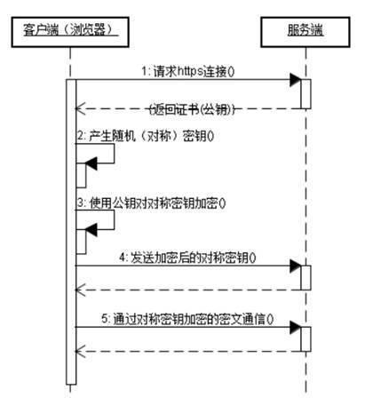

# HTTP和HTTPS

HTTP (HyperText Transfer Protocol)，即超文本运输协议，是实现网络通信的一种规范。即将数据由A传到B或将B传输到A，并且 A 与 B 之间能够存放很多第三方，如： A<=>X<=>Y<=>Z<=>B

传输的数据并不是计算机底层中的二进制包，而是完整的、有意义的数据，如HTML 文件, 图片文件, 查询结果等超文本，能够被上层应用识别

在实际应用中，HTTP常被用于在Web浏览器和网站服务器之间传递信息，以**明文方式**发送内容，不提供任何方式的数据加密

特点如下：
- 支持客户/服务器模式
- 简单快速：客户向服务器请求服务时，只需传送请求方法和路径。由于HTTP协议简单，使得HTTP服务器的程序规模小，因而通信速度很快
- 灵活：HTTP允许传输任意类型的数据对象。正在传输的类型由Content-Type加以标记
- 无连接：无连接的含义是限制每次连接只处理一个请求。服务器处理完客户的请求，并收到客户的应答后，即断开连接。采用这种方式可以节省传输时间
- 无状态：HTTP协议无法根据之前的状态进行本次的请求处理

## HTTPS
HTTPS出现是为了解决HTTP不安全的特性。
为了保证这些隐私数据能加密传输，让HTTP运行安全的SSL/TLS协议上，即 HTTPS = HTTP + SSL/TLS，通过 SSL证书来验证服务器的身份，并为浏览器和服务器之间的通信进行加密
SSL 协议位于 TCP/IP 协议与各种应用层协议之间，浏览器和服务器在使用 SSL 建立连接时需要选择一组恰当的加密算法来实现安全通信，为数据通讯提供安全支持

流程图如下所示：

- 首先客户端通过URL访问服务器建立SSL连接
- 服务端收到客户端请求后，会将网站支持的证书信息（证书中包含公钥）传送一份给客户端
- 客户端的服务器开始协商SSL连接的安全等级，也就是信息加密的等级
- 客户端的浏览器根据双方同意的安全等级，建立会话密钥，然后利用网站的公钥将会话密钥加密，并传送给网站
- 服务器利用自己的私钥解密出会话密钥
- 服务器利用会话密钥加密与客户端之间的通信

## 区别
- HTTPS是HTTP协议的安全版本，HTTP协议的数据传输是明文的，是不安全的，HTTPS使用了SSL/TLS协议进行了加密处理，相对更安全
- HTTP 和 HTTPS 使用连接方式不同，默认端口也不一样，HTTP是80，HTTPS是443
- HTTPS 由于需要设计加密以及多次握手，性能方面不如 HTTP
- HTTPS需要SSL，SSL 证书需要钱，功能越强大的证书费用越高

## HTTPS为何安全

HTTP安全隐患：
- 通信使用明文（不加密），内容可能被窃听
- 不验证通信方的身份，因此有可能遭遇伪装
而HTTPS的出现正是解决这些问题，HTTPS是建立在SSL之上，其安全性由SSL来保证

在采用SSL后，HTTP就拥有了HTTPS的加密、证书和完整性保护这些功能

### SSL实现

SSL 的实现这些功能主要依赖于以下手段：
- 对称加密：采用协商的密钥对数据加密
- 非对称加密：实现身份认证和密钥协商
- 摘要算法：验证信息的完整性
- 数字签名：身份验证

#### 对称加密
对称加密指的是加密和解密使用的秘钥都是同一个，是对称的。只要保证了密钥的安全，那整个通信过程就可以说具有了机密性

#### 非对称加密
非对称加密，存在两个秘钥，一个叫公钥，一个叫私钥。两个秘钥是不同的，公钥可以公开给任何人使用，私钥则需要保密

公钥和私钥都可以用来加密解密，但公钥加密后只能用私钥解
密，反过来，私钥加密后也只能用公钥解密

#### 混合加密
在HTTPS通信过程中，采用的是对称加密+非对称加密，也就是混合加密

在对称加密中讲到，如果能够保证了密钥的安全，那整个通信过程就可以说具有了机密性

而HTTPS采用非对称加密解决秘钥交换的问题

具体做法是发送密文的一方使用对方的公钥进行加密处理“对称的密钥”，然后对方用自己的私钥解密拿到“对称的密钥”

这样可以确保交换的密钥是安全的前提下，使用对称加密方式进行通信

#### 摘要算法
实现完整性的手段主要是摘要算法，也就是常说的散列函数、哈希函数

可以理解成一种特殊的压缩算法，它能够把任意长度的数据“压缩”成固定长度、而且独一无二的“摘要”字符串，就好像是给这段数据生成了一个数字“指纹”

摘要算法保证了“数字摘要”和原文是完全等价的。所以，我们只要在原文后附上它的摘要，就能够保证数据的完整性

#### 数字签名
数字签名能确定消息确实是由发送方签名并发出来的，因为别人假冒不了发送方的签名

原理其实很简单，就是用私钥加密，公钥解密

签名和公钥一样完全公开，任何人都可以获取。但这个签名只有用私钥对应的公钥才能解开，拿到摘要后，再比对原文验证完整性，就可以像签署文件一样证明消息确实是你发的

和消息本身一样，因为谁都可以发布公钥，我们还缺少防止黑客伪造公钥的手段，也就是说，怎么判断这个公钥就是你的公钥

这时候就需要一个第三方，就是证书验证机构

#### CA验证机构
数字证书认证机构处于客户端与服务器双方都可信赖的第三方机构的立场

CA 对公钥的签名认证要求包括序列号、用途、颁发者、有效时间等等，把这些打成一个包再签名，完整地证明公钥关联的各种信息，形成“数字证书”

流程如下：
- 服务器的运营人员向数字证书认证机构提出公开密钥的申请
- 数字证书认证机构在判明提出申请者的身份之后，会对已申请的公开密钥做数字签名
- 然后分配这个已签名的公开密钥，并将该公开密钥放入公钥证书后绑定在一起
- 服务器会将这份由数字证书认证机构颁发的数字证书发送给客户端，以进行非对称加密方式通信
- 接到证书的客户端可使用数字证书认证机构的公开密钥，对那张证书上的数字签名进行验证，一旦验证通过，则证明：

认证服务器的公开密钥的是真实有效的数字证书认证机构
服务器的公开密钥是值得信赖的

