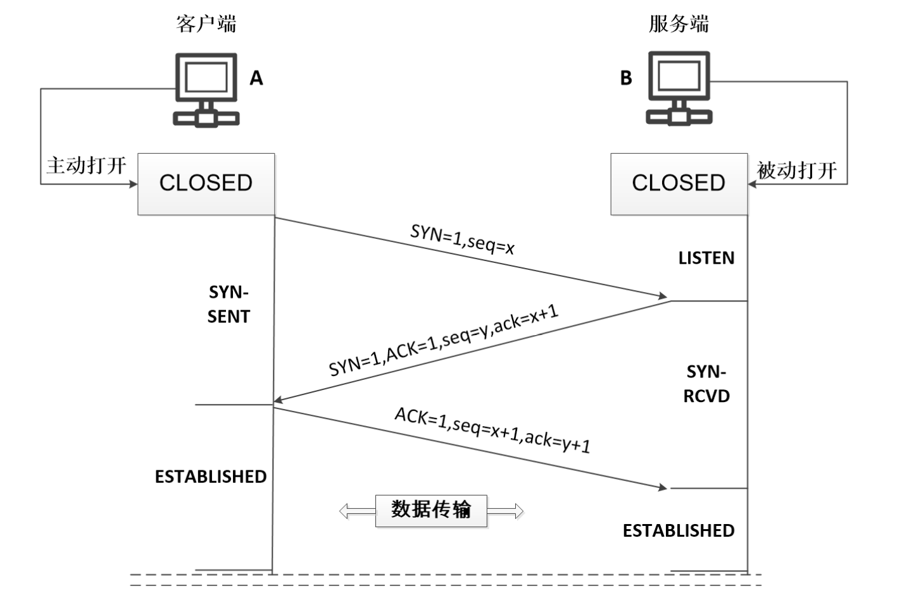
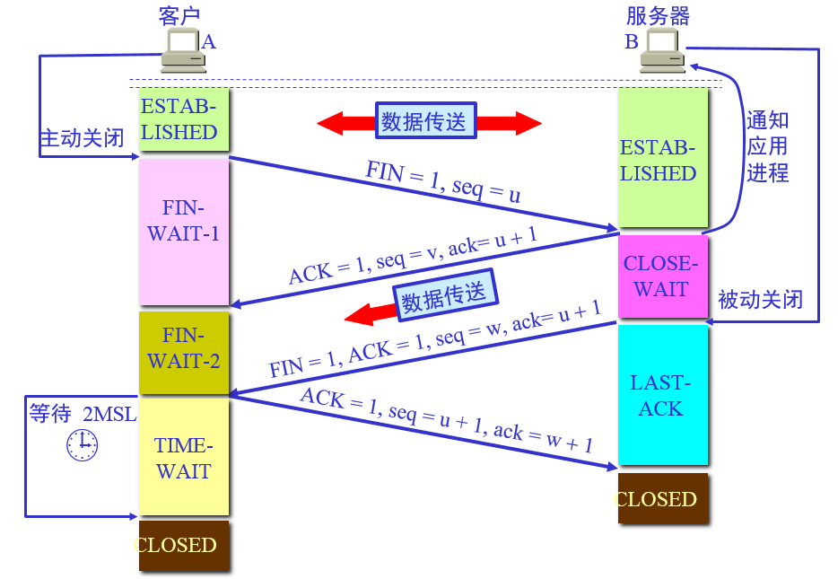

# TCP握手

三次握手（Three-way Handshake）其实就是指建立一个TCP连接时，需要客户端和服务器总共发送3个包

主要作用就是为了确认双方的接收能力和发送能力是否正常、指定自己的初始化序列号为后面的可靠性传送做准备

过程如下：
- 第一次握手：客户端给服务端发一个 SYN(同步序列号) 报文，并指明客户端的 ISN(初始化序列号 c )，此时客户端处于 SYN_SENT 状态
- 第二次握手：服务器收到客户端的 SYN 报文之后，会以自己的 SYN 报文作为应答，为了确认客户端的 SYN，将客户端的 ISN+1作为ACK(确认)的值(SYN-ACK)，此时服务器处于 SYN_RCVD 的状态
- 第三次握手：客户端收到 SYN 报文之后，会发送一个 ACK 报文，值为服务器的ISN+1。此时客户端处于 ESTABLISHED(已建立连接) 状态。服务器收到 ACK 报文之后，也处于 ESTABLISHED 状态，此时，双方已建立起了连接

上述每一次握手的作用如下：
- 第一次握手：客户端发送网络包，服务端收到了。
这样服务端就能得出结论：客户端的发送能力、服务端的接收能力是正常的。
- 第二次握手：服务端发包，客户端收到了。
这样客户端就能得出结论：服务端的接收、发送能力，客户端的接收、发送能力是正常的。
不过此时服务器并不能确认客户端的接收能力是否正常
- 第三次握手：客户端发包，服务端收到了。这样服务端就能得出结论：客户端的接收、发送能力正常，服务器自己的发送、接收能力也正常
通过三次握手，就能确定双方的接收和发送能力是正常的。之后就可以正常通信了

## 挥手
tcp终止一个连接，需要经过四次挥手

过程如下：
- 第一次挥手：客户端发送一个 FIN 报文，报文中会指定一个序列号。此时客户端处于 FIN_WAIT1 状态，停止发送数据，等待服务端的确认
- 第二次挥手：服务端收到 FIN 之后，会发送 ACK 报文，且把客户端的序列号值 +1 作为 ACK 报文的序列号值，表明已经收到客户端的报文了，此时服务端处于 CLOSE_WAIT状态
- 第三次挥手：如果服务端也想断开连接了，和客户端的第一次挥手一样，发给 FIN 报文，且指定一个序列号。此时服务端处于 LAST_ACK 的状态
- 第四次挥手：客户端收到 FIN 之后，一样发送一个 ACK 报文作为应答，且把服务端的序列号值 +1 作为自己 ACK 报文的序列号值，此时客户端处于 TIME_WAIT状态。需要过一阵子以确保服务端收到自己的 ACK 报文之后才会进入 CLOSED 状态，服务端收到 ACK 报文之后，就处于关闭连接了，处于 CLOSED 状态

服务端在收到客户端断开连接Fin报文后，并不会立即关闭连接，而是先发送一个ACK包先告诉客户端收到关闭连接的请求，只有当服务器的所有报文发送完毕之后，才发送FIN报文断开连接，因此需要四次挥手

