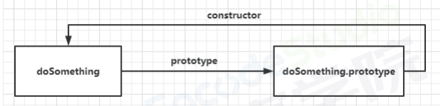
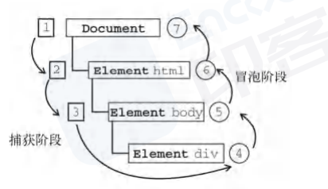
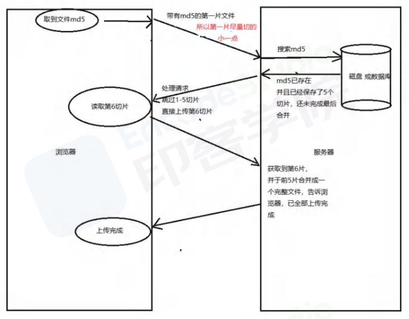
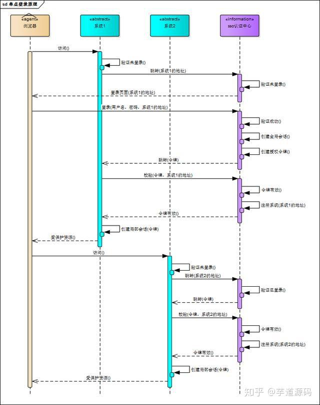
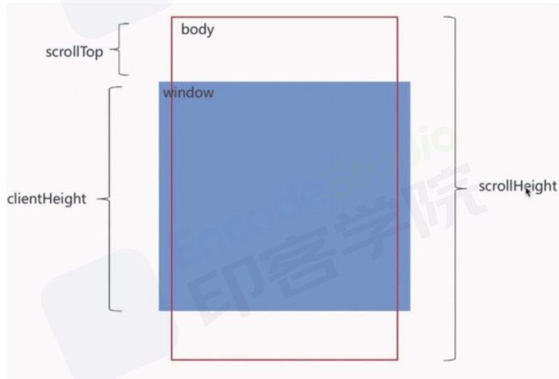
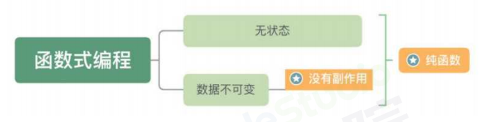
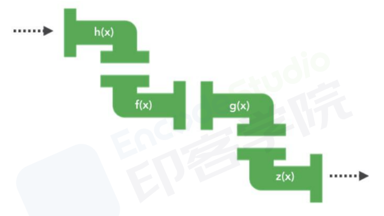
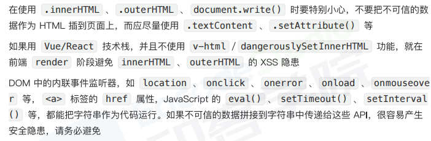

<Catalog />

# JavaScript

## 对象的原型、原型链
每一个对象都是被构造函数new出来的，函数也是对象。
当试图访问一个对象的属性时，不仅仅在该对象上搜寻，还会搜寻该对象的原型，以及原型的原型，直至找到属性或到达原型链的末尾
这些方法和属性要定义在Object的构造器函数之上的prototype属性上，而非示例对象本身

原型对象有一个自有属性constructor，这个属性指向该函数
1. 原型prototype属性
指向对象的构造器函数
2. 隐式原型_proto_属性
指向构造器函数的原型

### 原型链
原型对象也可能有原型，并从中继承方法和属性。
_proto_属性构建了对象的原型链


## this
在严格模式和非严格模式下，this的行为有一定区别
1. this所在的作用域类型
2. 函数的类型
3. 函数是否处于严格模式
4. 函数的调用方式

### this表达式的求值
1. 从作用域链上寻找第一个有绑定this值的环境记录器，然后获取该环境记录器上的this值
|作用域类型|this指向|
|---|---|
|全局|全局对象|
|模块|undefined|
|块级|无|
|with|无|
|函数|返回[[ThisValue]]字段的值|
2. 函数作用域的this解析
|调用方法|this指向|方法|
|---|---|---|
|显示绑定|严格模式：this参数的值，非严格模式：this参数转化为对象|apply、bind、Array.prototype.map等可显式绑定this值的API|
|对象方法|对象自身|call|
|new构造器|以prototype属性为原型创建的对象|new|
|普通调用|严格模式：undefined，非严格模式：globalThis|call|
注意
```js
// 需要注意的是：以下的情况是普通调用，而不是作为方法调用：
const trick = obj.ordinaryMethod
trick() // global
```

```js
const object = {
  who: 'World',

  greet() {
    return `Hello, ${this.who}!`; 
  },

  farewell: () => {
    return `Goodbye, ${this.who}!`;
  }
};

console.log(object.greet());    
console.log(object.farewell()); 
// farewell，this在函数作用域，外层是全局作用域
```

```js
var length = 4;
function callback() {
  console.log(this.length); 
}

const object = {
  length: 5,
  method(callback) {
    // 普通调用，指向undefined，转化为全局对象
    callback();
  }
};

object.method(callback, 1, 2);
```

```js
var length = 4;
function callback() {
  console.log(this.length); 
}

const object = {
  length: 5,
  method() {
    // 参数对象arguments
    //相当于arguments.callback()
    // 对象方法调用，this指向argument
    arguments[0]();
  }
};

object.method(callback, 1, 2);
```

## 显示绑定：bind、call、apply的区别
call、bind、apply作用是改变函数执行时的上下文
1. apply：this指向、参数数组
2. call：this指向，参数列表
3. bind：this指向，参数列表，永久改变this指向，不会立即执行
返回一个this指向改变的函数


### 实现
```js
Function.prototype.myBind = function (context) {
    if (typeof this !== "function") {
        throw new TypeError("Error");
    }
    const args = [...arguments].slice(1),
    // 取决于调用方式
    fn = this;
    // 
    return function Fn() {
        return fn.apply(this instanceof Fn ? new fn(...arguments) : context, args.concat(...arguments));
    }
}
```

## 事件模型
用于DOM是一个树结构，如果在父子节点绑定事件的时候，当触发子节点，就会存在一个顺序问题，也就是事件流。
事件流都会经历三个阶段：
1. 事件捕获阶段：事件向下捕获依次触发
2. 处于目标阶段
3. 事件冒泡阶段：将事件向上传递依次触发

事件模型有三种：
1. 原始事件模型(DOM0级)
具备很好的跨浏览器优势，最快的绑定速度，只支持冒泡
```js
var btn = document.getElementById('.btn');
btn.onclick = fun2;
```
2. 标准事件模型(DOM2级)
事件有三个阶段：捕获阶段、处理阶段、冒泡阶段
useCapture用于指定是否在捕获阶段处理
```js
addEventListener(eventType, handler, useCapture)
removeEventListener(eventType, handler, useCapture)
```
3. IE事件模型(不使用)
有两个阶段：事件处理、事件冒泡
```js
attachEvent(eventType, handler)
```

## 类型转换
parseInt()函数逐个解析字符，遇到不能转换的字符就停下来


## 浅拷贝、深拷贝

### 浅拷贝
创建新的数据，拷贝一层。拷贝基本类型的值，引用类型的内存地址。
1. Obejct.assign
2. Array.prototype.slice()
3. Array.prototype.concat()
4. 使用...扩展运算符实现的复制

### 深拷贝
开辟一个新的栈，对象属性完全相同，但是地址不同
1. lodash的_.cloneDeep()
2. jQuery.extend()
3. JSON.stringify()
忽略undefined、symbol、函数
4. 手写递归实现
```js
function deepClone(obj,hash=new WeakMap()){
    if(obj==null) return obj;
    if(obj instanceof Date) return new Date(obj);
    if(obj instanceof RegExp) return new RegExp(obj);
    if(typeof obj !== 'Object') return obj;
    if(hash.get(obj)) return hash.get(obj);
    // 空对象
    let cloneObj=new obj.constructor();
    // 暂存
    hash.set(obj,cloneObj);
    // 
    for(let key in obj){
        if(obj.hasOwnProperty(key)){
            // 递归
            cloneObj[key]=deepClone(obj[key],hash)
        }
    }
    return cloneObj;
}

```


## 函数缓存
将函数的运算结果进行缓存，将参数和对应结果存在一个对象中，判断参数对应的数据是否存在，如果存在则返回对应的结果数据。
```js
const memoize = function(func,content){
    let cache=Object.create(null);
    content=content || this;
    return (...key)=>{
        if(!cache[key]){
            cache[key]=func.apply(content,key)
        }
        return cache[key]
    }
}
```

### 场景
1. 复杂计算的函数
2. 有限且输入高度重复的函数
3. 重复输入值的递归函数
4. 纯函数

## 本地存储方式
1. cookie
不超过4kb，每次请求中都会被发送
```js
document.cookie='name=value'
```
2. sessionStorage
与localStorage基本一致，但页面关闭，sessionStorage将会删除数据。
3. localStorage
持久化本地存储、信息同域共享、受同源策略影响、当本页操作localStorage，其他页面会触发storage事件
缺点：无法设置过期时间、只能存入字符串(使用JSON转换)
4. indexedDB 
用于客户端存储大量结构化数据(包括文件、blobs)
存储量理论上没有上限、操作异步、支持存储JS对象、数据库
缺点：操作繁琐、高门槛


## 大文件断点续传、分片上传

### 分片上传
将所要上传的文件，按照一定的大小，将整个文件分隔成多个数据块来进行分片上传
流程：
1. 分割数据块
2. 初始化一个分片上传任务，返回本次分片上传唯一标识
3. 按照策略(串行、并行)发生各个分片数据块
4. 上传完成后，服务端根据数据上传是否完整，合并数据块得到原始文件。

### 断点续传
将下载、上传任务划分为几个部分，每个部分使用一个线程进行上传、下载
实现方式：
1. 服务器端返回，告知从哪开始
2. 浏览器端自行处理
上传过程中将文件在服务器端写为临时文件，等全部完成后，重命名为正式文件即可。
如果中途上传中断过，下次上传的时候根据当前临时文件大小，作为在客户端读取文件的偏移量，从此位置继续读取文件数据块，上传到服务器从此偏移量继续写入文件即可。



## 元素是否在可视区域中
1. 图片懒加载
2. 列表无限滚动
3. 计算广告元素的曝光情况
4. 可点击链接的预加载

### 实现
1. offsetTop顶部距离、scrollTop滚动条距离
```js
function isInViewPortOfOne(el){
    const viewPortHeight=window.innerHeight||document.documentElement.clientHeight||document.body.clientHeight;
    const offsetTop=el.offsetTop;
    const scrollTop=document.documentElement.scrollTop;
    const top=offsetTop - scrollTop;
    return top <= viewPortHeight;
}
```
2. getBoundingClientRect
返回值是一个DOMRect对象，拥有left、top、right、bottom、x、y、width、height属性，基本上是相对视口的属性。
```js
function isInViewPort(element) {
    const viewWidth = window.innerWidth || document.documentElement.clientWidth;
    const viewHeight = window.innerHeight || document.documentElement.clientHeight;
    const {top,right,bottom,left,} = element.getBoundingClientRect();
    return (
        top >= 0 &&left >= 0 &&right <= viewWidth &&bottom <= viewHeight
 );
}
```
3. intersection Observer
判断两个元素是否重叠的api
创建观察者
```js
const options={
    // 1表示被完全包含
    threshold：1.0,
    // 必须是目标元素的父级元素
    root:document.querySelector('#scrollArea')
}

const callback=(entries,observer)=>{
    entries.forEach(entry=>{
        // 触发时间
        entry.time
        // 根元素位置矩形
        entry.rootBounds
        // 被观察者的位置矩形
        entry.boundingClientRect
        // 重叠区域的位置矩形
        entry.intersectionRect
        // 重叠区域占被观察者面积的比例
        entry.intersectionRatio
        // 被观察者
        entry.target 
    })
}

const oberver=new IntersectionObserver(callback,options)
```
传入被观察者
```js
const target=document.querySelector('.target')
observer.observer(target)
```

## 单点登录
单点登录(SSO),在多个应用系统中，用户只需要登陆一次就可以访问所有相互信任的应用系统
SSO一般需要一个独立的认证中心，子系统的登录均通过passport，子系统本身不参与登录操作
当一个系统成功登录以后，passport将会颁发一个令牌给各个子系统，子系统可以拿着令牌获取各自受保护的资源，为了减少频繁认证，各个子系统在被passport授权以后，会建立一个局部会话，在一段时间内无需再次向passport发起认证。

### 实现
1. 同域名下的单点登录
cookie的domain属性设置为当前域的父域，并且父域的cookie会被子域所共享。path属性默认为web应用的上下文路径。
将SessionID(或token)保存到父域中，这样所有的子域应用都可以访问到这个cookie。
2. 不同域名下的单点登录，使用cookie
部署一个认证中心，专门处理登录请求的独立web服务。
用户统一在认证中心登录，登陆成功后，认证中心记录用户的登陆状态，将token写入cookie(应用系统无法访问)。
应用系统检查当前请求有没有token，如果没有，说明用户在当前系统中尚未登录，那么就将页面跳转至认证中心。
这个操作会把认证中心的cookie自动带过去，因此认证中心能够根据cookie知道用户是否已经登陆过了。
用户登陆过了用户，跳转回目标URL，并在跳转前生成一个token，拼接在目标URL的后面，回转给目标应用系统。
应用系统拿到token之后，还需要向认证中心确认token的合法性，防止用户伪造。确认无误后，记录用户的登陆状态，并将token写入cookie(当前应用系统的cookie)
3. 使用localStorage
将SessionID(或Token)保存到浏览器的localStorage中，让前端在每次向后端发送请求时，主动将localStorage的数据传递给服务端。
```js
// token
var token = result.data.token;
// 
var iframe = document.createElement("iframe");
iframe.src = "http://app1.com/localstorage.html";
document.body.append(iframe);
// 
setTimeout(function () {
    iframe.contentWindow.postMessage(token, "http://app1.com");
}, 4000);
setTimeout(function () {
    iframe.remove();
}, 6000);
//
window.addEventListener('message', function (event) {
 localStorage.setItem('token', event.data)
}, false);
```
通过iframe+postMessage()方式，将同一份token写入到了多个域下的localStorage中。

### 流程



## 下拉刷新和上拉加载

### 上拉加载
页面触底或快要触底的操作

1. scrollTop：滚动视窗的高度距离window顶部的距离
2. clientHeight：表示可视区域的高度，固定值
3. scrollHeight：表示body的所有元素的总长度
```js
scrollTop + clientHeight >= scrollHeight
```
### 下拉刷新
页面置于顶部时，用户下拉刷新需要触发的动作
1. 监听原生touchstart事件，记录其初始位置的值，e.touches[0].pageY
```js
var _element = document.getElementById('refreshContainer'),
    _refreshText = document.querySelector('.refreshText'),
    _startPos = 0,  
    _transitionHeight = 0;  
_element.addEventListener('touchstart', function(e) {
    _startPos = e.touches[0].pageY;  
    _element.style.position = 'relative';
    _element.style.transition = 'transform 0s';
}, false);
```
2. 监听原生touchmove事件，记录并计算当前滑动的位置与初始位置的差值，大于0为向下滑动，并借助CSS3的translateY属性使元素跟随手势向下滑动对应的差值，同时也应设置一个允许滑动的最大值
```js
_element.addEventListener('touchmove', function(e) { 
    _transitionHeight = e.touches[0].pageY - _startPos;
    if (_transitionHeight > 0 && _transitionHeight < 60) {
        _refreshText.innerText = '下拉刷新';
        _element.style.transform = 'translateY('+_transitionHeight+'px)';
        if (_transitionHeight > 55) {
            _refreshText.innerText = '释放更新';
        }
    } 
}, false);
```
3. 监听原生touched事件，若此时元素滑动达到最大值，则触发callback，同时将translateY重设为0，元素回到初始位置
```js
_element.addEventListener('touchend', function(e) {
    _element.style.transition = 'transform 0.5s ease 1s';
    _element.style.transform = 'translateY(0px)';
    _refreshText.innerText = ' ...';
    // todo...
}, false);
```

### 第三方库
```js
import BScroll from "@better-scroll/core";
import PullDown from "@better-scroll/pull-down";
import PullUp from '@better-scroll/pull-up';
BScroll.use(PullDown);
BScroll.use(PullUp);

let pageNo = 1,pageSize = 10,dataList = [],isMore = true; 
var scroll= new BScroll("#position-wrapper",{
    scrollY:true,   //默认垂直方向
    click:true,     //true不阻止浏览器原生的click事件
    pullUpLoad:true,    //上拉加载更多
    pullDownRefresh:{
        threshold:50,   // 触发pullingDown事件的位置
        stop:0          //下拉回弹后停留的位置
 }
});

//监听下拉刷新
scroll.on("pullingDown",pullingDownHandler);

//监测实时滚动
scroll.on("scroll",scrollHandler);

//上拉加载更多
scroll.on("pullingUp",pullingUpHandler);

async function pullingDownHandler(){
    dataList=[];
    pageNo=1;
    isMore=true;
    $(".more").text(" ");
    await getlist();
    scroll.finishPullDown();
    scroll.refresh();
}

async function pullingUpHandler(){
    if(!isMore){
        $(".more").text("没有更多数据了");
        scroll.finishPullUp();
        return;
    }
    pageNo++;
    await this.getlist();//
    scroll.finishPullUp();//
    scroll.refresh();// dom 
}

function scrollHandler(){
     if(this.y>50) $('.refresh').text("松手开始加载");
    else $('.refresh').text("下拉刷新");
}

function getlist(){
 //
 let result=....;
 dataList=dataList.concat(result);
 //
 if(result.length<pageSize) isMore=false;
 // dataList html
}
```

## 函数式编程
主要的编程范式有三种：命令式编程、声明式编程、函数式编程
函数式编程更加强调程序执行的结果而非执行的过程，利用若干简单的执行单元让计算结果不断渐进，逐层推导复杂运算，而非设计一个复杂的执行过程。

### 纯函数
函数式编程旨在尽可能的提高代码的无状态性和不变性。
纯函数是对给定的输入返回相同输出的函数，并且要求所有的数据都是不可变的，即纯函数=无状态+数据不可变。


### 高阶函数
以函数为输入或者输出的函数被称为高阶函数


### 柯里化
把一个多参函数转化为一个嵌套的一元函数的过程

### 组合与管道
组合函数，目的是将多个函数组合成一个函数，来完成更复杂的逻辑。
组合函数执行是从右到左的
```js
const compose = (...fns)=>val=>fns.reverse().reduce((acc,fn)=>fn(acc),val); 
```
管道函数是从左到右的
```js
const pipe = (...fns)=>val=>fns.reduce((acc,fn)=>fn(acc),val);
```

## web的常见攻击方式有哪些、如何防御
如植入恶意代码、修改网站权限，获取网站用户隐私信息等
常见web攻击方式有：
### XSS
跨站脚本攻击，允许攻击者将恶意代码植入到提供给其他用户使用的页面中
涉及到三方，即攻击者、客户端和web应用
攻击目标是盗取存储在客户端的cookie或者其他网站用于识别客户端身份的敏感信息
根据攻击的来源，XSS攻击可以分为：存储型、反射型、DOM型
1. 存储型
将恶意代码提交到目标网站的数据库中
用户打开目标网站时，网站服务端将恶意代码从数据库中取出，拼接在HTML中返回给浏览器
用户浏览器接收到响应后解析执行，混在其中的恶意代码也被执行
恶意代码窃取用户数据并发送到攻击者的网站，或者冒充用户的行为，调用目标网站接口执行攻击者指定的操作
2. 反射型
攻击者构造出特殊的URL，其中包含恶意代码
用户打开带有恶意代码的URL时，网站服务器将恶意代码从URL中取出，拼接在HTML中返回给浏览器
用户浏览器接收到响应后解析执行，混在其中的恶意代码也被执行
恶意代码窃取用户数据并发送到攻击者的网站，或者冒充用户的行为，调用目标网站接口执行攻击者指定的操作
3. DOM型
攻击者构造出特殊的URL，其中包含恶意代码
用户打开带有恶意代码的URL
用户浏览器接收到响应后解析执行，前端取出URL中的恶意代码并执行
恶意代码窃取用户数据并发送到攻击者的网站，或者冒充用户的行为，调用目标网站接口执行攻击者指定的操作
4. 预防
过滤用户输入的恶劣代码，数据库过滤输入

## CSRF跨站请求伪造
攻击者诱导受害者进入第三方网站，在第三方网站中，向被攻击者发送跨站请求
利用受害者在被攻击网站已经获取的注册凭证，绕过后台的用户验证，达到冒充用户对被攻击网站执行某些操作的目的
## SQL注入攻击


