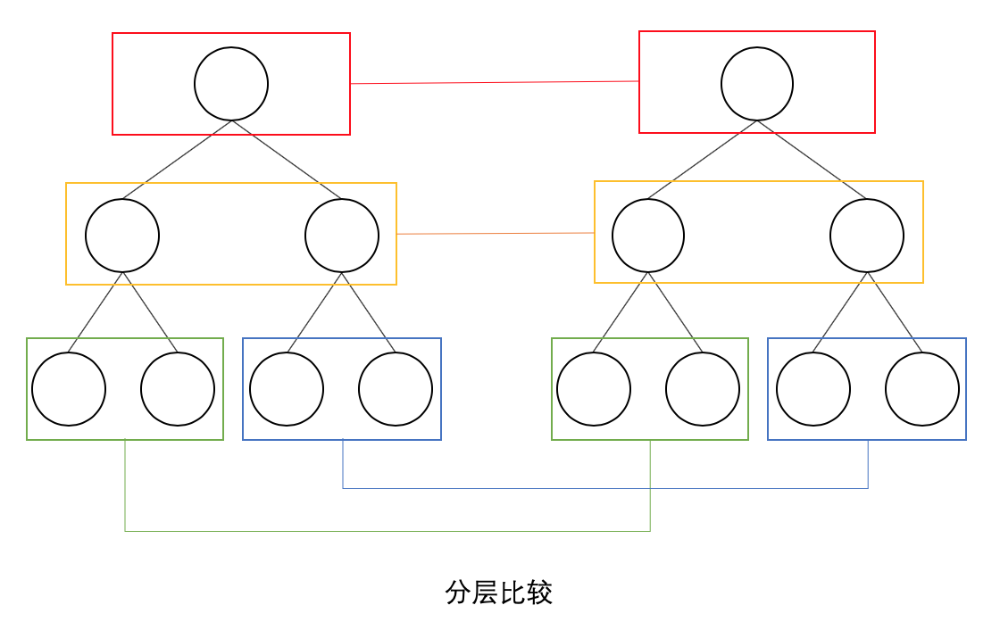
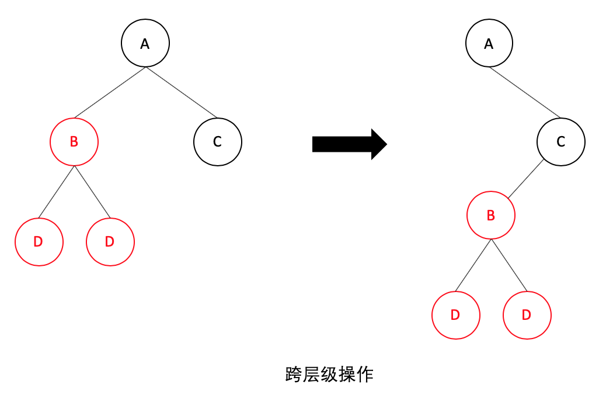
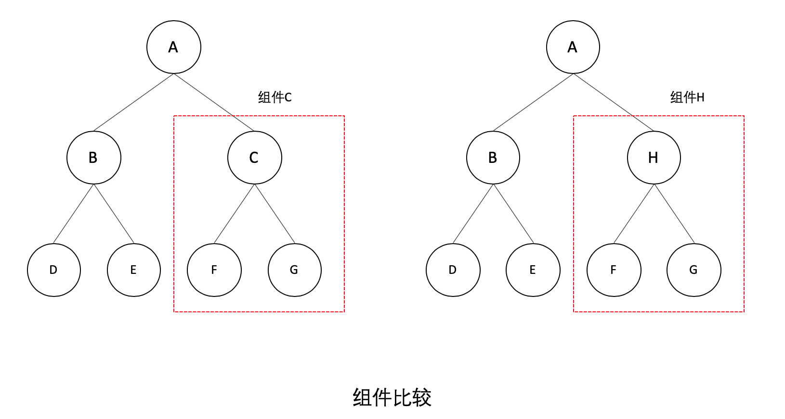
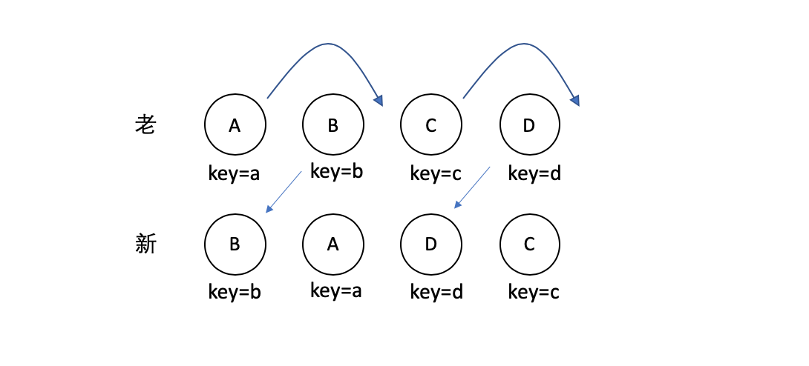

# diff

跟Vue一致，React通过引入Virtual DOM的概念，极大地避免无效的Dom操作，使我们的页面的构建效率提到了极大的提升

而diff算法就是更高效地通过对比新旧Virtual DOM来找出真正的Dom变化之处

## 原理

react中diff算法主要遵循三个层级的策略：
- tree层级
- conponent 层级
- element 层级

### tree层级

DOM节点跨层级的操作不做优化，只会对相同层级的节点进行比较


只有删除、创建操作，没有移动操作，如下图：


react发现新树中，A节点下没有了B，那么直接删除B，在C节点下创建B以及下属节点

上述操作中，只有删除和创建操作

### conponent层级

如果是同一个类的组件，则会继续往下diff运算，如果不是一个类的组件，那么直接删除这个组件下的所有子节点，创建新的


当component C 换成了component H 后，即使两者的结构非常类似，也会将C删除再重新创建H

### element层级

对于比较同一层级的节点们，每个节点在对应的层级用唯一的key作为标识
提供了 3 种节点操作，分别为 INSERT_MARKUP (插入)、MOVE_EXISTING (移动)和 REMOVE_NODE (删除)
如下场景：



通过key可以准确地发现新旧集合中的节点都是相同的节点，因此无需进行节点删除和创建，只需要将旧集合中节点的位置进行移动，更新为新集合中节点的位置
- index： 新集合的遍历下标。
- oldIndex：当前节点在老集合中的下标
- maxIndex：在新集合访问过的节点中，其在老集合的最大下标
如果当前节点在新集合中的位置比老集合中的位置靠前的话，是不会影响后续节点操作的，这里这时候被动字节不用动

操作过程中只比较oldIndex和maxIndex，规则如下：

- 当oldIndex>maxIndex时，将oldIndex的值赋值给maxIndex
- 当oldIndex=maxIndex时，不操作
- 当oldIndex<maxIndex时，将当前节点移动到index的位置

diff过程如下：
- 节点B：此时 maxIndex=0，oldIndex=1；满足 maxIndex< oldIndex，因此B节点不动，此时maxIndex= Math.max(oldIndex, maxIndex)，就是1
- 节点A：此时maxIndex=1，oldIndex=0；不满足maxIndex< oldIndex，因此A节点进行移动操作，此时maxIndex= Math.max(oldIndex, maxIndex)，还是1
- 节点D：此时maxIndex=1, oldIndex=3；满足maxIndex< oldIndex，因此D节点不动，此时maxIndex= Math.max(oldIndex, maxIndex)，就是3
- 节点C：此时maxIndex=3，oldIndex=2；不满足maxIndex< oldIndex，因此C节点进行移动操作，当前已经比较完了
当ABCD节点比较完成后，diff过程还没完，还会整体遍历老集合中节点，看有没有没用到的节点，有的话，就删除

## 注意事项
对于简单列表渲染而言，不使用key比使用key的性能，例如：

将一个[1,2,3,4,5]，渲染成如下的样子：
```html
<div>1</div>
<div>2</div>
<div>3</div>
<div>4</div>
<div>5</div>
```
后续更改成[1,3,2,5,4]，使用key与不使用key作用如下：

1.加key
```html
<div key='1'>1</div>             <div key='1'>1</div>     
<div key='2'>2</div>             <div key='3'>3</div>  
<div key='3'>3</div>  ========>  <div key='2'>2</div>  
<div key='4'>4</div>             <div key='5'>5</div>  
<div key='5'>5</div>             <div key='4'>4</div>  
```
操作：节点2移动至下标为2的位置，节点4移动至下标为4的位置。

2.不加key
```html
<div>1</div>             <div>1</div>     
<div>2</div>             <div>3</div>  
<div>3</div>  ========>  <div>2</div>  
<div>4</div>             <div>5</div>  
<div>5</div>             <div>4</div>  
```
操作：修改第1个到第5个节点的innerText
如果我们对这个集合进行增删的操作改成[1,3,2,5,6]

1.加key
```html
<div key='1'>1</div>             <div key='1'>1</div>     
<div key='2'>2</div>             <div key='3'>3</div>  
<div key='3'>3</div>  ========>  <div key='2'>2</div>  
<div key='4'>4</div>             <div key='5'>5</div>  
<div key='5'>5</div>             <div key='6'>6</div>  
```
操作：节点2移动至下标为2的位置，新增节点6至下标为4的位置，删除节点4。

2.不加key
```html
<div>1</div>             <div>1</div>     
<div>2</div>             <div>3</div>  
<div>3</div>  ========>  <div>2</div>  
<div>4</div>             <div>5</div>  
<div>5</div>             <div>6</div> 
```
操作：修改第1个到第5个节点的innerText
由于dom节点的移动操作开销是比较昂贵的，没有key的情况下要比有key的性能更好