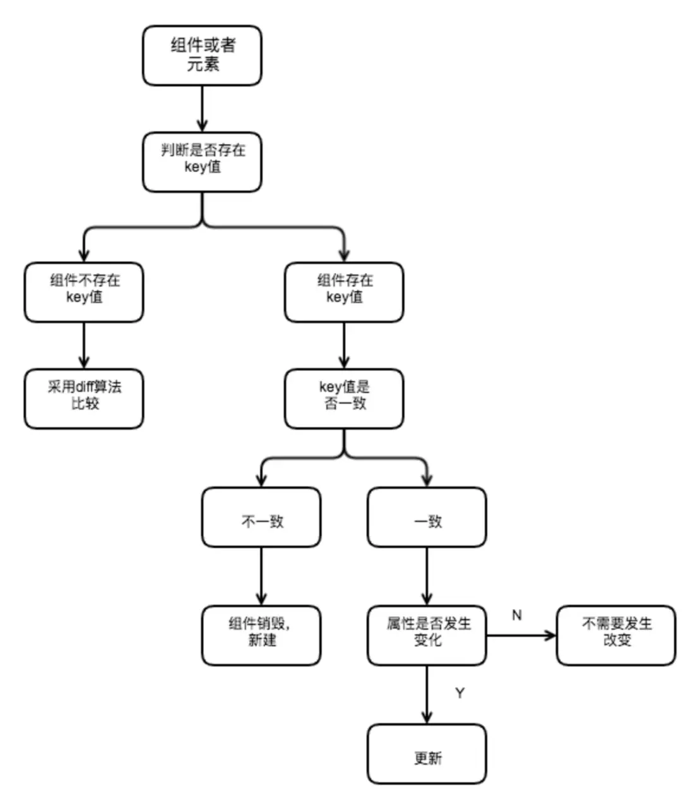

# key

跟Vue一样，React 也存在 Diff算法，而元素key属性的作用是用于判断元素是新创建的还是被移动的元素，从而减少不必要的Diff

因此key的值需要为每一个元素赋予一个确定的标识

如果列表数据渲染中，在数据后面插入一条数据，key作用并不大，如下：

```js
this.state = {
    numbers:[111,222,333]
}

insertMovie() {
  const newMovies = [...this.state.numbers, 444];
  this.setState({
    movies: newMovies
  })
}

<ul>
    {
        this.state.movies.map((item, index) => {
            return <li>{item}</li>
        })
    }
</ul>
```

前面的元素在diff算法中，前面的元素由于是完全相同的，并不会产生删除创建操作，在最后一个比较的时候，则需要插入到新的DOM树中

因此，在这种情况下，元素有无key属性意义并不大

下面再来看看在前面插入数据时，使用key与不使用key的区别：

```js
insertMovie() {
  const newMovies = [000 ,...this.state.numbers];
  this.setState({
    movies: newMovies
  })
}
```

当拥有key的时候，react根据key属性匹配原有树上的子元素以及最新树上的子元素，像上述情况只需要将000元素插入到最前面位置

当没有key的时候，所有的li标签都需要进行修改

同样，并不是拥有key值代表性能越高，如果说只是文本内容改变了，不写key反而性能和效率更高

主要是因为不写key是将所有的文本内容替换一下，节点不会发生变化

而写key则涉及到了节点的增和删，发现旧key不存在了，则将其删除，新key在之前没有，则插入，这就增加性能的开销

## 总结

良好使用key属性是性能优化的非常关键的一步，注意事项为：
- key 应该是唯一的
- key不要使用随机值（随机数在下一次 render 时，会重新生成一个数字）
- 避免使用 index 作为 key
react判断key的流程具体如下图：

