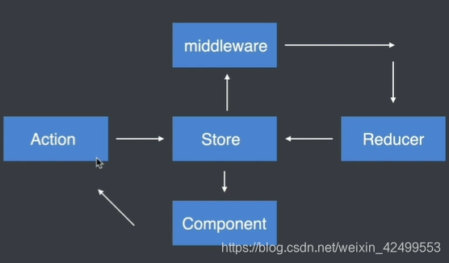
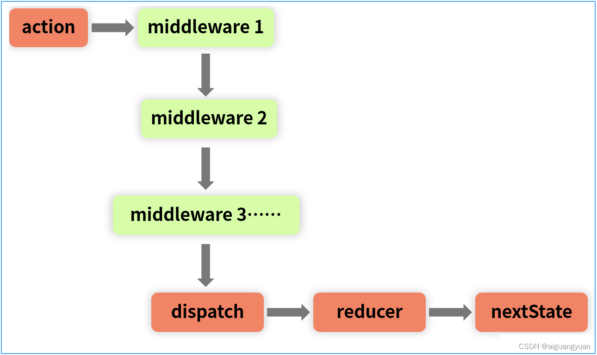

# 状态管理
react-redux将组件分成：
- 容器组件：存在逻辑处理
- UI 组件：只负责现显示和交互，内部不处理逻辑，状态由外部控制
通过redux将整个应用状态存储到store中，组件可以派发dispatch行为action给store

其他组件通过订阅store中的状态state来更新自身的视图

使用react-redux分成了两大核心：
- Provider
- connection

## Provider
在redux中存在一个store用于存储state，如果将这个store存放在顶层元素中，其他组件都被包裹在顶层元素之上
那么所有的组件都能够受到redux的控制，都能够获取到redux中的数据

使用方式如下：

```jsx
<Provider store = {store}>
    <App />
<Provider>
```

## connection
connect方法将store上的getState 和 dispatch 包装成组件的props

导入conect如下：
```js
import { connect } from "react-redux";
```
用法如下：
```js
connect(mapStateToProps, mapDispatchToProps)(MyComponent)
```
可以传递两个参数：
- mapStateToProps
- mapDispatchToProps

### mapStateToProps
把redux中的数据映射到react中的props中去

如下：
```js
const mapStateToProps = (state) => {
    return {
        // prop : state.xxx  | 意思是将state中的某个数据映射到props中
        foo: state.bar
    }
}
```
组件内部就能够通过props获取到store中的数据
```js
class Foo extends Component {
    constructor(props){
        super(props);
    }
    render(){
        return(
         // 这样子渲染的其实就是state.bar的数据了
            <div>this.props.foo</div>
        )
    }
}
Foo = connect()(Foo)
export default Foo
```
### mapDispatchToProps
将redux中的dispatch映射到组件内部的props中

```js
const mapDispatchToProps = (dispatch) => { // 默认传递参数就是dispatch
  return {
    onClick: () => {
      dispatch({
        type: 'increatment'
      });
    }
  };
}
class Foo extends Component {
    constructor(props){
        super(props);
    }
    render(){
        return(
         
             <button onClick = {this.props.onClick}>点击increase</button>
        )
    }
}
Foo = connect()(Foo);
export default Foo;
```



## 项目结构
可以根据项目具体情况进行选择，以下列出两种常见的组织结构

### 按角色组织（MVC）
角色如下：
- reducers
- actions
- components
- containers
参考如下：
```
reducers/
  todoReducer.js
  filterReducer.js
actions/
  todoAction.js
  filterActions.js
components/
  todoList.js
  todoItem.js
  filter.js
containers/
  todoListContainer.js
  todoItemContainer.js
  filterContainer.js
```
### 按功能组织
使用redux使用功能组织项目，也就是把完成同一应用功能的代码放在一个目录下，一个应用功能包含多个角色的代码
Redux中，不同的角色就是reducer、actions和视图，而应用功能对应的就是用户界面的交互模块

参考如下：
```
todoList/
  actions.js
  actionTypes.js
  index.js
  reducer.js
  views/
    components.js
    containers.js
filter/
  actions.js
  actionTypes.js
  index.js
  reducer.js
  views/
    components.js
    container.js
```
每个功能模块对应一个目录，每个目录下包含同样的角色文件：
- actionTypes.js 定义action类型
- actions.js 定义action构造函数
- reducer.js 定义这个功能模块如果响应actions.js定义的动作
- views 包含功能模块中所有的React组件，包括展示组件和容器组件
- index.js 把所有的角色导入，统一导出
其中index模块用于导出对外的接口

```js
import * as actions from './actions.js';
import reducer from './reducer.js';
import view from './views/container.js';

export { actions, reducer, view };
```
导入方法如下：
```js
import { actions, reducer, view as TodoList } from './xxxx'
```

## 中间件
中间件（Middleware）是介于应用系统和系统软件之间的一类软件，它使用系统软件所提供的基础服务（功能），衔接网络上应用系统的各个部分或不同的应用，能够达到资源共享、功能共享的目的

Redux整个工作流程，当action发出之后，reducer立即算出state，整个过程是一个同步的操作
那么如果需要支持异步操作，或者支持错误处理、日志监控，这个过程就可以用上中间件
Redux中，中间件就是放在就是在dispatch过程，在分发action进行拦截处理，如下图：

其本质上一个函数，对store.dispatch方法进行了改造，在发出 Action 和执行 Reducer 这两步之间，添加了其他功能

### 常用的中间件
有很多优秀的redux中间件，如：
- redux-thunk：用于异步操作
- redux-logger：用于日志记录
上述的中间件都需要通过applyMiddlewares进行注册，作用是将所有的中间件组成一个数组，依次执行

然后作为第二个参数传入到createStore中
```js
const store = createStore(
  reducer,
  applyMiddleware(thunk, logger)
);
```
#### redux-thunk
redux-thunk是官网推荐的**异步处理中间件**
默认情况下的dispatch(action)，action需要是一个JavaScript的对象
redux-thunk中间件会判断你当前传进来的数据类型，如果是一个函数，将会给函数传入参数值（dispatch，getState）
- dispatch函数用于之后再次派发action
- getState函数考虑到我们之后的一些操作需要依赖原来的状态，用于让我们可以获取之前的一些状态
所以dispatch可以写成下述函数的形式：
```js
const getHomeMultidataAction = () => {
  return (dispatch) => {
    axios.get("http://xxx.xx.xx.xx/test").then(res => {
      const data = res.data.data;
      dispatch(changeBannersAction(data.banner.list));
      dispatch(changeRecommendsAction(data.recommend.list));
    })
  }
}
```
#### redux-logger
如果想要实现一个日志功能，则可以使用现成的redux-logger
```js
import { applyMiddleware, createStore } from 'redux';
import createLogger from 'redux-logger';
const logger = createLogger();

const store = createStore(
  reducer,
  applyMiddleware(logger)
);
```
这样我们就能简单通过中间件函数实现日志记录的信息

### 原理
首先看看applyMiddlewares的源码
```js
export default function applyMiddleware(...middlewares) {
  return (createStore) => (reducer, preloadedState, enhancer) => {
    var store = createStore(reducer, preloadedState, enhancer);
    var dispatch = store.dispatch;
    var chain = [];

    var middlewareAPI = {
      getState: store.getState,
      dispatch: (action) => dispatch(action)
    };
    // 执行中间件
    chain = middlewares.map(middleware => middleware(middlewareAPI));
    // 分发
    dispatch = compose(...chain)(store.dispatch);

    return {...store, dispatch}
  }
}
```
所有中间件被放进了一个数组chain，然后嵌套执行，最后执行store.dispatch。可以看到，中间件内部（middlewareAPI）可以拿到getState和dispatch这两个方法

redux-thunk的基本使用，内部会将dispatch进行一个判断，然后执行对应操作，原理如下：
```js
function patchThunk(store) {
    let next = store.dispatch;

    function dispatchAndThunk(action) {
        if (typeof action === "function") {
            action(store.dispatch, store.getState);
        } else {
            next(action);
        }
    }

    store.dispatch = dispatchAndThunk;
}
```
实现一个日志输出的原理也非常简单，如下：
```js
let next = store.dispatch;

function dispatchAndLog(action) {
  console.log("dispatching:", addAction(10));
  next(addAction(5));
  console.log("新的state:", store.getState());
}

store.dispatch = dispatchAndLog;
```